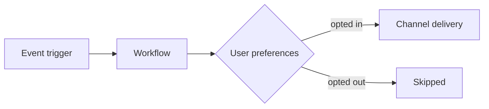

# Doc Templates: a pattern library, not skeletons

These show what each doc type **often** covers. They are not a section list to copy.
Design every page's outline from its reader's questions first (SKILL.md → Step 2), then
look here to catch a question you missed. Where a pattern below says "required",
"mandatory", "never reorder" or "every page", read it as "consider". Skip a section when
you have no sourced content for it; reorder when your reader's questions come in a
different order. `[square brackets]` are instructions, not literal text.

---

## 1. Concept doc

**Purpose:** Understanding. Answers "what is this, why does it exist, when do I use it (and when do I not)."
**Length target:** 400–900 words of prose + visuals. If it's longer, you're leaking implementation detail — move it and link.

```mdx
---
title: "[Noun phrase — the concept name, e.g. 'Objects' or 'Tenants']"
description: "[One sentence: what the concept is and the problem it solves.]"
---

[1–2 sentence definition in plain language. First sentence must stand alone as the answer to "what is X?"]

[1 short paragraph: the problem this exists to solve — the pain the reader has without it.]

## How it works

[Mental model in 2–4 short paragraphs. Include a Mermaid diagram if the concept involves flow,
hierarchy, or relationships between entities — e.g. trigger → workflow → channels.]



## When to use [concept]

[Bulleted, concrete use cases — real scenarios ("notify all members of a Slack channel when an
invoice fails"), not abstract categories.]

## When NOT to use it / [Concept] vs [neighboring concept]

[The disambiguation section. SuprSend has many adjacent primitives (Lists vs Objects, Broadcast vs
Workflow, Batch vs Digest). A comparison table with a "use when" column prevents most support
questions about this concept.]

| | [Concept] | [Alternative] |
|---|---|---|
| Best for | ... | ... |
| Throughput / limits | ... | ... |
| Use when | ... | ... |

## Key behaviors and constraints

[Facts the reader must know before designing around this: limits, defaults, what's plan-gated,
what happens in edge cases. Short bullets. This is understanding-level, not setup-level.]

## Next steps

<CardGroup cols={2}>
  <Card title="[Implementation guide]" icon="wrench" href="/docs/...">
    Set up [concept] in your product.
  </Card>
  <Card title="[API reference]" icon="code" href="/reference/...">
    Manage [concept] programmatically.
  </Card>
</CardGroup>
```

**Never in a concept doc:** setup steps, dashboard click-paths, exhaustive parameter lists, code beyond a tiny illustrative snippet (≤10 lines, only if it clarifies the mental model).

---

## 2. Quickstart

**Purpose:** First working result in under 10 minutes. Builds confidence, not mastery.
**Rules:** One happy path only. Every step verifiable. No choices except unavoidable ones (language). No edge cases — link to them at the end.

```mdx
---
title: "[Outcome-oriented: 'Send your first notification' — not 'Quickstart to X']"
description: "[Send/build X in N minutes using SuprSend.]"
---

[1–2 sentences: exactly what the reader will have working at the end, and roughly how long it takes.]

## Prerequisites

[Short checklist: account, API key location (link to where to find it), runtime versions.
Nothing the reader must go research — link everything.]

<Steps>
  <Step title="[Verb-first action, e.g. 'Install the SDK']">
    <CodeGroup>
    ```bash npm
    npm install @suprsend/node-sdk
    ```
    ```bash pip
    pip install suprsend-py-sdk
    ```
    </CodeGroup>
  </Step>

  <Step title="[Next action]">
    [Instruction. Complete code with imports and realistic values.
    If a dashboard step: exact click path in bold — go to **Workflows → Create workflow**.]

    <Frame>
      <!-- SCREENSHOT: [describe exactly what to capture] -->
      
    </Frame>
  </Step>

  <Step title="[Trigger / run it]">
    [The moment of truth.]
  </Step>

  <Step title="Verify it worked">
    [Exactly what the reader should see and where — dashboard Logs page, their inbox, the API
    response. Include the expected response body.]

    <Check>
      You should see the notification in **Logs → Messages** with status `delivered`.
    </Check>
  </Step>
</Steps>

## Troubleshooting

<AccordionGroup>
  <Accordion title="[Most common first-run failure, phrased as the user would search it]">
    [Cause → fix.]
  </Accordion>
</AccordionGroup>

## Next steps

[CardGroup: the concept doc, the full implementation guide, and 1–2 obvious expansions.]
```

---

## 3. Implementation guide

**Purpose:** Take a competent reader from "I understand the concept" to "it's live in my product." Must cover every persona: dashboard UI (setup + testing), backend API, SDKs, and AI/vibe-coder routes.

```mdx
---
title: "[Task-oriented verb phrase: 'Set up digest notifications', 'Integrate the In-App Inbox']"
description: "[Implement X end to end — dashboard setup, API, SDK, and AI-assisted routes.]"
---

[2–3 sentences: what you'll build, and the shape of the solution. Link the concept doc for background —
do not re-explain the concept.]

## How the pieces fit

[Mermaid diagram of the implementation architecture: which parts live in the reader's code,
which in the SuprSend dashboard, and how data flows between them. This orients before the steps.]

## Prerequisites

[Bullets with links: concept doc read, account/keys, any dashboard assets that must exist first.]

## Step 1 — [Dashboard setup phase]

<Steps>
  <Step title="...">
    [Exact click paths in bold. Screenshot placeholders at decision points. Name every field the
    reader must fill, with example values and what each field does — a field table if >4 fields.]
  </Step>
</Steps>

## Step 2 — [Code integration phase]

[Lead with the persona split:]

<Tabs>
  <Tab title="Node.js">
    [Full runnable code: imports, client init, the call, the expected response.]
  </Tab>
  <Tab title="Python">
    [Same, idiomatic Python.]
  </Tab>
  <Tab title="REST API">
    [cURL with real headers and full JSON body. Show the response.]
  </Tab>
  <Tab title="AI agent / MCP">
    [The vibe-coder route: MCP setup command or `npx skills add suprsend/skills`, then a
    copy-pasteable prompt that gets an agent to implement this feature correctly, e.g.:
    "Add a digest schedule to my 'billing-alerts' preference category with Daily and Weekly
    options, and update my workflow to route on the user's chosen cadence."]
  </Tab>
</Tabs>

[Every parameter used in the code gets a ParamField or table: type, required, default, valid values.]

## Step 3 — Test it

[How to verify without touching real users: Test Mode, sandbox verified channels, template test
sends, what to look for in Logs. This section is mandatory — testing is a first-class persona need.]

## Configuration reference

[Tables/ParamFields for every option, including ones the happy path didn't use. This is what makes
the page complete for AI readers. If the full reference is huge, the deep tail goes in an
AccordionGroup ("Advanced configuration").]

## Edge cases and behavior

<AccordionGroup>
  <Accordion title="What happens if [common edge, e.g. the user has no email channel]?">...</Accordion>
  <Accordion title="[Limits and quotas]">...</Accordion>
</AccordionGroup>

## Troubleshooting

<AccordionGroup>
  <Accordion title="[Exact error string or symptom]">[Cause → fix. Include the exact error text so it's searchable.]</Accordion>
</AccordionGroup>

## Next steps

[CardGroup.]
```

---

## 4. API reference page

**Purpose:** Precise facts. Neutral, complete, zero persuasion. Mirrors the structure of the API itself.

Prefer generating from OpenAPI (frontmatter `openapi: "openapi.json POST /path"`); write manual MDX only when no spec exists. Manual skeleton:

```mdx
---
title: "[Verb + resource: 'Create tenant', 'List messages']"
description: "[One sentence: what the endpoint does.]"
api: "POST /v1/[path]"
---

[1–2 sentences max. What it does, and one sentence of critical context (idempotency, rate limit,
plan gating) if any.]

<ParamField header="Authorization" type="string" required>
  Bearer token. Use your workspace API key.
</ParamField>

<ParamField path="distinct_id" type="string" required>
  Unique identifier of the user. Max 128 characters.
</ParamField>

<ParamField body="channels" type="string[]">
  Channels to send on. Valid values: `email`, `sms`, `whatsapp`, `androidpush`, `iospush`,
  `slack`, `ms_teams`, `webpush`, `inbox`. Defaults to all channels in the template.
</ParamField>

[EVERY param: type, required/optional, default, valid values, constraints, and a realistic example.
Nested objects use <Expandable>.]

<RequestExample>
```bash cURL
[full request]
```
```javascript Node.js
[full request]
```
```python Python
[full request]
```
</RequestExample>

<ResponseExample>
```json 200
[full success body]
```
```json 400
[full error body with real error message string]
```
</ResponseExample>

<ResponseField name="status" type="string">
  [Every response field documented, same rigor as params.]
</ResponseField>

## Error codes

| Status | Code | Meaning | Fix |
|---|---|---|---|
```

**Never in reference:** tutorials, "you might want to", marketing adjectives. Present tense, declarative: "Returns the user object."

---

## 5. SDK integration doc

**Purpose:** Working code in the reader's language/framework. One page per SDK per capability area (matches SuprSend's existing pattern: `python-messages`, `java-objects`, `ios-preferences`).

Skeleton: Install (with version requirements) → Initialize (all auth options, env vars) → Method-by-method sections, each with: signature, param table, runnable example, return value/response shape, errors thrown → Framework notes (if frontend: React/Vue/vanilla variants in Tabs) → Migration notes if a version changed behavior → Troubleshooting accordion.

Frontend SDK docs additionally need: component props tables, theming/customization options, a note on auth flow (JWT for user-facing SDKs), and SSR/build-tool gotchas.

---

## 6. AI integration doc (MCP, Agent, CLI, Agent Skills)

**Purpose:** Get a machine (and its human) connected fast. These readers copy-paste; optimize for that.

Skeleton: What it is (2 sentences) + what it can do (bulleted capabilities with example prompts in italics) → Setup per client in Tabs (Cursor / Claude Code / Claude Desktop / Windsurf — exact config JSON per client) → Auth and scoping (service tokens, read-only flags, safety notes in a Warning) → Example prompts section (6–10 realistic prompts users can copy) → Tool/command reference table or link → Limits and safety (what's restricted, e.g. no destructive deletes) → Troubleshooting.

---

## 7. Changelog entry

**Purpose:** "What changed and why should I, the end user, care." Benefit-first, not feature-internals. Matches SuprSend's existing `<Update>` style.

**Research first (mandatory):** search how competitors and adjacent products announced the same capability (their changelogs, release notes, launch posts). Use it to (a) frame benefits against what the market can't do — stated as user pain removed, never as competitor call-outs, (b) borrow proven structural moves (review-before-save notes on AI features, pro tips, "go here to start" CTAs), and (c) echo the terminology migrating users already know, once. See SKILL.md Step 1.5.

```mdx
<Update label="[D Month YYYY]">
  ## [Benefit-first headline — 'Let users choose how often they hear from you',
      not 'Added digest_schedule field to preference categories']

  [1–2 sentences: what you can now do, in "you" voice.]

  <Frame>
    <!-- SCREENSHOT/GIF of the feature -->
    
  </Frame>

  [1 short paragraph OR 3–5 bullets: the concrete user-facing wins. Each bullet = a scenario the
  reader recognizes, bolded lead-in, → what they get. No implementation internals, no schema
  details — that's what the linked doc is for.]

  See [Doc page name](/docs/...) to set it up.
</Update>
```

**Show, don't list.** Every changelog with a visible UI change needs at least one screenshot inline. If the capability has multiple visible states (e.g., healthy / issue / offline), a 2- or 3-column comparison row of images beats prose.

**When the change ships across multiple SDKs / packages / channels,** don't structure the body as one bullet per package — that reads like an internal release note. Lead with the capability and image; put "how each SDK exposes it" into a single closing paragraph with links. Example of what NOT to do:

```mdx
<!-- Bad: SDK-per-bullet, no image, technical framing -->
- **`@suprsend/react` 1.3.0:** Inbox shows a status dot… Pass `reachability={false}` to turn off.
- **`@suprsend/react-core` 2.3.0:** pass `reachability` to `SuprSendFeedProvider`…
- **`@suprsend/web-sdk` 5.3.0:** initialize with `reachability: true` and listen for…
```

**Never in a changelog:** setup steps, request/response bodies, exhaustive option lists, internal architecture. One doc link at the end carries all of that.

---

## Fan-out guide: mapping a PRD to pages

A typical feature PRD produces:

| PRD content | Goes to |
|---|---|
| Problem statement, positioning, use cases | Concept doc (new or updated) |
| Setup flows, config options, personas | Implementation guide |
| New/changed endpoints and fields | API reference + OpenAPI spec updates |
| SDK method additions | Relevant SDK doc(s) |
| MCP tools / CLI commands / agent capabilities | AI integration doc |
| Launch announcement | Changelog entry |

Propose the fan-out first; get agreement; then write. Cross-link every page in the set to the others.
