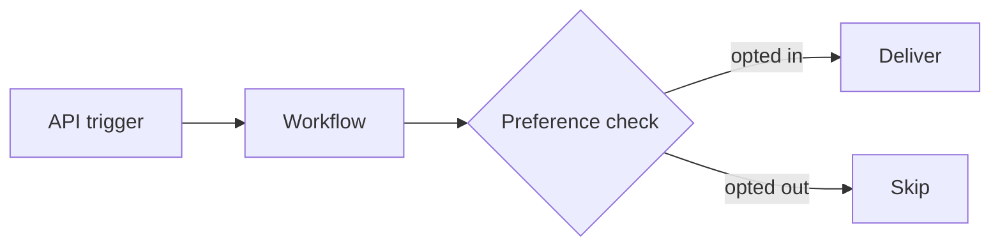

# Mintlify Syntax Reference

SuprSend docs are MDX rendered by Mintlify. Live syntax source of truth: `https://www.mintlify.com/docs/llms-full.txt` (fetch it if you hit a component not covered here). Validate locally with `mint dev` / `mint validate` if a repo checkout is available.

## Frontmatter

```mdx
---
title: "Page title"                # required
description: "One SEO/llms.txt sentence stating what the page helps you do."  # strongly recommended
sidebarTitle: "Short nav label"    # optional, when title is long
icon: "bell"                       # optional, Lucide/FontAwesome icon name
openapi: "openapi.json GET /users" # API pages generated from a spec (method+path must match exactly)
openapi-schema: "OrderItem"        # data-model pages from components.schemas
api: "POST /v1/users"              # manual API page (relative path needs api.mdx.server in docs.json)
deprecated: true                   # shows a deprecated badge
version: "2.0"
---
```

Page URLs = file path. Every published page is fetchable as markdown at `<url>.md`.

## Callouts

```mdx
<Note>Supplementary context.</Note>
<Tip>Pro move or shortcut.</Tip>
<Warning>Irreversible / breaking / data-loss. Use sparingly — it must stay alarming.</Warning>
<Info>Neutral background info.</Info>
<Check>Success confirmation — "you should now see X".</Check>
```

## Steps (any sequential procedure)

```mdx
<Steps>
  <Step title="Install the SDK">
    Content, code, images — anything can nest here.
  </Step>
  <Step title="Initialize the client">
    ...
  </Step>
</Steps>
```

## Tabs (alternatives: languages, platforms, personas)

```mdx
<Tabs>
  <Tab title="Node.js">...</Tab>
  <Tab title="Python">...</Tab>
</Tabs>
```

## Code blocks and CodeGroup

Fenced blocks take `language [title] [flags]`. Useful flags: line highlight `{3-5}`, `expandable`, `wrap`.

````mdx
```javascript index.js {2}
const { Suprsend } = require("@suprsend/node-sdk");
const client = new Suprsend("YOUR_WORKSPACE_KEY", "YOUR_WORKSPACE_SECRET");
```

<CodeGroup>
```bash npm
npm install @suprsend/node-sdk
```
```bash pip
pip install suprsend-py-sdk
```
</CodeGroup>
````

CodeGroup = same action in multiple languages, shown as tabs on one block. Titles become the tab labels.

## API components (manual reference pages)

```mdx
<ParamField path="user_id" type="string" required>
  Path parameter. Unique identifier of the user. Max 128 chars.
</ParamField>
<ParamField body="channels" type="string[]" default="all">
  Body field. Valid values: `email`, `sms`, `inbox`.
</ParamField>
<ParamField header="Authorization" type="string" required>
  Bearer token.
</ParamField>
<ParamField query="limit" type="integer" default="20">
  Max results per page (1–100).
</ParamField>

<ResponseField name="id" type="string" required>
  ID of the created resource.
</ResponseField>

<Expandable title="properties">   <!-- nested object fields go inside -->
  <ResponseField name="nested" type="string">...</ResponseField>
</Expandable>

<RequestExample>
```bash cURL
curl -X POST ...
```
</RequestExample>

<ResponseExample>
```json 200
{ "status": "success" }
```
</ResponseExample>
```

`RequestExample`/`ResponseExample` pin to the right-hand column on API pages. On OpenAPI-generated pages, prefer fixing the spec (`x-codeSamples` for SDK snippets, `examples` for multiple responses, `x-mint.content` to prepend MDX, `x-hidden`/`x-excluded` for visibility) over hand-writing MDX.

## Accordions (progressive disclosure)

```mdx
<AccordionGroup>
  <Accordion title="Why am I getting SUBSCRIBER_NOT_FOUND?">
    Cause → fix.
  </Accordion>
</AccordionGroup>
```

## Cards (navigation, next steps)

```mdx
<CardGroup cols={2}>
  <Card title="Set up workflows" icon="workflow" href="/docs/workflows">
    Build your first multi-channel workflow.
  </Card>
</CardGroup>
```

## Images and Frames

```mdx
<Frame caption="Optional caption">
  
</Frame>
```

Always wrap screenshots in `<Frame>`. Always write meaningful alt text. When the image doesn't exist yet, leave `<!-- SCREENSHOT: what to capture -->` and an `` placeholder.

## Mermaid diagrams

````mdx

````

Also supports `sequenceDiagram` (great for auth/JWT flows and webhook exchanges) and `stateDiagram-v2` (message lifecycle: triggered → sent → delivered → seen → clicked).

## Changelog

```mdx
<Update label="30 June 2026" description="v1.4" tags={["Preferences"]}>
  ## Headline
  Body — MDX allowed.
</Update>
```

## Other useful components

```mdx
<Tooltip tip="Definition shown on hover">term</Tooltip>
<Icon icon="bell" size={16} />
<Prompt description="Install the SuprSend skill.">
npx skills add suprsend/skills
</Prompt>
```

`<Prompt>` renders a copy/open-in-AI-tool block — ideal for the vibe-coder persona.

## Gotchas

- MDX is JSX: unclosed tags break the build; `{` in prose must be escaped or in backticks; HTML comments `<!-- -->` are fine.
- Don't deep-nest components (max ~2 levels: AccordionGroup → Accordion → content).
- Relative links (`/docs/page-slug`) not absolute URLs for internal pages; anchor links use lowercased-hyphenated heading text (`/docs/batch#flush-first-item-immediately`).
- Headings start at `##` inside a page (`title` is the H1). Keep heading text short — they become the right-hand TOC.
- Every page needs `description` frontmatter — it feeds search, SEO, and llms.txt.
