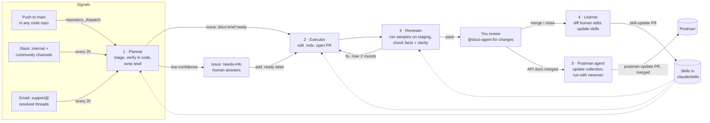

# SuprSend docs agent

Five Claude agents that keep docs.suprsend.com in sync with the product without anyone
having to ask. Code lands on `main`, a customer asks a question in Slack, support
resolves a confusing email thread: the agents notice, write the docs change, test it
against a real staging workspace and open a PR. You review and merge. Every correction
you make teaches them, so over time you review less.

Everything runs in GitHub Actions on the docs repo. No servers.

## How it works



| Agent | Runs on | Reads | Produces |
|---|---|---|---|
| **1 · Planner** (monitor + plan) | push dispatch, 2-hourly cron | commits + diffs, Slack threads, support emails, docs repo, source code | One GitHub issue per change: pages to edit, verified facts with evidence, persona + example, test plan, confidence |
| **2 · Executor** | brief labelled `docs-brief:ready`; PR labelled `docs-agent:fix`; `@docs-agent` comments | the brief, docs pages, writing skills | A branch + PR with `.mdx` edits, nav, changelog. Each page goes through one of two writing lanes (below) |
| **3 · Reviewer + tester** | every push to a `docs-agent` PR | PR diff, brief, snippet results | Runs every code sample and the test plan on staging; posts verdict table; sends back to executor or to you |
| **5 · Postman agent** | API reference changes on main; weekly drift check | collection pulled live from Postman, API docs, code | `postman-update` PR: requests, one saved example per documented variant, tests, all run with newman on staging. Merged → uploaded to Postman |
| **4 · Learner** | PR closed; weekly | human commits, `@docs-agent` requests, review comments, answers on briefs | `skill-update` PR editing the agents' skills, metrics, weekly Slack digest with autonomy recommendations |

### Two writing lanes inside the executor

API/SDK docs and concept/usage docs need opposite things. Reference pages must be
exhaustive and consistent across pages: every field, every variant, same layout.
Guides must be selective and fresh: only what this reader needs, one scenario, a
structure built for this feature. One agent tuned for both drifts into the average of
the two, which is the "same sections everywhere" problem.

So the executor routes each page by `doc_type`:

| Lane | Pages | Skill |
|---|---|---|
| Reference writer | REST API, SDK methods, CLI/MCP commands, workflow/template schemas | `docs-reference-writer` |
| Guide writer | concepts, guides, quickstarts, AI integration, FAQs, changelog | `docs-guide-writer` |

They share one planner, reviewer and learner, and the shared rules in
`suprsend-docs-writer` (no unverified facts, no overwriting, plain words, real customer
examples). A change that touches both is still one PR: reference pages first, then guides,
so both use the same fields and example values. Each lane has its own `learnings.md`, so
"describe every field" lessons don't leak into concept pages and "keep it short" lessons
don't strip fields from the API reference.

### Real browser: screenshots and click-path checks

Dashboard steps are the part of the docs that rots fastest, and the dashboard code isn't
in the watched repos. So the agents use a real browser (Playwright + Chromium) on the
staging dashboard:

| When | What happens |
|---|---|
| **Writing** (executor) | Each documented dashboard procedure gets a flow file in `.docs-agent/flows/`: the doc's steps as clicks. The executor runs it in *capture* mode, looks at every screenshot, and writes the step text from the buttons the browser actually clicked. Screenshots are cropped to the panel that matters, have one orange highlight, mask emails/keys/timestamps, and show the persona data seeded in staging. |
| **Reviewing** (reviewer) | On every PR push: runs the flows for changed pages in *verify* mode (broken step = Blocker; screenshot differs from today's UI by >2% = stale), then opens each changed page in a local Mintlify preview on desktop and mobile. It checks for raw `<Steps>` text, broken images, dead anchors, mobile overflow and console errors, and looks at the screenshots. |
| **Weekly** (`docs-ui-drift`) | Runs every flow. A broken flow becomes a `needs-info` brief ("did this button move?"). Stale screenshots become a ready brief the executor re-captures. |
| **On request** | `@docs-agent retake the screenshot on step 3 with the tenant dropdown open` on a PR |

Flows are YAML data with a fixed set of actions (`goto`, `click`, `fill`, `expect`,
`screenshot`…), not code. The runner blocks navigation to any site other than the
dashboard, and main's runner executes them even when a PR changes a flow.

### What each handoff looks like

- **Brief (planner → executor)** is a GitHub issue. Humans can read it, correct it, answer
  its open questions. The JSON inside follows `.docs-agent/schemas/brief.schema.json`.
  The executor may only state facts listed in the brief, each backed by a file:line,
  commit or thread quote. This is the main guard against made-up docs.
- **PR (executor → reviewer → you)** always says `Closes #<brief>`, lists the example
  persona, the test plan, and "where I was unsure".
- **Review comment** starts with `<!-- docs-reviewer -->` and has two tables: tests run
  (with evidence) and findings (with exact fix text).
- **Skill-update PR (learner → you)** shows before/after per rule, with the PR that
  taught it.

### How the learning loop works

The learner treats three things as feedback, strongest first:

1. **Commits you push** to an agent PR: it diffs your version against the agent's.
2. **`@docs-agent …` comments** on the PR (e.g. "@docs-agent use the multi-tenant
   example, not e-commerce"). The executor applies them right away; the learner reads
   them later. **Asking via `@docs-agent` teaches faster than editing by hand**,
   because the request states the rule.
3. **Answers you give on a brief**, and PRs you close without merging.

It sorts each lesson into *rule* (you said always/never, or seen twice), *candidate*
(seen once, parked in `docs-learner/references/candidates.md`) or *one-off* (ignored),
then edits the right file: planner, executor, the two writing lanes, reviewer, Postman
agent, `suprsend-docs-writer` or the persona file. Rules are merged into existing text, not
appended, so skills don't bloat.

**Getting to autonomy.** Every closed PR adds a file to `.docs-agent/metrics/prs/` on
the `docs-agent/metrics` branch (category, human edit ratio, review rounds, merged).
Each Monday the learner posts a table per doc category. When the last 10 PRs in a
category were all merged, with ≤5% of lines changed by humans and ≤1 review round, it
recommends turning on auto-merge for that category in `config.yml → autonomy`. You flip
the switch. Changelogs and SDK reference pages usually graduate first; concept pages last.

## What's in the kit

```
code-repo-template/.github/workflows/notify-docs.yml   ← copy into every code repo
docs-repo/                                              ← copy into the docs repo root
  .github/actions/docs-agent-setup/                     shared: bot-token checkout, git identity
  .github/workflows/
    docs-plan.yml       agent 1
    docs-execute.yml    agent 2 (new brief + revise)
    docs-iterate.yml    agent 2 via "@docs-agent" comments
    docs-review.yml     agent 3
    docs-learn.yml      agent 4 (after PR + weekly)
    docs-postman.yml    agent 5 (update collection + publish to Postman)
    docs-ui-drift.yml   weekly: every dashboard flow in a real browser
  .claude/skills/
    docs-planner/  docs-executor/  docs-reviewer/  docs-learner/  docs-postman/
    docs-reference-writer/  docs-guide-writer/      the executor's two writing lanes
    docs-ui-flows/          flow files, screenshot rules, verify results
    suprsend-docs-writer/   your existing skill, reworked: fresh outlines, no unverified
                            facts, no overwriting, full API field coverage, real examples
  postman/collection.json   created on the first docs-postman run
  .docs-agent/
    config.yml          repos, channels, labels, staging fixtures, autonomy switches
    context/customers.md personas + realistic values for examples
    schemas/brief.schema.json
    scripts/            collectors, brief filing, snippet runner, review gate,
                        feedback collector, autonomy report, Slack replies
    tester/             SDK deps for running samples
    browser/            run_flow.mjs (capture/verify flows), render_check.mjs (rendered pages)
    flows/              one YAML flow per documented dashboard procedure (example included;
                        its labels are illustrative, re-record against the real UI)
    metrics/            per-PR stats live on the docs-agent/metrics branch
```

## Setup

Follow **SETUP.md**. It's the step-by-step checklist for `suprsend/documentation`, with
helper scripts in `install/`:

| Script | Does |
|---|---|
| `install/install-into-docs-repo.sh` | copies the agents into a branch of `suprsend/documentation` and opens the PR |
| `install/add-notify-docs.sh` | opens the one-file PR in each watched code repo |
| `install/set-secrets.sh` | asks for every secret (hidden input) and stores it with `gh` |
| `install/slack-app-manifest.yml` | the Slack bot, ready to paste |
| `install/gmail_token.py` | gets the Gmail refresh token for support@ |
| `install/dashboard-login.sh` | saves the staging dashboard login for the browser agents |

## Rollout

| Week | Setting | You do |
|---|---|---|
| 1–2 **Shadow** | `planner.auto_ready_min_confidence: 1.01` (the default) so every brief waits for you | Read briefs. Fix wrong ones on the issue; the learner reads those too. Add `docs-brief:ready` to good ones. |
| 3–4 **Assisted** | `0.75` | Review PRs. Prefer `@docs-agent` comments over hand edits. Merge the learner's skill PRs. |
| 5+ **Graduating** | flip `autonomy.auto_merge_docs.<category>` when the digest says ready | Spot-check auto-merged PRs; one bad one → switch that category back off. |

Once skill PRs have been boring for a month, set `autonomy.auto_merge_skill_updates: true`.

## Guardrails built in

- **No invented facts.** The planner cites evidence for every fact; the executor may only
  state those; the reviewer blocks any claim it can't trace to the brief or code.
- **Tested examples.** Samples run on staging on every push. Samples that can't run must be
  marked `norun`, and the reviewer checks that's justified.
- **PII.** Community Slack and support email are redacted (emails, phones, keys) before
  any model sees them. Customer names never go into docs or skills.
- **No customer-facing replies by default.** The bot only replies in Slack channels with
  `reply_in_thread: true` (internal ones).
- **Loop caps.** Max 2 reviewer↔executor rounds, then a human. Humans pushing to a PR
  stops the auto-fix loop. One planner and one learner run at a time.
- **Nothing merges without you** until you turn on a category.
- **Postman stays safe.** The collection only ever holds `{{variables}}`; a scan fails the
  run if a secret value appears. If someone edits the collection in the Postman app
  after the agent pulled it, the upload refuses to overwrite and asks for a re-run.
- **Scoped tokens and tools.** Tokens only cover the docs repo. The planner, which reads
  untrusted community text, gets a read-only token and no code execution. Each agent
  gets only the shell commands it needs (`--allowedTools`). Docs PRs that touch
  `.github/`, `.docs-agent/` or `.claude/` fail review, and the reviewer always runs
  pipeline code from `main`, never from the PR.
- **Residual risk to know about:** the reviewer must execute code to test it, so it has
  `node`/`python3`/`curl` plus staging keys. Keep that staging workspace isolated (Test
  Mode, verified channels, no production data) and rotate its keys if anything looks off.

## Talking to it

| You want | Do |
|---|---|
| Something documented now | Post in `#documentation`, or react :memo: to any message in a watched channel |
| A code change ignored | Put `[skip docs]` in the commit message |
| A change on a docs PR | Comment `@docs-agent <what to change>` |
| Follow agent PRs | Every PR the agents open (docs, Postman, skill updates) is posted in #documentation, with one thread per PR: opened → tested / needs you → merged. Set in `config.yml → slack.announce` |
| The agents to always/never do X | Say it with "always"/"never" in a PR comment. The learner turns it into a rule on the next PR close |
| To see what it learned | Skill-update PRs, `references/learnings.md` in each skill, Monday digest |

## Cost and limits

Each run is one Claude Code session. Rough shape: a push that needs no docs ends at the
planner; a typical doc change is planner + executor + one or two reviews + learner.
Watch spend in the Anthropic console for the first two weeks, then tune `--max-turns`
and the cron in `docs-plan.yml`. Diffs above `commit_filters.max_diff_chars` are cut
short, so huge refactors get planned from commit messages and PR descriptions; the
planner can still clone the repo and read the code. If many pushes land within minutes,
GitHub keeps only one queued planner run; the 2-hourly sweep picks up the rest.
