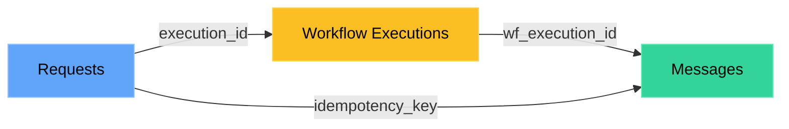

<Note>
**Using S3 v1.0?** [Migrate to v2.0](/connectors/amazon-s3-migration) for improved performance and data structure.
</Note>

Export your SuprSend notification data directly to your S3 bucket. Build custom analytics dashboards, debug delivery issues, surface errors to your customers, or maintain compliance audit trails—all with data you fully own and control.

---

## How it works

Every 5 minutes, SuprSend syncs your notification data to S3 in Parquet format. Data lands in hourly partitions across three data points:

```
your-bucket/
├── messages/
│   └── year=2025/month=01/day=15/hour=14/data.parquet
├── workflow_executions/
│   └── year=2025/month=01/day=15/hour=14/data.parquet
└── requests/
    └── year=2025/month=01/day=15/hour=14/data.parquet
```

Data is encrypted with TLS 1.2+ in transit and SSE-S3/SSE-KMS at rest. The Parquet format and partition structure work natively with query engines like Athena, Spark, and Presto. If you pause sync, data from the pause period backfills automatically when you resume.


---

## What you can export

You choose which data points to sync. Each one becomes a separate folder in your S3 bucket.

| Data point | What's in it | Use it for |
|---------|--------------|------------|
| **Messages** | Delivery status, engagement, vendor info, failures | Analytics, delivery troubleshooting |
| **Workflow Executions** | Step-by-step logs, node details, timing | Debugging workflow logic |
| **Requests** | API payloads, responses, triggered workflows | API debugging, audit trails |


**Recommended data points by use case:**
| Use case | Data points to sync |
|----------|---------------------|
| Analytics & reporting | **Messages** |
| Workflow debugging | **Workflow Executions** + **Requests** |
| Delivery troubleshooting / surfacing errors to customers | **Messages** + **Requests** |

### Connecting the dots

These data points link together so you can trace any notification from API call to final delivery:



| From → To | Join on |
|-----------|---------|
| Requests → Workflow Executions | `execution_id` |
| Workflow Executions → Messages | `wf_execution_id` |
| Requests → Messages (shortcut) | `idempotency_key` |

### Schema

<Tabs>
<Tab title="Messages">

| Column | Type | Description |
|--------|------|-------------|
| `message_id` | String | Primary key |
| `wf_execution_id` | String | Links to Workflow Executions |
| `recipient_distinct_id` | String | User or object ID |
| `tenant_id` | String | Tenant ID |
| `workflow_slug` | String | Workflow name |
| `status` | String | `triggered`, `delivered`, `seen`, `clicked`, `dismissed`, `failed` |
| `channel_slug` | String | `email`, `sms`, `push`, etc. |
| `channel_info` | String | Email/phone/token |
| `vendor_name` | String | Delivery vendor |
| `triggered_at` | datetime | Sent to vendor |
| `delivered_at` | datetime | Delivered by vendor |
| `seen_at` | datetime | Opened by user |
| `execution_failure_reason` | JSON | Why it failed (execution) |
| `delivery_failure_reason` | String | Why it failed (vendor) |
| `created_at` | datetime | Row created |
| `updated_at` | datetime | Row last updated |

</Tab>

<Tab title="Workflow Executions">

| Column | Type | Description |
|--------|------|-------------|
| `execution_id` | String | Primary key |
| `idempotency_key` | String | Links to Requests |
| `recipient_distinct_id` | String | User or object ID |
| `tenant_id` | String | Tenant ID |
| `workflow_slug` | String | Workflow name |
| `workflow_version` | String | Version |
| `node_id` | String | Current node |
| `node_name` | String | Node label |
| `node_type` | String | `email`, `condition`, `delay`, etc. |
| `execution_stage` | String | `workflow_started`, `node_started`, `node_processing`, `node_finished` |
| `status` | String | `info`, `error`, `warning` |
| `message` | String | What happened |
| `properties` | JSON | Extra context |
| `created_at` | datetime | Row created |
| `updated_at` | datetime | Row last updated |

</Tab>

<Tab title="Requests">

| Column | Type | Description |
|--------|------|-------------|
| `idempotency_key` | String | Primary key |
| `api_type` | String | `event`, `workflow`, `user` |
| `api_name` | String | Workflow/event name |
| `distinct_id_list` | Array | Target users |
| `tenant_id` | String | Tenant ID |
| `payload` | JSON | Request body |
| `response` | JSON | API response |
| `errors` | Array | Any errors |
| `executions` | Array | Triggered workflow IDs |
| `status` | String | `completed`, `failure`, `partial_failure` |
| `created_at` | datetime | Row created |
| `updated_at` | datetime | Row last updated |

</Tab>
</Tabs>

---

## Setup

### Step 1: Create your S3 bucket

Open [AWS S3 Console](https://s3.console.aws.amazon.com/) and create a bucket with these settings:


- **Bucket name**: Something like `suprsend-logs-production` (save this—you'll need it)
- **Region**: Pick one close to you
- **Block all public access**: Yes
- **Encryption**: SSE-S3 (or SSE-KMS for compliance)


### Step 2: Create an IAM policy

This gives SuprSend permission to write to your bucket. In [IAM Console](https://console.aws.amazon.com/iam/), create a policy with this JSON:

```json
{
  "Version": "2012-10-17",
  "Statement": [{
    "Sid": "SuprSendS3ExportAccess",
    "Effect": "Allow",
    "Action": ["s3:PutObject", "s3:ListBucket", "s3:GetObject"],
    "Resource": [
      "arn:aws:s3:::YOUR_BUCKET_NAME/*",
      "arn:aws:s3:::YOUR_BUCKET_NAME"
    ]
  }]
}
```

Replace `YOUR_BUCKET_NAME` with your actual bucket name. Save it as something like `suprsend_s3_policy`.

### Step 3: Set up authentication

Two authentication methods are available:

| Method | When to use | We recommend |
|--------|-------------|--------------|
| **IAM Role** | Production, enterprise, multi-account setups | ✅ Yes—credentials rotate automatically, no secrets to manage |
| **IAM User** | Development, testing, quick POCs | Only if IAM Role isn't feasible. Requires manual key rotation every 90 days. |

<Tabs>
<Tab title="IAM Role (Recommended)">

**Use IAM Role when:**
- Running in production environments
- Security compliance requires no long-lived credentials
- You have multi-account AWS setups
- You want zero credential management overhead

1. In IAM Console → **Roles** → **Create Role**
2. Select **Another AWS Account** and enter SuprSend's account ID: `924219879248`
3. Attach the policy you just created
4. Name it (e.g., `suprsend_s3_role`)

Now configure the trust relationship. Generate an External ID at [uuidgenerator.net](https://www.uuidgenerator.net/), then update the trust policy:

```json
{
  "Version": "2012-10-17",
  "Statement": [{
    "Effect": "Allow",
    "Principal": { "AWS": "arn:aws:iam::924219879248:root" },
    "Action": "sts:AssumeRole",
    "Condition": { "StringEquals": { "sts:ExternalId": "YOUR_EXTERNAL_ID" }}
  }]
}
```

**Save these for the next step:** Role ARN + External ID (case-sensitive, no extra spaces)

</Tab>

<Tab title="IAM User">

**Use IAM User when:**
- Setting up for development or testing
- Quick proof-of-concept needed
- IAM Role setup isn't feasible in your environment

<Warning>IAM User credentials require manual rotation every 90 days for security compliance.</Warning>

1. In IAM Console → **Users** → **Add users**
2. Name it (e.g., `suprsend-s3-connector`)
3. Attach your policy
4. Go to **Security credentials** → **Create access key** → **Third party service**


**Save immediately:** Access Key ID + Secret Access Key (AWS won't show the secret again)

</Tab>
</Tabs>

### Step 4: Connect in SuprSend

Go to **Settings** → **Connectors** → **Amazon S3 v2.0** → **Add Connector**

<Tabs>
<Tab title="IAM Role">


</Tab>
<Tab title="IAM User">


</Tab>
</Tabs>

Enter your AWS credentials, select which data points to export, then **Save** and toggle **Enable sync**.

### Step 5: Verify it's working

Give it about 10 minutes, then check your S3 bucket. You should see folders like `messages/year=2025/month=01/...` appearing.

<Warning>
Nothing showing up? Jump to [FAQs](#faqs) for troubleshooting steps.
</Warning>

---

## Best practices

<AccordionGroup>
<Accordion title="Security">

- Use IAM Role in production—no keys to manage
- Never commit credentials to git
- Keep your bucket private with encryption enabled (SSE-S3 or SSE-KMS)
- Block all public access to your bucket

</Accordion>

<Accordion title="Managing roles & permissions">

- **Use IAM Role for production**—credentials rotate automatically, no secrets to manage
- **Rotate IAM User keys every 90 days**—required for security compliance
- **Use External ID for IAM Roles**—prevents "confused deputy" attacks
- **Assign policies to groups, not users**—simplifies permission management

</Accordion>

<Accordion title="Data syncing & querying">

- **Sync only what you need**—for analytics, Messages is often enough. Add Workflow Executions and Requests for debugging.
- **Use `updated_at` for incremental queries**—filter by this field instead of scanning all data. Saves memory and query costs.
- **Clean up old data regularly**—data accumulates fast. Keep 3-6 months, archive or delete the rest.
- **Adjust data points anytime**—disable ones you don't need, re-enable to resync automatically.

</Accordion>
</AccordionGroup>

---

## FAQs

<AccordionGroup>
<Accordion title="Files not appearing?">

Work through this checklist:

1. **Wait 10 minutes**—first sync takes time
2. **Check bucket name**—must match exactly, case-sensitive
3. **Check region**—must match in both AWS and SuprSend
4. **Check IAM**—Role ARN or Access Keys correct? External ID matches?
5. **Check policy**—has `PutObject`, `ListBucket`, `GetObject` on the right bucket?

</Accordion>

<Accordion title="How do I know it's working?">

In SuprSend → **Settings** → **Connectors** → **Amazon S3 v2.0**:
- Sync toggle is ON
- Status shows "Active"
- At least one dataset selected

</Accordion>

<Accordion title="Missing data?">

- Data point might not be selected—check your export settings
- New data points only export going forward (no historical backfill)
- Were notifications actually sent during that time?
- If sync was paused, data backfills when you resume

</Accordion>

<Accordion title="How does backfilling work?">

| What you did | What happens |
|--------------|--------------|
| Paused then resumed | Backfills everything from the pause |
| Added a new dataset | Starts fresh, no historical data |
| Re-enabled a dataset | Backfills from when it was disabled |

</Accordion>

<Accordion title="Can I change data points later?">

Absolutely:
- **Add one**: Starts exporting going forward
- **Remove one**: Stops syncing, data stays in S3
- **Re-enable**: Backfills automatically

</Accordion>
</AccordionGroup>
