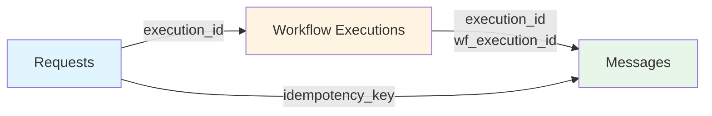

 
Export your SuprSend notification data to your S3 bucket every 5 minutes in Parquet format. You maintain complete data ownership in your infrastructure for compliance audits, custom analytics dashboards, and detailed debugging workflows.

**Key features:**
- **5-minute sync frequency** - You export logs every 5 minutes, with initial sync taking up to 10 minutes for new or empty buckets
- **Complete data ownership** - All notification logs stored in your infrastructure
- **Encrypted** - TLS 1.2+ in transit, S3 server-side encryption at rest
- **Automatic backfilling** - Historical data automatically synced when you resume sync

---

## Data points

You export three data points individually or together. Choose based on your needs.


| Data Point | Use for | Helps diagnose |
|------------|---------|----------------|
| **Messages** | Delivery tracking, engagement analysis, vendor performance | Delivery failures, invalid addresses, vendor errors |
| **Workflow Executions** | Debugging workflows, performance analysis | Template errors, preference issues, webhook failures |
| **Requests** | API monitoring, compliance, integration debugging | API errors, invalid payloads, authentication failures |

<Tabs>
<Tab title="Messages">

Delivery status and engagement metrics for each message sent to users.

**Key information:** Status (`triggered`, `delivered`, `seen`, `clicked`, `dismissed`, `failed`), timestamps, vendor information, failure reasons (execution and delivery level).

**Use cases:**
- Monitor delivery rates and identify failures
- Track user engagement (opens, clicks)
- Compare vendor performance
- Maintain compliance audit trail

</Tab>

<Tab title="Workflow Executions">

Step-by-step execution logs showing exactly how each workflow ran. Each workflow step becomes a separate row.

**Key information:** Execution stages, node details, status (`info`, `warning`, `error`), performance timing, execution data (template rendering results, webhook responses, preference computations).

**Use cases:**
- Debug workflow failures
- Identify performance bottlenecks
- Analyze template rendering
- Understand preference computation

</Tab>

<Tab title="Requests">

Complete API request logs for every request sent to SuprSend, including request payloads, responses, and triggered workflows.

**Key information:** API type, payload, response, status (`completed`, `failure`, `partial_failure`), errors, metadata (SDK version, machine details, location).

**Use cases:**
- Track API calls and success rates
- Identify error patterns
- Debug SDK integrations
- Maintain API audit trail

</Tab>
</Tabs>

### Linking data

The three data points connect to trace complete notification flows:



**Linking fields:**
- `Requests.executions[].execution_id` → `Workflow Executions.execution_id`
- `Workflow Executions.execution_id` → `Messages.wf_execution_id`
- `Requests.idempotency_key` → `Messages.idempotency_key`

**Example flow:**

1. **Request** (`idempotency_key: "req_abc123"`) triggers workflow `welcome_email`
2. **Workflow Execution** (`execution_id: "exec_xyz789"`) processes the workflow
3. **Messages** (`wf_execution_id: "exec_xyz789"`, `idempotency_key: "req_abc123"`) - Two messages created (email and SMS channels)

**Result:** 1 Request → 1 Workflow Execution → 2 Messages

---

## Quick start

You complete setup in 4 steps (~15 minutes).
 
### Prerequisites
 
- **AWS account** with admin access (permissions to create S3 buckets and IAM roles/users)
- SuprSend workspace

---
 
### Step 1: Create S3 bucket
 
1. Open [AWS S3 Console](https://s3.console.aws.amazon.com/) → **Create bucket**
2. Configure these settings:
   - **Bucket name**: Unique name (e.g., `suprsend-notification`)
   - **Region**: Your preferred region
   - **Bucket type**: General purpose
   - **Object Ownership**: ACLs disabled (recommended)
   - **Block all public access**: Enabled
   - **Bucket versioning**: Disabled
   - **Default encryption**: Server-side encryption with Amazon S3 managed keys (SSE-S3). For compliance-heavy use cases requiring audit trails and key management, use SSE-KMS instead.
   - **Bucket Key**: Enabled
3. Click **Create bucket**


---
 
### Step 2: Create IAM policy
 
1. Open [IAM Console](https://console.aws.amazon.com/iam/) → **Policies** → **Create Policy** → **JSON** tab
2. Paste this policy (replace `suprsend-notification` with your bucket name):
 
```json
{
  "Version": "2012-10-17",
  "Statement": [
    {
      "Sid": "S3ObjectActions",
      "Effect": "Allow",
      "Action": [
        "s3:PutObject"  // Required: Allows SuprSend to write Parquet files to your bucket
      ],
      "Resource": [
        "arn:aws:s3:::suprsend-notification/*"  // Replace suprsend-notification with your bucket name
      ]
    }
  ]
}
```
 
<Note>
**Replace `suprsend-notification`** in the Resource ARN with your actual bucket name. The `/*` suffix is required for object-level permissions. ARN must not have extra spaces.
</Note>

3. Name it (e.g., `suprsend_s3_policy`) → **Create Policy**

---
 
### Step 3: Set up authentication
 
Choose **IAM Role** (recommended) or **IAM User** (simpler).

| Auth Scheme | When to Use | Pros | Cons |
|-------------|-------------|------|------|
| **IAM Role** | Enterprises, multi-account setups, production | Most secure, automates trust, no key rotation needed | Requires trust relationship setup |
| **IAM User** | Quick tests, small projects, development | Simple setup, fewer steps | Less secure, needs key rotation every 90 days |
 
<Note>
**Best practice:** Assign IAM policies to groups, not individual users. This simplifies permission management and follows AWS security best practices. For IAM Users, rotate access keys every 90 days as required by AWS security standards.
</Note>
 
<Tabs>
<Tab title="IAM Role">

#### Step 3.1: Create role

1. IAM Console → **Roles** → **Create Role**
2. Select **Trusted Entity Type** as **AWS Account**
3. Select **Another AWS Account**
4. Enter SuprSend account ID: `924219879248`
5. Attach the policy from Step 2
6. Name role (e.g., `suprsend_trust_role`) → **Create role**

#### Step 3.2: Verify trust relationship

1. Generate an External ID using a [UUID Generator](https://www.uuidgenerator.net/) (recommended best practice to prevent "confused deputy" attacks). Save it securely—you'll need the same value in both AWS and SuprSend (case-sensitive).

2. Select the role created above from IAM Console → **Roles** tab

3. In **Trust Relationships** tab, verify this trust policy:
 
```json
{
  "Version": "2012-10-17",
  "Statement": [
    {
      "Effect": "Allow",
      "Principal": {
        "AWS": "arn:aws:iam::924219879248:root"
      },
      "Action": "sts:AssumeRole",
      "Condition": {
        "StringEquals": {
          "sts:ExternalId": "<uniq-id-entered-by-user>"
        }
      }
    }
  ]
}
```
 
<Note>
**Important:**
- Principal must be SuprSend's AWS account ID: `924219879248`
- ExternalId should match the unique ID entered during role creation
</Note>

#### Step 3.3: Save credentials

- **Role ARN** (from Summary tab - copy exactly, no extra spaces)
- **External ID** (the value you generated above - case-sensitive)
- **Maximum session duration**

</Tab>

<Tab title="IAM User">

#### Step 3.1: Create user

1. IAM Console → **Users** → **Add users**
2. Enter username (e.g., `s3-bucket-suprsend`)
3. Select **Provide access to AWS services and resources**
4. Attach policy from Step 2
5. Click **Next** → **Create user**

<Note>
**Best practice:** Assign the policy to an IAM group, then add the user to that group. This simplifies permission management and follows AWS security best practices.
</Note>

#### Step 3.2: Get credentials

1. Open user → **Security credentials** → **Create access key**
2. Choose **Third party service**
3. **Save immediately:** Access Key ID and Secret Access Key (AWS won't show secret again)

<Note>
**Key rotation:** Rotate access keys every 90 days as required by AWS security standards. Plan for key rotation to avoid service interruption.
</Note>

#### Step 3.3: Save credentials

- **Access Key ID** (copy exactly, no extra spaces)
- **Secret Access Key** (copy exactly, no extra spaces)

</Tab>
</Tabs>

---
 
### Step 4: Configure in SuprSend
 
1. SuprSend → **Settings** → **Connectors** → **Amazon S3 v2.0** → **Add Connector**

<Tabs>
<Tab title="IAM Role">
 

 
**Configuration fields:**

| Field | Description | Sample Value | Required |
|-------|-------------|--------------|----------|
| **Connector name** | Descriptive name for this connector | `Production S3 Export` | Yes |
| **Authentication Scheme** | Authentication method | IAM Role | Yes |
| **AWS Region** | Your bucket's AWS region | `us-east-1`, `ap-south-1` | Yes |
| **Export Bucket** | Your S3 bucket name | Must match exactly with Step 1 | Yes |
| **Data Points to export** | Which data points to sync | Messages, Workflow Executions, Requests, or all | Yes |
| **Role ARN** | IAM Role ARN from Step 3 | Copy exactly from AWS (no extra spaces) | Yes |
| **External ID** | External ID from Step 3 | Must match exactly (case-sensitive) | Yes |
| **Duration Seconds** | How long credentials remain valid | Default: 3600 (1 hour), range: 900-43200 | No |

</Tab>

<Tab title="IAM User">
 

 
**Configuration fields:**

| Field | Description | Sample Value | Required |
|-------|-------------|--------------|----------|
| **Connector name** | Descriptive name for this connector | `Production S3 Export` | Yes |
| **Authentication Scheme** | Authentication method | IAM User | Yes |
| **AWS Region** | Your bucket's AWS region | `us-east-1`, `ap-south-1` | Yes |
| **Export Bucket** | Your S3 bucket name | Must match exactly with Step 1 | Yes |
| **Data Points to export** | Which data points to sync | Messages, Workflow Executions, Requests, or all | Yes |
| **Access Key ID** | Access Key ID from Step 3 | Copy exactly from AWS (no extra spaces) | Yes |
| **Secret Access Key** | Secret Access Key from Step 3 | Copy exactly from AWS (no extra spaces) | Yes |

</Tab>
</Tabs>

2. Click **Save** → Toggle **Enable sync**
 
<Tip>
Start with **Messages** to verify setup. Add other data points as needed. Initial files appear within 5-10 minutes after enabling sync.
</Tip>
 
---

## Troubleshooting
 
<AccordionGroup>
<Accordion title="Files not appearing or connection test failed" defaultOpen={false}>

- Wait 10+ minutes for initial sync
- Verify bucket name and region match exactly between AWS and SuprSend (case-sensitive)
- Check IAM permissions: Role ARN/External ID match exactly (if using IAM Role) or Access Key credentials are correct (if using IAM User)
- Ensure policy includes `s3:PutObject` and resource ARN has `/*` suffix
- Verify sync is enabled and at least one data point is selected
 
</Accordion>
 
<Accordion title="Missing data" defaultOpen={false}>

- Verify the data point is selected in "Data Points to export"
- New data points only export going forward, not retroactively
- If sync was paused, data backfills automatically when resumed
- Check that notifications were actually sent during that time period
 
</Accordion>
 
<Accordion title="Backfill behavior" defaultOpen={false}>

When you re-enable sync after pausing, all data from the pause period is automatically exported. You can add or remove data points anytime; new selections only export going forward.
 
</Accordion>
</AccordionGroup>

---

## Reference

### Data schemas

<Tabs>
<Tab title="Requests">

| Column | Description | Type | Example |
|--------|-------------|------|---------|
| `idempotency_key` | Unique request identifier | string | `req_abc123def456` |
| `api_type` | Entity type for the API call | string | `event`, `workflow`, `user` |
| `api_name` | Workflow/event name | string | `order_confirmation` |
| `distinct_id_list` | List of user distinct_id or object type/id | Array of strings | `["user_123", "user_456"]` |
| `tenant_id` | Tenant ID | string | `default` |
| `payload` | Input payload with API call details | JSON object | `{"event": "order_placed", "amount": 99.99}` |
| `response` | HTTP API response | JSON object | `{"status": 200, "execution_ids": ["exec_123"]}` |
| `errors` | Request-level errors with message, severity, type, and code | Array of JSON objects | `[{"message": "Recipient not found", "severity": "error"}]` |
| `executions` | Workflow/broadcast execution IDs and slugs triggered | Array of JSON objects | `[{"execution_id": "exec_123", "slug": "welcome_email"}]` |
| `created_at` | Request timestamp (UTC) | datetime | `2025-01-15T14:23:45.123Z` |
| `updated_at` | Last update timestamp | datetime | `2025-01-15T14:23:45.456Z` |
| `status` | Request status | string | `completed`, `failure`, `partial_failure` |

</Tab>

<Tab title="Workflow Executions">

| Column | Description | Type | Example |
|--------|-------------|------|---------|
| `execution_id` | Unique workflow execution identifier | String | `exec_abc123def456` |
| `recipient_distinct_id` | User or object identifier | String | `user_123`, `team_developer` |
| `tenant_id` | Tenant identifier | String | `default`, `acme_corp` |
| `idempotency_key` | Request identifier | String | `req_abc123def456` |
| `workflow_slug` | Workflow slug | String | `welcome_email`, `order_confirmation` |
| `workflow_version` | Workflow version | String | `v1.2`, `v2.0` |
| `node_id` | Node identifier | String | `node_email_1`, `node_condition_2` |
| `node_name` | Node name | String | `Send Email`, `Check Condition` |
| `node_type` | Node type | String | `email`, `condition`, `delay` |
| `execution_stage` | Execution stage | String | `workflow_started`, `node_started`, `node_processing`, `node_finished` |
| `status` | Log status | String | `info`, `error`, `warning` |
| `message` | Description of what happened; error message if status is `error` | String | `Email sent successfully`, `Template rendering failed` |
| `properties` | Additional data consumed or generated (input payload, webhook request/response, etc.) | JSON object | `{"template_rendered": true, "channel": "email"}` |
| `created_at` | Workflow execution start time | datetime | `2025-01-15T14:23:45.123Z` |
| `updated_at` | Last workflow step log update time | datetime | `2025-01-15T14:23:46.789Z` |

</Tab>

<Tab title="Messages">

| Column | Description | Type | Example |
|--------|-------------|------|---------|
| `message_id` | Message identifier (only present if no execution_error) | String | `msg_xyz789` |
| `wf_execution_id` | Workflow execution identifier | String | `exec_abc123def456` |
| `recipient_distinct_id` | User or object identifier | String | `user_123`, `team_developer` |
| `tenant_id` | Tenant identifier | String | `default`, `acme_corp` |
| `workflow_slug` | Workflow slug | String | `welcome_email`, `order_confirmation` |
| `status` | Message delivery status | String | `triggered`, `delivered`, `seen`, `clicked`, `dismissed`, `failed` |
| `channel_slug` | Communication channel | String | `email`, `sms`, `push` |
| `channel_info` | Channel value (e.g., email address, phone number) | String | `user@example.com`, `+1234567890` |
| `vendor_name` | Vendor nickname | String | `SendGrid`, `Twilio`, `AWS SES` |
| `triggered_at` | When message was sent to vendor | datetime | `2025-01-15T14:23:45.123Z` |
| `delivered_at` | When vendor sent the message | datetime | `2025-01-15T14:23:46.789Z` |
| `seen_at` | When user saw the message | datetime | `2025-01-15T14:25:30.000Z` |
| `execution_failure_reason` | Failure reason at execution level with severity (`error` or `warning`) | JSON object | `{"message": "Template rendering failed", "severity": "error"}` |
| `delivery_failure_reason` | Failure reason from vendor | String | `Invalid recipient address` |
| `created_at` | Entry creation time | datetime | `2025-01-15T14:23:45.123Z` |
| `updated_at` | Last status update time | datetime | `2025-01-15T14:23:50.456Z` |

</Tab>
</Tabs>
