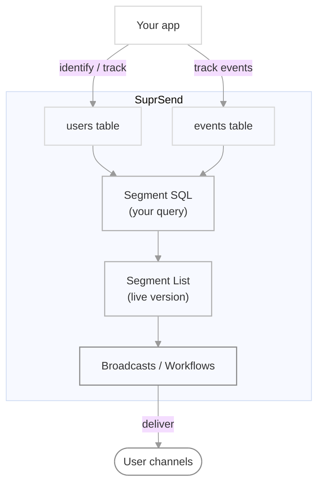

<Note>
  Segment Lists are currently in **beta**. Share feedback on our [Slack community](https://join.slack.com/t/suprsendcommunity/shared_invite/zt-3932rw936-XNWY1RC8bsffh4if4ZyoXQ) or at support@suprsend.com.
</Note>

This guide takes you from an empty workspace to a live Segment List that powers a broadcast or workflow trigger. You'll write SQL against `users` and `events`, preview matched users, commit a version, and use the list downstream. See [Segment Lists](/docs/segment-lists) for the concept and comparisons with other list types.

## How the pieces fit



## Prerequisites

- Read the [Segment Lists concept](/docs/segment-lists).
- Your workspace already sends [user data](/docs/users) and (optionally) [events](/docs/track-event) to SuprSend — the segment queries this data.
- A SuprSend workspace API key. Find it under **Settings → API keys**.

## Step 1 — Create the list

<Steps>
  <Step title="Open the source picker">
    Go to **Lists → New List**. In the source picker, select **Segment List**.

    <Frame>
      
    </Frame>
  </Step>

  <Step title="Name the list">
    Enter a `list_id`, and optionally a name and description. The `list_id` is the stable identifier you'll reference from the API and workflows.

    | Field | Rules |
    |---|---|
    | `list_id` | Required. URL-safe: lowercase letters, digits, and underscores. Unique within the workspace. |
    | Name | Optional. Defaults to `list_id` if omitted. |
    | Description | Optional. |

    <Frame>
      
    </Frame>
  </Step>

  <Step title="Land in the Segment Builder">
    You'll be taken to the **Segment Builder** — a SQL editor on the left, a schema panel on the right, and a **Generate with AI** button in the toolbar.

    <Frame>
      
    </Frame>
  </Step>
</Steps>

## Step 2 — Write your SQL

Segment SQL runs against two tables — `users` and `events` — using a PostgreSQL-compatible dialect.

### Available tables

<Tabs>
  <Tab title="users">
    One row per user in your workspace. Not time-bounded — you can query it freely without a date filter.

    | Column | Type | Notes |
    |---|---|---|
    | `distinct_id` | string | The canonical user identifier. **Required in every SELECT.** |
    | `created_at` | timestamp | When the user profile was created. |
    | `updated_at` | timestamp | Last profile update. |
    | `language` | string | e.g. `en`. |
    | `locale` | string | e.g. `en-US`. |
    | `timezone` | string | e.g. `America/New_York`. |
    | `user_properties` | JSON | Your custom user properties (plan, country, LTV, tags, nested objects, etc.). |
    | `all_channels` | array<string> | All channels ever attached (e.g. `["email","sms"]`). |
    | `active_channels` | array<string> | Currently active channels. |
    | `restricted_channels` | array<string> | Channels the user opted out of. |
    | `all_emails` | array<string> | All email addresses on the profile. |
    | `active_emails` | array<string> | Currently active email addresses. |
    | `all_phone_numbers` | array<string> | All phone numbers on the profile. |
    | `active_phone_numbers` | array<string> | Currently active phone numbers. |
  </Tab>
  <Tab title="events">
    One row per event you've sent to SuprSend. **Every query on `events` must include a bounded filter on `requested_at`** — for example `WHERE requested_at >= NOW() - INTERVAL '30 days'`.

    | Column | Type | Notes |
    |---|---|---|
    | `distinct_id` | string | User who triggered the event. |
    | `event_name` | string | Event name — e.g. `order_placed`, `signup_completed`. |
    | `requested_at` | timestamp | When SuprSend received the event. **Required in `WHERE`.** |
    | `processed_at` | timestamp | When the event finished processing. |
    | `status` | enum | `success` or `failure`. |
    | `properties` | JSON | The event payload you sent. |
    | `workflow_slugs` | array<string> | Workflows this event triggered. |
    | `tenant_id` | string | Tenant scope, if the event was tenant-scoped. |
  </Tab>
</Tabs>

### Query rules

- **Return `distinct_id`.** Your SELECT must include a `distinct_id` column. Any other columns you select show up in the dry-run preview but do not affect list membership.
- **No `SELECT *`.** List the columns you need.
- **Two tables only.** References to any table other than `users` and `events` are rejected.
- **`events` needs a bounded time filter** on `requested_at`. The `users` table doesn't need one.
- **Row cap.** Preview and evaluation are capped — set an explicit `LIMIT` (up to `1000`) when your query might produce very large result sets during preview.
- **JSON keys are case-sensitive.** `properties ->> 'Amount'` is not the same as `properties ->> 'amount'`.
- **Workspace isolation is automatic.** There's no `workspace_id` column — your API key scopes the query.

### Supported SQL

The dialect is PostgreSQL-compatible. Below are the categories most useful for segment building.

<AccordionGroup>
  <Accordion title="Aggregates">
    `count()`, `count(distinct ...)`, `count_if(cond)`, `sum()`, `sum_if()`, `avg()`, `min()`, `max()`, `arg_max(value, key)`, `arg_min(value, key)`, `median()`, `quantile(level, col)`, `array_agg()`, `groupUniqArray()`, `topK(n, col)`.
  </Accordion>
  <Accordion title="String functions">
    `upper()`, `lower()`, `initcap()`, `ltrim()`, `rtrim()`, `btrim()`, `substring()`, `left()`, `right()`, `split_part()`, `replace()`, `regexp_replace()`, `concat()`, `concat_ws()`, `||` (concatenation), `like`, `ilike`, `~`, `~*`, `starts_with()`, `ends_with()`, `position()`.
  </Accordion>
  <Accordion title="Date and time">
    `now()`, `current_date`, `date_trunc('day' | 'week' | 'month' | 'quarter' | 'year', ts)`, `extract(field from ts)`, `date_part('unit', ts)`, `date_diff('unit', a, b)`, arithmetic with `INTERVAL '30 days'` / `'1 hour'` / etc., casts via `to_timestamp()` and `toDate()`.
  </Accordion>
  <Accordion title="JSON access">
    - `->` — return the value at a key as JSON (for nested access).
    - `->>` — return the value at a key as text.
    - `@>` — containment check (does the JSON contain this subtree?).
    - `@?` — path existence check.
    - `'value' = ANY(col -> 'key')` — membership test for a JSON array.

    Cast when you need a numeric comparison: `CAST(user_properties ->> 'lifetime_value' AS DOUBLE PRECISION) >= 2500`.
  </Accordion>
  <Accordion title="Array access">
    - `'value' = ANY(arr)` — membership.
    - `array_length(arr, 1)` — length.
    - `arrayExists(x -> cond, arr)`, `arrayFilter(x -> cond, arr)`, `arrayMap(x -> expr, arr)` — lambda-style operations.
    - `array_position(arr, elem)`, `array_to_string(arr, ',')`.
  </Accordion>
  <Accordion title="Conditional and math">
    `CASE WHEN ... THEN ... ELSE ... END`, `if(cond, a, b)`, `multi_if(c1, v1, c2, v2, default)`, `coalesce()`, `nullif()`.

    `abs()`, `round()`, `floor()`, `ceil()`, `power()`, `sqrt()`, `greatest()`, `least()`.
  </Accordion>
</AccordionGroup>

### Sample queries

<Tabs>
  <Tab title="Property filters">
    ```sql Enterprise users in the US
    SELECT distinct_id
    FROM users
    WHERE user_properties ->> 'plan' = 'enterprise'
      AND user_properties -> 'address' ->> 'country' = 'US'
    ```

    ```sql VIP-tagged users
    SELECT distinct_id
    FROM users
    WHERE 'vip' = ANY(user_properties -> 'tags')
    ```

    ```sql Users with an active email channel
    SELECT distinct_id
    FROM users
    WHERE array_length(active_emails, 1) > 0
    ```

    ```sql High lifetime value
    SELECT distinct_id
    FROM users
    WHERE CAST(user_properties ->> 'lifetime_value' AS DOUBLE PRECISION) >= 2500
    ```
  </Tab>
  <Tab title="Event-based">
    ```sql Signups in the last 30 days
    SELECT DISTINCT distinct_id
    FROM events
    WHERE event_name = 'signup_completed'
      AND requested_at >= NOW() - INTERVAL '30 days'
    ```

    ```sql Big spenders in the last 7 days
    SELECT DISTINCT distinct_id
    FROM events
    WHERE event_name = 'order_placed'
      AND requested_at >= NOW() - INTERVAL '7 days'
      AND CAST(properties ->> 'amount' AS DOUBLE PRECISION) > 5000
    ```

    ```sql Cart abandoners (checkout started, not completed)
    SELECT DISTINCT distinct_id
    FROM events
    WHERE event_name = 'checkout_started'
      AND requested_at >= NOW() - INTERVAL '3 days'
      AND distinct_id NOT IN (
        SELECT distinct_id FROM events
        WHERE event_name = 'order_placed'
          AND requested_at >= NOW() - INTERVAL '3 days'
      )
    ```
  </Tab>
  <Tab title="Compound (user + event)">
    ```sql Growth-plan buyers in the last 60 days
    SELECT DISTINCT e.distinct_id
    FROM events e
    JOIN users u ON e.distinct_id = u.distinct_id
    WHERE e.event_name = 'order_placed'
      AND e.requested_at >= NOW() - INTERVAL '60 days'
      AND u.user_properties ->> 'plan' = 'growth'
    GROUP BY e.distinct_id
    HAVING count(*) >= 3
    ```

    ```sql Enterprise users in the US with recent activity
    SELECT DISTINCT e.distinct_id
    FROM events e
    JOIN users u ON e.distinct_id = u.distinct_id
    WHERE e.requested_at >= NOW() - INTERVAL '30 days'
      AND u.user_properties ->> 'plan' = 'enterprise'
      AND u.user_properties -> 'address' ->> 'country' = 'US'
    ```
  </Tab>
  <Tab title="Advanced JSON">
    ```sql Users whose subscription has 50+ seats
    SELECT distinct_id
    FROM users
    WHERE CAST(user_properties -> 'subscription' ->> 'seats' AS INT) >= 50
    ```

    ```sql Users who ordered electronics recently
    SELECT DISTINCT distinct_id
    FROM events
    WHERE event_name = 'order_placed'
      AND requested_at >= NOW() - INTERVAL '14 days'
      AND properties @> '{"items":[{"category":"electronics"}]}'
    ```

    ```sql Verified VIPs on Enterprise from selected countries
    SELECT distinct_id
    FROM users
    WHERE user_properties ->> 'plan' = 'enterprise'
      AND user_properties @> '{"is_verified":true}'
      AND 'vip' = ANY(user_properties -> 'tags')
      AND user_properties -> 'address' ->> 'country' IN ('US','GB','IN','CH','PT')
    ```
  </Tab>
</Tabs>

### The schema panel

The right-hand panel lists every column on `users` and `events` for your workspace, including custom user properties. Click a column name to insert it at the cursor. Click a table header to collapse or expand it.

## Step 3 — Generate SQL with the SuprSend Agent

If SQL isn't your thing, describe the segment in plain English and let the Agent write the query.

<Steps>
  <Step title="Open the Agent">
    Click **Generate with AI** in the Segment Builder toolbar. The Agent drawer opens on the right.
  </Step>
  <Step title="Describe the segment">
    Type what you want in natural language. Examples:

    - *Users on the Growth plan in the US who placed at least 3 orders in the last 60 days.*
    - *Users who signed up in the last 30 days but never triggered `onboarded`.*
    - *Enterprise users with lifetime value above $2,500 and an active email channel.*

    You can also use the suggested prompts above the input.
  </Step>
  <Step title="Review before you use it">
    The Agent returns SQL along with a plain-English summary of what the query does. Read the SQL and the summary carefully — check column names, comparison operators, and time windows.

    <Tip>
      The Agent uses your workspace **schema** — table and column names — to generate SQL. It does not read user data or event payloads.
    </Tip>
  </Step>
  <Step title="Insert into the editor">
    Click **Use this SQL** to insert the query at the cursor. You can edit it before running.
  </Step>
</Steps>

<Warning>
  Always dry-run and inspect the sample rows before committing. Agent-generated SQL is never auto-executed.
</Warning>

## Step 4 — Dry-run to preview matched users

Click **Run query** (or press `Cmd/Ctrl + Enter`) to execute a dry-run.

The dry-run panel shows:

- The total count of matched users.
- Up to a sample of the actual rows, so you can spot-check the segment.
- The exact error if the SQL is invalid.

The two API calls under the hood:

<CodeGroup>
```bash Dry-run (sample rows)
curl -X POST 'https://hub.suprsend.com/v1/subscriber_list/~/dry_run/' \
  -H 'Authorization: Bearer YOUR_WORKSPACE_KEY' \
  -H 'Content-Type: application/json' \
  -d '{
    "query_text": "SELECT distinct_id, active_emails FROM users LIMIT 40"
  }'
```

```bash Dry-run (count only)
curl -X POST 'https://hub.suprsend.com/v1/subscriber_list/~/dry_run/count/' \
  -H 'Authorization: Bearer YOUR_WORKSPACE_KEY' \
  -H 'Content-Type: application/json' \
  -d '{
    "query_text": "SELECT distinct_id FROM users WHERE user_properties ->> '\''plan'\'' = '\''enterprise'\''"
  }'
```
</CodeGroup>

Response for the sample-rows call:

```json 200
{
  "data": [
    { "distinct_id": "u_8f21ac", "active_emails": ["maya.chen@acme.co"] },
    { "distinct_id": "u_2c11ef", "active_emails": ["jordan@northwind.io"] }
  ]
}
```

Response for the count call:

```json 200
{
  "count": 4812
}
```

## Step 5 — Commit the segment

Committing turns the current SQL into an immutable version of the segment. That version becomes the `live` version and is used by any broadcast or workflow trigger that references this list.

<Steps>
  <Step title="Click Commit">
    The **Commit** button becomes active after a successful dry-run. If you edit the SQL after the dry-run, run it again before committing.
  </Step>
  <Step title="Add a commit message (optional)">
    Describe what changed in this version — e.g. *"Expanded to 5 countries; 60-day order window."* The message shows up in **Version History**.

    <Frame>
      
    </Frame>
  </Step>
  <Step title="Enable the list">
    A committed segment isn't active until it's enabled. Toggle **Enable segment** from the list detail page's menu.
  </Step>
</Steps>

You can also create a Segment List directly through the API, with the SQL as the initial query:

<CodeGroup>
```bash cURL
curl -X POST 'https://hub.suprsend.com/v1/subscriber_list/' \
  -H 'Authorization: Bearer YOUR_WORKSPACE_KEY' \
  -H 'Content-Type: application/json' \
  -d '{
    "list_id": "high_ltv_q1",
    "list_type": "dynamic_list",
    "query": "SELECT distinct_id FROM users WHERE CAST(user_properties ->> '\''lifetime_value'\'' AS DOUBLE PRECISION) >= 2500",
    "is_enabled": true
  }'
```

```javascript Node.js
const { Suprsend } = require("@suprsend/node-sdk");
const client = new Suprsend("WORKSPACE_KEY", "WORKSPACE_SECRET");

await client.request({
  method: "POST",
  path: "/v1/subscriber_list/",
  body: {
    list_id: "high_ltv_q1",
    list_type: "dynamic_list",
    query:
      "SELECT distinct_id FROM users WHERE CAST(user_properties ->> 'lifetime_value' AS DOUBLE PRECISION) >= 2500",
    is_enabled: true,
  },
});
```

```python Python
from suprsend import Suprsend
client = Suprsend("WORKSPACE_KEY", "WORKSPACE_SECRET")

client.request(
    method="POST",
    path="/v1/subscriber_list/",
    body={
        "list_id": "high_ltv_q1",
        "list_type": "dynamic_list",
        "query": "SELECT distinct_id FROM users WHERE CAST(user_properties ->> 'lifetime_value' AS DOUBLE PRECISION) >= 2500",
        "is_enabled": True,
    },
)
```
</CodeGroup>

See [Create a List](/reference/create-list) for the full request/response contract.

## Step 6 — Use the segment

Once the segment is committed and enabled, you can use it anywhere lists are supported.

<Tabs>
  <Tab title="Broadcast (dashboard)">
    Go to **Broadcasts → New Broadcast**, pick the Segment List as the audience, choose a template, and schedule. Before running, SuprSend refreshes the segment so the broadcast picks up the current membership.
  </Tab>
  <Tab title="Broadcast (API)">
    ```bash cURL
    curl -X POST 'https://hub.suprsend.com/v1/broadcast/' \
      -H 'Authorization: Bearer YOUR_WORKSPACE_KEY' \
      -H 'Content-Type: application/json' \
      -d '{
        "workflow": "product-update-announcement",
        "list_id": "high_ltv_q1",
        "delay": "0m"
      }'
    ```

    See [Broadcast](/docs/broadcast) for the full options.
  </Tab>
  <Tab title="Workflow triggers (list entry/exit)">
    Add a **list entry / exit** trigger to a workflow — the `$USER_ENTERED_LIST` and `$USER_EXITED_LIST` events fire automatically as users join or leave the segment. See [workflow triggers](/docs/design-workflow#1-trigger-node).

    Useful for retention (fire on exit) and welcome flows (fire on entry).
  </Tab>
  <Tab title="AI agent / MCP">
    Point your AI agent at the SuprSend [MCP server](/reference/mcp-overview) and prompt:

    <Prompt description="Create a Segment List using the SuprSend MCP.">
    Create a Segment List named "high_ltv_q1" that includes users on the Enterprise plan in the US with lifetime value above $2,500, then schedule a broadcast using the "product-update-announcement" workflow to that list.
    </Prompt>
  </Tab>
</Tabs>

## Versioning and rollback

Every commit creates a new version. The current version is `live`; older versions stay in **Version History** on the list detail page.

<Steps>
  <Step title="Open Version History">
    From the segment detail page, click **Version History**. The left pane lists all versions with the live one badged; the right pane shows the SQL, plain-language summary, and commit message.
  </Step>
  <Step title="Roll back">
    Select an older version and click **Rollback to this version**. This creates a new version (V{n+1}) with the SQL copied from the selected one. The new version becomes `live`; the previous versions stay in history.

    <Tip>
      Rollback never destroys history — the audit trail is preserved.
    </Tip>
  </Step>
</Steps>

## Configuration reference

Fields on the list object relevant to Segment Lists:

<ParamField body="list_id" type="string" required>
  Unique identifier within the workspace. Lowercase letters, digits, and underscores only.
</ParamField>

<ParamField body="list_type" type="string" required>
  Set to `dynamic_list` to create a Segment List. Other values: `static_list` (default), `sync_list`.
</ParamField>

<ParamField body="query" type="string" required>
  The SQL query defining the segment. Must return a `distinct_id` column.
</ParamField>

<ParamField body="list_name" type="string">
  Display name. Defaults to `list_id` if omitted.
</ParamField>

<ParamField body="list_description" type="string">
  Free-form description shown in the dashboard.
</ParamField>

<ParamField body="is_enabled" type="boolean" default="false">
  Whether the segment is active. A disabled segment does not refresh and cannot be used for broadcasts or triggers.
</ParamField>

<ParamField body="track_user_entry" type="boolean" default="false">
  Emit `$USER_ENTERED_LIST` events when users are added. Required to trigger workflows on list entry.
</ParamField>

<ParamField body="track_user_exit" type="boolean" default="false">
  Emit `$USER_EXITED_LIST` events when users are removed. Required to trigger workflows on list exit.
</ParamField>

## Edge cases and behavior

<AccordionGroup>
  <Accordion title="Query returns zero users">
    Commit is allowed — the segment simply has no members until data changes and someone matches. The dashboard shows a `0 users matched` indicator with a suggestion to adjust filters.
  </Accordion>
  <Accordion title="SQL is edited after a successful dry-run">
    The **Commit** button is disabled until you re-run the query. This prevents committing a query you haven't previewed.
  </Accordion>
  <Accordion title="Missing distinct_id in SELECT">
    A red banner appears under the editor: *"Missing distinct_id. Query results must include a `distinct_id` column to sync users to the list."* Commit is blocked until the SELECT is fixed.
  </Accordion>
  <Accordion title="Selecting extra columns alongside distinct_id">
    Extra columns show up in the dry-run preview so you can spot-check the data. They do not affect list membership — only `distinct_id` is used to sync users into the list.
  </Accordion>
  <Accordion title="Deleting a segment used by a workflow or broadcast">
    Delete is disabled while any workflow or scheduled broadcast references the list. Remove the dependency first — the tooltip on the disabled button lists what's using the list.
  </Accordion>
  <Accordion title="Disabling a segment">
    Sync pauses. Existing memberships remain in place, so a manually-triggered broadcast can still send to the last-known members. Re-enabling resumes sync.
  </Accordion>
  <Accordion title="Navigating away with unsaved changes">
    The builder prompts to save a draft or discard changes before you leave. A saved draft is preserved and re-loaded next time you open the builder — it doesn't become live until you commit.
  </Accordion>
</AccordionGroup>

## Troubleshooting

<AccordionGroup>
  <Accordion title="Schema error: No field named X. Valid fields are …">
    The column doesn't exist on the table you're querying. Check the schema panel for the correct column name — JSON keys are case-sensitive, and custom user properties live inside `user_properties` (use `user_properties ->> 'field_name'`), not as top-level columns.
  </Accordion>
  <Accordion title="Table 'orders' does not exist. Only 'users' and 'events' are available.">
    Segment SQL can only reference `users` and `events`. To filter on business objects like orders, model them as events (`order_placed`) or user properties (`total_orders_count`) and re-query those.
  </Accordion>
  <Accordion title="Query timed out">
    The dry-run couldn't complete in the allowed time. Simplify: narrow the time window on `events`, add more selective filters, avoid `SELECT` with many columns, and add a `LIMIT`. Then re-run.
  </Accordion>
  <Accordion title="Missing time filter on events">
    `events` queries must include a bounded filter on `requested_at`, such as `WHERE requested_at >= NOW() - INTERVAL '30 days'`. Bare comparisons on the raw column count; wrapping the column in a function (e.g. `DATE_TRUNC(requested_at)`) does not.
  </Accordion>
  <Accordion title="AI Agent generated a query that doesn't return anything">
    Two common causes: (1) a column name in the Agent's SQL doesn't match your workspace's schema — check the schema panel and correct the identifier; (2) the time window is too narrow. Adjust and re-run. The Agent uses your schema but it can still make plausible-looking mistakes.
  </Accordion>
</AccordionGroup>

## Limits and constraints

- Queries can reference only `users` and `events`.
- The SELECT must include `distinct_id`.
- `SELECT *` is not allowed — list the columns you need.
- `events` queries require a bounded time filter on `requested_at`.
- Row cap on preview and evaluation — use an explicit `LIMIT` (up to `1000`) if your query might produce very large result sets.
- JSON keys are case-sensitive; function names are case-insensitive.
- The API key on each request scopes queries to your workspace — there's no way to reference another workspace's data.

## Next steps

<CardGroup cols={2}>
  <Card title="Segment Lists concept" icon="lightbulb" href="/docs/segment-lists">
    Positioning, comparisons with other list types, and key behaviors.
  </Card>
  <Card title="Send a Broadcast" icon="bullhorn" href="/docs/broadcast">
    Use a Segment List as the audience for a one-shot campaign.
  </Card>
  <Card title="List entry / exit events" icon="workflow" href="/docs/design-workflow#1-trigger-node">
    Trigger workflows when users enter or exit a segment.
  </Card>
  <Card title="Create a List API" icon="code" href="/reference/create-list">
    Create a Segment List programmatically.
  </Card>
</CardGroup>
