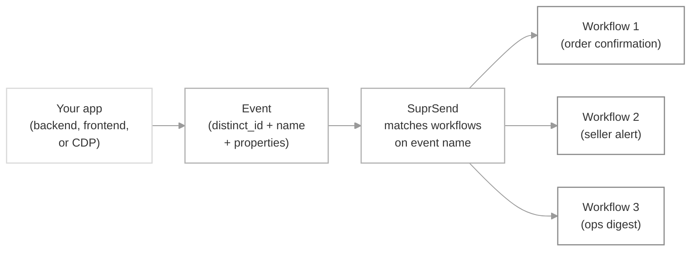

An **event** is a record of something that happened in your product — a user placed an order, a payment failed, an invite was sent — that SuprSend uses to trigger workflows. You send the event once; SuprSend decides which workflows run and who gets notified.

Without events, every place in your code that does something notification-worthy has to know which workflow to call and who to send it to. With events, your code emits *what happened*, and your product team wires up *what to do about it* from the SuprSend dashboard — new notifications ship without a deploy.

## How it works



You emit one event; SuprSend fans it out to every workflow whose trigger is set to that event name, resolving the recipient, channels, and content per workflow.

<Frame>
  
</Frame>

## Anatomy of an event

Every event has the same shape, regardless of which SDK or API you use to send it.

- **`distinct_id`** — the user the event belongs to. The user must already exist in SuprSend (see [Users](/docs/users)); events for unknown users are silently dropped.
- **`event_name`** — a string like `order_placed` or `PAYMENT_FAILED`. This is the exact string a workflow matches on. Use past tense and keep casing consistent across your codebase — the value is case-sensitive.
- **`properties`** — a JSON object with data about the event (`order_id`, `amount`, `plan_name`). These become variables you can reference in workflow templates as `{{order_id}}` and use in [branch conditions](/docs/design-workflow#branch-node).
- **`tenant_id`** *(optional)* — routes the event through a specific [tenant's](/docs/tenants) templates, branding, and preferences. Use it for B2B products where every workspace has its own look and feel.
- **`idempotency_key`** *(optional)* — a unique string to dedupe retries. SuprSend rejects a second event with the same key within a 24-hour window. Always set this for critical notifications so a retry storm doesn't send the same message twice.

A minimal event, for reference:

```json
{
  "distinct_id": "u_9f2c3e",
  "event": "order_placed",
  "properties": {
    "order_id": "ORD-4821",
    "amount": 129.00,
    "currency": "USD"
  },
  "idempotency_key": "order_placed:ORD-4821"
}
```

## How to send events

Pick the path that matches where the event originates in your stack.

<CardGroup cols={1}>
  <Card title="Backend SDK" icon="server" href="/docs/node-send-event-data">
    Send from server-side code with the [Node](/docs/node-send-event-data), [Python](/docs/python-send-event-data), [Java](/docs/java-send-event-data), or [Go](/docs/go-send-event-data) SDK. Best for domain events that live in your backend — *for example, `payment_captured` fired from your billing service*.
  </Card>
  <Card title="Client-side SDK" icon="mobile" href="/docs/js-events-and-user-methods">
    Send directly from web or mobile apps with the [JavaScript](/docs/js-events-and-user-methods), [React](/docs/react-events-and-user-methods), [iOS](/docs/ios-events-and-user-methods), [Android](/docs/android-send-event-data), [React Native](/docs/react-native-send-event-data), or [Flutter](/docs/flutter-send-event-data) SDK. Best for UI interactions you already track for analytics — *for example, `product_added_to_cart` fired from the storefront*.
  </Card>
  <Card title="HTTP API" icon="code" href="/reference/create-event">
    Call the [Track Event API](/reference/create-event) directly. Best for languages without a SuprSend SDK, or from serverless functions and webhooks — *for example, forwarding a Stripe webhook as `subscription_renewed`*.
  </Card>
  <Card title="Third-party connector" icon="plug" href="/docs/segment">
    Route events already flowing through a CDP like [Segment](/docs/segment) into SuprSend without adding a new integration in your backend. Best when your event pipeline is already in place — *for example, mirroring every `Order Completed` event from Segment*.
  </Card>
</CardGroup>

<Tip>
  If you already publish domain events to a CDP or event bus, the connector or HTTP API is usually the shortest path — you don't need to touch service code. If your notifications originate from a single service that already talks to SuprSend, use the backend SDK for that service directly.
</Tip>

## When to use events

Reach for events (instead of the [direct workflow API](/docs/event-vs-workflow-api)) when:

- **Notifications map to user actions.** For things like `post_liked`, `comment_added`, `order_placed`, or `friend_request_sent`, the event already exists in your system — you just forward it to SuprSend.
- **One thing that happened should trigger several notifications.** An `order_placed` event can fan out to an order confirmation for the buyer, a new-sale alert for the seller, and a summary line in the ops team's digest — from a single call.
- **Product or ops teams need to iterate without a deploy.** Because the event-to-workflow mapping lives in the dashboard, non-engineers can add new notification workflows, change routing, or swap channels without shipping code.
- **You're already syncing users to SuprSend.** Event triggers assume the user profile exists. If you already run a user sync pipeline, events are a clean fit that keep notification triggering decoupled from user upserts.
- **You're integrating via a CDP.** If Segment, Rudderstack, or a similar platform already carries your events, route them into SuprSend as a destination — no extra backend integration.

## Events vs direct workflow triggers

Events aren't the only way to trigger a workflow. You can also call the [Trigger Workflow API](/docs/trigger-workflow) directly with a `workflow_slug`. The two are complementary; most teams use both.

| Parameter | Event trigger | [Workflow API trigger](/docs/trigger-workflow) |
|---|---|---|
| **Best for** | User actions and product events | System-generated sends, scheduled jobs, transactional flows |
| **User pre-creation** | Required — event is dropped if the user doesn't exist | Not required — pass recipient info inline (upsert) or send to a `is_transient` anonymous user |
| **Fan-out** | One event can trigger many workflows | One call triggers one workflow |
| **Who controls what fires** | Product/ops team, via the dashboard | Engineering, via code |
| **Use when** | *"Notify buyer, seller, and ops when an order is placed"* | *"Send a one-off OTP to an anonymous user"* |

For the full comparison, including failure modes and hybrid patterns, see [Event vs Workflow API](/docs/event-vs-workflow-api).

## Key behaviors and constraints

- **Silent drops for unknown users.** If the `distinct_id` on the event doesn't exist in SuprSend, the event is discarded without an error in the API response. Sync users first, and monitor the Requests log for dropped events. Alternatively, use the [Trigger Workflow API](/docs/trigger-workflow) which upserts the user inline.
- **Reserved prefixes.** Event names and property keys must not start with `$` or `ss_` — those namespaces are reserved for SuprSend's [system events](#system-events) and internal properties.
- **Fan-out is automatic.** SuprSend runs every live workflow whose trigger matches the event name. To stop a workflow from firing on an event, disable or delete it — there's no per-event routing rule to update.
- **Idempotency window.** Events sharing the same `idempotency_key` are deduplicated for 24 hours. Set the key for every retryable trigger.
- **Payload validation.** Attach a [JSON schema](/docs/validate-workflow-payload) to the event so malformed properties are rejected at the API layer instead of surfacing as template render errors downstream.
- **Recipient overrides.** By default the event's `distinct_id` is the recipient. To send to a different user, an [object](/docs/objects), or a set of users derived from event properties, use the workflow's [override recipient](/docs/override-recipient-list) setting.

### System events

SuprSend emits a few reserved events automatically. You don't send these — you trigger workflows on them.

- **`$USER_ENTERED_LIST`** — fires when a user joins a [list](/docs/lists). Use it for welcome flows or onboarding sequences.
- **`$USER_EXITED_LIST`** — fires when a user leaves a list. Use it for win-back or offboarding flows.

Wire either as the trigger on a workflow's [trigger node](/docs/design-workflow#1-trigger-node) and select the list to scope it to.

## FAQ

<AccordionGroup>
  <Accordion title="Why isn't my workflow firing on an event?">
    The three common causes: (1) the user's `distinct_id` doesn't exist in SuprSend, so the event was silently dropped — check the Requests log; (2) the event name in your code doesn't match the workflow's trigger exactly (event names are case-sensitive); (3) the workflow is in **Draft** and hasn't been committed. Commit the workflow and verify from the dashboard's **Logs → Executions** view.
  </Accordion>
  <Accordion title="Do I need to declare event names anywhere before sending?">
    No. Event names are free-form strings. SuprSend starts tracking a new event the first time it sees one, and it becomes selectable as a trigger in the workflow editor. For type safety, define a [JSON schema](/docs/validate-workflow-payload) for the event's properties.
  </Accordion>
  <Accordion title="Can one event trigger more than one workflow?">
    Yes. Every live workflow whose trigger matches the event name runs. This is the recommended way to fan a single business event out to multiple notifications — for example, buyer confirmation, seller alert, and ops summary from one `order_placed` event.
  </Accordion>
  <Accordion title="What are the naming rules for events and properties?">
    Event names are case-sensitive strings; keep casing consistent across your codebase. Property keys should be valid JSON keys. Neither event names nor property keys can start with `$` or `ss_` — those prefixes are reserved for SuprSend's system events and internal properties.
  </Accordion>
  <Accordion title="Can I send an event to an object instead of a user?">
    Not directly — an event always carries a user `distinct_id`. To notify an [object](/docs/objects) from an event, use the workflow's [override recipient](/docs/override-recipient-list) setting to point at an event property that holds the `object_type` and `object_id`. For direct object targeting without an intermediary user, use the [Trigger Workflow API](/docs/trigger-workflow) instead.
  </Accordion>
  <Accordion title="How do I stop a workflow from firing on an event without deleting the workflow?">
    Disable the workflow from the workflows list. It stops matching new events immediately; re-enable to resume.
  </Accordion>
</AccordionGroup>

## Next steps

<CardGroup cols={2}>
  <Card title="Design a workflow triggered by an event" icon="diagram-project" href="/docs/design-workflow">
    Wire an event name to a workflow's trigger node and route it to channels.
  </Card>
  <Card title="Validate event payloads with a schema" icon="shield-check" href="/docs/validate-workflow-payload">
    Reject malformed events at the API layer before they hit your templates.
  </Card>
  <Card title="Track events from Segment" icon="plug" href="/docs/segment">
    Route events from your CDP into SuprSend without a new backend integration.
  </Card>
  <Card title="Track Event API reference" icon="code" href="/reference/create-event">
    The full request and response schema for the HTTP endpoint.
  </Card>
</CardGroup>
