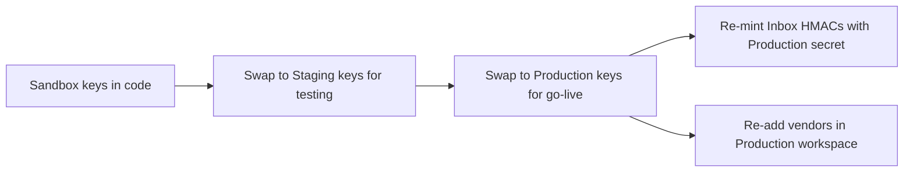

SuprSend is environment-isolated and key-scoped. Workspace keys, public keys, service tokens, and Inbox secrets all do different things. Mixing them up is the most common cause of "why isn't my notification sending?" — so spend 5 minutes here.

---

## Environments

Every SuprSend account ships with three workspaces. Each is a fully isolated environment — no shared workflows, users, vendors, or keys.

| Workspace | Purpose | Vendors | Limits |
|---|---|---|---|
| **Sandbox** | Demo / POC. Pre-loaded with a sample workflow, sample user (your signup email), and pre-configured vendors. | Provided by SuprSend | Trial period; some channels can only send to verified addresses (e.g. Email) |
| **Staging** | Your dev environment. Test workflow logic before production. Supports [Test Mode](/docs/developer/test-mode) so you don't notify real users. | Bring your own | None |
| **Production** | Live workspace. Sync real users, run real workflows. | Bring your own | None |

You can create additional workspaces (e.g. one per product line — `consumer`, `business`, `internal`).

<Warning>
  Don't edit Production directly. Build and test in Staging, then [clone](/docs/go-live-checklist) workflows, templates, and preferences into Production.
</Warning>

---

## The four key types

All four are scoped to a single workspace. A Sandbox key cannot read or write Staging or Production.

### 1. Workspace key + workspace secret

**What:** the standard auth pair for backend SDKs (Node, Python, Go, Java).
**Where to find:** [Settings → API Keys](https://app.suprsend.com/en/sandbox/developers/api-keys).
**Used by:** backend SDK calls — `new Suprsend(workspace_key, workspace_secret)`.
**Can do:** trigger workflows, identify users, manage objects, anything the SDK exposes.
**Where it lives:** server-side env vars only. Never in the browser.

### 2. API Key (bearer token)

**What:** the bearer token for direct HTTP calls to the trigger endpoint.
**Where to find:** same [API Keys page](https://app.suprsend.com/en/sandbox/developers/api-keys).
**Used by:** cURL, server-side fetch, integrations that don't use an SDK.
**Can do:** trigger workflows via `POST https://hub.suprsend.com/trigger/`.
**Where it lives:** server-side env vars only.

### 3. Service token (for MCP)

**What:** a workspace-scoped token used by the [SuprSend MCP server](/reference/mcp-overview). Lets your AI agent call any MCP tool.
**Where to find:** [Account Settings → Service Tokens](https://app.suprsend.com/en/account-settings/service-tokens).
**Used by:** Cursor / Claude / Windsurf MCP config, the SuprSend CLI.
**Can do:** depends on the tools exposed via `--tools`. Default = full access. **For Production, restrict to read-only tools** so an agent can't accidentally trigger a real send.
**Where it lives:** in your AI client's MCP config or your shell env. Never commit.

### 4. Inbox secret (for HMAC)

**What:** the secret used to HMAC-sign per-user subscriber IDs for the in-app Inbox SDK.
**Where to find:** [Inbox vendor configuration page](https://app.suprsend.com/en/sandbox/vendors/inbox/suprsend-inbox?brand_id=default).
**Used by:** your backend, when minting a subscriber ID for the frontend Inbox SDK.
**Can do:** prove a frontend session is authorized to read a specific user's inbox feed.
**Where it lives:** server-side env vars only — your backend mints the HMAC and returns the signed token to the frontend. **Different per environment.**

---

## Quick decision table

| I'm doing... | Use this |
|---|---|
| Triggering a workflow from my Node/Python/Go/Java backend | **Workspace key + secret** in the SDK constructor |
| Calling `POST /trigger/` directly from cURL or another HTTP client | **API Key** as the bearer token |
| Connecting Cursor / Claude / Windsurf to SuprSend via MCP | **Service token** in MCP env config |
| Embedding the Inbox bell in my React/Angular/RN/Flutter app | **Workspace public key** on the client + **Inbox secret** on the server (for HMAC) |
| Running the SuprSend CLI | **Service token** (or workspace key/secret depending on command) |

---

## Promoting from Sandbox to Staging to Production

When you go live, every key needs to be swapped for the new environment's equivalent:

Full step-by-step: [Go-live checklist](/docs/go-live-checklist).

---

## Best practices

- Keep keys in a secret manager (AWS Secrets Manager, Vault, Doppler, etc.). Never commit.
- Rotate the workspace secret if you suspect leakage — rotation is one click on the API Keys page.
- For MCP service tokens, generate one per developer (so you can revoke individually).
- For multi-tenant B2B, set [per-tenant vendors](/docs/tenant-vendor) so each customer's emails go through their own SendGrid / Mailgun account when needed.

Full guide: [API key management best practices](/docs/best-practices-for-api-keys-management).

---
