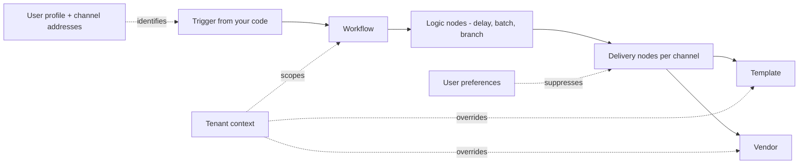

You can send your first notification without reading this page. You **cannot** ship a real notification system to real users without understanding these five primitives. Each card links to the deep-dive docs.

---

<CardGroup cols={2}>
  <Card title="1. Workflow" icon="diagram-project" href="/docs/workflows">
    **What it is:** the unit of automation. A workflow has a trigger, optional logic nodes (delay, batch, branch, fetch), and one or more delivery nodes.

    **Why it matters before going live:** the same notification logic that works in Sandbox needs to be promoted to Production by **cloning** — workflows are environment-isolated. SuprSend uses Git-style commits, so uncommitted edits won't trigger.
  </Card>

  <Card title="2. User" icon="user" href="/docs/users">
    **What it is:** the recipient. Identified by a `distinct_id`. Stores channel addresses (`$email`, `$sms`, push tokens, Slack ID, etc.) and arbitrary properties used in templates.

    **Why it matters before going live:** for event-based triggers, the user must exist on SuprSend **before** the event fires. Set up [user sync](/docs/users#creating-user-profile-on-suprsend) from your backend the moment a user signs up or updates their profile.
  </Card>

  <Card title="3. Template" icon="file-lines" href="/docs/templates-overview">
    **What it is:** the message content per channel. Uses [Handlebars](/docs/handlebars-helpers) — `{{var}}` is HTML-escaped, `{{{var}}}` is raw (use for URLs and special characters).

    **Why it matters before going live:** templates have to be **published** before they're used by a workflow. WhatsApp and SMS templates need [provider approval](/docs/dlt-guidelines) before they can be sent — start that process early.
  </Card>

  <Card title="4. Tenant" icon="building" href="/docs/tenants">
    **What it is:** a logical grouping of users — typically one tenant per customer organization in a B2B product. Drives per-tenant branding, vendors, preferences, and templates.

    **Why it matters before going live:** if your product is multi-tenant (any B2B SaaS), model tenants from day one. Retrofitting tenants after launch is painful. See [Multi-tenant modelling](/docs/multi-tenant-modelling).
  </Card>

  <Card title="5. Preference" icon="sliders" href="/docs/user-preferences">
    **What it is:** per-user opt-in / opt-out at the category, channel, or workflow level. Evaluated automatically at send time.

    **Why it matters before going live:** law (GDPR, CAN-SPAM, DLT, etc.) requires honoring user preferences. Build [Notification Categories](/docs/notification-category) before any production sends and expose a [Preference Centre](/docs/embedded-preference-centre) in your UI.
  </Card>
</CardGroup>

---

## How they fit together

Mental model: **Workflow** is the recipe. **User** is who you're cooking for. **Template** is the plate. **Tenant** is the restaurant. **Preference** is the user's "no peanuts" allergy card.

---

## What to read next

<CardGroup cols={3}>
  <Card title="Best practices" icon="shield-check" href="/docs/best-practices-notification-system-design">
    System design patterns for a production notification system.
  </Card>
  <Card title="API keys & environments" icon="key" href="/docs/getting-started/api-keys-and-environments">
    Which key belongs in which environment, and where each one lives.
  </Card>
  <Card title="Go-live checklist" icon="rocket" href="/docs/go-live-checklist">
    Pre-launch and post-launch checks for the move to Production.
  </Card>
</CardGroup>

---
