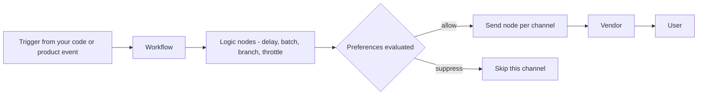
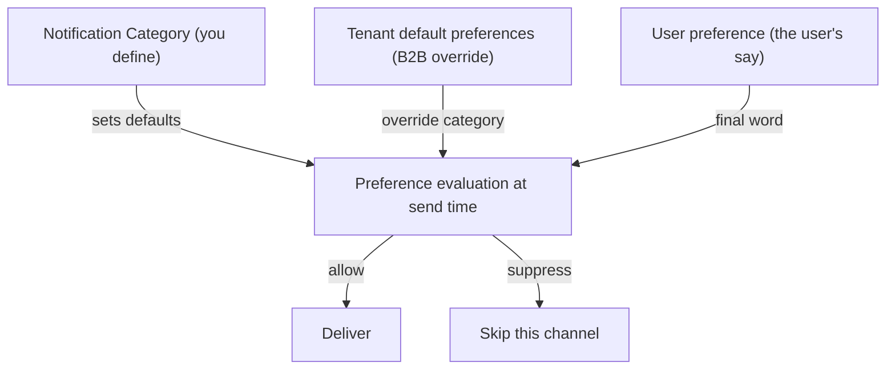
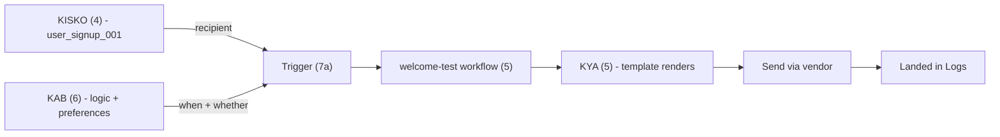
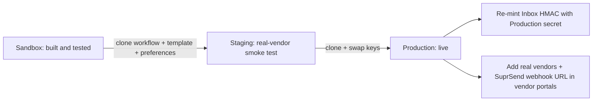

If you've never used SuprSend before, **start here**. By the end of this page you'll have triggered a real notification, set up preferences, and have the path to production mapped out.

This guide is **AI-first**. Almost every step has a green **AI command** block — paste it into your AI coding assistant (with [SuprSend MCP](/reference/mcp-overview) connected) and the agent does the work. If you'd rather hand-code, every step also includes a `Or do it manually` accordion with the snippet.

<Tip>
  **Skip the typing — connect MCP first**

  Click to install the SuprSend MCP server in Cursor (1.0+):

  [](cursor://anysphere.cursor-deeplink/mcp/install?name=suprsend&config=eyJjb21tYW5kIjoibnB4IiwiYXJncyI6WyIteSIsInN1cHJzZW5kIiwic3RhcnQtbWNwLXNlcnZlciJdLCJlbnYiOnsiU1VQUlNFTkRfU0VSVklDRV9UT0tFTiI6InlvdXJfc2VydmljZV90b2tlbl9oZXJlIn19)

  Other clients (Claude Desktop, Windsurf) → [MCP overview](/reference/mcp-overview). Service token setup is covered in **Section 2c**.

  Once connected, paste any AI command from this guide into your assistant and it will execute.
</Tip>

---

# 1. The 3 questions every notification answers

Every notification you'll ever send with SuprSend is the answer to three questions. Keep these in your head — the rest of the page is just answering them concretely.

<CardGroup cols={3}>
  <Card title="KYA bhejna hai?" icon="file-lines">
    **WHAT to send**

    The message content. Built once as a [Template](/docs/templates-overview) per channel, with [Handlebars](/docs/handlebars-helpers) variables for personalization.

    Answered in **Section 5**.
  </Card>
  <Card title="KISKO bhejna hai?" icon="user">
    **WHOM to send to**

    The recipient. A [User](/docs/users) (identified by `distinct_id` with channel addresses) or an [Object](/docs/objects) (non-user recipients like orders, channels, threads).

    Answered in **Section 4**.
  </Card>
  <Card title="KAB bhejna hai?" icon="clock">
    **WHEN to send**

    The rules. [Workflow logic nodes](/docs/delay) (delay, batch, branch, throttle) decide *when*; [Preferences](/docs/user-preferences) decide *if* this user wants it.

    Answered in **Section 6**.
  </Card>
</CardGroup>

You'll have answered all three by the end of Section 7.

---

# 2. How SuprSend processes a notification

Read this once, never re-read it. This is the runtime model + everything you need to know about auth.

## 2a. The runtime flow

When you trigger a notification, here's what SuprSend does:



**The order matters:** preferences are evaluated **before** the send node. You don't write that eval code yourself — SuprSend does it automatically. That's why setting up preferences early (Section 6) means they're already enforced when you start sending.

## 2b. Two kinds of vendors

The "Vendor" box above is one of two things:

- **Third-party vendors** — built-in integrations with SendGrid, Twilio, FCM, APNs, Slack, Microsoft Teams, Mailgun, Resend, and more. SuprSend handles the API contract; you just provide the vendor's API token. See the full [vendor matrix](/docs/vendors).
- **External APIs** — your own auth-protected endpoint (e.g. an internal delivery service) wired up via an [outbound webhook](/docs/outbound-webhook). SuprSend posts to your URL with whatever auth headers (HMAC, bearer token, custom) you configure.

Either way, vendor auth is configured **once on the dashboard** — never in your application code.

## 2c. Every auth artifact you'll ever need

One table. Referenced from every later section.

| Artifact | Where it goes | Used by | Where to grab |
|---|---|---|---|
| **Workspace key + secret** | Server only | Backend SDK / cURL trigger | [Settings → API Keys](https://app.suprsend.com/en/sandbox/developers/api-keys) |
| **Public key** | Browser / mobile app | Frontend SDK init (safe in client) | [Settings → API Keys](https://app.suprsend.com/en/sandbox/developers/api-keys) |
| **Inbox secret** | Server only | HMAC mint route for Inbox + Preference Center | [Inbox vendor config page](https://app.suprsend.com/en/sandbox/vendors/inbox/suprsend-inbox?brand_id=default) |
| **Service token** | Your AI client config | MCP server | [Account Settings → Service Tokens](https://app.suprsend.com/en/account-settings/service-tokens) |
| **Vendor API tokens** | Dashboard only | SuprSend → vendor handoff | Vendor portal → SuprSend [vendor page](https://app.suprsend.com/en/sandbox/vendors) |
| **External-API auth** | Your own endpoint | SuprSend → custom delivery via outbound webhook | [Outbound webhook config](/docs/outbound-webhook) |

<Warning>
  All server-side keys (workspace secret, Inbox secret, service token, vendor tokens) belong in env vars or a secret manager. **Never** ship them in your frontend bundle.
</Warning>

## 2d. Connect SuprSend MCP to your AI assistant (recommended)

If you haven't already used the install button at the top, do it now — every later section assumes MCP is connected.

<Steps>
  <Step title="Get a service token">
    [Account Settings → Service Tokens](https://app.suprsend.com/en/account-settings/service-tokens) → create a token scoped to your Sandbox workspace.
  </Step>
  <Step title="Add the MCP config to your AI client">
    <CodeGroup>

    ```json Cursor / Claude Desktop / Windsurf
    {
      "mcpServers": {
        "suprsend": {
          "command": "npx",
          "args": ["-y", "suprsend", "start-mcp-server"],
          "env": {
            "SUPRSEND_SERVICE_TOKEN": "your_token_here"
          }
        }
      }
    }
    ```

    </CodeGroup>

    Client-specific setup: [Cursor](/reference/mcp-quickstart-cursor) · [Claude Desktop](/reference/mcp-quickstart-claude) · [Windsurf](/reference/mcp-quickstart-windsurf).
  </Step>
  <Step title="Install Agent Skills">
    Skills give your agent the actual SuprSend schemas and CLI flags so prompts produce correct output on the first try.

    ```bash
    npx suprsend skills install
    ```

    Full guide: [Agent Skills](/reference/agent-skills).
  </Step>
</Steps>

You're set. Every AI command box from here on assumes MCP is connected.

---

# 3. Set up your account

<Steps>
  <Step title="Sign up">
    [Sign up](https://auth.suprsend.com/sign-up) with your work email (or ask your admin to invite you). You'll land directly in **Sandbox**.
  </Step>
  <Step title="You're in Sandbox">
    Sandbox is pre-loaded with **demo vendors** + your signup email as a **sample user**. You can send a real notification immediately — no SendGrid/Twilio account needed.

    Your account also has **Staging** and **Production** workspaces (top nav switcher). They're isolated — keys, workflows, users, and vendors don't cross over. Stay in Sandbox for sections 4–8. We'll promote to Production in section 9.
  </Step>
</Steps>

[Workspaces deep dive →](/docs/getting-started/api-keys-and-environments)

---

# 4. KISKO bhejna hai? — Identify your users

> **Goal:** SuprSend knows who your users are and how to reach them on each channel.
> **Where the work happens:** your backend (your server is the source of truth for users).
> **Auth:** workspace key + secret (from [section 2c](#2c-every-auth-artifact-you-ll-ever-need)).

## 4a. Install the backend SDK

<Tip>
  **AI command — install + init the SuprSend backend SDK in this project**

  ```text
  Detect the backend language and framework in this project.
  Install the matching SuprSend backend SDK, add
  SUPRSEND_WORKSPACE_KEY and SUPRSEND_WORKSPACE_SECRET to
  the env config, and create a shared Suprsend client module
  the rest of the codebase can import. Keys are at
  https://app.suprsend.com/en/sandbox/developers/api-keys.
  ```
</Tip>

<Accordion title="Or do it manually">
  Pick your stack:

  <CodeGroup>

  ```bash Node.js
  npm install @suprsend/node-sdk
  ```

  ```bash Python
  pip install suprsend-py-sdk
  ```

  ```bash Go
  go get github.com/suprsend/suprsend-go
  ```

  ```bash Java (Maven)
  <dependency>
    <groupId>com.suprsend</groupId>
    <artifactId>suprsend-java-sdk</artifactId>
    <version>latest</version>
  </dependency>
  ```

  </CodeGroup>

  Init a shared client once at app startup:

  <CodeGroup>

  ```javascript Node.js
  const { Suprsend } = require("@suprsend/node-sdk");

  const supr = new Suprsend(
    process.env.SUPRSEND_WORKSPACE_KEY,
    process.env.SUPRSEND_WORKSPACE_SECRET,
  );

  module.exports = { supr };
  ```

  ```python Python
  import os
  from suprsend import Suprsend

  supr = Suprsend(
    os.environ["SUPRSEND_WORKSPACE_KEY"],
    os.environ["SUPRSEND_WORKSPACE_SECRET"],
  )
  ```

  ```go Go
  import (
    "os"
    suprsend "github.com/suprsend/suprsend-go"
  )

  var Client, _ = suprsend.NewClient(
    os.Getenv("SUPRSEND_WORKSPACE_KEY"),
    os.Getenv("SUPRSEND_WORKSPACE_SECRET"),
  )
  ```

  ```java Java
  public class SuprsendClient {
    public static final Suprsend supr = new Suprsend(
      System.getenv("SUPRSEND_WORKSPACE_KEY"),
      System.getenv("SUPRSEND_WORKSPACE_SECRET")
    );
  }
  ```

  </CodeGroup>

  Full SDK guides: [Node](/docs/integrate-node-sdk) · [Python](/docs/integrate-python-sdk) · [Go](/docs/integrate-go-sdk) · [Java](/docs/integrate-java-sdk).
</Accordion>

## 4b. Sync your users — `users.upsert`

Mirror your user database into SuprSend. Call `users.upsert` on every sign-up and profile update — it's idempotent so it's safe to call repeatedly.

<Tip>
  **AI command — wire user sync into your sign-up handler**

  ```text
  Find the sign-up and profile-update handlers in this
  project. Right after the user is saved to our database,
  call SuprSend users.upsert with the same internal user ID
  as distinct_id and map our user fields to $email, $sms,
  name, and any other properties we use in templates.
  Then test by signing up a fake user and use the
  SuprSend MCP to confirm the user appears in Sandbox.
  ```
</Tip>

<Accordion title="Or do it manually">
  <CodeGroup>

  ```javascript Node.js
  const { supr } = require("./suprsend");

  await supr.users.upsert({
    distinct_id: newUser.id,         // your internal user ID
    $email: [newUser.email],          // channel identity
    $sms: [newUser.phone],
    name: newUser.fullName,           // arbitrary property used in templates
    plan: newUser.plan,
    locale: newUser.locale,
  });
  ```

  ```python Python
  from suprsend_client import supr

  supr.users.upsert({
    "distinct_id": new_user.id,
    "$email": [new_user.email],
    "$sms": [new_user.phone],
    "name": new_user.full_name,
    "plan": new_user.plan,
  })
  ```

  ```http cURL
  curl --request POST \
       --url https://hub.suprsend.com/v1/users/ \
       --header 'Authorization: Bearer __workspace_key__:__workspace_secret__' \
       --header 'content-type: application/json' \
       --data '{
    "distinct_id": "user_signup_001",
    "$email": ["jamie@example.com"],
    "$sms": ["+12135555444"],
    "name": "Jamie Tan",
    "plan": "pro"
  }'
  ```

  </CodeGroup>
</Accordion>

**Three rules to know:**

- **`distinct_id` = your internal user ID.** Pick once, never change. Use the same value across SuprSend, your DB, and your frontend.
- **`$`-prefixed fields = channel identities.** `$email`, `$sms`, `$whatsapp` are arrays. `$slack`, `$ms_teams`, push-token fields are objects (set automatically by the frontend SDK in Section 8).
- **For initial backfill** of your existing users, use the [bulk users endpoint](/reference/list-users) with retries.

## 4c. Group users into tenants (only if B2B)

If your product is B2B (one customer = one organization), model each org as a [Tenant](/docs/tenants). Tenants drive per-tenant branding, vendors, preferences, and templates — retrofitting this later is painful.

<Tip>
  **AI command — set up a tenant for one of our customers**

  ```text
  Use the SuprSend MCP to create a tenant in Sandbox called
  "acme-corp" with display name "Acme Corp". Then update
  user_signup_001 to belong to this tenant.
  ```
</Tip>

<Accordion title="Or do it manually">
  ```javascript Node.js
  await supr.tenants.upsert({
    tenant_id: "acme-corp",
    name: "Acme Corp",
  });

  await supr.users.upsert({
    distinct_id: "user_signup_001",
    tenant_id: "acme-corp",
  });
  ```

  Full guide: [Tenants overview](/docs/tenants) · [Multi-tenant modelling](/docs/multi-tenant-modelling).
</Accordion>

## 4d. Frontend equivalent — `identify()` (set up in Section 8)

Same concept as `users.upsert`, but on the client. The frontend SDK calls `identify(distinct_id)` to attach a device's push token / browser sub / Inbox session to the same user. We'll set this up in [Section 8](#8-add-frontend-channels-push-in-app-inbox) when we add Push and Inbox — there's nothing to do here yet.

---

# 5. KYA bhejna hai? — Build your message

> **Goal:** the message that goes out when the workflow fires.
> **Where the work happens:** SuprSend dashboard.
> **What you build once and reuse forever:** a workflow + a template per channel.

## 5a. Create a workflow

A [Workflow](/docs/workflows) is the container — trigger + logic + delivery nodes.

<Tip>
  **AI command — create the welcome workflow**

  ```text
  Use the SuprSend MCP to create a workflow in Sandbox
  called "welcome-test" with a single Email delivery node
  that uses a template I'll define in the next step.
  ```
</Tip>

<Accordion title="Or do it manually on the dashboard">
  Click **`+ Create workflow`** on the [Workflows tab](https://app.suprsend.com/en/sandbox/workflows) and name it `welcome-test`.

  <Frame>
    
  </Frame>
</Accordion>

## 5b. Add a delivery node for the channel you want

Pick a channel. Mintlify keeps your selection synced across this section, 5c, and the trigger snippet in 7a — so picking once switches everything.

<Tabs>
  <Tab title="Email">
    Drag in an **Email** delivery node. Channel identity on the user: `$email`. No special vendor setup needed in Sandbox (demo vendor pre-loaded).
  </Tab>
  <Tab title="SMS">
    Drag in an **SMS** delivery node. Channel identity: `$sms` (E.164 format). [DLT-registered templates](/docs/dlt-guidelines) required for India.
  </Tab>
  <Tab title="WhatsApp">
    Drag in a **WhatsApp** delivery node. Channel identity: `$whatsapp` (E.164). Templates need [Meta approval](/docs/whatsapp-template-guidelines) before use.
  </Tab>
  <Tab title="Slack">
    Drag in a **Slack** delivery node. Channel identity: `$slack` (object with OAuth token, captured during Slack App install).
  </Tab>
  <Tab title="MS Teams">
    Drag in an **MS Teams** delivery node. Channel identity: `$ms_teams` (object with `tenant_id` + `service_url` + `conversation_id`).
  </Tab>
  <Tab title="Inbox">
    Drag in an **Inbox** delivery node. No identity field needed — every user is auto-attached. Frontend rendering covered in [Section 8](#8d-add-the-in-app-inbox-bell-feed).
  </Tab>
</Tabs>

For Push (mobile + web), see [Section 8c](#8c-add-push-notifications) — these need the frontend SDK first.

## 5c. Design the template + add personalization

Click **Edit Template** on the delivery node. Templates use [Handlebars](/docs/handlebars-helpers).

- `{{var}}` — the value is HTML-escaped (safe default).
- `{{{var}}}` — the value is **raw** (use for URLs and special characters).

Add example values to the **mock data** panel so you get autocomplete. Example template body for Email:

```handlebars
Hi {{first_name}}, welcome to {{product_name}}!

Click here to get started: {{{action_url}}}
```

<Tabs>
  <Tab title="Email">
    Use the [Email template editor](/docs/email-template) — drag-and-drop blocks, raw HTML, or AMP. Subject + body + headers all use Handlebars.
  </Tab>
  <Tab title="SMS">
    Use the [SMS template editor](/docs/sms-template) — plain text. Watch the 160-char (GSM-7) / 70-char (UCS-2) segment limit.
  </Tab>
  <Tab title="WhatsApp">
    Use the [WhatsApp template editor](/docs/whatsapp-template) — variables follow Meta's positional format `{{1}}`, `{{2}}`. Submit for approval.
  </Tab>
  <Tab title="Slack">
    Use the [Slack template editor](/docs/slack-template) — plain text, rich formatting, or [Block Kit](https://api.slack.com/block-kit) JSON.
  </Tab>
  <Tab title="MS Teams">
    Use the [MS Teams template editor](/docs/ms-teams-template) — markdown for simple text, [JSONNET](/docs/jsonnet-templates) for Adaptive Cards.
  </Tab>
  <Tab title="Inbox">
    Use the [In-app Inbox template editor](/docs/in-app-inbox-template) — message body, action buttons, deeplink, custom data exposed to your frontend.
  </Tab>
</Tabs>

<Tip>
  **AI command — generate a starter template**

  ```text
  In the welcome-test workflow's delivery node, design a
  friendly welcome template for {channel I picked above}
  with variables for first_name, product_name, and action_url.
  Add sensible mock data and publish the template.
  ```
</Tip>

## 5d. Publish + commit

Two clicks:

1. Click **Publish** on the template (uncommitted templates are not used at trigger time).
2. Click **Commit** at the top of the workflow editor (SuprSend uses Git-style versioning — uncommitted edits won't fire).

---

# 6. KAB bhejna hai? — Logic + Preferences

> **Goal:** decide *when* the message goes out and *whether* the user wants it.
> **Why set this up before the first send:** preferences are evaluated automatically before every delivery — wire them now and you don't risk sending unwanted messages later.

## 6a. Add workflow logic nodes (the WHEN)

Drop logic nodes into the workflow you built in Section 5 to control timing and grouping.

| Node | What it does |
|---|---|
| [Delay](/docs/delay) | Pause for a duration before the next node. |
| [Batch](/docs/batch) | Combine multiple triggers into one notification. |
| [Digest](/docs/digest) | Send a periodic summary on a schedule. |
| [Branch](/docs/branch) | Conditional routing based on user / event properties. |
| [Throttle](/docs/throttle) | Cap the rate of sends per user. |
| [Time-window](/docs/time-window) | Restrict sends to allowed hours / days. |
| [Wait until](/docs/wait-until) | Pause until a specific datetime in event data. |
| [Fetch](/docs/fetch) | Call an external HTTP API and use the response in the next node. |

<Tip>
  **AI command — add a delay before the welcome email**

  ```text
  In the welcome-test workflow, add a 5-minute delay node
  before the email delivery so brand-new signups don't feel
  spammed. Commit the change.
  ```
</Tip>

## 6b. Set up preferences (the WHETHER)

Preferences run automatically *before* the send node — you don't write any eval code. The integration work is just:

1. Define **categories** on the dashboard.
2. Drop the **embedded preference center** into your product so users can opt in/out.
3. (B2B only) Define **tenant-level overrides**.



### Step 1 — Define categories

A [Notification Category](/docs/notification-category) groups workflows (e.g. `marketing`, `transactional`, `digest`, `alerts`) and sets per-channel defaults.

<Tip>
  **AI command — set up sensible default categories**

  ```text
  Use the SuprSend MCP to create three notification
  categories in Sandbox: "marketing" (default opt-out for
  email and sms), "transactional" (default opt-in for all
  channels), and "alerts" (default opt-in, can't be turned
  off). Tag the welcome-test workflow with the
  transactional category.
  ```
</Tip>

### Step 2 — Drop in the embedded preference center

A drop-in component your users use to manage their preferences. Uses the **frontend SDK** (public key from 2c) on the client and an **HMAC mint route** (Inbox secret from 2c) on the server. If you set up Inbox in Section 8 first, this reuses the same plumbing.

<Tip>
  **AI command — add the SuprSend Preference Center to my settings page**

  ```text
  Add the SuprSend embedded Preference Center to my product's
  settings page. Install the SuprSend frontend SDK if it's
  not already installed. On the backend, create an
  /api/suprsend-token route that mints an HMAC subscriber ID
  using SUPRSEND_INBOX_SECRET. On the frontend, mount the
  <PreferenceCenter /> component using the public workspace
  key from env vars.
  ```
</Tip>

<Accordion title="Or do it manually">
  Pattern:

  - Backend: a `GET /api/suprsend-token` endpoint that returns `subscriber_id = HMAC(distinct_id, INBOX_SECRET)`.
  - Frontend: install `@suprsend/web-sdk` (or your platform's SDK), init with the public key, drop the [`<PreferenceCenter />`](/docs/embedded-preference-centre) component into your settings page.

  Per-stack guides: [JavaScript](/docs/preferences-javascript) · [Angular](/docs/preferences-angular) · [React Headless](/docs/preferences-react-headless).
</Accordion>

### Step 3 — Tenant overrides (B2B only)

Customer admins can override category defaults for their entire org (e.g. "no SMS for our employees"). See [Tenant preferences](/docs/tenant-preference).

[Preference evaluation order →](/docs/preference-evaluation) · [Managing categories →](/docs/managing-notification-categories)

---

# 7. Trigger + watch it land

All three questions are answered. Time to fire it.

## 7a. Trigger from your backend

<Tip>
  **AI command — trigger the welcome workflow for our test user**

  ```text
  Use the SuprSend MCP to trigger the welcome-test workflow
  in Sandbox for user_signup_001 with sample data
  (first_name: "Jamie", product_name: "Acme",
  action_url: "https://acme.example.com/welcome").
  Then check the execution log to confirm it sent.
  ```
</Tip>

<Accordion title="Or do it manually">
  <CodeGroup>

  ```javascript Node.js
  const { Suprsend, WorkflowTriggerRequest } = require("@suprsend/node-sdk");
  const supr = new Suprsend(process.env.SUPRSEND_WORKSPACE_KEY, process.env.SUPRSEND_WORKSPACE_SECRET);

  const w1 = new WorkflowTriggerRequest({
    workflow: "welcome-test",
    recipients: [{ distinct_id: "user_signup_001" }],
    data: {
      first_name: "Jamie",
      product_name: "Acme",
      action_url: "https://acme.example.com/welcome",
    },
  }, { idempotency_key: "welcome-user_signup_001-2024-01-15" });

  await supr.workflows.trigger(w1);
  ```

  ```python Python
  from suprsend import Suprsend, WorkflowTriggerRequest

  supr = Suprsend(workspace_key, workspace_secret)

  w1 = WorkflowTriggerRequest(
    body={
      "workflow": "welcome-test",
      "recipients": [{"distinct_id": "user_signup_001"}],
      "data": {
        "first_name": "Jamie",
        "product_name": "Acme",
        "action_url": "https://acme.example.com/welcome",
      },
    },
    idempotency_key="welcome-user_signup_001-2024-01-15",
  )
  supr.workflows.trigger(w1)
  ```

  ```http cURL
  curl --request POST \
       --url https://hub.suprsend.com/trigger/ \
       --header 'Authorization: Bearer __api_key__' \
       --header 'content-type: application/json' \
       --data '{
    "workflow": "welcome-test",
    "recipients": [{"distinct_id": "user_signup_001"}],
    "data": {
      "first_name": "Jamie",
      "product_name": "Acme",
      "action_url": "https://acme.example.com/welcome"
    }
  }'
  ```

  </CodeGroup>
</Accordion>

There's also event-based triggering for product events that fan out to multiple workflows — see the [appendix](#a1-direct-api-vs-event-based-triggers).

## 7b. Watch it land in Logs

Open the [Logs page](https://app.suprsend.com/en/sandbox/logs/api?last_n_minutes=1440). Three tabs:

- **Requests** — every API/SDK call you sent. Start here if you got an error.
- **Executions** — workflow runs with a step-by-step debugger that shows what each node did, including preference evaluation.
- **Messages** — every delivery node call to a vendor with status (delivered, seen, clicked, failed).

If your message didn't land:

1. Check **Requests** for a 4xx/5xx — almost always a missing field or wrong key.
2. Check **Executions** — was the workflow found? Was the recipient resolved? Did a preference suppress delivery?
3. Check **Messages** — did the vendor accept it? Spam folder?

[Logging guide →](/docs/logging) · [Common error guides →](/docs/error-guides)

## 7c. Recap — what you just built



You answered all three questions and the message landed. Section 8 adds Push and the in-app Inbox; Section 9 promotes everything to Production.

---

# 8. Add frontend channels — Push + In-app Inbox

> **Goal:** add the only two channels that need code in your product (push tokens are issued by the device; the Inbox bell is rendered in your UI).
> **Auth:** public key (for SDK init) + Inbox secret (for HMAC mint route). Both from [section 2c](#2c-every-auth-artifact-you-ll-ever-need). If you set up the Preference Center in 6b, the frontend SDK and HMAC route are already in place.

## 8a. Install the frontend SDK (skip if you did 6b)

<Tip>
  **AI command — install the SuprSend frontend SDK in this app**

  ```text
  Detect the frontend stack in this project (web/React/RN/
  Flutter/iOS/Android) and install the matching SuprSend
  client SDK. Initialize it once at app startup with the
  workspace public key from
  https://app.suprsend.com/en/sandbox/developers/api-keys.
  Use a public env var (e.g. NEXT_PUBLIC_SUPRSEND_PUBLIC_KEY).
  ```
</Tip>

<Accordion title="Or do it manually">
  <CodeGroup>

  ```bash JavaScript (web)
  npm install @suprsend/web-sdk
  ```

  ```bash React Native
  npm install @suprsend/react-native-sdk
  cd ios && pod install
  ```

  ```bash Flutter
  # pubspec.yaml
  # dependencies:
  #   suprsend_flutter_sdk: ^latest
  ```

  ```kotlin Android
  // build.gradle (app)
  implementation 'com.suprsend:android-sdk:+'
  ```

  ```swift iOS
  # Podfile
  pod 'SuprSend'
  ```

  </CodeGroup>

  Init once with public key:

  <CodeGroup>

  ```javascript JavaScript (web)
  import { Suprsend } from "@suprsend/web-sdk";

  export const suprsend = new Suprsend(process.env.NEXT_PUBLIC_SUPRSEND_PUBLIC_KEY);
  ```

  ```javascript React Native
  import { SuprSendSDK } from "@suprsend/react-native-sdk";
  SuprSendSDK.initialize(SUPRSEND_PUBLIC_KEY);
  ```

  ```kotlin Android
  SuprSend.getInstance(this).init(SUPRSEND_PUBLIC_KEY)
  ```

  ```swift iOS
  SuprSend.shared.configureWith(publicKey: "YOUR_PUBLIC_KEY")
  ```

  ```dart Flutter
  SuprSend.instance.initialize(SUPRSEND_PUBLIC_KEY);
  ```

  </CodeGroup>
</Accordion>

## 8b. Wire `identify()` on login + `reset()` on logout

The two commands every frontend integration needs.

<Tip>
  **AI command — wire identify() on login and reset() on logout**

  ```text
  Find the auth callback / login success handler in this app
  and call SuprSend identify(distinct_id) using the same
  internal user ID our backend uses. Find the logout handler
  and call SuprSend reset() before the normal sign-out logic.
  ```
</Tip>

<Accordion title="Or do it manually">
  <CodeGroup>

  ```javascript JavaScript (web)
  // on login
  await suprsend.identify(user.id);

  // on logout
  await suprsend.reset();
  ```

  ```javascript React Native
  SuprSendSDK.identify(user.id);
  // logout
  SuprSendSDK.reset();
  ```

  ```kotlin Android
  SuprSend.getInstance(context).identify(user.id)
  SuprSend.getInstance(context).reset()
  ```

  ```swift iOS
  SuprSend.shared.identify(identity: user.id)
  SuprSend.shared.reset(unsubscribeNotification: true)
  ```

  ```dart Flutter
  SuprSend.instance.identify(user.id);
  SuprSend.instance.reset();
  ```

  </CodeGroup>
</Accordion>

<Warning>
  **Forgetting `reset()` on logout** silently accumulates multiple users on the same device — every notification meant for any of them goes to all. Wire it before your normal sign-out logic.
</Warning>

## 8c. Add Push notifications

`identify()` (from 8b) automatically captures the device's push token. You just need to add the vendor and a Push delivery node.

<Tip>
  **AI command — add Push to my app + workflow**

  ```text
  Set up Push notifications:
  1. Add an FCM vendor (Android) or APNs vendor (iOS) on
     the SuprSend Sandbox dashboard. Walk me through the
     vendor portal steps if needed.
  2. Add a Push delivery node to the welcome-test workflow.
  3. Design a short Push template using existing variables.
  4. Trigger the workflow for user_signup_001 and confirm
     the device receives it.
  ```
</Tip>

Vendor setup guides: [FCM (Android)](/docs/firebase-fcm-androidpush) · [APNs (iOS)](/docs/ios-push-vendor-integration). Per-stack SDK push integration: [Native Android](/docs/android-firebase-fcm-push-integration) · [Native iOS](/docs/ios-apns-push) · [React Native (Android)](/docs/react-native-androidpush-integration) · [React Native (iOS)](/docs/react-native-ios-push-integration) · [Flutter (Android)](/docs/flutter-androidpush-integration) · [Flutter (iOS)](/docs/flutter-ios-push-integration).

For Web Push (browser), see [JS Web Push](/docs/js-webpush) — service-worker setup required.

## 8d. Add the in-app Inbox bell + feed

Drop-in component for a real-time notification feed inside your product.

<Tip>
  **AI command — add the SuprSend Inbox to my nav bar**

  ```text
  Add the SuprSend Inbox bell + feed to my app's top
  navigation bar. If we already have an /api/suprsend-token
  HMAC mint route from the Preference Center setup, reuse
  it; otherwise create one using SUPRSEND_INBOX_SECRET on
  the backend. On the frontend, mount the drop-in <Inbox />
  component using the workspace public key. Use default
  styling for now.
  ```
</Tip>

<Accordion title="Or do it manually">
  Per-stack integration guides:

  | Stack | Documentation |
  |---|---|
  | React (drop-in) | [React Inbox integration](/docs/react-inbox-integration) |
  | React Headless (custom UI) | [Headless guide](/docs/react-headless) |
  | Angular / vanilla JS / Vue / Next | [Web Components integration](/docs/web-components-integration) |
  | React Native | [RN integration](/docs/inbox-react-native) |
  | Flutter | [Flutter integration](/docs/inbox-flutter) |

  [HMAC authentication →](/docs/hmac-authentication) · [Inbox Playground (live demo)](https://inbox-playground.suprsend.com/)
</Accordion>

---

# 9. Go to Production



<Tip>
  **AI command — promote everything to Staging**

  ```text
  Use the SuprSend MCP to clone the welcome-test workflow,
  its template, and the notification categories I created
  from Sandbox to Staging. List anything that can't be
  cloned (e.g. vendors) so I can configure them manually.
  ```
</Tip>

Pre-launch checklist:

- Workspaces are isolated — clone workflows, templates, and preferences from Sandbox → Staging → Production.
- Swap **all** keys to the Production environment: workspace key + secret, public key, Inbox secret, service token (and any vendor tokens).
- Set up user sync (Section 4b) into Production.
- Bring real vendors (link to [vendor matrix](/docs/vendors)).
- **Add the SuprSend webhook URL in each vendor portal** so delivery / open / click / bounce events flow back into Logs and Analytics.
- Test in Staging with [Test Mode](/docs/developer/test-mode) so real users aren't notified during validation.

Full step-by-step: [Go-live checklist →](/docs/go-live-checklist)

After launch:
- [Analytics](/docs/analytics) for engagement metrics.
- [Audit logs](/docs/audit-logs) for who changed what.
- [Outbound webhooks](/docs/outbound-webhook) + [Connectors](/docs/connectors) (Datadog, New Relic, OpenTelemetry, Mixpanel, Segment, S3, BigQuery) for streaming events into your own systems.

---

# Help & Appendix

## Examples

<CardGroup cols={3}>
  <Card title="Task Management App" icon="rocket" href="/docs/task-management-app-guide">
    Complete end-to-end notification system in a sample app.
  </Card>
  <Card title="Same app, built with MCP" icon="wand-magic-sparkles" href="/reference/mcp-example-task-management-app">
    The same app, built end-to-end via prompts.
  </Card>
  <Card title="Inbox Playground" icon="bell" href="https://inbox-playground.suprsend.com/">
    Live demo of every Inbox layout (bell, sidesheet, fullscreen).
  </Card>
</CardGroup>

## Reference and tooling

<CardGroup cols={3}>
  <Card title="API Reference" icon="code" href="/reference/overview">
    Every HTTP endpoint with request / response examples.
  </Card>
  <Card title="MCP Tool List" icon="wrench" href="/reference/mcp-tool-list">
    Every tool the SuprSend MCP server exposes to your AI assistant.
  </Card>
  <Card title="Prompt Cheatsheet" icon="clipboard-list" href="/reference/mcp-prompts">
    More copy-paste prompts for workflows, users, debugging, migration.
  </Card>
  <Card title="Agent Skills" icon="graduation-cap" href="/reference/agent-skills">
    Install SuprSend domain knowledge into Cursor / Claude Code / Copilot.
  </Card>
  <Card title="Postman Collection" icon="play" href="https://www.postman.com/suprsend/workspace/suprsend/collection/27786422-d77a13c1-8f59-406d-9669-078a10d52521">
    Test the entire API without writing code.
  </Card>
  <Card title="Mandatory concepts" icon="book" href="/docs/getting-started/mandatory-concepts">
    The 5-primitive deep dive (Workflow / User / Template / Tenant / Preference).
  </Card>
</CardGroup>

## Get help

- [Slack community](https://join.slack.com/t/suprsendcommunity/shared_invite/zt-3932rw936-XNWY1RC8bsffh4if4ZyoXQ) — 24/7 support from the SuprSend team.
- In-app **AI Copilot** in the dashboard — same MCP tools, available without configuring your editor.
- Email — `support@suprsend.com`.
- [Status page](https://status.suprsend.com).

## Appendix

### A1. Direct API vs Event-based triggers

Two ways to trigger a workflow. The full decision is in the [Event vs Workflow API guide](/docs/event-vs-workflow-api). Summary:

| | Direct workflow API | Event-based |
|---|---|---|
| **What you say** | "Run **this** workflow for **these** recipients" | "**This** event happened for **this** user" |
| **Mapping lives in** | Your code (workflow slug) | Dashboard (event → workflow link) |
| **User pre-creation** | Not required | **Mandatory** (silently discards otherwise) |
| **One trigger → many workflows** | No | Yes |
| **Best for** | OTPs, password resets, scheduled jobs, migrating from existing systems | Product events that drive many notifications |

### A2. Multi-channel patterns

The same workflow can deliver across many channels. See the docs for each pattern:

- [Multi-channel delivery node](/docs/delivery-multi-channel) — parallel fanout.
- [Smart channel routing](/docs/smart-delivery) — sequential, stop on engagement.
- [Vendor fallback](/docs/vendor-fallback) — auto-failover within one channel.

### A3. Track frontend product events with `track()`

For events that only happen in the client (page views, button clicks, A/B exposure, abandoned cart on the checkout page):

```javascript
suprsend.track("checkout_abandoned", {
  cart_value: 4999,
  items: 3,
  step_left_at: "shipping",
});
```

Link the event name to a workflow on the dashboard (event-based triggering). Per-stack guides: [JS](/docs/js-events-and-user-methods) · [React](/docs/react-events-and-user-methods) · [React Native](/docs/react-native-send-event-data) · [iOS](/docs/swift-events-and-user-methods) · [Android](/docs/android-send-event-data) · [Flutter](/docs/flutter-send-event-data).

### A4. Anonymous + transient recipients

- **Anonymous frontend users** (pre-signup analytics): the JS SDK auto-generates an anonymous ID; calling `identify(realId)` later merges the history.
- **Transient backend recipients** (OTP to a phone for a non-user, magic link to an unverified email): use Direct API trigger with `is_transient: true` and inline channel info — no User record created. See [Trigger Workflow guide](/docs/trigger-workflow).

### A5. Migrating from another notification system

If you're moving off Knock, Courier, MagicBell, or your own in-house system, see [Migrating your existing notifications](/docs/migrating-your-existing-notifications) and [Magicbell → SuprSend migration guide](/docs/migrate-from-magicbell-to-suprsend).

---

You're done with the tour. Single highest-leverage next step: [install the MCP server](/reference/mcp-overview) (if you haven't yet) and ask your assistant to retrace any of the sections above for your real codebase.
