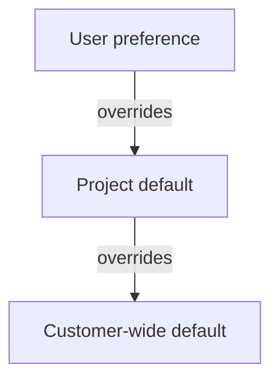
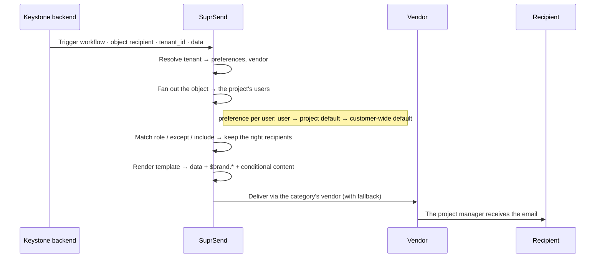

In a B2B product, each customer is a company with its own set of users. In Keystone those users are the customer's employees, working across its projects, departments and teams.

Each customer controls its own notifications — across account, per project, and per user:

- **Which notifications exist**, and whether each is on, off, or mandatory.
- **Who receives them**, by role.
- **Which channels** they go out on, and how often.

This guide models that in SuprSend using **Keystone**, a project-management product, and its two customers — **Acme** and **Globex**. It walks through Acme; Globex is set up the same way.

<Note>
  **Example app.** Keystone's source code is coming soon.
</Note>

---

## Keystone architecture overview

Keystone is a project-management product. It serves several customers — Acme and Globex, for example — each running multiple projects, and keeps each customer's notifications entirely separate.

**What Keystone notifies users about**

| Notification type | What triggers it |
| --- | --- |
| **Project status** | A project is started or paused |
| **Assignments** | Someone is assigned to a project or a task |
| **Tasks** | A task is assigned or completed, or a due date is approaching |
| **Collaboration** | A comment is added to a project |

**Who can change what**

- An **Admin** sets the defaults across the account: which notifications exist, whether each is on, off or mandatory, who receives it by role, the digest cadence, conditions and channels. An admin also sets the customer's branding and edits the message content.
- A **Project Manager** decides who is on their project and in which role. They set the project's default notification settings, and can adjust individual members' preferences across the project — as can an admin.
- A **Project Sponsor**, **Process Owner** or **Team Member** controls only their own notifications: a default that applies across all their projects, and an override for any single project.

<Frame>
  
</Frame>

The sections below map each of these concepts onto SuprSend, using Acme.

---

## Keystone concept mapping to SuprSend

Here's how the Keystone concepts map to SuprSend:

<Frame>
  
</Frame>

| Keystone concept | SuprSend entity | Example |
| --- | --- | --- |
| **Keystone** | Account | One SuprSend account, holding every workspace — dev, staging and prod, per customer |
| **Customer** | [Workspace](/docs/workspaces) | Acme and Globex — one workspace each, fully isolated |
| **Delivery provider** | [Vendor](/docs/vendors) | The email or SMS provider that delivers each message |
| **Notification type** | [Notification category](/docs/notification-category) | Groups notifications (Assignments, Project status, Tasks, Collaboration) and holds the customer-wide default preferences |
| **A notification** | [Workflow](/docs/workflows) | Notifications like project started or task completed |
| **Message content** | [Template](/docs/tenant-templates) | The email, in-app message or any other channel's content a notification has |
| **Recipient** | [User](/docs/users) | Dana Carter, a member of the Aerospace project |
| **Project** | [Tenant](/docs/tenants) | The Aerospace and Building Controls projects — each with its own preferences |
| **Project** | [Object](/docs/objects) | The members of a project; notify the project to reach all of them |
| **Project role** | [Subscription property](/docs/object-subscriptions) | Project Manager, Team Member, Project Sponsor, Process Owner |
| **Project's notification settings** | [Tenant preference](/docs/tenant-preference) | The project's defaults, set by an admin or project manager |
| **A user's notification settings** | [User preference](/docs/user-preferences) | What one user chooses — across all their projects, or for one |

---

## Data modelling in SuprSend

### 1. Workspace

Each customer gets its own workspace. All of Acme's assets and projects live in Acme's workspace; Globex has its own and shares nothing with it.

<Frame>
  
</Frame>

A workspace holds its own copy of everything, shared with no other by default:

- Notification categories, templates, and workflows
- Vendors, users, and preferences
- API keys and logs

Differences between a customer's projects, such as their preferences, are handled inside the workspace by tenants.

**Environments.** A workspace is also SuprSend's environment boundary. Most products run one workspace per environment:

- `dev` — build and experiment.
- `staging` — test safely, with [Test Mode](/docs/developer/test-mode) holding back delivery to real users.
- `prod` — live sends.

<Frame>
  
</Frame>

When each customer has its own staging and production, you can create multiple workspaces per customer: `acme-staging` and `acme-prod`, `globex-staging` and `globex-prod`.

<Note>
  To keep more than one workspace in sync — for example Staging and Production — replicate categories, templates, and workflows with the [SuprSend CLI](/reference/cli-intro).
</Note>

<Note>
  A customer doesn't always need to be modelled as a workspace. You can model each customer as a tenant, with its projects as sub-tenants. See [tenants vs workspaces](/docs/guides/modelling-customers-workspace-vs-tenant) to choose.
</Note>

### 2. Projects as tenants

Each of Acme's projects is a [tenant](/docs/tenants). `acme-aero` and `acme-bms` are two tenants inside Acme's workspace. A project's `tenant_id` is the project's id.

A tenant is a segment inside a workspace — an organization, a team, or a project. SuprSend applies its configuration when the trigger passes its `tenant_id`.

A project's tenant holds its preferences (see [Customizing preferences](#5-customizing-preferences)) and, if it needs one, its own template variant (see [Templates](#7-templates)).

Keystone creates a tenant for each project through the [Create/update tenants API](/reference/create-update-tenants):

```json
{
  "tenant_id": "acme-aero",
  "tenant_name": "Aerospace — Turbine Sensors Gen-2"
}
```

Every workspace also has a `default` tenant — here, Acme's own branding and settings. SuprSend applies it whenever a notification is triggered without a `tenant_id`, and any project tenant falls back to it for anything the project doesn't set itself. Keystone's projects set no branding of their own, so every message carries Acme's.

<Frame>
  
</Frame>

Recipients come from the project's object, covered next.

<Note>
  A tenant can also carry per-project user properties — different channel identities or properties for the same user, per project ([user-tenant mapping](/docs/user-tenant-mapping)). Keystone doesn't use it; a user's role lives on the project's object.
</Note>

### 3. Projects as objects and their subscriptions

Each project is also an [object](/docs/objects) — the record of who is on it. Users subscribe to the object, and a workflow triggered on it fans out to every subscriber, so a notification reaches the whole project without listing anyone in the trigger.

Keystone creates the object with the [Create/update objects API](/reference/create-update-objects), then adds each user with the [subscription API](/reference/add-object-subscription). Their role is stored as a [subscription property](/docs/object-subscriptions):

```json
{
  "recipients": ["u_dana_carter"],
  "properties": { "role": "Project Manager" }
}
```

<Frame caption="Projects and roles in Keystone's Acme project">
  
</Frame>

The role sits on the subscription in the project, and not on the user, so the same user can hold a different role on each project.

A workflow reads it as `$recipient.subscription.role`. A trigger names the object as the recipient and passes the project's `tenant_id`:

```json
{
  "workflow": "project-started",
  "recipients": [{ "object_type": "project", "id": "acme-aero" }],
  "tenant_id": "acme-aero"
}
```

<Frame caption="Objects in SuprSend">
  
</Frame>

When a notification should reach only some roles, the workflow filters the fan-out by role — see [Workflows and conditions](#6-workflows-and-conditions).

<Note>
  An object can subscribe to another object, so you can [model nested structures](/docs/object-subscriptions#adding-nested-object-hierarchies) — a department containing several teams, say — where a trigger on the parent fans out across levels, up to two by default. Keystone's projects are flat, so it isn't used.
</Note>

### 4. Notification categories

Every Keystone notification belongs to a [notification category](/docs/notification-category) — the tree that holds a customer's notification settings. It has three levels, and only the bottom one carries preferences:

- **Root** — **System**, **Transactional**, or **Promotional**. Fixed; Keystone puts every notification under Transactional.
- **Section** — an optional grouping for the preference page. Carries no settings.
- **Sub-category** — one per notification. This is what a user opts in and out of, and where the customer's defaults live. Each workflow is assigned one sub-category's slug, and several workflows can share the same sub-category.

For Keystone's customers, the sections are **Assignments**, **Project status**, **Tasks**, **Collaboration** and **Budget**:

```
Transactional (root)
 └── Project status (section)
      ├── Project Started (sub-category) ← slug assigned to the Project Started workflow
      └── Project Paused (sub-category)
```

<Frame>
  
</Frame>

Each sub-category holds the **defaults** across the account for its notification:

- **Default preference** — **On**, **Off**, or **Can't Unsubscribe** (must-send). Channel-level opt-in/out still applies unless a channel is marked mandatory.
- **Default channels** — email, in-app inbox and Slack.
- **Digest schedule** — an optional cadence a user can pick, such as Instant, Daily, or Weekly, that drives a [Digest node](/docs/digest) at send time.
- **Condition properties** — values the workflow reads at send time as `$category.properties.<key>`. Keystone uses them for recipient rules — which roles receive the notification (`role`), plus specific users to always notify (`include`) or exclude (`except`), each a multi-select list of the workspace's users — and for thresholds such as a cost limit.

**Exposing categories in your app.** Keystone doesn't set these defaults on its customers' behalf — it exposes the same category tree on two screens:

- **Customer-wide**, for an admin — changes are stored on the category itself, as its default preference.
- **Per project**, for a project manager or an admin — changes are stored against that project's tenant, so one project's changes never affect another's.

A user's own choices are stored against the user. See [Customizing preferences](#5-customizing-preferences) for how the three resolve.

**What an admin can lock.** A category set to **Can't Unsubscribe** can't be switched off by a project or by a user — only its non-mandatory channels stay adjustable. An admin can also hide a category for a project entirely, in which case it disappears from those users' preference page and stops sending, whatever they had chosen before.

<Frame>
  
</Frame>

### 5. Customizing preferences

A [preference](/docs/user-preferences) decides whether someone receives a notification for a category, and on which channels. Three layers set it: a user's own choice wins over the project's default, which wins over the customer-wide default.



Each layer is set in a different place:

| Layer | Who sets it | How |
| --- | --- | --- |
| **Customer-wide default** | An admin, for the whole customer | [Create/update category API](/reference/create-update-category) |
| **Project default** | An admin or project manager, for a whole project | [Tenant preference API](/reference/get-tenant-full-preference) |
| **User preference** | One user, for a default across all their projects and an override for any single project. An admin or project manager can also adjust it. | [User preference API](/reference/get-user-full-preference), scoped by `tenant_id` |

Every layer sets the same four controls:

- **Whether it's sent** — On, Off, or Can't Unsubscribe.
- **Channels** — which ones the notification goes out on.
- **Digest cadence** — how often batched notifications arrive.
- **Condition properties** — `role`, `include`, `except`, and thresholds like cost.

**Exposing preferences in your app.** Keystone builds its own UI surfaces on these APIs:

- A user's Notifications tab, for their own preferences.
- Admin screens for the customer-wide defaults, a project's defaults, and any user's preferences on a project.
- If you'd rather not build the end-user preference centre, SuprSend ships prebuilt and headless [preference components](/docs/preference-react-sdk).

<Frame>
  
</Frame>

### 6. Workflows and conditions

A [workflow](/docs/workflows) is what runs when a notification fires — its steps, channels, and conditions. Each is linked to one notification category and to a template per channel.

**Triggering.** Keystone [triggers a workflow](/docs/trigger-workflow) two ways, each passing the project's `tenant_id`:

- **Direct API trigger** — Keystone names the workflow, its recipients, and the data. The recipient is the **project object**, so SuprSend fans the notification out to everyone on that project (see [Projects as objects](#3-projects-as-objects-and-their-subscriptions)) — the backend never has to look up or list members. It can also name a single user instead, for something aimed at one person like a task assignment.
- **Event-based trigger** — Keystone emits what happened, and every live workflow linked to that event fires, with SuprSend resolving the recipient. One product action can drive several notifications, and adding another one later is a dashboard change, not a backend change.

Compare the two in [Event vs Workflow API](/docs/guides/event-vs-workflow-api).

One workflow can serve every project. The `tenant_id` in the trigger decides which project's settings apply.

**Preferences and recipient matching.** SuprSend first drops anyone opted out of the workflow's category. The trigger step then filters what's left against the category's recipient rules:

```
$category.properties.role     contains      $recipient.subscription.role
# role is targeted

$category.properties.except   not contains  $recipient.distinct_id
# not excluded

$category.properties.include  contains      $recipient.distinct_id
# always notify
```

A user is kept if their role is in `role` and they aren't in `except`, or if they're in `include`. That's how one workflow reaches only the project manager for a completed task, but the whole team for a started project.

**Steps used.** Beyond a plain send, Keystone's workflows use two nodes:

- [**Wait Until**](/docs/wait-until) — in `Tasks Coming Up`, the reminder waits for whichever comes first: if the task is closed, nothing sends; if the due date comes within three days, the reminder goes out.
- [**Digest**](/docs/digest) — in `Comment Added`, comments collect into one summary instead of a message per comment. Its schedule type is Preference Category, so it uses the cadence the recipient picked, falling back to the project default, then the category default, in the recipient's timezone.

Keystone builds and publishes workflows through the [Workflows Management API](/reference/create-update-workflow), or in the SuprSend dashboard's visual builder.

<Frame>
  
</Frame>

### 7. Templates

A [template](/docs/tenant-templates) holds a notification's content for each channel — email, in-app inbox, and any others. Content is Handlebars, with variables from the trigger, the recipient, and the tenant. The `{{$brand.*}}` variables are filled from the tenant at send time. See the [full variable list](/docs/tenant-templates#available-variables).

Keystone creates and publishes templates through the [Templates Management API](/reference/upsert-template-v2) — create the template, set each channel's content, then commit a version.

**Exposing templates in your app.** Admins edit a notification's content inside Keystone with the embedded [template editor](/docs/embeddable-template-react-sdk), authenticated with a scoped token. There's one template per notification, so an edit applies to every project.

<Frame>
  
</Frame>

<Tip>
  **Conditional content.** A block can be shown only to recipients who match a condition — a *display condition*. One notification often reaches several roles at once, so Keystone's `Project Assigned` email gates its paragraphs on `$recipient.subscription.role`, and each role reads the wording meant for it from one template.
</Tip>

<Note>
  Keystone uses one default template per notification. If a project needs different content, add a [variant](/docs/template-variants) scoped to its tenant.
</Note>

### 8. Vendors

A [vendor](/docs/vendors) is the delivery provider that sends — email, SMS, push, or chat. Vendors are configured once per workspace, so every project sends through the customer's own providers, under one sender identity.

Keystone's templates are authored for email, in-app inbox and Slack. Adding a vendor for another channel makes that channel available to the same templates.

<Frame>
  
</Frame>

<Note>
  A project can send from its own identity — a different email domain or SMS sender — with a [tenant vendor](/docs/tenant-vendor). Keystone doesn't use this.
</Note>

---

## End-to-end notification flow

With the categories, templates, workflows and vendors in place, one trigger runs the whole thing. Take a completed task on the Aerospace project: it should reach only that project's manager.

Keystone triggers the workflow with the **project object** as the recipient and the project as `tenant_id`:

```json
{
  "workflow": "task-completed",
  "recipients": [{ "object_type": "project", "id": "acme-aero" }],
  "tenant_id": "acme-aero",
  "data": { "task_name": "Design FMEA review", "task_assignee": "Karen Brooks" }
}
```

SuprSend resolves it end to end:



One trigger, two entities: the **tenant** supplied the preferences, the **object** supplied the recipients.

---

## What a project keeps to itself, and what it shares

Everything for a customer lives in its own workspace. Within it:

| Resource | Scope |
| --- | --- |
| Preferences, and who's on a project | **Per project** |
| Template variant | **Per project** — if added |
| Branding — logo, colours, links | **Shared** — the customer's own brand, on the `default` tenant |
| Notification categories | **Shared** — one category tree for the customer |
| Templates and workflows | **Shared** — one of each per notification |
| Vendors | **Shared** — unless a project sets its own tenant vendor |
| User records | **Shared** — one user, reusable across projects; their role is per project |
| Credentials — API keys, signing key | **Shared** — the workspace's keys |
| [Analytics](/docs/analytics) and [logs](/docs/logging) | **Shared** — workspace-wide, filterable by project (`tenant_id`) |

---

## Other common scenarios

The same model extends beyond projects:

- **Units other than projects.** Departments, teams, or regions map the same way — each a tenant and an object.
- **One user across many projects.** A user exists once in the workspace and subscribes to several objects, with a different role and different preferences on each.

**When to use a different model.**

- If your product is B2B2C and you're looking to notify your customer's end-consumers, see [Designing notifications for B2B2C applications](/docs/guides/modelling-customers-b2b2c).
- Either way you still choose how to model a customer: as a **tenant** in one shared workspace, or as its own **workspace**, fully isolated (used here). The [tenants vs workspaces overview](/docs/guides/modelling-customers-workspace-vs-tenant) compares the two.

---

## Reference: credentials and APIs

Keystone talks to SuprSend across **four surfaces**. Secrets stay server-side; the two browser SDKs only ever get a short-lived JWT minted by the backend.

| Surface | Host / package | Auth | Used for |
| --- | --- | --- | --- |
| **Node SDK** | `@suprsend/node-sdk` → `hub.suprsend.com` | Per-workspace **key + secret** (server-side) | Users, objects and subscriptions, tenant profile, workflow triggers, message logs |
| **Management API** | `management-api.suprsend.com` | Account **Service Token** | Authoring: templates, workflows, and the category tree with its defaults |
| **Hub REST (signed)** | `hub.suprsend.com` | **HMAC-SHA256** signed per request, or a subscriber JWT | The preference surfaces the SDK doesn't cover: tenant (project) preferences, and a user's per-project preferences |
| **React SDK** | `@suprsend/react`, `@suprsend/react-editor` | Short-lived **ES256 JWT** minted server-side | The browser widgets: the inbox, and the embedded template editor |

### Credentials

| Credential | Scope | Used for |
| --- | --- | --- |
| **Service Token** | Account (all workspaces) | [Management API](/docs/management-api-overview): authoring templates, workflows, and categories |
| **Workspace Key & Secret** | The workspace | [Backend SDK](/docs/developer/sdk-overview) auth: users, objects, subscriptions, triggers, tenant profile, and preferences |
| **API Key** | The workspace | [REST API](/reference/overview) auth (`Authorization: Bearer <API_KEY>`) — the same delivery actions over HTTP |
| **Public Key** | The workspace | [Client SDK](/docs/client-authentication) auth (web / mobile) |
| **Signing Key** | The workspace | Signing user tokens (JWT) for the embedded preference centre, inbox, and template editor |

The frontend embeds authenticate the end user with a **signed user token** — an `ES256` JWT the backend mints with the workspace's signing key, carrying the user's `distinct_id`. Keystone uses it for the embedded preference centre and template editor. Every key is stored in environment variables, never in client code.

### Node SDK and Hub REST — per-workspace credentials

On `hub.suprsend.com`, using the workspace key and secret (backend SDK) or API key (REST). Keystone uses the Node SDK.

| API | What it does | Where it's used in Keystone |
| --- | --- | --- |
| [Trigger workflow](/reference/trigger-workflow-api) | Runs a workflow for the named recipients — users or objects | Sending a notification, including the fan-out on a project object |
| [Track event](/reference/trigger-event) | Emits an event; any live workflow linked to it fires | Event-based triggers |
| [Upsert user](/reference/create-update-users) | Creates or updates a user with channel identities | Syncing a project's users |
| [Upsert object](/reference/create-update-objects) | Creates the project object | Creating a project |
| [Add subscriptions](/reference/add-object-subscription) | Subscribes users to the object with their role | Adding members to a project, with roles |
| [Tenant profile](/reference/create-update-tenants) | Reads or updates a project as tenant | Creating a project |
| [Tenant preferences](/reference/get-tenant-full-preference) | Reads or updates a project's category preferences | The project-level preference overrides |
| [User preferences](/reference/get-user-full-preference) | Reads or updates a user's per-category preferences, scoped by `tenant_id` | A user's per-project Notifications tab |
| [Messages](/reference/list-messages) | Lists sent messages with per-channel delivery status | The logs and executions views |

### Management API — account Service Token

On `management-api.suprsend.com`, with the workspace as a path segment.

| API | What it does | Where it's used in Keystone |
| --- | --- | --- |
| [Templates](/reference/upsert-template-v2) (v2) | Create, update, and commit template content per channel | Creating and editing notification templates |
| [Workflows](/reference/create-update-workflow) (v1) | Create, list, and publish workflows | Creating and publishing workflows |
| [Notification categories](/reference/create-update-category) (v1) | Read or update the category tree and its default preferences | The category tree and customer-wide defaults |

---

## Related reference

<CardGroup cols={2}>
  <Card title="Tenants" icon="building" href="/docs/tenants">
    [Tenant preferences](/docs/tenant-preference) · [Tenant templates](/docs/tenant-templates) · [Template variants](/docs/template-variants) · [Tenant vendors](/docs/tenant-vendor)
  </Card>
  <Card title="Objects" icon="sitemap" href="/docs/objects">
    [Object subscriptions](/docs/object-subscriptions) · [Users](/docs/users)
  </Card>
  <Card title="Preferences" icon="sliders" href="/docs/user-preferences">
    [Notification categories](/docs/notification-category) · [Preference components](/docs/preference-react-sdk)
  </Card>
  <Card title="Workflows" icon="diagram-project" href="/docs/workflows">
    [Trigger a workflow](/docs/trigger-workflow) · [Wait Until](/docs/wait-until) · [Digest](/docs/digest)
  </Card>
</CardGroup>
