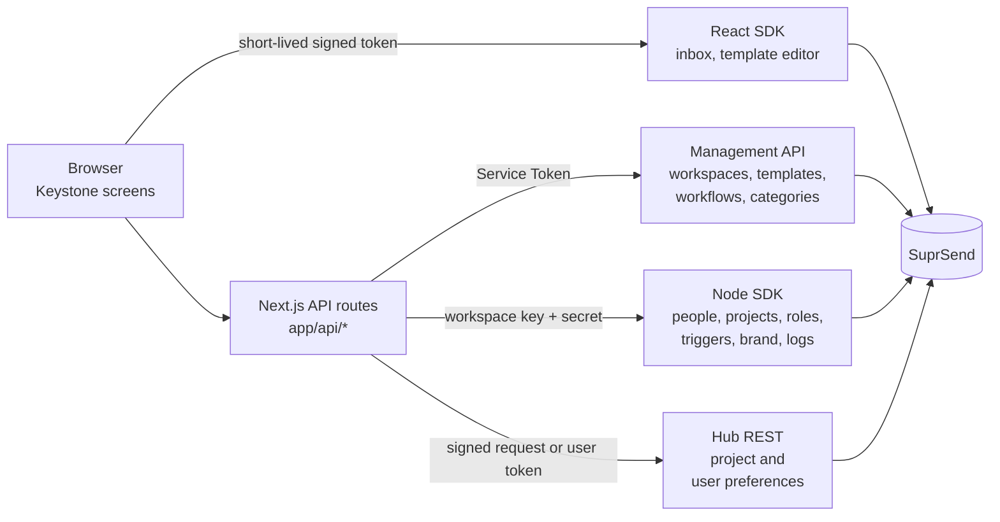
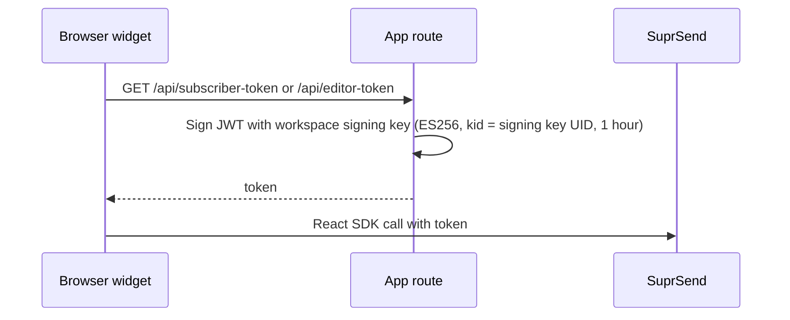

Keystone is a demo project-management product. Its customers are companies, and its notifications reach their own employees across projects. This page shows you how to run it, what each screen does, and how you can build it using SuprSend.

<Card title="Keystone">
  A B2B project workspace built on Next.js with the **Node SDK**, **drop-in Inbox**, and **embedded template editor**.<br/>
  [GitHub code repository](https://github.com/yashika248/keystone-app)
</Card>

**Stack:** Next.js 16 (App Router) · React 19 · TypeScript · Tailwind v4 · shadcn/Radix UI.
**SuprSend SDKs:** `@suprsend/node-sdk`, `@suprsend/react`, `@suprsend/react-editor`.

## What the app does

Companies use Keystone to run their projects. Each project has people on it, each in a role, and what you can see and change depends on that role. Use **Viewing as** in the top bar to switch between people.

| Role | Scope | What they do |
|---|---|---|
| **Admin** | The whole customer | Writes the messages, decides which notifications exist and who they reach, sets the brand, and reads the logs |
| **Project Manager** | Their project | Runs the project: state, cost, members and roles. Sets the project's notification defaults, and can adjust a member's settings |
| **Project Sponsor, Process Owner, Team Member** | Their project | Work on the project, and choose what they hear about |

The app ships with two customers, **Acme** and **Globex**. A switcher in the top bar changes which one you are working in.

## How Keystone maps to SuprSend

One SuprSend account holds the whole product. Each customer is a **workspace** of its own, with its own keys, people, templates, workflows and delivery logs.

Inside a workspace, each project is two records with the same ID: a **tenant**, which carries the project's notification settings, and an **object**, which carries its team. A person is a **user** subscribed to that object with a `role`, so one person can hold a different role on each project. Notifying the object reaches everyone on the project, and each workflow's conditions decide who actually receives it.

<Frame>
  
</Frame>

To go deeper on modelling your customers in SuprSend, and on the concepts this app uses, read [Designing notifications for multi-tenant B2B applications](/docs/guides/modelling-customers-b2b).

## App structure

The [repository](https://github.com/yashika248/keystone-app) is organised like this:

| Folder | What it holds |
|---|---|
| `app/project/` | Projects list and the project page: overview, resources, notifications |
| `app/workspace/` | Resource Pool |
| `app/admin/` | Administer screens: preferences, templates, brand, logs |
| `app/api/` | API routes. **All code that uses a SuprSend secret lives here** |
| `components/` | The code behind each screen, grouped by area (`project/`, `admin/`, `templates/`), plus buttons, dialogs and the top bar shared across screens |
| `lib/server/` | Server-only SuprSend access (Node SDK, Management API, Hub REST) |
| `lib/roles.ts` | Project role rules: one Project Manager, single-holder roles |
| `scripts/` | Workspace creation and asset push |
| `suprsend/` | Preference categories, templates and workflows as SuprSend CLI files |
| `proxy.ts` | Optional password gate for a hosted demo |

## Run it locally

**Prerequisites:** Node.js 20.9+ and a SuprSend account. Sign up free at [app.suprsend.com](https://app.suprsend.com).

<Steps>
  <Step title="Install">
    ```bash
    git clone https://github.com/yashika248/keystone-app.git
    cd keystone-app
    npm install
    ```
  </Step>
  <Step title="Create the workspaces">
    Get an account Service Token: **Account Settings → Service Tokens**. Copy the env template and paste the token into `SUPRSEND_SERVICE_TOKEN`.

    ```bash
    cp .env.example .env.local
    npm run create-workspaces
    ```

    This creates two workspaces in your account, **Acme** and **Globex**, and fills each Workspace Key in `.env.local`.
  </Step>
  <Step title="Paste the remaining keys">
    In the dashboard, switch to each workspace and open **Developers → API Keys**.

    | Variable | Where to find it |
    |---|---|
    | `SUPRSEND_<WS>_WORKSPACE_SECRET` | **Workspace Key and Secret** — shown once |
    | `NEXT_PUBLIC_SUPRSEND_<WS>_PUBLIC_KEY` | **Public Keys** — starts with `SS.PUBK` |
    | `SUPRSEND_<WS>_SIGNING_KEY_UID` | **Signing Keys** — the `signing_key_…` UID, not the `ws_signk_…` ID |
    | `SUPRSEND_<WS>_SIGNING_KEY_B64` | **Signing Keys → Generate** — the Base64 value, shown once |

    `<WS>` is `ACME` or `GLOBEX`.
  </Step>
  <Step title="Use the ready-made notifications">
    The repo ships a working set of preference categories, email and inbox templates, and workflows, in `suprsend/`. Push them and both workspaces have something to send from the first minute. Preview first, then push:

    ```bash
    npm run push:assets -- --dry-run
    npm run push:assets
    ```

    | Notification | Sent when | Reaches, by default |
    |---|---|---|
    | `project-assigned` | A project gets a new Project Manager | Project Manager, Process Owner |
    | `project-started`, `project-paused` | The project's state changes | Started: Project Manager, Team Member, Project Sponsor. Paused: Team Member, Project Sponsor |
    | `task-completed` | Someone completes a task | Project Manager |
    | `tasks-upcoming` | A task is added, then waits until the due date nears | Team Member, Project Manager |
    | `comment-added` | Someone comments, collected into a digest | Project Manager, Team Member |
    | `tagged-on-project` | Someone is @mentioned in a comment | That person |
    | `budget-alert` | Total cost goes above the category's threshold | Project Manager, Project Sponsor, Process Owner |

    To use your own, create them in the SuprSend dashboard and the app picks them up — it reads whatever is live in the workspace. The rest of this page uses the ready-made set.
  </Step>
  <Step title="Run">
    ```bash
    npm run dev
    ```

    Open [http://localhost:3000](http://localhost:3000).
  </Step>
</Steps>

## Add your starting data

Next, add the people and projects the app works with. Both are stored in SuprSend, and the app reads them from there.

<Steps>
  <Step title="Add people in SuprSend">
    People live in SuprSend. In the dashboard, open **Acme → Users** and add 3–4 people. Give each one a distinct ID such as `u_dana_carter`, an email, and a `name` property such as `Dana Carter`.

    The `name` property is what the app shows, so set it for everyone.

    <Frame caption="A person in the SuprSend dashboard, with an email and a name property">
      
    </Frame>

    A real employee would arrive from your own product's signup. The dashboard stands in for that here.
  </Step>
  <Step title="Set the customer's brand">
    Open **Administer → Brand**. Set name, colours, logo and links. Templates read these through `{{$brand.*}}`, so emails carry the customer's own name and colours. A new project copies the brand as it is created.

    The brand is stored on the workspace's `default` tenant, which you can also see in the dashboard under **Tenants**.

    <Frame caption="Acme's brand on its default tenant in the SuprSend dashboard">
      
    </Frame>
  </Step>
  <Step title="Create a project">
    Click **+ Project**. Name it, pick a **Project Manager** (required) and at least one **Team Member**, then click **Create project**.

    This creates the tenant, the object and the role subscriptions in one request.
  </Step>
  <Step title="Check it works">
    1. On the project page, change the state from **In-flight** to **Paused**.
    2. Open **Viewing as** and pick the Team Member. Open the bell: the notification is there.
    3. Switch **Viewing as** back to **Admin** and open **Administer → Logs**. The same send is listed with its status.

    Email needs an email vendor in the dashboard (**Vendors**). The inbox works straight away.
  </Step>
</Steps>

To try every notification in turn, follow the [test checklist](https://github.com/yashika248/keystone-app#test-it) in the repo.

## App navigation

### Top bar

| Control | What it does |
|---|---|
| **Customer** | Picks the customer. Lists every workspace whose key and secret are in `.env.local`. Shows the brand name and colour |
| **Viewing as** | Picks who you are: Admin, or any person in the workspace. Every screen follows that person's role |
| **+ Project** | Creates a project from people who already exist |
| **Search projects** | Opens a project you can see |
| **Bell** | Your inbox for the current project. Hidden when you view as Admin |

### Project screens

| Screen | What you do there |
|---|---|
| **Projects** | See your projects. Admin sees every project, and can change a project's state or Project Manager from the list |
| **Project Overview** | Comment, and type `@` to tag someone. Add tasks with an assignee and due date, and mark them complete |
| **Project header** | Set the state — **In-flight**, **Paused** or **Completed** — and the project's **Total cost**. In-flight and Paused each send a notification; Completed records the state quietly |
| **Resources** | Add and remove people, and set their roles. Giving someone a one-person role removes its previous holder from the project |
| **Notifications** | **Project Settings**: the project's defaults — on or off, frequency, recipient roles, people to leave out, channels and the cost threshold. **User Settings**: one member's choices. **My Settings**: your own. The tabs you see depend on your role |
| **Resource Pool** | See everyone in the customer and how many projects each person is on. Read-only |

<Tabs>
  <Tab title="Projects">
    <Frame>
      
    </Frame>
  </Tab>
  <Tab title="Project Overview">
    <Frame>
      
    </Frame>
  </Tab>
  <Tab title="Resources">
    <Frame>
      
    </Frame>
  </Tab>
  <Tab title="Notifications">
    <Frame caption="User Settings — one member's choices, edited by an Admin">
      
    </Frame>
  </Tab>
  <Tab title="Resource Pool">
    <Frame>
      
    </Frame>
  </Tab>
</Tabs>

### Administer screens

Admins see these screens.

| Screen | What you do there |
|---|---|
| **Preferences** | Set each notification's customer-wide default: on, off or required, its channels, which roles receive it, its digest cadence, and conditions such as the budget threshold |
| **Message Templates** | See every template and its channels. Open one to edit it, or delete it |
| **Template editor** | Edit email and inbox content in SuprSend's embedded editor, and send a test. Preview as a real member of the project |
| **Brand** | Set name, logo, colours, links and custom properties used by templates, with a live preview of a sample email |
| **Logs** | See every message sent for the current project, with its delivery status. The page is headed **Executions** |

<Tabs>
  <Tab title="Preferences">
    <Frame>
      
    </Frame>
  </Tab>
  <Tab title="Message Templates">
    <Frame>
      
    </Frame>
  </Tab>
  <Tab title="Template editor">
    <Frame>
      
    </Frame>
  </Tab>
  <Tab title="Brand">
    <Frame>
      
    </Frame>
  </Tab>
  <Tab title="Logs">
    <Frame>
      
    </Frame>
  </Tab>
</Tabs>

### Inbox

| Screen | What you do there |
|---|---|
| **Inbox** | The bell in the top bar. Read your notifications for the current project, in **All** and **Unread** tabs |

<Frame>
  
</Frame>

## How each screen talks to SuprSend

### The path every screen takes

SuprSend's backend APIs authenticate with the workspace key and secret, which belong on the server. So every call runs there: open **Resources**, the browser asks the Keystone server for `/api/admin/project-members`, and that route calls SuprSend and returns the result.

For you that means all SuprSend code lives in `app/api` and `lib/server`, and the screens call the app's own routes. The exception is SuprSend's browser components — the inbox and the template editor — which call SuprSend themselves using a short-lived token the server signs for them.

Hub REST is SuprSend's REST API on `hub.suprsend.com`. Keystone calls it directly for project and personal preferences.



### Which API each screen uses

| Screen | App route | SuprSend call | Auth |
|---|---|---|---|
| Customer switcher | server layout (`lib/server/workspace.ts`) | Management API `GET /v1/workspace/`, then Node SDK `tenants.get("default")` for brand name and colour | Service Token; key + secret |
| Projects, Viewing as, Search, Resource Pool | `GET /api/people`, `/api/users` | Node SDK `users.list`, `objects.list("project")`, `objects.get_subscriptions` | Key + secret |
| + Project | `POST /api/admin/create-project` | Node SDK `objects.upsert`, `tenants.upsert`, `objects.create_subscriptions` with each role | Key + secret |
| Resources | `GET` / `POST` / `PATCH` / `DELETE /api/admin/project-members` | Node SDK object subscriptions. A new Project Manager triggers `project-assigned` on the project object | Key + secret |
| Project state | `GET` / `POST /api/admin/project-state` | Node SDK `objects.upsert`; triggers `project-started` or `project-paused` on the object. **Completed** records the state | Key + secret |
| Total cost | `GET` / `POST /api/admin/project-cost` | Node SDK `objects.upsert`; triggers `budget-alert` on the object on every save | Key + secret |
| Comments | `GET` / `POST /api/admin/project-comments` | Node SDK `objects.upsert` (comments live on the object); triggers `comment-added` on the object, or `tagged-on-project` for one person | Key + secret |
| Tasks | `GET` / `POST` / `PATCH /api/admin/project-tasks` | Node SDK `objects.upsert` (tasks live on the object); `track_event` for `TASKS_UPCOMING` and `TASK_CLOSED`; triggers `task-completed` on the object | Key + secret |
| Project Settings | `/api/admin/tenant-preferences`, `/api/admin/tenant-digest` | Hub REST `/v1/tenant/{project}/category/` and `/v1/tenant/{project}/preference/category/{category}/` | HMAC signature |
| My Settings, User Settings | `/api/user-preferences`, `/api/user-digest` | Hub REST `/v2/subscriber/{id}/category/` for on/off and channels; `/v1/user/{id}/preference/category/{category}/` for digest and cost | Public key + ES256 signature; HMAC signature |
| Preferences | `/api/admin/preference-config`, `/api/admin/notification-recipients` | Management API `GET` / `POST /v1/{ws}/preference_category/`; workflow recipient tags | Service Token |
| Message Templates | `GET` / `DELETE /api/templates` | Management API templates (v2): list, get, delete | Service Token |
| Template editor | `GET /api/editor-token` | `@suprsend/react-editor` `TemplateEditor` | ES256 token, `entity_type: "template"` |
| Brand | `GET` / `POST /api/brand` | Node SDK `tenants.get` / `tenants.upsert("default")` | Key + secret |
| Logs | `GET /api/executions` | Node SDK `messages.list`, filtered to the current project | Key + secret |
| Inbox | `GET /api/subscriber-token` | `@suprsend/react` `SuprSendProvider` + `Inbox` | ES256 token, `entity_type: "subscriber"`, scoped to the project |

Full API lists and credential types: [B2B guide → Reference: credentials and APIs](/docs/guides/modelling-customers-b2b#reference-credentials-and-apis).

### How one trigger reaches the right people

Keystone names the **project object** as the recipient and passes the project as `tenant_id`. SuprSend works out who receives it:

```json
{
  "workflow": "task-completed",
  "recipients": [{ "object_type": "project", "id": "acme-aero" }],
  "tenant_id": "acme-aero",
  "data": { "task_name": "Design FMEA review", "project_link": "https://…/project/acme-aero" }
}
```

SuprSend fans that out to everyone subscribed to the object, then each workflow's conditions compare the recipient's `$recipient.subscription.role` with the roles the category targets. That is how one trigger reaches only the Project Manager for a completed task, but the whole team for a started project. Change the roles on the **Preferences** screen and delivery follows.

<Frame caption="A project object in the SuprSend dashboard. Each member is subscribed with a role">
  
</Frame>

Every notification also carries `project_link`, which points back at the project's page in the app.

### Two calls that use the REST API

- **Project and personal preferences:** both come from the REST API, called directly from `lib/server/`. Project settings are signed with the workspace key and secret; a person's own settings use a token signed for that person. Use the same approach when you need them.
- **Preference categories:** a save sends the whole category tree. The app reads what is live, applies your one change to it, and sends all of it back, so every other category stays as it was.

### How the inbox and editor get their token



## Change or extend it

### Add a customer workspace

Everything here is configuration.

1. Create the workspace in the dashboard.
2. Add its keys to `.env.local` under a new prefix: `SUPRSEND_INITECH_WORKSPACE_KEY`, `NEXT_PUBLIC_SUPRSEND_INITECH_PUBLIC_KEY`, and so on.
3. Restart the dev server. The app reads the workspace list once per process.
4. To give it notifications, run `npm run push:assets -- <workspace slug>`.

### Add a role

A role lives in three places:

| What | Where | Change it in |
|---|---|---|
| Which roles a notification can target | The `role` property on each preference category | `suprsend/preference_categories/categories.json`, or the dashboard |
| A person's role on one project | Their subscription to the project object | The app: **+ Project** or **Resources** |
| How many people may hold a role | `lib/roles.ts` | Code |

Add a role choice to a category and it appears in the app's recipient pickers.

### Edit templates, workflows or categories

Edit the files in `suprsend/`, then push. Push to one workspace by naming it:

```bash
npm run push:assets -- acme
```

<Warning>
  Pushing overwrites the live copy. Template edits made in the dashboard, and the defaults set in **Administer → Preferences**, go back to the repo files. Pull first if you want to keep them.
</Warning>

```bash
npx suprsend template pull -w acme
```

To pull workflows or categories, use `workflow` or `category` in the same command.

### Add a notification

1. Add its category, template and workflow to `suprsend/`, then push.
2. Trigger it from an API route. `lib/server/hub.ts` wraps the three calls Keystone uses: `triggerObjectWorkflow` for a whole project, `triggerWorkflow` for one person, and `trackEvent` for event-triggered workflows.

```ts
import { getActiveWorkspace } from "@/lib/server/workspace";
import { triggerObjectWorkflow } from "@/lib/server/hub";
import { projectLink } from "@/lib/server/http";

export async function POST(req: Request) {
  const ws = await getActiveWorkspace();
  const { projectId } = await req.json();

  await triggerObjectWorkflow(
    ws,
    {
      workflow: "milestone-reached",
      objectType: "project",
      objectId: projectId,
      data: { project_link: projectLink(req, projectId) },
    },
    projectId, // tenant_id
  );

  return Response.json({ ok: true });
}
```

### Add a channel

Set up the channel's vendor in SuprSend, then add that channel's content to the template, both in the dashboard. Every template covers email and inbox, and two also carry Slack content.

### Check your changes

```bash
npm run lint && npm run typecheck && npm test && npm run build
```

## Deploy

The app runs anywhere Next.js runs, for example Vercel. Add the same variables from `.env.local` to the deployment.

**Put a password on it.** Set `DEMO_PASSWORD` and every page and API route asks for it (`proxy.ts`). A deployed demo reads and writes your real SuprSend account.

### Reusing this pattern in your own product

Two routes sign the tokens that SuprSend's browser components need. In Keystone, anyone can pick who they are with **Viewing as**, so both hand a token to whoever asks. Your product knows who is signed in, so tie both to that session before you ship them.

| Route | What it's for | In Keystone | In your product |
|---|---|---|---|
| `/api/subscriber-token` | Signs the token the inbox uses, which tells SuprSend whose notifications to show | Takes `distinct_id` from the query string, so a caller can ask for a token for anyone | Take `distinct_id` from the signed-in session |
| `/api/editor-token` | Signs the token the template editor uses, which tells SuprSend which templates may be edited | Open to any caller. The token unlocks every template in the workspace, because `entity_id` is set to `"*"` | Limit it to admins, and set `entity_id` to the template they are editing |

The same applies to roles. **Viewing as** decides who you are, and the API routes trust the `actor` cookie the browser sets, so check the signed-in user's role in every route under `app/api/` before you ship.

## Troubleshooting

<AccordionGroup>
  <Accordion title="&quot;No workspace connected&quot;">
    A customer appears only when `SUPRSEND_<WS>_WORKSPACE_KEY` matches a workspace in your account **and** `_WORKSPACE_SECRET` is set. Fix the keys, then restart the dev server.
  </Accordion>
  <Accordion title="&quot;Couldn't list SuprSend workspaces&quot;">
    The message ends with the status code, usually 401. `SUPRSEND_SERVICE_TOKEN` is wrong or expired. Create a new one in **Account Settings → Service Tokens**.
  </Accordion>
  <Accordion title="&quot;node: bad option: --env-file&quot;, or Next.js refuses to start">
    Node.js is older than 20.9, which Next.js 16 requires. The scripts also read `.env.local` through `--env-file`. Upgrade Node.js.
  </Accordion>
  <Accordion title="Inbox or template editor doesn't load">
    "Missing signing-key env for …" — a signing key variable is empty.

    A 401 from the editor — you used the `ws_signk_…` ID. Use the `signing_key_…` UID.

    "public key not configured" — `NEXT_PUBLIC_SUPRSEND_<WS>_PUBLIC_KEY` is empty for this customer.

    No bell — the bell shows when you view as a project member with a project open.
  </Accordion>
  <Accordion title="&quot;A Project Manager is required.&quot;">
    Every project needs one. The picker lists the people in your workspace, so add them in the SuprSend dashboard first.
  </Accordion>
  <Accordion title="People show as IDs instead of names">
    The user has no `name` property. Add it in the dashboard, or the app falls back to the distinct ID.
  </Accordion>
  <Accordion title="The change saved, but nobody was notified">
    Triggers run after the save, so the action always completes. Open the SuprSend dashboard **Logs** to see the request and its status.
  </Accordion>
  <Accordion title="One person didn't get a notification">
    Their project role isn't among the category's recipient roles, they are in its excluded list, or they opted out. Check **Administer → Preferences**, then the project's **Project Settings**.

    For example, Project Paused reaches Team Members and Project Sponsors by default, not the Project Manager.
  </Accordion>
  <Accordion title="No budget alert">
    Total cost has to be above the category's threshold, which ships at 30000. Raise the cost, or lower the threshold in **Preferences**.
  </Accordion>
  <Accordion title="@mentions are never delivered">
    Known issue. `tagged-on-project` goes to one person, but its condition reads the recipient's project role, which only exists when a notification is sent to the project object. There is no fix yet.
  </Accordion>
  <Accordion title="Sent, but no email arrives">
    Add an email vendor in the dashboard (**Vendors**), and an email on the person. Open **Administer → Logs** for the failure reason.
  </Accordion>
  <Accordion title="Logs look empty or incomplete">
    Logs show the current project only, from the newest 1,000 messages in the workspace. Open the project first.
  </Accordion>
  <Accordion title="My dashboard template edits disappeared">
    `npm run push:assets` overwrote them. Pull before you push — see [Edit templates, workflows or categories](#edit-templates-workflows-or-categories).
  </Accordion>
  <Accordion title="Hosted demo returns &quot;Locked. Enter the demo password first.&quot;">
    `DEMO_PASSWORD` is set. Enter it on the gate page.
  </Accordion>
</AccordionGroup>

## Reference

### Environment variables

| Variable | Scope | Used for |
|---|---|---|
| `SUPRSEND_SERVICE_TOKEN` | Account | Management API for every workspace |
| `SUPRSEND_<WS>_WORKSPACE_KEY` / `_SECRET` | Workspace | Node SDK and signed Hub REST. A matching key also makes the customer appear |
| `SUPRSEND_<WS>_SIGNING_KEY_UID` / `_B64` | Workspace | Signs inbox, editor and preference tokens |
| `NEXT_PUBLIC_SUPRSEND_<WS>_PUBLIC_KEY` | Workspace | Inbox and user preferences |
| `DEMO_PASSWORD` | Deployment | Shared password for a hosted demo. Leave empty locally |
| `SUPRSEND_MGMNT_URL`, `SUPRSEND_PREF_MGMNT_URL`, `SUPRSEND_HOST` | Optional | API hosts, for a private or regional cluster |

### Scripts

| Command | Does |
|---|---|
| `npm run dev` | Start the dev server |
| `npm run build` / `npm start` | Production build / run |
| `npm run lint` / `typecheck` / `test` | ESLint / TypeScript / Vitest |
| `npm run create-workspaces` | Create both workspaces and fill their Workspace Keys. Add `-- --dry-run` to preview |
| `npm run push:assets` | Push `suprsend/` to every workspace. Add `-- --dry-run` to preview, `-- <workspace>` for one, or `-- --draft` to save as a draft |

## Next steps

<CardGroup cols={2}>
  <Card title="B2B modelling guide" icon="building" href="/docs/guides/modelling-customers-b2b">
    Why each customer is its own workspace.
  </Card>
  <Card title="Workspaces vs tenants" icon="scale-balanced" href="/docs/guides/modelling-customers-workspace-vs-tenant">
    When to use the other model.
  </Card>
  <Card title="React inbox" icon="inbox" href="/docs/react-inbox-integration">
    The inbox used in the top bar.
  </Card>
  <Card title="Embedded template editor" icon="pen-to-square" href="/docs/embeddable-template-react-sdk">
    The editor used in Message Templates.
  </Card>
</CardGroup>
