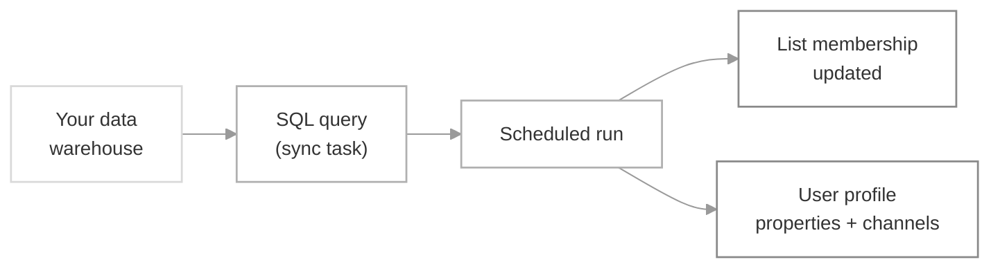

Connect your data warehouse to SuprSend and sync a [List's](/docs/lists) membership by writing a SQL query. The query runs on the schedule you choose, so the list stays in sync with your source of truth without any code — and you can update user profile properties and channels in the same pass to power personalized broadcasts.

<Note>
  Database sync needs an active database connection. If you haven't added one, see [Setup database connection](/docs/database) first.
</Note>

## How it works



A sync task is a SQL query plus a schedule. When the schedule fires, SuprSend runs the query, adds or replaces the list membership from the result, and — if you enable it — updates each user's profile properties and channels from other columns your query returns.

## Setting up the sync

<Steps>
  <Step title="Create a sync task">
    Open the list from the Lists page and click **Update Users**, or click **New task** on the **Sync tasks** tab. Lists whose source is a database connector open the sync task editor directly on **Update Users**; other list types fall back to the sync tasks tab.

    <Frame caption="Open the sync task editor from the list details page.">
      
    </Frame>

    Set a task name and pick the list to sync into. The list must already exist — [create one](/docs/lists#creating-lists) first if it doesn't.
  </Step>

  <Step title="Write the SQL query">
    Pick your database connection, then write the query that returns the users to sync. If you haven't added a connection yet, add it from this screen — see [database connection](/docs/database) for the setup.

    <Frame>
      
    </Frame>

    Your `SELECT` must return a `distinct_id` column — that's how SuprSend identifies each user. Every additional column can be mapped to a user property or channel in the next step.

    Click **Run** to preview the first 10 rows and confirm the query pulls what you expect.

    Return only the rows and columns you need. Avoid `SELECT *` in the committed query — the preview limits to 10 rows, but the live sync doesn't. If you're mapping channels, format each column so the values are ready to use as-is:

    | Channel | Required format |
    |---|---|
    | Email | Standard email address (e.g. `user@example.com`) |
    | SMS / WhatsApp | [E.164](https://www.twilio.com/docs/glossary/what-e164) with country code (e.g. `+919999999999`) |

    To prepend a country code inside SQL:
    - **PostgreSQL** — `SELECT '+91' || phone_number AS phone FROM users`
    - **MySQL** — `SELECT CONCAT('+91', phone_number) AS phone FROM users`

    <Warning>
      Column names are case-sensitive when mapping to user properties or channels. `Email`, `email`, and `EMAIL` are treated as three different columns — pick one form and stick with it.
    </Warning>

    ### Incremental syncs with `{{last_sync_time}}`

    For recurring syncs, use the `{{last_sync_time}}` template variable to fetch only rows that changed since the previous successful run. This keeps queries fast and avoids re-processing the same rows every interval.

    `{{last_sync_time}}` is an ISO 8601 timestamp. Add a `WHERE` clause against an indexed "last updated" column in your source table, and cast the variable if your column uses a different format.

    ```sql
    SELECT distinct_id, email, plan
    FROM users
    WHERE updated_at > '{{last_sync_time}}';
    ```
  </Step>

  <Step title="Configure the sync settings">
    Once the preview looks right, **Save query** and click **Commit changes**. You'll be walked through the sync settings.

    <Frame caption="Sync settings on commit — update type, schedule, and user profile mapping.">
      
    </Frame>

    | Field | Description |
    |---|---|
    | **Update type** | **Add** — append the query result to the existing list. Use when the query returns *new* users only (e.g. today's signups). **Replace** — swap the current membership for exactly the rows the query returns. Use when the query is the full definition of the audience (e.g. *"users who purchased in the last 30 days"*). |
    | **Schedule** | **One-time** for a single run; **Recurring** for a repeating sync on an interval (every N minutes / hours / days) or a cron expression like `every monday at 9:00 am`. |
    | **Create / Update user profile** | Turn on to sync additional columns as user properties and channels. Reference the properties later in templates as `{{$user.<property_key>}}`. |
    | **Column header** | The exact column name (case-sensitive) from your query output. |
    | **Is channel?** | Enable if the column value is a channel (`email`, `sms`, `whatsapp`). Phone columns must be in E.164 format. |
    | **User property** | The property key to store the value under — can differ from the column name. For channels, pick from the list of available channels. |
    | **Manage existing property** | **Override** — replace the value on every sync. **Don't Override** — set only if the property isn't already set (useful for one-time properties like `signup_date`). **Append** — build up an array across syncs. Channel columns are always appended. |

    <Frame caption="Set sync frequency — one-time, recurring on an interval, or a cron expression.">
      
    </Frame>

    <Frame caption="Map query columns to user properties and channels for the profile sync.">
      
    </Frame>

    Click **Next**, add a commit description so the change is easy to identify in version history, and confirm.

    <Frame caption="Add a commit description to record what changed in this version.">
      
    </Frame>

    <Check>
      Your sync is now live. It'll run at the configured interval and the list will refresh as your source data changes.
    </Check>
  </Step>
</Steps>

## Enable or disable a sync

A sync is enabled the moment you commit it. Toggle it off from the switch next to the edit button — the query stops running but the sync configuration stays intact, so you can turn it back on later. On re-enable, the next run picks up from `{{last_sync_time}}` of the previous successful run, so it processes everything that changed while the sync was off.

<Frame>
  
</Frame>

## Sync logs

Every run appears in **Lists → Logs**. Filter by source type to see only database syncs. Each row shows when the sync ran, who last edited it, and the outcome.

<Frame>
  
</Frame>

| Status | Meaning |
|---|---|
| **Created** | The run is queued but hasn't started yet. |
| **In progress** | Users are being added to the list. You'll see a `% progress` on the row. |
| **Success** | The run completed. You'll see `Total` (rows the query returned), `Processed` (rows attempted), and `Added` (users actually added to the list). `Added` can be lower than `Total` if some users were already in the list, or if some `distinct_id`s don't exist in SuprSend — enable **Create / Update user profile** to auto-create missing users. |
| **Ignored** | Skipped because the previous run was still in progress when this one was due to start. |
| **Failed** | The run couldn't complete — usually a query error, a missing `distinct_id` column, or an empty result set. Hover the status or open the sync to see the error, or filter to **Show only error logs**. |

<Frame>
  
</Frame>

If the error looks internal to SuprSend, reach out on our [Slack community](https://join.slack.com/t/suprsendcommunity/shared_invite/zt-3932rw936-XNWY1RC8bsffh4if4ZyoXQ).

## Version control

Every change to the query or settings is saved as a draft first. Only **Commit changes** publishes it as the live version — the running sync keeps using the previous version until then. Browse and roll back to older versions from the version history.

<Frame>
  
</Frame>

## Troubleshooting

<AccordionGroup>
  <Accordion title="Sync failed: 'distinct_id column is missing'">
    Your query must return a column literally named `distinct_id` (lowercase). If your source uses a different name, alias it: `SELECT user_id AS distinct_id FROM users`.
  </Accordion>
  <Accordion title="Sync failed: empty result set">
    The query returned zero rows. Check your `WHERE` clause — a common cause is a `{{last_sync_time}}` filter that's too restrictive on the first run, when there is no previous sync time. Run the preview to confirm the query returns data.
  </Accordion>
  <Accordion title="Users showed up in the list, but their properties didn't update">
    Column names are case-sensitive in the profile mapping. If your query returns `Email` but the mapping is `email`, the value won't be applied. Re-check that the mapping matches the query output exactly.
  </Accordion>
  <Accordion title="SMS or WhatsApp channels aren't syncing">
    Phone numbers must be in E.164 format (`+<country-code><number>`). If your database stores raw numbers, prepend the country code in the query — `CONCAT('+91', phone_number)` in MySQL or `'+91' || phone_number` in PostgreSQL.
  </Accordion>
  <Accordion title="Runs are being marked 'Ignored'">
    A run is skipped when the previous run is still in progress. Either lengthen the sync interval, or tighten the query with a `{{last_sync_time}}` filter so each run processes fewer rows.
  </Accordion>
</AccordionGroup>

## Next steps

<CardGroup cols={2}>
  <Card title="Setup database connection" icon="database" href="/docs/database">
    Add your warehouse credentials before creating a sync task.
  </Card>
  <Card title="Send a Broadcast" icon="bullhorn" href="/docs/broadcast">
    Use the synced list as the audience for a broadcast.
  </Card>
  <Card title="Segment Lists" icon="wand-magic-sparkles" href="/docs/segment-lists">
    Skip the warehouse — write SQL directly against SuprSend's user and event data.
  </Card>
  <Card title="List entry / exit triggers" icon="workflow" href="/docs/design-workflow#1-trigger-node">
    Trigger a workflow when users enter or exit the list.
  </Card>
</CardGroup>
