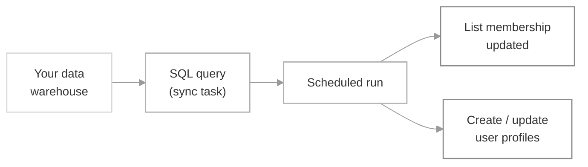

Connect your data warehouse to SuprSend and sync a [List's](/docs/lists) membership by writing a SQL query. The query runs on the schedule you choose, so the list stays in sync with your source of truth without any code. In the same pass, you can also create users who don't yet exist in SuprSend and update their profile properties or channels — powering personalized broadcasts and workflows.

<Note>
  Database sync needs an active database connection. If you haven't added one, see [Setup database connection](/docs/database) first.
</Note>

## How it works



A sync task is a SQL query plus a schedule. When the schedule fires, SuprSend runs the query, adds or replaces the list membership from the result, and — if you enable it — creates any users who don't yet exist and updates each user's profile properties and channels from other columns your query returns.

## Setting up the sync

### 1. Create the list

Go to **Lists → + New List** and set a `list_id` (required — unique within the workspace; lowercase letters, digits, and underscores only), plus an optional name and description.

### 2. Write the SQL query

Open the list from the Lists page. On the **User Sync Query** tab, click **Setup Sync** to launch the query editor.

<Frame caption="Empty User Sync Query tab — click Setup Sync to start.">
  
</Frame>

Pick your database connection from the dropdown at the top of the editor, then write the query that returns the users to sync. If you haven't added a connection yet, add it from this screen — see [database connection](/docs/database) for the setup.

<Frame caption="Query editor with connection selector, SQL input, and preview panel.">
  
</Frame>

Keep these rules in mind as you write the query:

- **Return `distinct_id`** — your `SELECT` must include this column; it's how SuprSend identifies each user. Any additional columns can be mapped to a user property or channel in the next step.
- **Preview, then save** — click **Run** to preview the first 10 rows and confirm the query pulls what you expect, then click **Save Query** to persist the draft.
- **Select only what you need** — avoid `SELECT *` in the committed query. The preview limits to 10 rows, but the live sync would return all rows and columns and can take longer to run.
- **Mind column-name case** — mappings are case-sensitive, so `Email`, `email`, and `EMAIL` are three different columns. Pick one form and stick with it.
- **Format channel columns** - make sure that you format the channel values correctly otherwise they'd be dropped while syncing in user profile.

    | Channel | Required format |
    |---|---|
    | Email | Standard email address (e.g. `user@example.com`) |
    | SMS / WhatsApp | [E.164](https://www.twilio.com/docs/glossary/what-e164) with country code (e.g. `+919999999999`) |

    To prepend a country code inside SQL:
    - **PostgreSQL** — `SELECT '+91' || phone_number AS phone FROM users`
    - **MySQL** — `SELECT CONCAT('+91', phone_number) AS phone FROM users`

#### Incremental syncs with `{{last_sync_time}}`

For recurring syncs, use the `{{last_sync_time}}` template variable to fetch only rows that changed since the previous successful run. This keeps queries fast and avoids re-processing the same rows on every sync.

`{{last_sync_time}}` is an ISO 8601 timestamp. Add a `WHERE` clause against an indexed "last updated" column in your source table, and cast the variable if your column uses a different format.

```sql
SELECT distinct_id, email, plan
FROM users
WHERE updated_at > '{{last_sync_time}}';
```

### 3. Configure the sync settings

Once the preview looks right, click **Update Sync Settings and Commit**.

<Steps>
  <Step title="Choose the update type">
    Pick how users returned by the query merge with the current list membership on every run.

    <Frame caption="Step 1 — choose Add or Replace for how the list membership is updated.">
      
    </Frame>

    | Option | When to use |
    |---|---|
    | **Add** | Appends only new `distinct_id`s to the list; existing users are never removed. Use when the list is additive — membership only ever accumulates. For example, *users who signed up* or *users who ever made a purchase*. |
    | **Replace** | Swaps the current membership for exactly the rows the query returns. Use when the query is the full definition of the audience — e.g. *"last 30 days active users"*, *"newsletter subscribers"*. |
  </Step>

  <Step title="Choose the update frequency">
    Set how often the sync runs.

    <Frame caption="Step 2 — pick One-time or Recurring, then set the interval.">
      
    </Frame>

    | Option | Description |
    |---|---|
    | **One-time** | Runs the query exactly once, either immediately after commit or at a later timestamp. |
    | **Recurring** | Repeats on a schedule — either an interval you build from the **Every / days / hours / minutes** selectors (e.g. every 1 day, every 6 hours, every 30 minutes), or a **cron expression** for more precise timing (e.g. `0 9 * * 1` for every Monday at 9:00 am). |
  </Step>

  <Step title="Map columns to user profile">
    Turn on **Create / Update user profile** to create users who don't yet exist in SuprSend and to sync your extra columns as user properties or channels. Reference the properties later in templates as `{{$recipient.<property_key>}}`.

    <Frame caption="Step 3 — map query output columns to user properties and channels.">
      
    </Frame>

    Add one row per column you want to sync:

    | Field | Description |
    |---|---|
    | **Column name** | The exact column name (case-sensitive) from your query output. |
    | **Is channel?** | Toggle on if the column value is a channel (`email`, `sms`, `whatsapp`). Phone columns must be in E.164 format. |
    | **User property key** | The property key to store the value under — can differ from the column name. For channels, pick from the list of available channels. |
    | **Manage existing property** | **Override** — replace the value on every sync.<br/> **Don't Override** — set only if the property isn't already set (useful for one-time properties like `signup_date`). **Append** — build up an array across syncs. Channel columns are always appended. |
  </Step>

  <Step title="Commit changes">
    Add a description so the change is easy to identify in version history, then click **Commit Changes**.

    <Frame caption="Step 4 — describe what changed in this version and commit.">
      
    </Frame>

    <Check>
      Your sync is now live. It'll run at the configured interval and the list will refresh as your source data changes.
    </Check>
  </Step>
</Steps>

## Enable or disable a sync

A sync is enabled the moment you commit it. Toggle it off from the switch next to the edit button — the query stops running but the sync configuration stays intact, so you can turn it back on later.

<Frame>
  
</Frame>

## Run a sync on demand

Click **Sync Now** in the user sync task header to trigger an immediate run outside the scheduled interval — useful for testing a new query, backfilling after fixing a source-data issue, or refreshing the list before a broadcast. The manual run uses the currently committed query and settings, honours `{{last_sync_time}}` from the previous successful run, and appears in **Sync Logs** like any other run.

## Sync logs

Every run appears on the **Sync Logs** tab of the list. Each row shows when the sync was queued, the source task, who last edited it, the status, and a summary with `Total` and `Added` counts.

<Frame>
  
</Frame>

| Status | Meaning |
|---|---|
| **Created** | The run is queued but hasn't started yet. |
| **In progress** | Users are being added to the list. You'll see a `% progress` on the row. |
| **Success** | The run completed. The summary shows `Total` and `Added` — see below for how they differ. |
| **Ignored** | Skipped because the previous run was still in progress when this one was due to start. |
| **Failed** | The run couldn't complete — usually a query error, a missing `distinct_id` column, or an empty result set. Hover the status or open the sync to see the error, or filter to **Show only error logs**. |

### Total vs. Added

- **Total** — the number of users the query returned in this run.
- **Added** — the number of users actually added to the list after the run finished.

`Added` can be lower than `Total` for two reasons:

- **The user is already in the list.** Duplicate `distinct_id`s from earlier runs aren't added again, so they count toward `Total` but not `Added`.
- **The user doesn't exist in SuprSend and user sync is off.** When **Create / Update user profile** is off in sync settings, rows whose `distinct_id` doesn't already exist in SuprSend are skipped. Turn it on to auto-create those users so `Added` matches `Total`.

<Frame>
  
</Frame>

If the error looks internal to SuprSend, reach out on our [Slack community](https://join.slack.com/t/suprsendcommunity/shared_invite/zt-3932rw936-XNWY1RC8bsffh4if4ZyoXQ).

## Version control

Every change to the query or settings is saved as a draft first. Only **Commit changes** publishes it as the live version — the running sync keeps using the previous version until then. Browse and roll back to older versions from the version history.

<Frame>
  
</Frame>

## Troubleshooting

<AccordionGroup>
  <Accordion title="Sync failed: 'distinct_id column is missing'">
    Your query must return a column literally named `distinct_id` (lowercase). If your source uses a different name, alias it: `SELECT user_id AS distinct_id FROM users`.
  </Accordion>
  <Accordion title="Sync failed: empty result set">
    The query returned zero rows. Check your `WHERE` clause — a common cause is a `{{last_sync_time}}` filter that's too restrictive on the first run, when there is no previous sync time. Run the preview to confirm the query returns data.
  </Accordion>
  <Accordion title="Users showed up in the list, but their properties didn't update">
    Column names are case-sensitive in the profile mapping. If your query returns `Email` but the mapping is `email`, the value won't be applied. Re-check that the mapping matches the query output exactly.
  </Accordion>
  <Accordion title="SMS or WhatsApp channels aren't syncing">
    Phone numbers must be in E.164 format (`+<country-code><number>`). If your database stores raw numbers, prepend the country code in the query — `CONCAT('+91', phone_number)` in MySQL or `'+91' || phone_number` in PostgreSQL.
  </Accordion>
  <Accordion title="Runs are being marked 'Ignored'">
    A run is skipped when the previous run is still in progress. Either lengthen the sync interval, or tighten the query with a `{{last_sync_time}}` filter so each run processes fewer rows.
  </Accordion>
</AccordionGroup>

## Next steps

<CardGroup cols={2}>
  <Card title="Send a Broadcast" icon="bullhorn" href="/docs/broadcast">
    Use the synced list as the audience for a broadcast.
  </Card>
  <Card title="Setup Workflow on List entry/exit" icon="diagram-project" href="/docs/design-workflow#1-trigger-node">
    Trigger a workflow when users enter or exit the list.
  </Card>
</CardGroup>
