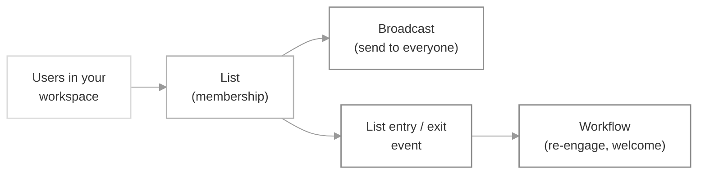

A **List** is a group of users you maintain in SuprSend to notify as a single audience — for example, everyone who signed up in the last 30 days. You can send a one-off [broadcast](/docs/broadcast) to the entire list, or [trigger a workflow](/docs/design-workflow#1-trigger-node) for individual users as they enter or exit the list — a welcome flow when someone joins, or a win-back flow when they drop off.

Every workspace gets an `all_users` list by default, which contains every user in the workspace. Use it for newsletters and product-wide announcements.

## How it works

You put users into a list once, and then use the list two ways: send a **broadcast** to everyone in it, or **trigger workflows** when users enter or leave.

## Creating lists

You can create a list via the **+ New List** button on the dashboard, or via the [Create List API](/reference/create-list). In the create-list modal, set a `list_id` (required — unique within the workspace; lowercase letters, digits, and underscores only), plus an optional display name and description.

<Frame>
  
</Frame>

Then choose how you'd want to sync users into the list:

<CardGroup cols={1}>
  <Card title="Segment List" icon="wand-magic-sparkles" href="/docs/segment-lists">
    Filter users by their properties or the events they've performed — for example, *users on the Growth plan who haven't logged in for 30 days*. Membership keeps itself up to date: users join the list the moment they meet the criteria and drop off as soon as they no longer qualify.
  </Card>
  <Card title="Database sync" icon="database" href="/docs/list-sync-via-database">
    Connect your data warehouse and sync users by writing a SQL query. It can also create users who don't yet exist in SuprSend and sync additional user properties you'd want to reference in a broadcast or workflow as `$recipient.<key>`.
  </Card>
  <Card title="CSV upload" icon="file-arrow-up" href="/docs/list-sync-via-csv">
    Upload a fixed set of known users from the dashboard — a snapshot you re-upload to refresh. Good for one-off campaigns with no engineering involvement.
  </Card>
  <Card title="SDK / API" icon="code" href="/docs/node-lists">
    Add and remove users in real time from your backend, using an [SDK](/docs/node-lists) ([Node](/docs/node-lists), [Python](/docs/python-lists), [Java](/docs/lists-java), [Go](/docs/lists-go)) or the [HTTP API](/reference/add-user-to-list) directly.
  </Card>
  <Card title="Third-party sync" icon="plug" href="/docs/mixpanel">
    Pull cohorts already defined in an analytics tool like Mixpanel through a connector — no SQL required.
  </Card> 
</CardGroup>

<Tip>
  To build an audience from a rule like *"Enterprise users in the US with 3+ orders in the last 60 days"*, use a [Segment List](/docs/segment-lists) if those properties and events are already synced into SuprSend, or [database sync](/docs/list-sync-via-database) if that data lives outside SuprSend in your data warehouse. For a fixed set of IDs you already have, a CSV upload is simplest.
</Tip>

## Sending notifications to list users

Two paths, depending on whether you're firing on membership change or sending to the whole list at once.

- **Broadcast** — the recommended way to send to a whole list. Schedule from the dashboard with **Run Broadcast**, or trigger via the [Broadcast API](/docs/broadcast). Use a promotional preference category so the send doesn't compete with transactional traffic; see [choosing a preference category](/docs/notification-category).
- **Workflow on list entry / exit** — fire a workflow when a user joins or leaves the list, e.g. re-engaging job seekers who dropped out of "active in the last 7 days." Set this up in the workflow itself: add a **List entry / exit** [trigger node](/docs/design-workflow#1-trigger-node) and select the list. The `$USER_ENTERED_LIST` / `$USER_EXITED_LIST` events then fire automatically as users join or leave — which in turn triggers the workflow.

<Warning>
  Avoid triggering individual workflows on a single list update that touches more than 1,000 users at once — it can back up your notification queue. For bulk sends, use a broadcast.
</Warning>

## Lists vs Objects

Both group recipients together, but they're different kinds of things. 
- A **List** is simply a group of users you notify in bulk. 
- An **Object** is an entity in its own right — with its own properties, channels, and preferences — that users *subscribe* to. 
- Reach for a List when you already know the set of users to send to; reach for an Object when you know the *group* a workflow should target but not the individual users, which makes objects a natural fit for modeling company or team structure (e.g. a team's `#devs` Slack channel).

| Parameter | List | [Object](/docs/objects) |
|---|---|---|
| **Best for** | An audience for a one-shot **broadcast** | A reusable topic users **subscribe to** |
| **Membership** | Managed centrally (uploaded, synced, or queried) | Users (or nested objects) opt in via subscriptions; each subscription can carry **subscription properties** — a relationship between the object and that user |
| **How to notify** | Broadcast to the whole list, or a workflow when users enter or exit | Send to all of the object's subscribers, optionally filtered by their subscription properties |
| **Hierarchy** | Flat structure — you create a separate list for every combination you need | Supports a parent–child hierarchy: one object can subscribe to another, so a notification sent to a parent also reaches everyone subscribed to its children. For example, *team* objects can subscribe to a *company* object, and anything sent to the company also reaches users subscribed to each team under it |
| **Standard throughput** | 1,000/s | 500/s |
| **Channels & preferences** | Has none of its own — notifications use each user's own channels and preferences | Has its own channels (e.g. a Slack channel or webhook) and its own preferences, so you can notify the object directly on top of reaching its subscribers |
| **Use when** | *"Send Q1 recap to everyone on the Growth plan"* | *"Notify the #incidents Slack channel"* or *"Notify everyone watching this project"* |

## FAQ

<AccordionGroup>
  <Accordion title="Why isn't my workflow firing on list entry?">
    Most likely the workflow was created *after* those users were added, so they don't count as new entries — list entry/exit events only fire for users who join or leave *after* the workflow's [trigger node](/docs/design-workflow#1-trigger-node) is active. Add the users again, or run a [broadcast](/docs/broadcast) to reach existing members.
  </Accordion>
  <Accordion title="Does CSV upload create user profiles?">
    No. CSV upload only maps existing users to the list. Identify users first via the [SDK](/docs/users#creating-user-profile-on-suprsend) or [API](/reference/create-a-subscriber-event), then upload the CSV.
  </Accordion>
  <Accordion title="Can I delete a list that's in use?">
    Deletion is blocked while a workflow or scheduled broadcast references the list. Remove those references first.
  </Accordion>
  <Accordion title="What are the rules for list_id?">
    Unique within the workspace, lowercase letters, digits, and underscores only. It's the stable identifier you'll pass to the API and reference from workflows.
  </Accordion>
  <Accordion title="How do I keep a list fresh without uploading a CSV every day?">
    Use a dynamic list. [Segment Lists](/docs/segment-lists) query your live `users` and `events` data; [database sync](/docs/list-sync-via-database) refreshes from your warehouse on a schedule; the [SDK](/docs/node-lists) lets you keep it up to date in real time from your backend.
  </Accordion>
</AccordionGroup>
