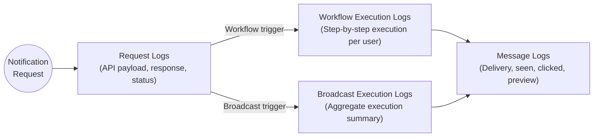

SuprSend provides end-to-end logging into each notification request. You can track the API request, detailed step-by-step execution, final message delivery, seen, click status along with preview of the final message sent to the user. Navigate to the [Logs tab](https://app.suprsend.com/en/production/logs/) to access your logs.

Every request produces logs at up to 3 stages depending on the type of request.

<CardGroup cols={2}>
  <Card title="Request logs" icon="code" iconType="solid" href="/docs/request-logs">
    View request payload, response, status, and errors for all API/SDK requests. Includes linked workflow execution logs for trigger and event requests.
  </Card>
  <Card title="Workflow execution logs" icon="sitemap" iconType="solid" href="/docs/workflow-execution-logs">
    Step-by-step workflow execution details per user — node execution, channel computation, template rendering, and error tracking.
  </Card>
  <Card title="Broadcast execution logs" icon="tower-broadcast" iconType="solid" href="/docs/broadcast-execution-logs">
    Aggregate execution summary for broadcast campaigns — processing steps, user statistics, and delivery status across lists.
  </Card>
  <Card title="Message logs" icon="envelope" iconType="solid" href="/docs/message-logs">
    Individual message delivery status, engagement tracking (delivered, seen, clicked), message preview, and vendor error details.
  </Card>
</CardGroup>

---

## Navigating Logs Page

### Refresh Interval
Logs are auto-refreshed every 20 seconds by default. You can manually refresh the logs by clicking the refresh button. You can also pause auto-refresh if you're investigating a specific issue to prevent new logs from changing your view.

### Filters
You have global filters to drill down logs like date range and then you have tab specific filters to filter logs by status, error severity, idempotency key, recipient, object, and tenant ID etc.

**Fastest ways to find something:**

- **Looking for end-to-end trace of a particular request?** → Paste idempotency key in the filter to trace the notification end-to-end across all log types
- **Looking for a recipient log history?** → Navigate to [Users](https://app.suprsend.com/en/staging/users) tab and check all users inside user details page or filter by recipient ID or email address in logs page
- **Checking why a notification was not delivered?** → Check message logs for delivery errors. If not found, check workflow execution logs for any error in node execution. If still not found, check request logs and see if the workflow was triggered for the user.
- **Tracing all executions for an object?** → Filter by object ID on workflow execution and messages logs.

<Frame caption="Filters panel for narrowing logs">
  
</Frame>

### Charts with drag-to-zoom capability
The request logs page displays an interactive graph showing request volume over time. Hover over any point to see date/time range, total requests, and success/failed/partial failure percentages. Click or drag to zoom into specific time periods.

<Frame caption="Interactive graph showing request volume with hover details">
  
</Frame>

### Log Retention

Logs default to "Last 1 day" when first opened. Choose from relative ranges (Last 1 day, 7 days, 30 days, and additional presets) or select absolute date ranges with timezone-aware selection.
Older logs are retained for a period of time based on your [pricing plan](https://www.suprsend.com/pricing).

For extended retention options, contact our [sales team](mailto:sales@suprsend.com).

## Exporting Logs

Export logs and notification statuses to your own systems:

<CardGroup cols={2}>
  <Card title="Outbound Webhooks" icon="webhook" iconType="solid" href="/docs/outbound-webhook">
    Get instant alerts of notification statuses after delivery in a URL endpoint. Use for third-party logging, internal alerting, and real-time updates.
  </Card>
  <Card title="S3 Sync" icon="database" iconType="solid" href="/docs/amazon_s3">
    Sync all logs: requests, workflow executions and messages to your own data warehouse for internal analytics or to power analytics and logs on your product.
  </Card>
</CardGroup>

---

## Frequently Asked Questions

<AccordionGroup>

  <Accordion title="What does each message stage mean in SuprSend?">
    Each status represents a specific step in notification processing:
    | Status | Meaning |
    |--------|---------|
    | **Triggered** | Request was sent to the vendor |
    | **Trigger Failed** | SuprSend failed to send the request to the vendor |
    | **Failure by Vendor** | Vendor accepted the request but could not deliver it |
    | **Delivered** | Message reached the end user |
    | **Seen** | User opened or viewed the message or user cleared the notification from tray in case of Android Push |
    | **Clicked** | User clicked or interacted with the notification |
  </Accordion>

  <Accordion title="I don't see any error in message logs even though the notification was not delivered?">
    There can be 2 reasons for the delivery failure to not get logged:
    - You have not configured the callback URL in your vendor dashboard. This is why SuprSend is not getting delivery status updates from the vendor.
    - If you've configured the webhook and still not seeing delivery status, there's a delay in delivery status by vendor.
  </Accordion>

  <Accordion title="Which message stages are tracked per channel?">
    | Channel  | Delivered | Seen | Clicked |
    |-------|---------|---------|---------|
    | Email | ✅ | ✅ | ✅ |
    | SMS | ✅ | ❌ | ❌ |
    | WhatsApp | ✅ | ✅ | ❌ |
    | Android Push | ✅ | ✅ | ✅ |
    | iOS Push | ✅ | ✅ | ✅ |
    | Web Push | ✅ | ✅ | ✅ |
    | Inbox | ✅ | ✅ | ✅ |
    | Slack | ✅ | ❌ | ❌ |
    | MS Teams | ✅ | ❌ | ❌ |
  </Accordion>

  <Accordion title="Why don’t I see delivery, seen, or click events in logs?">
    Delivery and engagement events require vendor callbacks for SMS, Email and WhatsApp. For push channels, there's a setup to enable delivery status tracking.

    Ensure the callback URL  `https://hub.suprsend.com/webhook/*`  is set in your vendor dashboard or in case of push channels, see if the SDK setup is done correctly.
  </Accordion>

  <Accordion title="Why are some notification logs delayed or out of order?">
    Log events can appear delayed because delivery, seen, and click updates depend on asynchronous vendor callbacks and there's a delay in webhook response from vendor.
  </Accordion>

  <Accordion title="What timezone are notification logs shown in?">
    Notification logs are displayed in the browser’s local timezone by default. You can change the timezone from the top navbar to your desired timezone. You can also set relative timestamp if needed.
  </Accordion>

  <Accordion title="Why was a notification channel skipped for a user?">
    A channel may be skipped due to user opt-outs, missing channel identifiers, or vendor and configuration constraints.

    These decisions are recorded in broadcast execution and message logs.
  </Accordion>

  <Accordion title="Are there limits on searching or accessing notification logs?">
    Logs have a retention period based on your pricing plan. Generally varies between 30 days to 90 days. Logs older than the retention period are not accessible.
  </Accordion>

</AccordionGroup>

---

## Additional Resources

<CardGroup cols={2}>
  <Card title="Error Guides" icon="book" href="/docs/error-guides">
    List of possible errors occurred and their resolutions.
  </Card>
  <Card title="Get Support" icon="life-ring">
    If you need help debugging a workflow, copy Execution ID and contact SuprSend support via [in-product chat](https://app.suprsend.com), [email](mailto:support@suprsend.com), or [Slack community](https://join.slack.com/t/suprsendcommunity/shared_invite/zt-3932rw936-XNWY1RC8bsffh4if4ZyoXQ)
  </Card>
</CardGroup>
