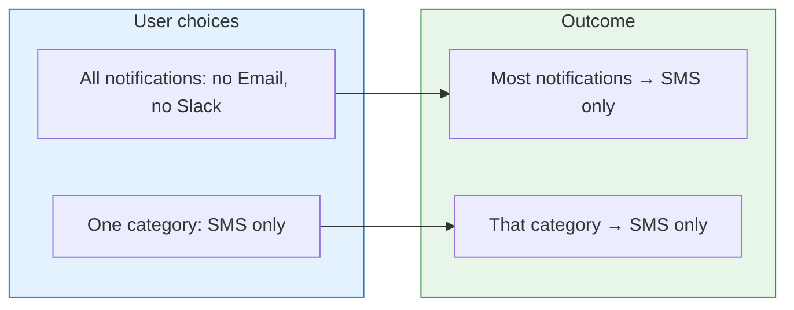
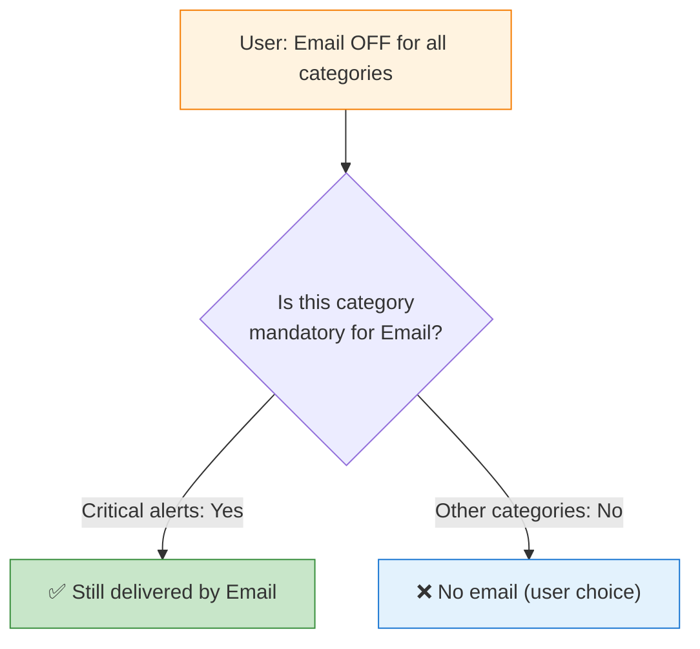
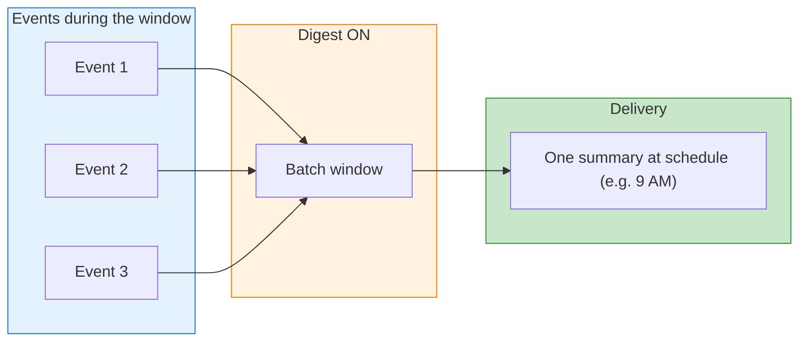
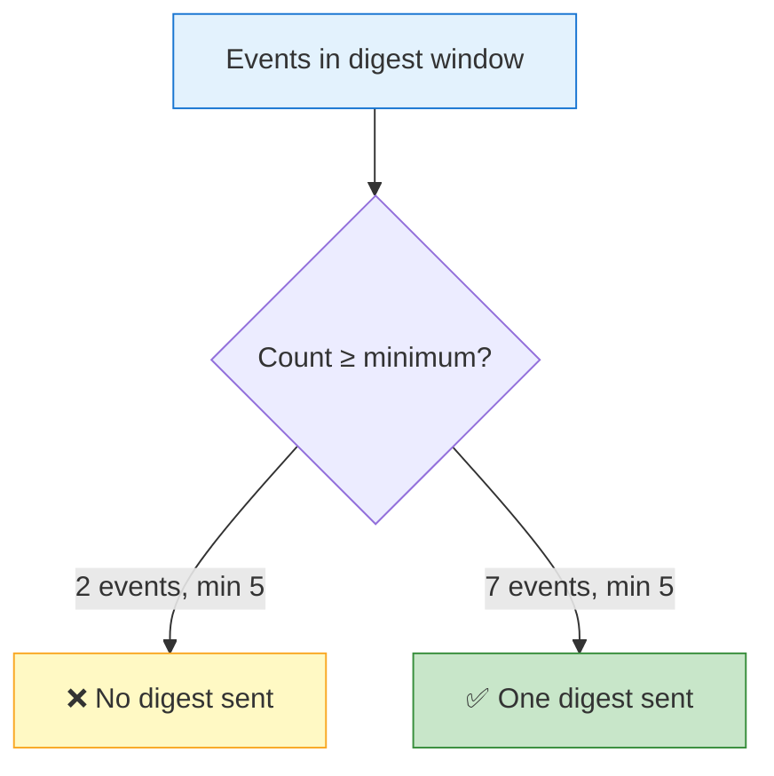
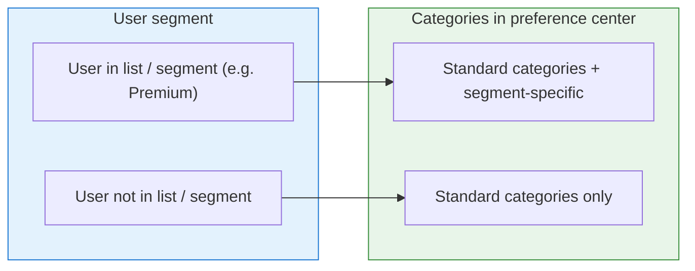

SuprSend supports fine-grained control over notification delivery. This guide describes five concepts in the order they are typically applied:

- **Channel-level preference** — where notifications go (channels)
- **Mandatory channels** — what cannot be turned off
- **Digest** — how events are batched into summaries
- **Threshold** — when those summaries are sent
- **Dynamic list** — who sees which preference options

---

## Channel-level preference

Channel-level preferences determine **where** notifications are delivered—email, SMS, Slack, and other channels. SuprSend supports two levels of control:

- **Global:** A channel can be turned off for all notification categories (e.g. no email, no Slack for any category).
- **Per category:** For a specific notification type (category), certain channels can be opted out while others remain enabled (e.g. reminders via SMS only).

Global settings apply to all categories. Per-category settings apply only to that category. Both levels are evaluated together; per-category choices override global only for that category.

**Example:** A user turns off email and Slack globally but wants one category (e.g. reminders or time-sensitive alerts) via SMS only. Result: most notifications are delivered only by SMS; that one category is also delivered by SMS only, consistent with the per-category choice.

| Level | User choice | Email | SMS | Slack | Result |
|-------|-------------|-------|-----|-------|--------|
| **Global** | Off for Email & Slack | Off | On | Off | All notifications only by SMS (unless overridden per category) |
| **One category** (e.g. reminders) | SMS only | Off | On | Off | That category delivered by SMS only |

**Configuration:**

- **Global channel opt-out:** Use [Update User Channel Preference](/reference/update-user-channel-preference) or the preference center to set channel-level opt-out for the user.
- **Per-category channels:** Set the category to opt-in and specify `opt_out_channels` (e.g. `["email", "slack"]`) for that category so delivery is limited to the desired channel(s).

📘 [User Preferences →](/docs/user-preferences) | [Preference APIs →](/reference/get-user-full-preference)

---

## Mandatory channels

For critical notification types (e.g. security, account safety, compliance), a channel can be marked as **mandatory**. Notifications in that category are always delivered on the mandatory channel—even when the user has turned that channel off globally. Other categories continue to respect the user’s channel preferences.

**Example:** A user has email turned off globally. The platform has a critical-alerts category (e.g. login from new device, password change, compliance notices) with email set as mandatory. Result: critical alerts are still delivered by email; all other categories respect the “no email” choice.

| Category | User global setting | Platform rule | Result |
|----------|---------------------|---------------|--------|
| Critical alerts (e.g. security, account) | Email OFF | Email **mandatory** for this category | Delivered by email |
| Other categories | Email OFF | No mandatory channel | No email (user’s choice) |

<Note>
In the preference center, mandatory channels for that category are shown as disabled; the user cannot turn them off for that category.
</Note>

**Configuration:**

<Steps>
  <Step title="Create sub-category">
    Create a sub-category for the critical notification type (e.g. `system.security-alert` or `system.account-alerts`).
  </Step>
  <Step title="Set mandatory behavior">
    Set the category preference to **“Can’t Unsubscribe”** and configure **mandatory channels** (e.g. Email).
  </Step>
  <Step title="Link workflow">
    Link the workflow to this sub-category so preference evaluation applies to the correct category.
  </Step>
</Steps>

📘 [Manage Categories →](/docs/managing-notification-categories) | [Preference Evaluation →](/docs/preference-evaluation)

---

## Digest

The Digest node batches multiple workflow triggers and sends **one** notification at a scheduled time—either a fixed schedule (e.g. daily at 6 PM) or a dynamic schedule derived from the user profile (e.g. daily at 9 AM in the user’s timezone). Users can opt in or out of the digest for that category.

**Example:** An application generates many similar events (e.g. new comments, status changes, activity). Without a digest, 10 events produce 10 separate notifications. With a digest configured (e.g. daily at 9 AM), those 10 events are batched and one summary is sent at the scheduled time.

| What happens | User setting | Result |
|--------------|--------------|--------|
| 10 events during the day | Digest ON, daily at 9:00 | One summary at 9:00 (e.g. next day) |
| Same 10 events | Digest OFF | 10 separate notifications when they occur |

**Configuration:**

<Steps>
  <Step title="Create sub-category">
    Create a sub-category for the digest (e.g. `engagement.activity-summary`).
  </Step>
  <Step title="Add Digest node">
    Add a **Digest** node in the workflow and link the workflow to this category.
  </Step>
  <Step title="Set schedule">
    Configure a fixed schedule (e.g. daily 6 PM) or a **dynamic** schedule by referencing a user profile property (e.g. `."$recipient".digestTime`). The user’s preferred time can be stored in the profile and used for delivery in the user’s timezone.
  </Step>
</Steps>

📘 [Digest Node →](/docs/digest) | [Dynamic Schedule →](/docs/digest#dynamic-schedule-send-digest-based-on-user-preference)

---

## Threshold

The Digest node can be configured with a **minimum trigger count** (threshold). The digest is sent only when the number of events in the batch window meets or exceeds this minimum. Optionally, a **maximum trigger count** can be set to cap the number of items included in the digest.

**Example:** A daily digest is configured with a minimum trigger count of 5. If 2 events occur in the window, no digest is sent. If 7 events occur, one digest is sent containing those 7 items. With a maximum of 10, 12 events result in a digest containing 10 items.

| Events in window | Min trigger count | Digest sent? |
|------------------|-------------------|--------------|
| 2 | 5 | No |
| 5 | 5 | Yes |
| 12 | 5 (max 10) | Yes, with 10 items (capped) |

<Note>
The threshold is applied only when the user is opted in to the digest category. If the user is opted out, no digest is sent regardless of the event count.
</Note>

**Configuration:**

<Steps>
  <Step title="Configure Digest node">
    In the **Digest** node, set **Min trigger count** (e.g. 5) and optionally **Max triggers** (e.g. 10).
  </Step>
  <Step title="Link workflow to category">
    Link the workflow to the sub-category so opt-in/opt-out is respected during preference evaluation.
  </Step>
</Steps>

📘 [Digest Node →](/docs/digest) | [Min Trigger Count →](/docs/digest#min-trigger-count)

---

## Dynamic list

Categories can be **tagged** (e.g. `premium`, `managers`). When preferences are fetched for the preference center, **tags** can be passed based on the user’s segment (e.g. list membership, role, or plan). Only categories whose tags match the request are returned—so different segments see different preference options. Categories can also be enabled or hidden when a user joins or leaves a list or segment via preference APIs.

**Example:** A category “Weekly summary” is tagged `premium`. When the preference center is loaded for a user in the Premium list, the request includes `tags: ["premium"]`, and “Weekly summary” is included. For a user not in that list, the tag is omitted and the category is not returned.

| User segment | In list / segment? | Categories returned |
|--------------|--------------------|----------------------|
| In segment (e.g. Premium) | Yes | Standard + segment-specific |
| Not in segment | No | Standard only |

**Configuration:**

<Steps>
  <Step title="Tag sub-categories">
    Add **tags** to sub-categories (e.g. `engagement.weekly-summary` with tag `premium`).
  </Step>
  <Step title="Pass tags when fetching preferences">
    When loading the preference center, pass the tags that correspond to the user’s segment (from list membership, role, or plan).
  </Step>
  <Step title="Optional: sync with list events">
    When a user is added to or removed from a list or segment, call the preference APIs to enable or disable the corresponding categories, or omit the tags so the category is no longer returned.
  </Step>
</Steps>

📘 [Lists →](/docs/lists) | [List Events →](/docs/lists#list-events)

---

## Summary

| Concept | Description |
|---------|-------------|
| **Channel-level preference** | Notifications are delivered on the channels selected by the user—globally and/or per category. |
| **Mandatory channels** | For critical categories, a channel is always used for delivery even when the user has turned it off globally. |
| **Digest** | Multiple events are batched and one summary is sent at a scheduled time (fixed or from the user profile). |
| **Threshold** | The digest is sent only when the number of events in the window meets the minimum (and optionally does not exceed the maximum). |
| **Dynamic list** | Different segments see different categories in the preference center, based on tags (list, role, or segment). |

---

## Related documentation

- [User Preferences](/docs/user-preferences) — User-level preference controls
- [Manage Categories and Preferences](/docs/managing-notification-categories) — Categories and defaults
- [Preference Evaluation](/docs/preference-evaluation) — How preferences are evaluated at runtime
- [Digest](/docs/digest) — Digest node and options
- [Lists](/docs/lists) — Lists and list events
