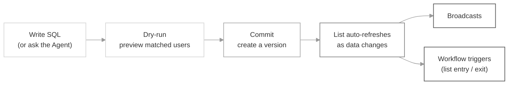

<Note>
  Segment Lists are currently in **beta**. Share feedback on our [Slack community](https://join.slack.com/t/suprsendcommunity/shared_invite/zt-3932rw936-XNWY1RC8bsffh4if4ZyoXQ) or at support@suprsend.com.
</Note>

A **Segment List** is a dynamic list whose membership is defined by a SQL query. You write SQL against the `users` and `events` data you already send to SuprSend, and the list auto-refreshes as your data changes. Also known as *dynamic audiences* or *SQL segments* in other tools.

Traditional lists — CSV uploads, API updates, database sync — need someone to keep membership up to date. Segment Lists close that loop: define the criteria once, and the list stays in sync with your live user and event data. Marketers can describe the segment in plain English and have the SuprSend **Agent** generate the SQL for them; engineers can drop into SQL when the logic can't be expressed as visual filters.

## How it works

You write a SQL query that returns `distinct_id`s. SuprSend runs that query against your workspace's `users` and `events` tables, and everyone the query returns becomes a member of the list. Commit a version, and the list is ready to power broadcasts and workflow triggers.

Two tables are exposed to your SQL:

- **`users`** — one row per user in your workspace, with `distinct_id`, channel arrays (email, phone, push), and your custom user properties as JSON.
- **`events`** — one row per event you've sent to SuprSend, with `event_name`, `distinct_id`, `requested_at`, and the event payload as JSON.

Every commit creates a new immutable version of the segment. The current version is `live`; older versions stay in history and you can roll back to any of them from the dashboard. Rolling back creates a new version — the audit trail is preserved.

Queries are scoped to your workspace by the API key on the request; there is no cross-workspace access.

## When to use Segment Lists

- **High-value re-engagement** — users on the Growth plan in the US who placed 3+ orders in the last 60 days.
- **Behavioral cohorts** — users who triggered `signup_completed` but not `onboarded` in the last 7 days.
- **Property-driven targeting** — Enterprise users in specific countries with lifetime value ≥ $2,500.
- **Recency campaigns** — users who signed up in the last 30 days.
- **Feature announcement audiences** — verified users on a specific plan with a specific integration enabled.

Reach for a Segment List whenever the audience is defined by a *rule* over your live data, not a fixed set of user IDs.

## When NOT to use it

If you already know exactly which users should receive a message (say, a one-off VIP list handed to you as a CSV), a static list is simpler. If your source of truth for a cohort lives in your data warehouse and you don't send that data to SuprSend, use [database sync](/docs/list-sync-via-database) instead.

## Segment Lists vs. other list types

|  | Segment List | Static list (CSV / API) | Database sync |
|---|---|---|---|
| **Best for** | Rules over live SuprSend data | A known, fixed set of users | Cohorts defined in your warehouse |
| **Data source** | `users` + `events` inside SuprSend | Manual upload or SDK/API calls | Your external database |
| **Membership updates** | Auto, as data changes | Manual (each upload or API call) | On a schedule you configure |
| **Setup effort** | Write SQL (or ask the Agent) | Upload / integrate | Set up a database connection |
| **Prerequisites** | None — uses data you already send | None | Warehouse connection configured |
| **Use when** | The audience is a *query* | The audience is a *list of IDs* | The truth lives in your warehouse |

## Key behaviors and constraints

- **Query surface.** SQL runs against exactly two tables: `users` and `events`. Any reference to another table is rejected. See the [full column and function reference](/docs/build-segment-lists#write-your-sql) in the implementation guide.
- **Must return `distinct_id`.** Your `SELECT` must include a `distinct_id` column. Any other columns you select are shown in the dry-run preview but ignored for list membership.
- **Versioning is UI-native.** Committing from the dashboard creates a new version. Older versions stay in history; rollback creates a new version with the old SQL as its content.
- **AI Agent uses schema only.** The SuprSend Agent generates SQL from your table and column names — it does not read user data or event payloads.
- **Workspace-scoped.** The API key on each request determines which workspace's `users` and `events` the query sees. There is no way to query another workspace's data.
- **In-use lists can't be deleted.** If a Segment List is referenced by a workflow or a scheduled broadcast, deletion is blocked until you remove the dependency.

## Next steps

<CardGroup cols={2}>
  <Card title="Build a Segment List" icon="wrench" href="/docs/build-segment-lists">
    Dashboard flow, SQL patterns, sample queries, and how to use the SuprSend Agent.
  </Card>
  <Card title="Send a Broadcast" icon="bullhorn" href="/docs/broadcast">
    Use a committed segment as the audience for a broadcast.
  </Card>
  <Card title="List entry / exit triggers" icon="workflow" href="/docs/design-workflow#1-trigger-node">
    Trigger workflows when users enter or exit a segment.
  </Card>
  <Card title="Create a List API" icon="code" href="/reference/create-list">
    Create a Segment List programmatically.
  </Card>
</CardGroup>
