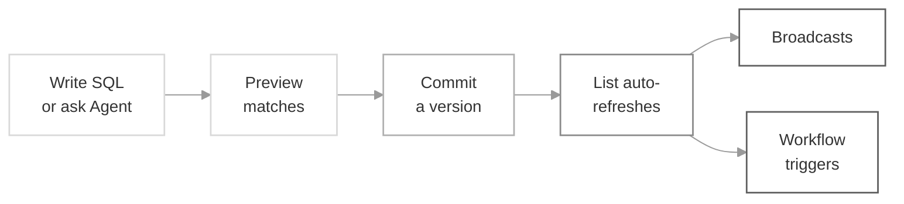

<Note>
  Segment Lists are currently in **beta**. Share feedback on our [Slack community](https://join.slack.com/t/suprsendcommunity/shared_invite/zt-3932rw936-XNWY1RC8bsffh4if4ZyoXQ) or at support@suprsend.com.
</Note>

A **Segment List** is a dynamic [List](/docs/lists) whose membership is defined by a SQL query. You write SQL against the `users` and `events` data you already send to SuprSend, and the list auto-refreshes as your data changes. Also known as *dynamic audiences* or *SQL segments* in other tools.

Define the criteria once, and the list stays in sync with your live user and event data. You can write the SQL yourself, or describe the segment in plain English and let the SuprSend **Agent** generate the query for you.

## How it works

You write a SQL query that returns `distinct_id`s. SuprSend runs that query against your workspace's `users` and `events` tables, and everyone the query returns becomes a member of the list. Commit a version, and the list is ready to power broadcasts and workflow triggers.



Two tables are exposed to your SQL:

- **`users`** — one row per user in your workspace, with `distinct_id`, channel arrays (email, phone, push), and your custom user properties as JSON.
- **`events`** — one row per event you've sent to SuprSend, with `event_name`, `distinct_id`, `requested_at`, and the event payload as JSON.

Every commit creates a new immutable version of the segment. The current version is `live`; older versions stay in history and you can roll back to any of them from the dashboard. Rolling back creates a new version — the audit trail is preserved. Queries are scoped to your workspace by the API key on the request; there is no cross-workspace access.

---

## Setting up a segment

### 1. Create the list

Go to **Lists → New List**. In the source picker, select **Segment List**.

<Frame>
  
</Frame>

Enter a `list_id`, and optionally a name and description. The `list_id` is the stable identifier you'll reference from the API and workflows.

| Field | Rules |
|---|---|
| `list_id` | Required. Unique within the workspace. Allowed characters: lowercase letters, digits, hyphens, and underscores. |
| Name | Optional. Display name for the list. |
| Description | Optional. Additional context to help you understand the list's purpose or the users it contains. |

<Frame>
  
</Frame>

### 2. Write your SQL or generate it with AI

After the list is created, you land in the **Segment Builder** — a SQL editor on the left, a schema panel on the right, and a **Generate with AI** button in the toolbar. Write the SQL yourself using the reference below, or click **Generate with AI** and describe the segment in plain English.

<Frame>
  
</Frame>

Segment SQL runs against two tables — `users` and `events` — using a PostgreSQL- and ClickHouse-compatible dialect.

#### Generate SQL with the SuprSend Agent

Click **Generate with AI** in the builder toolbar and describe the segment in plain English — e.g. *"Growth-plan users in the US who placed 3+ orders in the last 60 days"*. The Agent returns SQL plus a plain-English summary; click **Use this SQL** to insert it at the cursor, then edit as needed.

<Tip>
  The Agent references your user and event **schemas** to figure out which properties to use — it never reads your actual user data or event payloads. Always dry-run and inspect the sample rows before committing.
</Tip>

#### Auto-generated user schema

Open **Developers → Schemas → Users** to view every tracked user property with its inferred type and description. Descriptions are the strongest signal the Agent has when two properties are similarly named (`plan` vs. `plan_tier`, `country` vs. `billing_country`) — edit any description inline to give the Agent better context for future SQL generations. The schema is generated from the `users` table in your workspace and refreshes every **3 hours**, so properties added since the last refresh are picked up on the next cycle, and your description edits persist across refreshes.

<Frame>
  
</Frame>

For event properties, [link a JSON schema to each event](/docs/validate-workflow-payload#linking-schema-to-workflow) so the Agent understands your event payload shape too.

#### Available tables

<Tabs>
  <Tab title="users">
    One row per user in your workspace.

    | Column | Type | Notes |
    |---|---|---|
    | `distinct_id` | string | The canonical user identifier. **Required in every SELECT.** |
    | `created_at` | timestamp | When the user profile was created. |
    | `updated_at` | timestamp | Last profile update. |
    | `language` | string | e.g. `en`. |
    | `locale` | string | e.g. `en-US`. |
    | `timezone` | string | e.g. `America/New_York`. |
    | `user_properties` | JSON | Your custom user properties (plan, country, LTV, tags, nested objects, etc.). |
    | `active_channels` | array\<string\> | Currently active channels on the profile (e.g. `["email","sms"]`). |
    | `active_emails` | array\<string\> | Currently active email addresses. |
    | `active_phone_numbers` | array\<string\> | Currently active phone numbers. |
  </Tab>
  <Tab title="events">
    One row per event you've sent to SuprSend.

    | Column | Type | Notes |
    |---|---|---|
    | `distinct_id` | string | User who triggered the event. |
    | `event_name` | string | Event name, always uppercase — e.g. `ORDER_PLACED`, `SIGNUP_COMPLETED`. |
    | `requested_at` | timestamp | When SuprSend received the event. **Required in `WHERE`.** |
    | `status` | enum | `success` or `failure`. |
    | `properties` | JSON | The event properties passed in the payload. Agent uses event schema to understand the structure of these properties. |
    | `payload` | JSON | The full event payload you sent to SuprSend. |
    | `response` | JSON | SuprSend's processing response for the event. |
    | `tenant_id` | string | Tenant scope, if the event was tenant-scoped. |
  </Tab>
</Tabs>

#### Query Recommendations

A few things to keep in mind for accurate, efficient queries:

- **Always return `distinct_id`.** It's how membership is resolved, so include it in your SELECT. Other columns still show up in the dry-run preview, but don't affect who ends up in the list.
- **Select only the columns you need.** Prefer named columns over `SELECT *` — it keeps the query fast and skips large JSON fields (like `user_properties` or the event `payload`) you don't actually use.
- **Query only `users` and `events`.** These are the only two tables available; references to anything else are rejected.
- **Match event names in uppercase.** `event_name` is stored in caps, so filter with `event_name = 'ORDER_PLACED'`, not `'order_placed'` — a lowercase match returns no rows.
- **Mind JSON key casing.** Keys are case-sensitive, so `properties ->> 'Amount'` isn't the same as `properties ->> 'amount'`.
- **No need to scope by workspace.** There's no `workspace_id` column to set — a query only reads data from the workspace you're building it in.

#### Supported SQL

The dialect is PostgreSQL- and ClickHouse-compatible. For every supported function and query feature — organized by category, each with syntax, arguments, and an example — see the [Segment SQL reference](/docs/sql-query-clauses).

#### Sample queries

<Tabs>
  <Tab title="User property filters">
    ```sql Users on the enterprise plan in the US region
    SELECT distinct_id
    FROM users
    WHERE user_properties ->> 'plan' = 'enterprise'
      AND user_properties -> 'address' ->> 'country' = 'US'
    ```

    ```sql Users tagged as VIP (where tags is an array)
    SELECT distinct_id
    FROM users
    WHERE 'vip' = ANY(user_properties -> 'tags')
    ```

    ```sql Users with atleast 1 active email channel
    SELECT distinct_id
    FROM users
    WHERE array_length(active_emails, 1) > 0
    ```

    ```sql Users with lifetime value of $2,500 or more
    SELECT distinct_id
    FROM users
    WHERE CAST(user_properties ->> 'lifetime_value' AS DOUBLE PRECISION) >= 2500
    ```

    ```sql Users whose subscription has 50 or more seats
    SELECT distinct_id
    FROM users
    WHERE CAST(user_properties -> 'subscription' ->> 'seats' AS INT) >= 50
    ```

    ```sql Verified VIP users on the enterprise plan from selected countries
    SELECT distinct_id
    FROM users
    WHERE user_properties ->> 'plan' = 'enterprise'
      AND user_properties @> '{"is_verified":true}'
      AND 'vip' = ANY(user_properties -> 'tags')
      AND user_properties -> 'address' ->> 'country' IN ('US','GB','IN','CH','PT')
    ```
  </Tab>
  <Tab title="Event-based">
    ```sql Users who signed up in the last 30 days
    SELECT DISTINCT distinct_id
    FROM events
    WHERE event_name = 'SIGNUP_COMPLETED'
      AND requested_at >= NOW() - INTERVAL '30 days'
    ```

    ```sql Users who imported over 5,000 records in the last 7 days
    SELECT DISTINCT distinct_id
    FROM events
    WHERE event_name = 'DATA_IMPORTED'
      AND requested_at >= NOW() - INTERVAL '7 days'
      AND CAST(properties ->> 'record_count' AS DOUBLE PRECISION) > 5000
    ```

    ```sql Users who started a trial but didn't upgrade in the last 3 days
    SELECT DISTINCT distinct_id
    FROM events
    WHERE event_name = 'TRIAL_STARTED'
      AND requested_at >= NOW() - INTERVAL '3 days'
      AND distinct_id NOT IN (
        SELECT distinct_id FROM events
        WHERE event_name = 'PLAN_UPGRADED'
          AND requested_at >= NOW() - INTERVAL '3 days'
      )
    ```

    ```sql Users who integrated the Slack agent in the last 14 days
    SELECT DISTINCT distinct_id
    FROM events
    WHERE event_name = 'AGENT_INTEGRATED'
      AND requested_at >= NOW() - INTERVAL '14 days'
      AND properties @> '{"agent":"slack"}'
    ```
  </Tab>
  <Tab title="Compound (user + event)">
    ```sql Users on the growth plan with 3 or more orders in the last 60 days
    SELECT DISTINCT e.distinct_id
    FROM events e
    JOIN users u ON e.distinct_id = u.distinct_id
    WHERE e.event_name = 'ORDER_PLACED'
      AND e.requested_at >= NOW() - INTERVAL '60 days'
      AND u.user_properties ->> 'plan' = 'growth'
    GROUP BY e.distinct_id
    HAVING count(*) >= 3
    ```

    ```sql Enterprise users in the US active in the last 30 days
    SELECT DISTINCT e.distinct_id
    FROM events e
    JOIN users u ON e.distinct_id = u.distinct_id
    WHERE e.requested_at >= NOW() - INTERVAL '30 days'
      AND u.user_properties ->> 'plan' = 'enterprise'
      AND u.user_properties -> 'address' ->> 'country' = 'US'
    ```
  </Tab>
</Tabs>

### 3. Dry-run to preview matched users

Click **Run query** (or press `Cmd/Ctrl + Enter`) to execute a dry-run. The dry-run panel shows the total count of matched users, the first 10 matched rows so you can spot-check the segment, and the exact error if the SQL is invalid.

The two API calls under the hood:

<CodeGroup>
```bash Dry-run (sample rows)
curl -X POST 'https://hub.suprsend.com/v1/subscriber_list/~/dry_run/' \
  -H 'Authorization: Bearer YOUR_WORKSPACE_KEY' \
  -H 'Content-Type: application/json' \
  -d '{
    "query": "SELECT distinct_id, active_emails FROM users LIMIT 40"
  }'
```

```bash Dry-run (count only)
curl -X POST 'https://hub.suprsend.com/v1/subscriber_list/~/dry_run/count/' \
  -H 'Authorization: Bearer YOUR_WORKSPACE_KEY' \
  -H 'Content-Type: application/json' \
  -d '{
    "query": "SELECT distinct_id FROM users WHERE user_properties ->> '\''plan'\'' = '\''enterprise'\''"
  }'
```
</CodeGroup>

Response for the sample-rows call:

```json 200
{
  "data": [
    { "distinct_id": "u_8f21ac", "active_emails": ["maya.chen@acme.co"] },
    { "distinct_id": "u_2c11ef", "active_emails": ["jordan@northwind.io"] }
  ]
}
```

Response for the count call:

```json 200
{
  "count": 4812
}
```

### 4. Commit the segment

Committing makes your segment live and users start syncing into the list immediately. The first sync runs right after you commit, and the list keeps refreshing as your data changes. Each commit is stored as an immutable version, and any broadcast or workflow trigger that references this list uses the live version.

You can commit without running a dry-run first, though it's good practice to preview the matched users and confirm they look right before you do. Add an optional commit message describing what changed — e.g. *"Expanded to 5 countries; 60-day order window."* — and confirm. The message shows up in **Version History**.

<Frame>
  
</Frame>

#### Create a segment via the API

You can also create a Segment List directly through the API, with the SQL as the initial query. A segment created via the API is committed automatically — it goes live and starts syncing as soon as the request succeeds, with no separate commit step.

```bash cURL
curl -X POST 'https://hub.suprsend.com/v1/subscriber_list/' \
  -H 'Authorization: Bearer YOUR_WORKSPACE_KEY' \
  -H 'Content-Type: application/json' \
  -d '{
    "list_id": "high_ltv_q1",
    "list_type": "dynamic_list",
    "query": "SELECT distinct_id FROM users WHERE CAST(user_properties ->> '\''lifetime_value'\'' AS DOUBLE PRECISION) >= 2500",
    "is_enabled": true
  }'
```

See [Create a List](/reference/create-list) for the full request/response contract.

### 5. Trigger notifications to the segment

Once the segment is committed, you can use it anywhere lists are supported.

<Tabs>
  <Tab title="Broadcast">
    Send the same notification to everyone in the segment — click **Run Broadcast** from the list's details page, or trigger it via the [API](/docs/broadcast). SuprSend refreshes the segment right before sending, so it reaches the users who satisfy the filters at the time of sending.

    <CodeGroup>
    ```bash cURL
    curl -X POST "https://hub.suprsend.com/{workspace_key}/broadcast/" \
      --header 'Authorization: Bearer __YOUR_API_KEY__' \
      --header 'Content-Type: application/json' \
      --data '{
        "list_id": "high_ltv_q1",
        "template": "product-update-announcement",
        "notification_category": "promotional",
        "channels": ["email"],
        "data": { "product_name": "Premium Plan" }
      }'
    ```

    ```javascript Node.js
    const { Suprsend, SubscriberListBroadcast } = require("@suprsend/node-sdk");

    const supr_client = new Suprsend("workspace_key", "workspace_secret");

    const broadcast_body = {
      list_id: "high_ltv_q1",
      template: "product-update-announcement",
      notification_category: "promotional",
      channels: ["email"],
      data: { product_name: "Premium Plan" },
    };

    const broadcast_instance = new SubscriberListBroadcast(broadcast_body);
    supr_client.subscriber_lists
      .broadcast(broadcast_instance)
      .then((res) => console.log("response", res));
    ```

    ```python Python
    from suprsend import Suprsend, SubscriberListBroadcast

    supr_client = Suprsend("workspace_key", "workspace_secret")

    broadcast_body = {
        "list_id": "high_ltv_q1",
        "template": "product-update-announcement",
        "notification_category": "promotional",
        "channels": ["email"],
        "data": {"product_name": "Premium Plan"},
    }

    inst = SubscriberListBroadcast(body=broadcast_body)
    resp = supr_client.subscriber_lists.broadcast(inst)
    print(resp)
    ```

    ```java Java
    import org.json.JSONObject;
    import suprsend.Suprsend;
    import suprsend.SubscriberListBroadcast;

    Suprsend suprsendClient = new Suprsend("workspace_key", "workspace_secret");

    JSONObject body = new JSONObject()
        .put("list_id", "high_ltv_q1")
        .put("template", "product-update-announcement")
        .put("notification_category", "promotional")
        .put("data", new JSONObject().put("product_name", "Premium Plan"));

    SubscriberListBroadcast broadcastIns = new SubscriberListBroadcast(body);
    JSONObject res = suprsendClient.subscriberLists.broadcast(broadcastIns);
    System.out.println(res);
    ```

    ```go Go
    package main

    import (
        "context"
        "log"

        suprsend "github.com/suprsend/suprsend-go"
    )

    func main() {
        suprClient, err := suprsend.NewClient("workspace_key", "workspace_secret")
        if err != nil {
            log.Fatalln(err)
        }
        ctx := context.Background()

        broadcastIns := &suprsend.SubscriberListBroadcast{
            Body: map[string]interface{}{
                "list_id":               "high_ltv_q1",
                "template":              "product-update-announcement",
                "notification_category": "promotional",
                "channels":              []string{"email"},
                "data":                  map[string]interface{}{"product_name": "Premium Plan"},
            },
        }
        res, err := suprClient.SubscriberLists.Broadcast(ctx, broadcastIns)
        if err != nil {
            log.Fatalln(err)
        }
        log.Println(res)
    }
    ```
    </CodeGroup>
  </Tab>
  <Tab title="Workflow">
    Run a workflow when users enter or exit the segment (welcome flows on entry, retention flows on exit) — add a **List entry / exit** [trigger node](/docs/design-workflow#1-trigger-node) in the workflow builder, or create it via the [management API](/reference/create-update-workflow) with `trigger_type: event`. The `$USER_ENTERED_LIST - <list_id>` / `$USER_EXITED_LIST - <list_id>` events fire automatically as users are added or removed from the list.

    ```bash cURL
    curl -X POST "https://management-api.suprsend.com/v1/{workspace}/workflow/welcome-segment-members/" \
      --header 'Authorization: ServiceToken <token>' \
      --header 'Content-Type: application/json' \
      --data '{
        "name": "Welcome new segment members",
        "category": "promotional",
        "trigger_type": "event",
        "trigger_events": ["$USER_ENTERED_LIST - high_ltv_q1"],
        "tree": {
          "nodes": [
            {
              "name": "Send Email",
              "node_type": "send_email",
              "properties": { "template": "welcome-email-template" }
            }
          ]
        }
      }'
    ```
  </Tab>
</Tabs>

---

## Versioning and rollback

Every commit creates a new version. The current version is `live`; older versions stay in **Version History** on the list detail page.

Open **Version History** to see every version and its SQL. To revert, pick an older version and click **Rollback to this version** — it becomes the new live version.

<Frame>
  
</Frame>

---

## Enable or disable a segment

A segment is enabled the moment you commit it. Toggle it off from the 3 dots menu on the list detail page — the segment stops refreshing but the query and version history stay intact, so you can turn it back on later. Existing memberships remain in place while disabled, so a manually-triggered broadcast can still send to the last-known members.

---

## Troubleshooting

<AccordionGroup>
  <Accordion title="Query timed out">
    The dry-run couldn't complete in the allowed time. Simplify: narrow the time window on `events`, add more selective filters, avoid `SELECT` with many columns, and add a `LIMIT`. Then re-run.
  </Accordion>
  <Accordion title="Missing distinct_id in SELECT">
    A red banner appears under the editor: *"Missing distinct_id. Query results must include a `distinct_id` column to sync users to the list."* Commit is blocked until the SELECT is fixed.
  </Accordion>
  <Accordion title="Query returns zero users">
    Commit is allowed — the segment simply has no members until data changes and someone matches. The dashboard shows a `0 users matched` indicator with a suggestion to adjust filters.
  </Accordion>
  <Accordion title="Selecting extra columns alongside distinct_id">
    Extra columns show up in the dry-run preview so you can spot-check the data. They do not affect list membership — only `distinct_id` is used to sync users into the list.
  </Accordion>
  <Accordion title="Navigating away with unsaved changes">
    Save your query before leaving — any unsaved changes are lost if you exit without saving. A saved draft is preserved and re-loaded next time you open the builder, and doesn't become live until you commit.
  </Accordion>
  <Accordion title="AI Agent generated a query that doesn't return anything">
    Two common causes: (1) a column name in the Agent's SQL doesn't match your workspace's schema — check the schema panel and correct the identifier; (2) the time window is too narrow. Adjust and re-run. The Agent uses your schema but it can still make plausible-looking mistakes.
  </Accordion>
</AccordionGroup>

---

## Next steps

<CardGroup cols={2}>
  <Card title="Send a Broadcast" icon="bullhorn" href="/docs/broadcast">
    Use a Segment List as the audience for a one-shot campaign.
  </Card>
  <Card title="Setup Workflow on List entry/exit" icon="diagram-project" href="/docs/design-workflow#1-trigger-node">
    Trigger workflows when users enter or exit a segment.
  </Card>
</CardGroup>
