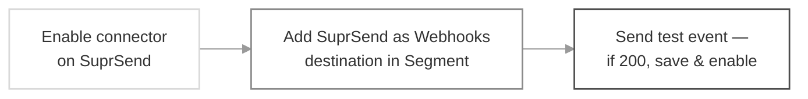
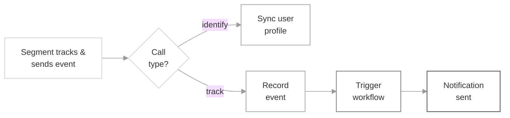

If you already use Segment as your customer data platform, this integration lets you reuse that data to power notifications, so you don't have to rebuild your user base or event tracking from scratch. SuprSend automatically syncs your users and their events from Segment, keeping profiles up to date and letting you trigger SuprSend workflows directly from the events your product is already sending to Segment.

The setup has two parts: 
- First you define how Segment users and events map to SuprSend
- Then you connect Segment to SuprSend as a webhook destination. Once live, your `identify` and `track` calls flow through automatically. *(Click any step below to jump to its section.)*

**Setup flow**



**How data flows from segment to SuprSend**



## Connector setup on SuprSend

On SuprSend dashboard, Navigate to **Connectors** tab and Select **Segment** and enable it.

<Frame caption="Segment integration settings on SuprSend">
  
</Frame>

Next setup how events and users will be mapped to segment events inside SuprSend.

### 1. Event mapping

By default, events sync to SuprSend exactly as they are named in your Segment `track` call — the event name is passed through unchanged. You don't need to configure anything here for events to flow through.

**Adding a prefix is an optional setting** (off by default). Turn it on only if you send the *same* event to SuprSend from more than one source — for example, from both the SuprSend SDK and Segment — and want to tell them apart. When enabled, SuprSend prepends `segment : ` to every event name coming from Segment.

For example, given this [Segment track](https://segment.com/docs/connections/spec/track/) call:

<CodeGroup>
  ```javascript javascript
  {
    "type": "track",
    "event": "User Registered",
    "properties": {
      "plan": "Pro Annual",
      "accountType" : "Facebook"
    }
  }
  ```
</CodeGroup>

Only the `event_name` changes — the properties are synced as-is either way:

<CodeGroup>
  ```javascript Default (prefix off)
  event_name = "User Registered"

  properties = {
    "plan": "Pro Annual",
    "accountType" : "Facebook"
  }
  ```

  ```javascript Prefix enabled
  event_name = "segment : User Registered"

  properties = {
    "plan": "Pro Annual",
    "accountType" : "Facebook"
  }
  ```
</CodeGroup>

### 2. User mapping

Users are synced to SuprSend from your [Segment identify](https://segment.com/docs/connections/spec/identify/) calls. Every identify call **must include a `userId`** — it is mandatory. Segment's `userId` maps to the user's `distinct_id` in SuprSend and is what ties the profile (and its events) together, so calls without a `userId` can't be attributed to a user (see [Handling anonymous users](#handling-anonymous-users)).

All properties inside `traits` are synced as user properties. For example, this Segment `identify` call:

<CodeGroup>
  ```javascript Segment identify call
  {
    "type": "identify",
    "traits": {
      "name": "Peter Gibbons",
      "email": "peter@example.com",
      "language": "hi",
      "timezone": "Asia/Kolkata",
      "plan": "premium",
      "logins": 5
    },
    "userId": "97980cfea0067"
  }
  ```

  ```javascript Synced user in SuprSend
  distinct_id = "97980cfea0067"

  properties = {
    "name": "Peter Gibbons",
    "email": "peter@example.com",
    "language": "hi",
    "timezone": "Asia/Kolkata",
    "plan": "premium",
    "logins": 5
  }
  ```
</CodeGroup>

By default, every trait syncs to SuprSend as a **custom property**. To set SuprSend's **reserved properties** — like `$locale`, `$timezone`, or channel values (`$email`, `$sms`, `$whatsapp`, …) — you map the corresponding Segment trait explicitly in the connector form fields:

- **User preference mapping** — map traits to reserved profile fields such as **Locale** (`$locale`) and **Timezone** (`$timezone`). For example, mapping the `language` trait to Locale means the value in `language` (`hi` above) becomes the user's preferred language.
- **User channel mapping** — map each SuprSend channel to the Segment trait that carries its value. Channels are **not** mapped automatically; you must define each one here for it to work. Use the channel keys below:

<Frame caption="Reserved property and channel mapping in Segment connector settings">
  
</Frame>

<Warning>
  Locale is stored in ISO 639-1 standard language codes. If you pass a value that isn't in this format, it will be ignored. You can refer to all the [language codes here](https://github.com/suprsend/suprsend-py-sdk/blob/v0.12.0/src/suprsend/language_codes.py).
</Warning>

<Warning>
  **Mapping changes apply to future syncs only**

  Any changes to channel or preference mapping apply only to future user syncs — to update existing users, replay their past syncs. Channel values are never overridden: a changed email (or any channel) is appended to the user's channel list, and notifications go to both the old and new value so no communication is lost.
</Warning>

Now that the desired mapping of Segment events and users in SuprSend has been established, the next step is to start Segment integration.

## Setting up data sync from Segment to SuprSend

You'll have to configure SuprSend as a destination in Segment.

<Info>
  **Use webhooks destination to connect with SuprSend**

  Since, we are in beta and we don't have a first-party integration with Segment yet, you can use webhooks in Segment destination list to connect with SuprSend.
</Info>

Follow below steps to configure SuprSend Destination in Segment:

<Steps>
  <Step title="Add SuprSend as destination in your segment account">
    1. Login to your Segment account. Select **Connections**-> **Destinations** from the side navigation menu and click on **"Add Destination"**

    <Frame>
      
    </Frame>
  </Step>

  <Step title="Search for webhook">
    This will open destinations catalog. Search for webhook and select **"Webhooks (Actions)"**

    <Frame>
      
    </Frame>
  </Step>

  <Step title="Add Destination">
    On the Webhooks page, click on **"Add destination"**

    <Frame>
      
    </Frame>
  </Step>

  <Step title="Pick Data Source">
    Select the data source from which you are syncing your user and event data and click on "Next"
  </Step>

  <Step title="Add Destination Name">
    On the setup screen, add Destination name. Destination name can be **"SuprSend \{workspace}"**. For example- For staging workspace, the destination name can be "SuprSend Staging". Choose **"Fill in settings manually"** and click on **"Create destination"**.

    <Frame>
      
    </Frame>
  </Step>

  <Step title="Create a New Mapping">
    Now, on your webhook destination page, go to **Mappings** tab and create a **+New Mapping**.

    <Frame>
      
    </Frame>
  </Step>

  <Step title="Send an HTTP Request">
    Select **Send an HTTP request** in Add Mapping modal and add below details

    <Frame>
      
    </Frame>
  </Step>

  <Step title="Add below mapping in the send request:">
    * Select any of event type- track and identify

      <Frame>
        
      </Frame>

    * In Add test event, select **Load Test Event from Source**

      <Frame>
        
      </Frame>

    * In Select Mappings, add below details:

    > URL: [https://hub.suprsend.com/connector/segment/](https://hub.suprsend.com/connector/segment/)
      <br/> Method: `POST`
      <br/>`Authorization` in headers: `Bearer _api_key_`(Please make sure to replace "*`api_key`*" with actual api key from segment connector settings page.)

    <Frame>
      
    </Frame>
  </Step>

  <Step title="Sending Test Event">
    Now, send a test event of type `track` or `identify`. You'll see status `200 OK` response and the corresponding event on [SuprSend dashboard -> API logs](https://app.suprsend.com/en/staging/logs/api/?last_n_minutes=1440) page.

    <Frame>
      
    </Frame>

    <Warning>
      Callout ContentIf you don't get `200 OK` response in event tester, this means that Segment was unable to successfully setup your SuprSend connection. Double check Webhook URL and header in step-7 and see if its configured correctly in the Destination settings.
    </Warning>

    Once your SuprSend connection is successful, try sending a test `identify call` and see if the user channels are mapped correctly in SuprSend. You can see the synced user on [*SuprSend dashboard -> Subscribers*](https://app.suprsend.com/en/staging/subscribers/subscribers/) page. Also, send a test `track event` call and check if the workflows are getting triggered.
  </Step>

  <Step title="Enable Mapping">
    1. After successful testing, **Save and Enable** the mapping.

    <Frame>
      
    </Frame>
  </Step>

  <Step title="Enable Destination in Settings ">
    Also enable destination in Settings tab to start sending webhook data to SuprSend.

    <Frame>
      
    </Frame>
  </Step>
</Steps>

Your setup is now complete, enabling events and users data to flow from Segment to SuprSend. You can use this info to automatically power SuprSend workflows without making any changes in your codebase.

### Handling anonymous users

SuprSend's Segment integration requires a `userId` on every event. Segment's `userId` is what maps to the user's `distinct_id` in SuprSend, so events that carry only an `anonymousId` (anonymous `identify`, `track`, or `page` calls) can't be attributed to a user and aren't supported.

The cleanest way to handle this is to stop anonymous events at Segment so they never reach SuprSend. There are two ways to do this, depending on your Segment plan.
<br/>

**Option 1: Add a trigger condition on the mapping (recommended, all plans)**

This tells Segment to fire the SuprSend mapping only when a `userId` is present, so anonymous events are skipped before they're sent.

<Steps>
  <Step title="Open your SuprSend mapping">
    In Segment, go to **Connections** → **Destinations** and select your SuprSend (Webhooks) destination. Open the **Mappings** tab and edit the mapping you created during setup.
  </Step>

  <Step title="Add a userId condition to the trigger">
    In the **Select events to map and send** step (the event trigger), add a condition alongside your existing event-type condition:

    > **Field:** `userId`
    > <br /> **Condition:** `exists`

    Your trigger should now read like: *Event Type is `track` or `identify`* **and** *`userId` exists*. Segment will only forward events that match, so anonymous (`anonymousId`-only) calls are dropped.
  </Step>

  <Step title="Test the condition">
    Use **Load Test Event from Source** (or paste a sample) to confirm the condition matches the events you expect. Test with both an identified event and an anonymous one to verify the anonymous event no longer matches.
  </Step>

  <Step title="Save and enable">
    **Save and enable** the mapping. The condition takes effect for events sent from this point onward.
  </Step>
</Steps>

<Warning>
  Trigger conditions are **case-sensitive** (`userId`, not `userid`).

  If you're on a Segment **self-service** plan, a trigger supports a maximum of **2 conditions**. *Event Type is `identify`* + *`userId` exists* fits within that limit; if you need more conditions than your plan allows, use Option 2 instead.
</Warning>


**Option 2: Add a Destination Filter (Segment Business Tier)**

A Destination Filter drops any event without a `userId` across all mappings on the SuprSend destination. This option is available only on Segment **Business Tier** workspaces.

<Steps>
  <Step title="Open the Filters tab">
    Go to **Connections** → **Destinations**, select your SuprSend destination, and open the **Filters** tab. Click **+ New Filter**.
  </Step>

  <Step title="Configure the rule">
    Set the filter to drop events that have no `userId`:

    > **Condition:** `userId` `is null`
    > <br /> **Action:** Drop the event

    A missing `userId`, as on an anonymous call, evaluates as `null` and is dropped.
  </Step>

  <Step title="Test with a sample event">
    Click **Load Sample Event** and paste an anonymous `identify` payload to confirm it gets filtered out:

    <CodeGroup>
      ```json anonymous identify theme={"system"}
      {
        "type": "identify",
        "anonymousId": "507f191e810c19729de860ea",
        "traits": {
          "email": "peter@example.com"
        },
        "timestamp": "2026-01-01T00:00:00.000Z"
      }
      ```
    </CodeGroup>
  </Step>

  <Step title="Name, enable, and save">
    Click **Next Step**, name the filter (for example, *Drop events without userId*), toggle it **on**, and click **Save**.
  </Step>
</Steps>

You can also create the same filter programmatically with the [Segment Public API](https://docs.segmentapis.com/tag/Destination-Filters/). The FQL condition `length( userId ) < 1` is slightly more robust than the UI's `is null` because it also drops events where `userId` is an empty string:

<CodeGroup>
  ```json destination filter API theme={"system"}
  {
    "sourceId": "<SOURCE_ID>",
    "destinationId": "<SUPRSEND_DESTINATION_ID>",
    "title": "Drop events without userId",
    "description": "Anonymous users are not supported by SuprSend",
    "if": "length( userId ) < 1",
    "actions": [
      { "type": "DROP" }
    ],
    "enabled": true
  }
  ```
</CodeGroup>

<Warning>
  A few things to keep in mind with Destination Filters:

  * Filters only apply to events sent **after** the filter is set up. Right after enabling, you may still see a few anonymous events arrive — these are retries of events that failed before the filter existed.
  * Conditions are **case-sensitive**. Test before enabling.
  * Filtered events appear on the schema page but aren't counted in the destination's event delivery graphs, so dropped anonymous events won't show up as failures.
</Warning>


**What happens if an anonymous event still reaches SuprSend**

If an anonymous event is sent without being filtered, SuprSend rejects it with an HTTP **`400 Bad Request`** and an error message indicating that a `userId` is required. Segment records this as a **discarded** event and does **not** retry it, so a missing `userId` won't cause repeated failed deliveries. Filtering at the source (Option 1 or 2) is still recommended, as it keeps these events out of your delivery metrics entirely.

***