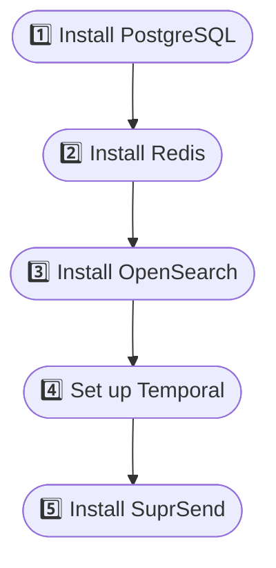
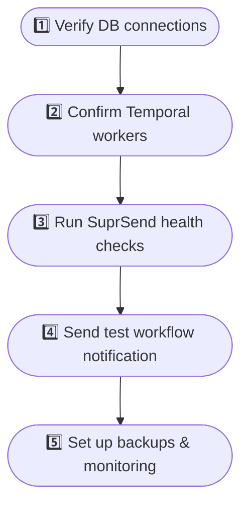

This comprehensive guide will walk you through setting up SuprSend in your own infrastructure.

<Tip>
For production deployments, we recommend using managed services for databases and queues to ensure high availability and performance.
</Tip>

## Deployment Checklist

<Columns cols={2}>

### Installation Steps

### Final Checklist

</Columns>

### Step 1: PostgreSQL Installation

PostgreSQL serves as the primary data store for SuprSend. For production deployments, we recommend using a managed PostgreSQL service. For development or testing, you can deploy PostgreSQL using Helm. Refer [setup guide](/docs/self-hosted/setup-dependencies/postgres).

### Step 2: Redis Setup

Redis provides high-performance caching and session management. You'll have to setup 2 redis instances (both external):
- **Shared Redis**: Shared across all SuprSend services for cahing purpose
- **Workflow state management Redis**: Keeps cache of workflow execution details and its execution history

This is done to ensure that delay in any service doesn't impact your notifications delivery. Refer [setup guide](/docs/self-hosted/setup-dependencies/redis).

### Step 3: OpenSearch Installation

OpenSearch acts as DB store for Inbox notifications. SuprSend recommends using a managed OpenSearch service (AWS OpenSearch, GCP Elastic, or Azure Elastic) for production environments to reduce operational overhead and ensure high availability.

However, for self‑managed or air‑gapped environments, you can deploy OpenSearch directly in Kubernetes using the OpenSearch Operator. Refer [Installation guide](/docs/self-hosted/setup-dependencies/opensearch).

### Step 4: Temporal Installation

Temporal is your workflow exection engine and interim state management layer. Refer [Setup Guide](/docs/self-hosted/setup-dependencies/temporal).

### Step 5: SuprSend Application Deployment

You can install and setup SuprSend Application in your host using the helm chart provided [here](https://byoc.suprsend.com/install/suprsend). This will install suprsend package and it's bundled dependencies in your infra. Once setup, you can access SuprSend dashboard and start testing the product.

---

## Post-Deployment Checklist

1. **Access the Dashboard**: Navigate to `https://your-domain.com/dashboard`
2. **Create Admin Account**: Set up your first admin user
3. **Configure Channels**: Set up email, SMS, and push notification providers
4. **Configure Webhooks**: Set up webhook endpoints in your vendor for getting real-time logs in SuprSend dashboard
5. **Test Notifications**: Create your first workflow and send a test notification from the dashboard or API to test a notification flow.
6. **(Optional) Set Up WorkOS SSO**: Enable enterprise SSO, social logins, or SAML for dashboard authentication. See [WorkOS Integration Guide](/docs/workos-integration).

#### Verify if the following services or connections are properly working

- [ ] Dashboard accessible via HTTPS
- [ ] API endpoints responding correctly
- [ ] Database connections established
- [ ] Redis caching working
- [ ] OpenSearch indexing notifications
- [ ] Temporal workflows executing
- [ ] Email notifications sending
- [ ] SMS notifications sending (if configured)

Once your setup is working, you can navigate SuprSend dashboard and start testing your product usecases. Here's a test sheet with all usecases to test your deployment.
<Card title="Download Test Sheet" icon="download" iconType="solid" href="/images/SuprSend-Self-hosted-Installation-Checklist.xlsx">
  Download the test sheet for checking if your installation is working.
</Card>