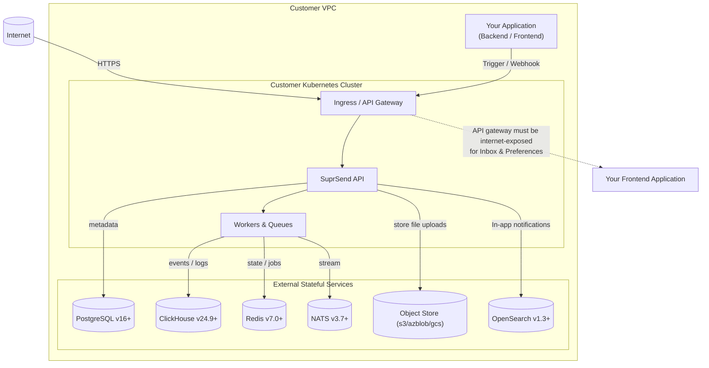

<Info>
Self-hosted deployment is supported under the Enterprise plan and is enabled via an enterprise license. Contact our sales team at [sales@suprsend.com](mailto:sales@suprsend.com) or reach out to our enterprise support team at [enterprise-support@suprsend.com](mailto:enterprise-support@suprsend.com) to get the license.
</Info>

SuprSend’s **Self-Hosted** mode allows enterprises to deploy the full notification infrastructure within their own VPC or on-prem environment, ensuring data sovereignty, compliance, and custom integration flexibility.

It mirrors SuprSend’s cloud capabilities — including multi-channel delivery, preferences management, and workflow automation — but gives customers ownership of both the control plane and the data plane.

## When to choose Self-Hosted

Self-hosting is a good fit if you need:

| Need | Example |
|------|--------|
| **Data residency or compliance** | GDPR, HIPAA, or enterprise IT policies |
| **Private system integration** | Internal CRM, ERP, or on-prem alerting tools |
| **Custom delivery infra** | Private SMTP, SMS gateways, or Kafka |
| **Restricted networks** | Air-gapped or locked-down environments |
| **Scale control** | High-volume workloads (millions of events/day) |

If you prefer a fully managed experience with automatic scaling, uptime SLAs, and managed upgrades, use [SuprSend Cloud](https://app.suprsend.com/en/login) instead.

---

## Deployment modes

<Frame caption="SuprSend deployment options: SaaS, BYOC, and Self-Hosted">
  

    
  

</Frame>

SuprSend offers three deployment models:

| Mode | Data Plane | Control Plane | Ease of Use | Scalability | Maintenance | SLA |
|------|------------|---------------|-------------|-------------|-------------|-----|
| SaaS | SuprSend | SuprSend | Easiest — no setup required | Managed by SuprSend | Fully managed | ✅ Available |
| BYOC (Bring Your Own Cloud) | Customer | SuprSend | Moderate setup | Scales via SuprSend app | Shared responsibility | ❌ Not available |
| Self-Hosted | Customer | Customer | Complex setup & maintenance | Customer managed | Fully customer responsibility | ❌ Not available |

In the **Self-Hosted** model, you operate both the control plane and data plane — full isolation of data and operations.

---

## Architecture overview

### High-level components

| Component | Description |
|-----------|-------------|
| SuprSend API | Core API gateway for receiving workflow triggers, managing templates, and handling user preferences. |
| Workers & Queues | Distributed background processors for executing notification workflows, handling retries, and managing delivery logic. |
| Dashboard | Web-based management interface for configuration, analytics, and debugging. You'll access two dashboards — a Host Account (for internal product alerts) and a Root Account (for configuring customer-facing notifications). |
| PostgreSQL | Primary data store for users, templates, workflows, and notifications. |
| ClickHouse | Secondary data store to power analytics and logs. |
| Redis | Cache and transient state management layer. You'll operate two Redis stores (both external) — one shared across all services and one dedicated to workflow state management. This separation ensures delays in any shared service do not affect workflow executions. |
| NATS | Message queue for scalable event ingestion. |
| OpenSearch | For powering In-app notifications |

<Note>
SuprSend supports both single-cluster and multi-cluster topologies, depending on your scale and SLA requirements. You can run the entire system within your Kubernetes cluster, or keep stateful services (Postgres, Redis, ClickHouse) managed externally for better performance and resilience.
</Note>

---

## System requirements

All dependencies are open-source under permissible licenses:

| Component | Version | Recommended Deployment |
|-----------|---------|------------------------|
| Kubernetes | v1.29+ | Required for orchestration |
| PostgreSQL | v16+ | Outside Kubernetes |
| ClickHouse | v24.9+ | Outside Kubernetes |
| Redis | v7.0+ | Dedicated deployment preferred |
| NATS | v3.7+ | Dedicated or in-cluster |
| OpenSearch (optional) | v1.3+ | For search/log indexing |
| SuprSend API Gateway | — | Must be Internet-exposed for Inbox/Preferences |

<Note>
For best performance, deploy databases and queues outside the Kubernetes cluster.
</Note>

---

## Networking and observability

| Area | What you get |
|------|----------------|
| **Secure private networking** | Private interconnects between SuprSend API, workers, and your VPC |
| **Centralized observability** | Push logs and metrics to your stack (e.g. Prometheus, Grafana) |
| **Cluster management** | Use the [SuprSend CLI](/reference/cli-intro) or Terraform to create, update, and monitor clusters |

---

## Promotion and automation

Use the [SuprSend CLI](/reference/cli-intro) to promote assets and automate deployments in your CI/CD pipeline.

## Release lifecycle and versioning

| Type | Cadence |
|------|---------|
| **Stable releases** | Every quarter |
| **Patch releases** | Security and bug-fix updates as needed |
| **Version format** | vX.Y.Z (Semantic Versioning) |
| **Upgrade policy** | Minor versions are backward-compatible; major versions may introduce migrations |

Track all self-hosted releases in the [Changelog](/docs/self-hosted/changelog).

---

## What's next

<CardGroup cols="3">
  <Card title="Getting Started" icon="list-check" iconType="solid" href="/docs/self-hosted/getting-started">
    Step-by-step deployment checklist and dependency order.
  </Card>
  <Card title="List of Dependencies" icon="server" iconType="solid" href="/docs/self-hosted/list-of-dependencies">
    All infrastructure components and version requirements.
  </Card>
  <Card title="SuprSend Installation Guide" icon="rocket" iconType="solid" href="/docs/self-hosted/suprsend-installation-guide">
    Helm install, secrets, and values configuration.
  </Card>
</CardGroup>
