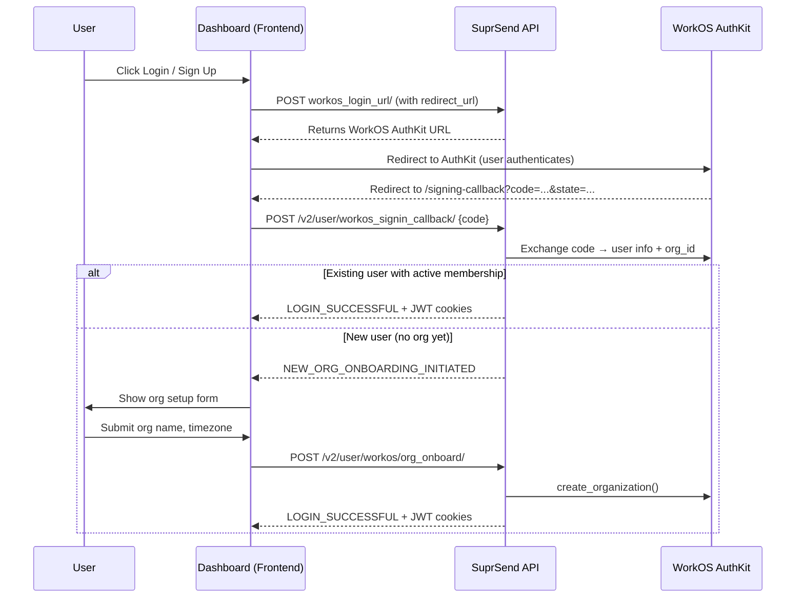

By default, self-hosted SuprSend uses a passwordless email+code flow for dashboard authentication. WorkOS integration replaces this with [AuthKit](https://workos.com/docs/user-management), giving you enterprise SSO, social logins (Google, GitHub, etc.), SAML, email verification, and magic-link login — all managed through your WorkOS dashboard.

<Info>
  **Optional feature** — WorkOS integration is optional. If you do not set it up, the default email+code login continues to work unchanged.
</Info>

---

## What WorkOS provides

| Feature | How SuprSend uses it |
| --- | --- |
| AuthKit (hosted auth UI) | Login and signup flows for the dashboard |
| User Management | User creation, email verification |
| Organization Management | Maps WorkOS orgs to SuprSend organizations |
| Webhooks | Sends magic-link login emails via your SMTP |
| Session Management | Tracks sessions for clean logout |

---

## Prerequisites

- A [WorkOS](https://workos.com) account with **User Management** enabled
- A running SuprSend self-hosted deployment
- Your dashboard URL (e.g. `https://app.yourdomain.com`) and API URL (e.g. `https://api.yourdomain.com`)

---

## Step 1 — Configure WorkOS dashboard

### 1.1 Create an application

In the WorkOS dashboard, create a new application (or use an existing one) and note down:

| Value | Where to find it |
| --- | --- |
| **Client ID** | Dashboard → API Keys → Client ID |
| **Secret Key** | Dashboard → API Keys → Secret Key |
| **AuthKit base URL** | Dashboard → Authentication → AuthKit → your hosted domain (e.g. `https://your-app.authkit.app`) |

### 1.2 Add the redirect URI

Under **Redirects**, add your frontend signing-callback page as an allowed redirect URI:

```
https://app.yourdomain.com/signing-callback
```

Replace `app.yourdomain.com` with your actual dashboard domain.

### 1.3 Register the webhook endpoint

Under **Webhooks**, add a new endpoint pointing at your SuprSend API:

```
https://api.yourdomain.com/v1/workos_webhook/
```

Enable the following event:

- `magic_auth.created` — **required** for magic-link login emails

Copy the **Webhook Secret** that WorkOS generates — you will need it in the next step.

---

## Step 2 — Add WorkOS secrets

Add the following keys to your existing `suprsend-secrets.yaml` (inside `stringData`):

```yaml title="suprsend-secrets.yaml (additions)"
  # WorkOS secret key (from WorkOS dashboard → API Keys)
  workosApiKey: "<your-workos-secret-key>"
  # WorkOS webhook signing secret (from WorkOS dashboard → Webhooks)
  workosWebhookSecretKey: "<your-workos-webhook-secret>"
```

Apply the updated secret:

```bash
kubectl apply -f suprsend-secrets.yaml -n suprsend
```

---

## Step 3 — Update `suprsend-values.yaml`

### 3.1 Backend (suprsend API)

Add the following under the `suprsendapi` section:

```yaml title="suprsend-values.yaml (suprsendapi section)"
suprsendapi:
  config:
    # ... existing config ...

    # Enable WorkOS integration
    isWorkosIntegrated: "true"
    # WorkOS Client ID (from WorkOS dashboard → API Keys)
    workosClientId: "<your-workos-client-id>"
    # AuthKit hosted base URL (e.g. https://your-app.authkit.app)
    workosSigninBaseUrl: "<your-authkit-base-url>"

  secret:
    existingKubeSecret: "suprsend-secrets"
    # ... existing secret keys ...

    # WorkOS API secret key reference
    workosApiKeyKey: "workosApiKey"
    # WorkOS webhook secret reference
    workosWebhookSecretKey: "workosWebhookSecretKey"
```

### 3.2 Frontend (suprsend dashboard app)

The dashboard frontend uses `viteDisableWorkosLoginFlow` to toggle the login mode. Set it to `"false"` to enable WorkOS:

```yaml title="suprsend-values.yaml (suprsendApp section)"
suprsendApp:
  config:
    # email editor token, contact suprsend to get one
    viteEmailEditorToken: "<your-token>"

    # Set to "false" (or omit) to activate the WorkOS login flow.
    # Set to "true" to force the default email+code login.
    viteDisableWorkosLoginFlow: "false"
```

<Info>
  To switch back to the default email+code login at any time, set `viteDisableWorkosLoginFlow` to `"true"` and re-run `helm upgrade`.
</Info>

---

## Step 4 — Apply changes

```bash
helm upgrade my-suprsend suprsend/suprsend \
  -f suprsend-values.yaml \
  -n suprsend
```

Wait for the `suprsendapi` and `suprsendApp` pods to restart:

```bash
kubectl rollout status deployment/suprsend-suprsendapi -n suprsend
kubectl rollout status deployment/suprsend-suprsend-app -n suprsend
```

---

## How the auth flow works



### Login response types

| `response_type` | Meaning | Frontend action |
| --- | --- | --- |
| `LOGIN_SUCCESSFUL` | User authenticated, membership active | Set auth state, redirect to dashboard |
| `NEW_ORG_ONBOARDING_INITIATED` | First-time user, no org yet | Show org setup form |
| `MEMBERSHIP_DEACTIVATED` | Membership exists but is inactive | Show deactivation message |
| `LINK_INVALID` / `LINK_EXPIRED` | Code exchange failed | Show error with retry option |

---

## Webhook integration

SuprSend registers a webhook endpoint at `/v1/workos_webhook/` to receive events from WorkOS. For self-hosted deployments, the only required event is:

| Event | Purpose |
| --- | --- |
| `magic_auth.created` | When a user requests a magic-link login, WorkOS fires this event. SuprSend receives it and sends the login code email directly via your configured SMTP. Without this webhook, magic-link login emails will not be delivered. |

**How it works**

1. User requests a magic-link login via WorkOS AuthKit.
2. WorkOS fires `magic_auth.created` to `https://api.yourdomain.com/v1/workos_webhook/`.
3. SuprSend verifies the webhook signature using `WORKOS_WEBHOOK_SECRET`.
4. SuprSend fetches the magic-auth code from WorkOS and sends the login email via direct SMTP.
5. Duplicate events are deduplicated using Redis (event IDs are cached for 3 days).

<Note>
  WorkOS AuthKit handles email verification natively — users must verify their email before they can authenticate. The `email_verification.created` event is not required for self-hosted deployments.
</Note>

---

## Troubleshooting

**Login redirects to email+code form instead of WorkOS**

Check that `viteDisableWorkosLoginFlow` is `"false"` (or unset) in `suprsendApp.config`, then re-run `helm upgrade` so the frontend is rebuilt with the new value.

**`LINK_INVALID` error after WorkOS redirect**

- Verify the redirect URI registered in the WorkOS dashboard exactly matches your frontend callback URL (`https://app.yourdomain.com/signing-callback`).
- Confirm `WORKOS_CLIENT_ID` and `WORKOS_API_KEY` are correctly set.

**Magic-link login emails not being sent**

- Confirm the `magic_auth.created` event is enabled on the WorkOS webhook.
- Confirm the `WORKOS_WEBHOOK_SECRET` in your Kubernetes secret matches the secret shown in the WorkOS webhook dashboard.
- Ensure the webhook endpoint (`https://api.yourdomain.com/v1/workos_webhook/`) is publicly reachable from WorkOS servers.
- Verify your SMTP configuration is correct (the magic-link email is sent directly via SMTP in self-hosted mode).
