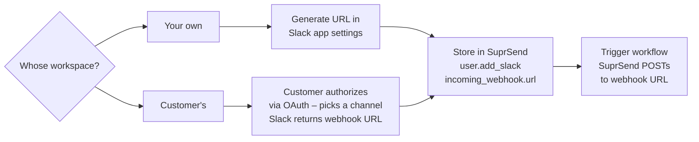

This guide covers sending notifications using an [incoming webhook](https://api.slack.com/messaging/webhooks) — a URL tied to a single Slack channel. SuprSend posts to that URL and Slack delivers the message. There's no bot token to manage and no per-user profile routing.

Incoming webhooks work for **both your own workspace and your customers' workspaces**. How you obtain the webhook URL differs depending on which.

## How it works

There are two ways to get a webhook URL depending on your use case.

**Your own workspace** — generate it directly in your Slack app settings. No OAuth flow needed.

**A customer's workspace** — get it via the OAuth V2 flow. During authorization, the customer picks a channel and Slack returns a webhook URL for it in the callback response. Each customer gets their own webhook URL tied to their chosen channel.



## Step 1 — Enable the Slack channel in SuprSend

1. Log in to your [SuprSend dashboard](https://app.suprsend.com)
2. Go to **[Vendors → Slack](https://app.suprsend.com/en/staging/vendors/slack)**
3. Toggle the Slack channel to **Enabled** and click **Save**

<Frame>
  
</Frame>

<Callout type="warning">
  Each SuprSend workspace (e.g. staging, production) has its own vendor settings. Enable Slack separately in each environment — notifications will fail silently if the channel is not enabled.
</Callout>

## Step 2 — Set up your Slack app

If you don't have a Slack app yet, create one at [api.slack.com/apps](https://api.slack.com/apps) by clicking **Create New App → From scratch**, selecting your workspace, and clicking **Create App**.

If you already have one, go to [api.slack.com/apps](https://api.slack.com/apps), select your app, then follow the appropriate path below.

## Step 3 — Get your webhook URL

Follow the path that matches your use case.

### Your own workspace

1. In your Slack app, go to **Features → Incoming Webhooks**
2. Toggle **Activate Incoming Webhooks** to **On** if it isn't already

    <Frame>
      
    </Frame>

3. Click **Add New Webhook to Workspace**
4. Select the channel to post to

    <Frame>
      
    </Frame>

5. Click **Allow** — Slack generates a webhook URL:

```
https://hooks.slack.com/services/<WORKSPACE_ID>/<BOT_ID>/<WEBHOOK_SECRET>
```

Copy this URL. For multiple channels, repeat this step for each one.

<Callout type="info">
  Enabling incoming webhooks on an existing app does not affect its other functionality or existing scopes.
</Callout>

### A customer's workspace

Add the `incoming-webhook` scope to your OAuth authorization URL. During the authorization screen, Slack shows the customer a channel picker — they select where they want notifications. After they approve, the `oauth.v2.access` callback response includes the webhook URL for their chosen channel.

Your authorization URL should include `incoming-webhook` in the scope parameter:

```
https://slack.com/oauth/v2/authorize
  ?client_id=YOUR_CLIENT_ID
  &scope=incoming-webhook
  &redirect_uri=https://yourapp.com/auth/slack/callback
  &state=YOUR_CSRF_STATE_TOKEN
```

In your callback handler, extract the webhook URL from the response:

<CodeGroup>
```javascript Node.js
const response = await fetch("https://slack.com/api/oauth.v2.access", {
  method: "POST",
  headers: { "Content-Type": "application/x-www-form-urlencoded" },
  body: new URLSearchParams({
    client_id: process.env.SLACK_CLIENT_ID,
    client_secret: process.env.SLACK_CLIENT_SECRET,
    code: req.query.code,
    redirect_uri: "https://yourapp.com/auth/slack/callback"
  })
});

const data = await response.json();
const webhookUrl = data.incoming_webhook.url;      // Store this per customer
const channelName = data.incoming_webhook.channel; // The channel they selected
```

```python Python
import requests, os

response = requests.post("https://slack.com/api/oauth.v2.access", data={
  "client_id":     os.environ["SLACK_CLIENT_ID"],
  "client_secret": os.environ["SLACK_CLIENT_SECRET"],
  "code":          request.args.get("code"),
  "redirect_uri":  "https://yourapp.com/auth/slack/callback"
})

data         = response.json()
webhook_url  = data["incoming_webhook"]["url"]      # Store this per customer
channel_name = data["incoming_webhook"]["channel"]  # The channel they selected
```
</CodeGroup>

<Callout type="warning">
  Each webhook URL is scoped to the specific channel the customer selected. If they want to change the channel later, they must re-authorize to generate a new URL.
</Callout>

## Step 4 — Store the webhook URL in SuprSend

Initialize the SDK first if you haven't already:

<CodeGroup>
```javascript Node.js
const { Suprsend, WorkflowTriggerRequest } = require("@suprsend/node-sdk");
const supr_client = new Suprsend("workspace_key", "workspace_secret");
```

```python Python
from suprsend import Suprsend, WorkflowTriggerRequest

supr_client = Suprsend("workspace_key", "workspace_secret")
```
</CodeGroup>

Pass the webhook URL using `user.add_slack()` with the `incoming_webhook` field. Use a descriptive `distinct_id` so it's easy to reference in workflow triggers.

**Your own workspace** — use a channel-based `distinct_id`:

<CodeGroup>
```javascript Node.js
const distinct_id = "channel_incidents";
const user = supr_client.user.get_instance(distinct_id);

user.add_slack({
  incoming_webhook: {
    url: "<your-webhook-url>"
  }
});

const response = user.save();
response.then((res) => console.log("response", res));
```

```python Python
distinct_id = "channel_incidents"
user = supr_client.user.get_instance(distinct_id)

user.add_slack({
  "incoming_webhook": {
    "url": "<your-webhook-url>"
  }
})

print(user.save())
```
</CodeGroup>

**A customer's workspace** — tie the `distinct_id` to the customer so each has their own profile:

<CodeGroup>
```javascript Node.js
const distinct_id = `slack_channel_${customerId}`;
const user = supr_client.user.get_instance(distinct_id);

user.add_slack({
  incoming_webhook: {
    url: webhookUrl  // From oauth.v2.access response
  }
});

const response = user.save();
response.then((res) => console.log("response", res));
```

```python Python
distinct_id = f"slack_channel_{customer_id}"
user = supr_client.user.get_instance(distinct_id)

user.add_slack({
  "incoming_webhook": {
    "url": webhook_url  # From oauth.v2.access response
  }
})

print(user.save())
```
</CodeGroup>

For multiple channels, create a separate profile for each with a different `distinct_id` and webhook URL.

## Step 5 — Trigger a workflow

Trigger a SuprSend workflow using the same `distinct_id`. SuprSend will post to the webhook and Slack delivers to the configured channel.

<Callout type="info">
  Prefer not to store the webhook URL in SuprSend? Pass it inline in the `$slack` field of `recipients` instead. See [Storing Slack identity: pre-stored vs. inline](/integrations/chat/slack/overview#storing-slack-identity-pre-stored-vs-inline).
</Callout>

<CodeGroup>
```javascript Node.js
const body = {
  workflow: "deployment-complete",   // workflow slug from the SuprSend dashboard
  recipients: [
    { distinct_id: "channel_incidents" }
  ],
  data: {
    service: "payments-api",
    environment: "production",
    status: "success"
  }
};

const wf = new WorkflowTriggerRequest(body);
const response = supr_client.workflows.trigger(wf);
response.then((res) => console.log("response", res));
```

```python Python
wf = WorkflowTriggerRequest(
  body={
    "workflow": "deployment-complete",  # workflow slug from the SuprSend dashboard
    "recipients": [
      { "distinct_id": "channel_incidents" }
    ],
    "data": {
      "service": "payments-api",
      "environment": "production",
      "status": "success"
    }
  }
)

response = supr_client.workflows.trigger(wf)
print(response)
```
</CodeGroup>