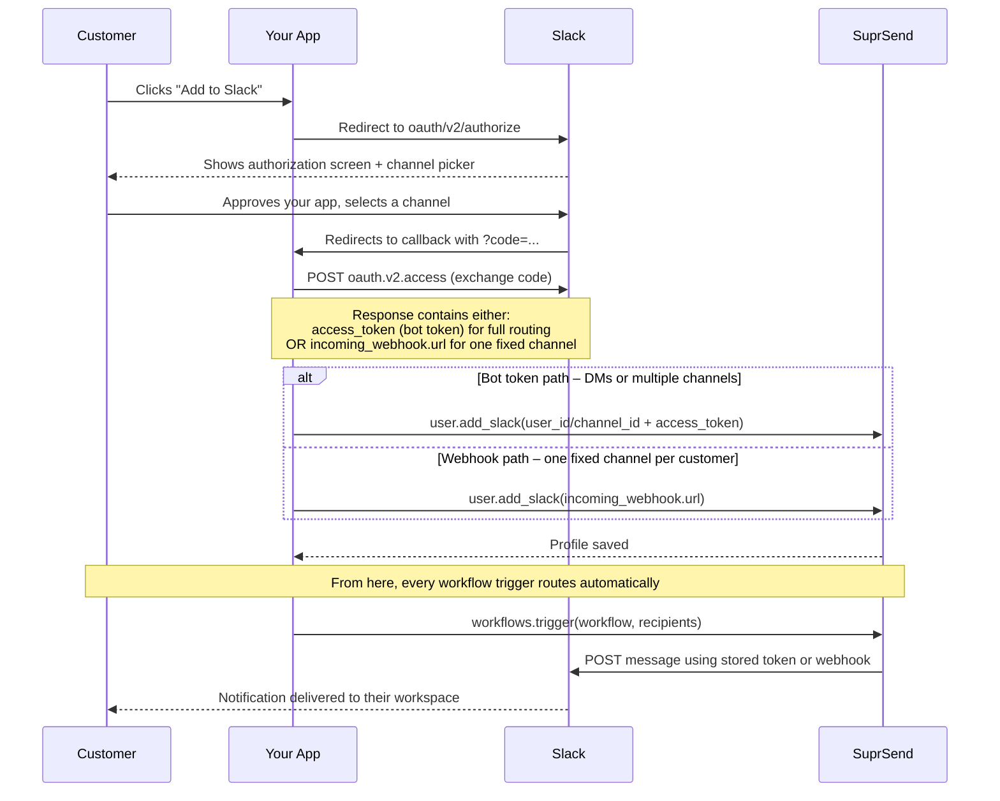

This guide is for SaaS products that want to send Slack notifications **into their customers' workspaces**. Unlike email — where you just need an address — Slack requires each user to explicitly grant your app permission to post on their behalf. This guide walks through how to collect that permission and wire it up with SuprSend.

## How it works

The flow has three parts: your user grants access, you get a token, and SuprSend uses that token to send notifications.



Each customer goes through this once. After that, SuprSend has their token and can send notifications whenever a workflow runs.

<Callout type="info">
  The `access_token` you receive is scoped to that customer's workspace specifically. It is not the same as your own bot token — every customer gets a unique one.
</Callout>

## Step 1 — Enable the Slack channel in SuprSend

1. Log in to your [SuprSend dashboard](https://app.suprsend.com)
2. Go to **[Vendors → Slack](https://app.suprsend.com/en/staging/vendors/slack)**
3. Toggle the Slack channel to **Enabled** and click **Save**

<Frame>
  
</Frame>

<Callout type="warning">
  Each SuprSend workspace (e.g. staging, production) has its own vendor settings. Enable Slack separately in each environment — notifications will fail silently if the channel is not enabled.
</Callout>

## Step 2 — Set up your Slack app

If you already have a Slack app, you can use it here. The app's name and icon are what your customers will see on the Slack authorization screen — make sure they're recognizable.

If you need to create one:

1. Go to [api.slack.com/apps](https://api.slack.com/apps) and click **Create New App**

    <Frame>
      
    </Frame>

2. Select **From scratch** and give it a name your users will recognize

    <Frame>
      
    </Frame>

3. Select any workspace as your development workspace — this doesn't affect where customers install the app
4. Click **Create App**

## Step 3 — Verify your OAuth scopes

Navigate to **Features → OAuth & Permissions → [Bot Token Scopes](https://api.slack.com/scopes)** and confirm the following scopes are present. Add any that are missing.

| Scope | Required | Purpose |
|-------|----------|---------|
| [`chat:write`](https://api.slack.com/scopes/chat:write) | Yes | Post messages to channels the bot has been invited to |
| [`chat:write.public`](https://api.slack.com/scopes/chat:write.public) | Yes | Post to public channels without the bot needing to join first |
| [`im:write`](https://api.slack.com/scopes/im:write) | Yes | Send direct messages to users |
| [`users:read`](https://api.slack.com/scopes/users:read) | No | Look up a user by their Slack user ID |
| [`users:read.email`](https://api.slack.com/scopes/users:read.email) | No | Look up a user by email. Required for DM by email. |

<Frame>
  
</Frame>

<Callout type="warning">
  If you add new scopes to an existing app, customers who have already authorized it will need to re-authorize before the new scopes take effect. Plan scope additions carefully in production.
</Callout>

<Callout type="info">
  **Simpler alternative:** If each customer only needs notifications in one fixed channel, you can use the `incoming-webhook` scope instead of a bot token. During the OAuth flow, the customer picks a channel and Slack returns a webhook URL for it — no `access_token` to manage. See [Sending via incoming webhook](/integrations/chat/slack/sending-a-direct-message#a-customers-workspace) for how to handle the callback and store the URL in SuprSend.
</Callout>

## Step 4 — Configure your OAuth redirect URL

Slack redirects the user back to your app after they approve. You must register this URL first or Slack will reject the request.

1. Go to **Features → OAuth & Permissions**
2. Under **Redirect URLs**, click **Add New Redirect URL**
3. Enter your callback URL, e.g. `https://yourapp.com/auth/slack/callback`
4. Click **Save URLs**

<Callout type="warning">
  The redirect URL in your authorization link must exactly match what you registered here — including trailing slashes.
</Callout>

## Step 5 — Build the "Add to Slack" flow

This is the UI and backend your customers interact with when connecting their Slack workspace.

**1. Add the button to your product**

Place an **Add to Slack** button on your settings or onboarding page. When clicked, redirect the user to Slack's authorization URL:

```
https://slack.com/oauth/v2/authorize
  ?client_id=YOUR_CLIENT_ID
  &scope=chat:write,chat:write.public,im:write
  &redirect_uri=https://yourapp.com/auth/slack/callback
  &state=YOUR_CSRF_STATE_TOKEN
```

Your `client_id` is under **Basic Information** in your Slack app settings.

<Callout type="warning">
  Always generate a unique `state` value per request, tied to the user's session. Verify it when Slack redirects back to prevent CSRF attacks.
</Callout>

**2. What your user sees**

Slack shows the user an authorization screen listing exactly what permissions your app is requesting. The user approves, and Slack redirects them back to your `redirect_uri` with a temporary `code` parameter.

**3. Exchange the code for a token**

On your server, exchange the `code` for a permanent bot token. This token is unique to that customer's workspace and is what you'll store in SuprSend.

<CodeGroup>
```javascript Node.js
const response = await fetch("https://slack.com/api/oauth.v2.access", {
  method: "POST",
  headers: { "Content-Type": "application/x-www-form-urlencoded" },
  body: new URLSearchParams({
    client_id: process.env.SLACK_CLIENT_ID,
    client_secret: process.env.SLACK_CLIENT_SECRET,
    code: req.query.code,
    redirect_uri: "https://yourapp.com/auth/slack/callback"
  })
});

const data = await response.json();
const botToken = data.access_token; // xoxb-... — unique per customer workspace
const teamId = data.team.id;        // The customer's Slack workspace ID
```

```python Python
import requests, os

response = requests.post("https://slack.com/api/oauth.v2.access", data={
  "client_id":     os.environ["SLACK_CLIENT_ID"],
  "client_secret": os.environ["SLACK_CLIENT_SECRET"],
  "code":          request.args.get("code"),
  "redirect_uri":  "https://yourapp.com/auth/slack/callback"
})

data      = response.json()
bot_token = data["access_token"]  # xoxb-... — unique per customer workspace
team_id   = data["team"]["id"]    # The customer's Slack workspace ID
```
</CodeGroup>

Store the `access_token` and `team.id` securely in your database, associated with the customer.

## Step 6 — Store the target in SuprSend

Once you have the customer's token, save their Slack delivery target to SuprSend using `user.add_slack()`. You only need to do this once per user — SuprSend stores it and uses it automatically on every subsequent workflow trigger.

Initialize the SDK first if you haven't already:

<CodeGroup>
```javascript Node.js
const { Suprsend, WorkflowTriggerRequest } = require("@suprsend/node-sdk");
const supr_client = new Suprsend("workspace_key", "workspace_secret");
```

```python Python
from suprsend import Suprsend, WorkflowTriggerRequest
import os

supr_client = Suprsend("workspace_key", "workspace_secret")
```
</CodeGroup>

**DM the user directly**

Use `user_id` (their Slack member ID) or `email` to send a direct message. You can get the user's Slack `user_id` from the OAuth response — the `authed_user.id` field contains the ID of the user who just authorized your app.

<CodeGroup>
```javascript Node.js
const distinct_id = "user_001";
const user = supr_client.user.get_instance(distinct_id);

// By Slack user ID (from authed_user.id in the OAuth response)
user.add_slack({
  user_id: "UXXXXXXXXX",
  access_token: botToken
});

// Or by email (requires users:read.email scope)
user.add_slack({
  email: "user@theirdomain.com",
  access_token: botToken
});

const response = user.save();
response.then((res) => console.log("response", res));
```

```python Python
distinct_id = "user_001"
user = supr_client.user.get_instance(distinct_id)

# By Slack user ID (from authed_user.id in the OAuth response)
user.add_slack({
  "user_id": "UXXXXXXXXX",
  "access_token": bot_token
})

# Or by email (requires users:read.email scope)
user.add_slack({
  "email": "user@theirdomain.com",
  "access_token": bot_token
})

print(user.save())
```
</CodeGroup>

**Post to a channel in the customer's workspace**

During the OAuth flow, you can include a channel picker so the customer selects where they want notifications. After the callback, use that channel's ID here.

<CodeGroup>
```javascript Node.js
const distinct_id = `channel_${customerId}_general`;
const user = supr_client.user.get_instance(distinct_id);

user.add_slack({
  channel_id: "CXXXXXXXX",
  access_token: botToken
});

const response = user.save();
response.then((res) => console.log("response", res));
```

```python Python
distinct_id = f"channel_{customer_id}_general"
user = supr_client.user.get_instance(distinct_id)

user.add_slack({
  "channel_id": "CXXXXXXXX",
  "access_token": bot_token
})

print(user.save())
```
</CodeGroup>

## Step 7 — Trigger a workflow

With channel data saved, trigger a SuprSend workflow targeting the same `distinct_id`. SuprSend will look up the stored token and route the message automatically.

<Callout type="info">
  Prefer not to store Slack identities in SuprSend? Pass the token inline in the `$slack` field of `recipients` instead. See [Storing Slack identity: pre-stored vs. inline](/integrations/chat/slack/overview#storing-slack-identity-pre-stored-vs-inline).
</Callout>

<CodeGroup>
```javascript Node.js
const body = {
  workflow: "task-assigned",         // workflow slug from the SuprSend dashboard
  recipients: [
    { distinct_id: "user_001" }
  ],
  data: {
    task_name: "Review Q4 report",
    assigned_by: "Jamie"
  }
};

const wf = new WorkflowTriggerRequest(body);
const response = supr_client.workflows.trigger(wf);
response.then((res) => console.log("response", res));
```

```python Python
wf = WorkflowTriggerRequest(
  body={
    "workflow": "task-assigned",     # workflow slug from the SuprSend dashboard
    "recipients": [
      { "distinct_id": "user_001" }
    ],
    "data": {
      "task_name": "Review Q4 report",
      "assigned_by": "Jamie"
    }
  }
)

response = supr_client.workflows.trigger(wf)
print(response)
```
</CodeGroup>