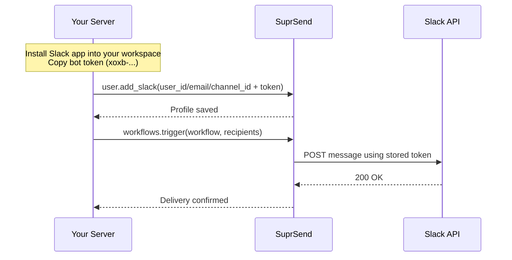

This guide covers sending notifications into a Slack workspace that you own and control — your company's workspace. This is the right approach for internal tooling: deployment alerts, anomaly detection, on-call notifications, and any other case where you, not your customers, are the recipient.

## How it works



You control everything — there's no user consent step because you own the workspace and the Slack app.

## Step 1 — Enable the Slack channel in SuprSend

1. Log in to your [SuprSend dashboard](https://app.suprsend.com)
2. Go to **[Vendors → Slack](https://app.suprsend.com/en/staging/vendors/slack)**
3. Toggle the Slack channel to **Enabled** and click **Save**

<Frame>
  
</Frame>

<Callout type="warning">
  Each SuprSend workspace (e.g. staging, production) has its own vendor settings. Enable Slack separately in each environment — notifications will fail silently if the channel is not enabled.
</Callout>

## Step 2 — Set up your Slack app

If you already have a Slack app installed in your workspace, skip to [Step 3](#step-3--verify-your-oauth-scopes).

If you need to create one:

1. Go to [api.slack.com/apps](https://api.slack.com/apps) and click **Create New App**

    <Frame>
      
    </Frame>

2. Select **From scratch**

    <Frame>
      
    </Frame>

3. Give it a name (e.g. `Acme Notifier`) and select your workspace

    <Frame>
      
    </Frame>

4. Click **Create App**

## Step 3 — Verify your OAuth scopes

Navigate to **Features → OAuth & Permissions → Bot Token Scopes** and confirm the following scopes are present. Add any that are missing.

| Scope | Required | Purpose |
|-------|----------|---------|
| [`chat:write`](https://api.slack.com/scopes/chat:write) | Yes | Post messages to channels the bot has been invited to |
| [`chat:write.public`](https://api.slack.com/scopes/chat:write.public) | Yes | Post to public channels without the bot needing to join first |
| [`im:write`](https://api.slack.com/scopes/im:write) | Yes | Send direct messages to users |
| [`users:read`](https://api.slack.com/scopes/users:read) | No | Required to look up users by Slack user ID |
| [`users:read.email`](https://api.slack.com/scopes/users:read.email) | No | Required to look up users by email address |

<Frame>
  
</Frame>

<Callout type="warning">
  If you added scopes to an existing app that was already installed, you must reinstall it. Go to **Settings → Install App** and click **Reinstall to Workspace**. Copy the updated bot token after reinstalling.
</Callout>

## Step 4 — Get your bot token

1. In the left sidebar, go to **Settings → Install App**
2. If the app is not yet installed, click **Install to Workspace**, review the permissions, and click **Allow**
3. Copy the **Bot User OAuth Token** — it starts with `xoxb-`

Store this token in an environment variable. Do not commit it to source control.

## Step 5 — Store the target in SuprSend

Initialize the SDK first if you haven't already:

<CodeGroup>
```javascript Node.js
const { Suprsend, WorkflowTriggerRequest } = require("@suprsend/node-sdk");
const supr_client = new Suprsend("workspace_key", "workspace_secret");
```

```python Python
from suprsend import Suprsend, WorkflowTriggerRequest
import os

supr_client = Suprsend("workspace_key", "workspace_secret")
```
</CodeGroup>

**Resolving Slack user IDs without manual lookups**

If you want to send DMs to individuals, you need their Slack `user_id`. You don't need to look these up manually — two common automated approaches:

- **Bulk sync at setup** — call [Slack's `users.list` API](https://api.slack.com/methods/users.list) once to fetch all workspace members, map each member's email to their Slack `user_id`, and store in SuprSend. Run this periodically if your team changes.
- **Resolve on login** — when an employee logs in to your internal tool, call [Slack's `users.lookupByEmail` API](https://api.slack.com/methods/users.lookupByEmail) with their email to get their `user_id`, then store it in SuprSend. One call per user, done once.

Both require the `users:read` scope (for `users.list`) or `users:read.email` scope (for `users.lookupByEmail`). Once stored, no further lookups are needed.

**Sending a DM by Slack user ID**

<CodeGroup>
```javascript Node.js
const distinct_id = "user_001";
const user = supr_client.user.get_instance(distinct_id);

user.add_slack({
  user_id: "UXXXXXXXXX",
  access_token: process.env.SLACK_BOT_TOKEN
});

const response = user.save();
response.then((res) => console.log("response", res));
```

```python Python
distinct_id = "user_001"
user = supr_client.user.get_instance(distinct_id)

user.add_slack({
  "user_id": "UXXXXXXXXX",
  "access_token": os.environ["SLACK_BOT_TOKEN"]
})

print(user.save())
```
</CodeGroup>

**Sending a DM by email**

Requires the [`users:read.email`](https://api.slack.com/scopes/users:read.email) scope. SuprSend resolves the email to a Slack user ID automatically at send time.

<CodeGroup>
```javascript Node.js
const distinct_id = "user_001";
const user = supr_client.user.get_instance(distinct_id);

user.add_slack({
  email: "alice@yourcompany.com",
  access_token: process.env.SLACK_BOT_TOKEN
});

const response = user.save();
response.then((res) => console.log("response", res));
```

```python Python
distinct_id = "user_001"
user = supr_client.user.get_instance(distinct_id)

user.add_slack({
  "email": "alice@yourcompany.com",
  "access_token": os.environ["SLACK_BOT_TOKEN"]
})

print(user.save())
```
</CodeGroup>

**Sending to a channel**

To get a channel's ID, open it in Slack in a browser. The ID is at the end of the URL — in `https://app.slack.com/client/TXXXXX/C012AB3CD`, the channel ID is `C012AB3CD`.

<Frame>
  
</Frame>

Use a descriptive `distinct_id` for channel profiles so they're easy to reference in workflow triggers.

<CodeGroup>
```javascript Node.js
const distinct_id = "channel_incidents";
const user = supr_client.user.get_instance(distinct_id);

user.add_slack({
  channel_id: "C012AB3CD",
  access_token: process.env.SLACK_BOT_TOKEN
});

const response = user.save();
response.then((res) => console.log("response", res));
```

```python Python
distinct_id = "channel_incidents"
user = supr_client.user.get_instance(distinct_id)

user.add_slack({
  "channel_id": "C012AB3CD",
  "access_token": os.environ["SLACK_BOT_TOKEN"]
})

print(user.save())
```
</CodeGroup>

## Step 6 — Trigger a workflow

With the profile saved, trigger a SuprSend workflow using the same `distinct_id`.

<Callout type="info">
  Prefer not to store Slack identities in SuprSend? Pass the token inline in the `$slack` field of `recipients` instead. See [Storing Slack identity: pre-stored vs. inline](/integrations/chat/slack/overview#storing-slack-identity-pre-stored-vs-inline).
</Callout>

<CodeGroup>
```javascript Node.js
const body = {
  workflow: "incident-alert",        // workflow slug from the SuprSend dashboard
  recipients: [
    { distinct_id: "channel_incidents" }
  ],
  data: {
    title: "High error rate detected",
    service: "payments-api",
    threshold: "5%"
  }
};

const wf = new WorkflowTriggerRequest(body);
const response = supr_client.workflows.trigger(wf);
response.then((res) => console.log("response", res));
```

```python Python
wf = WorkflowTriggerRequest(
  body={
    "workflow": "incident-alert",    # workflow slug from the SuprSend dashboard
    "recipients": [
      { "distinct_id": "channel_incidents" }
    ],
    "data": {
      "title": "High error rate detected",
      "service": "payments-api",
      "threshold": "5%"
    }
  }
)

response = supr_client.workflows.trigger(wf)
print(response)
```
</CodeGroup>

<Callout type="tip">
  Use SuprSend's staging workspace to test before switching to production. Staging and production have separate vendor settings and user profiles.
</Callout>