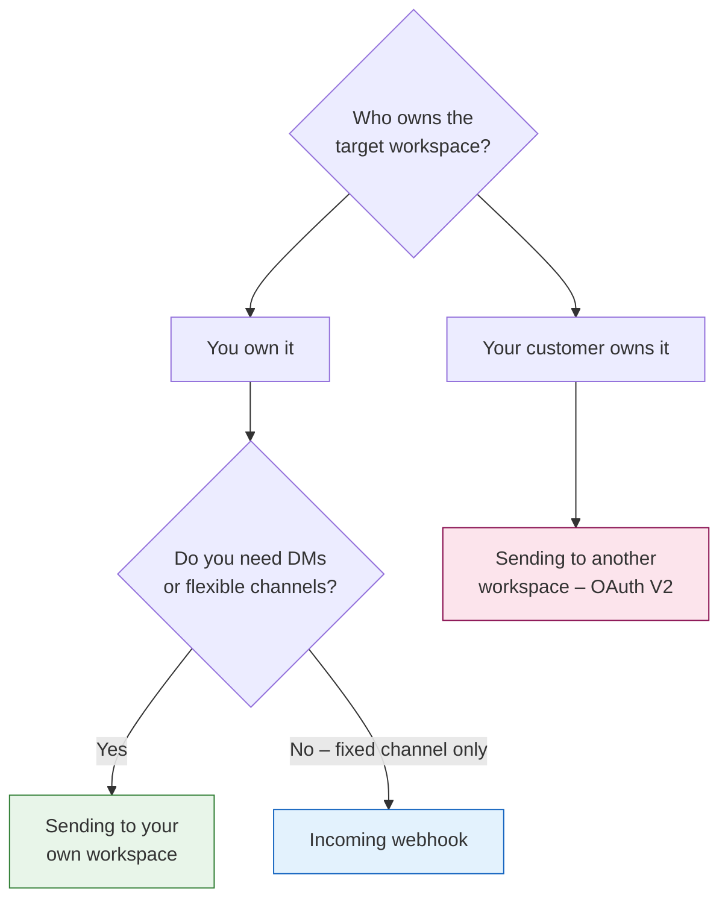

SuprSend lets you send Slack notifications to channels and direct messages to users — in your own workspace, your customers' workspaces, or a fixed internal channel via webhook.

## Choosing your implementation



### [Sending a message to your own workspace](/integrations/chat/slack/sending-an-internal-message)

Use this for internal tooling — alerts, monitoring, on-call notifications — where you own the Slack workspace. You install a Slack app once, copy its bot token, and use it to send to any channel or user.

Common use cases:
- Deployment alerts and release notifications to `#deployments`
- On-call and incident notifications to `#incidents` or an engineer's DM
- Anomaly detection and monitoring alerts from your infrastructure
- Internal ops notifications (new signups, payment failures, threshold breaches)

### [Sending a message to another workspace](/integrations/chat/slack/sending-a-message-to-channels)

Use this when your **customers** need to connect their Slack workspace to your product. You add an "Add to Slack" button — customers click it, approve your app on Slack's screen, and you get a token for their workspace. SuprSend uses that token to send notifications there.

Common use cases:
- Task assignments and project updates delivered into a customer's workspace
- Real-time product event notifications (new comment, status change, approval)
- Customer-facing alerting where each customer picks their own channel
- Weekly digests or activity summaries

### [Sending via incoming webhook](/integrations/chat/slack/sending-a-direct-message)

Use this when you need a quick, fixed-channel setup with no OAuth flow. A webhook ties one URL to one channel — SuprSend posts to that URL and Slack delivers the message. Cannot send DMs.

Common use cases:
- CI/CD status and deployment summaries to `#deployments`
- Error and anomaly alerts to `#alerts`
- Product announcements to `#announcements`
- Internal operational notifications where the destination never changes

## Prerequisites

- A [SuprSend account](https://app.suprsend.com)
- A Slack account with permission to create or manage [Slack apps](https://api.slack.com/apps)
- A Slack workspace — you can [create a free one](https://slack.com/get-started#/createnew) if needed

You do not need to create a new Slack app if you already have one. All three guides explain how to use an existing app.

## Storing Slack identity: pre-stored vs. inline

SuprSend gives you two ways to associate a Slack identity with a recipient.

**Pre-stored (recommended for most cases):** Call `user.add_slack()` to save the user's Slack identity to their profile in SuprSend once. Any workflow triggered for that `distinct_id` will automatically route to the right place — no need to pass identity on every trigger.

**Inline (for one-off or dynamic sends):** Pass the Slack identity directly in the `$slack` field of the `recipients` array when triggering a workflow. Nothing is stored in SuprSend — identity is resolved at trigger time.

```json
{
  "workflow": "_workflow_slug_",
  "recipients": [
    {
      "distinct_id": "user_001",
      "$slack": [
        {
          "email": "user@example.com",
          "access_token": "xoxb-XXXXXXXX"
        }
      ]
    }
  ],
  "data": {}
}
```

Use inline when the Slack identity isn't known until trigger time, or when you don't want to manage profiles in SuprSend. Use pre-stored when the same user receives multiple notifications over time.

## Order of precedence

When SuprSend resolves a Slack delivery target, it uses this priority order if more than one field is present:

| Priority | Field | Delivers to |
|----------|-------|-------------|
| 1 (highest) | `incoming_webhook.url` | The channel the webhook was configured for |
| 2 | `channel_id` + `access_token` | The specified Slack channel |
| 3 | `user_id` + `access_token` | A DM to that Slack user |
| 4 (lowest) | `email` + `access_token` | A DM after resolving the user by email |

Only include the fields relevant to your use case.