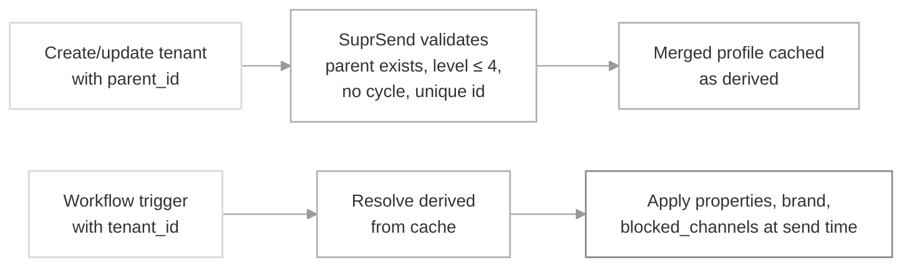

This guide walks you through building a real hierarchy: creating a child tenant under a parent, inspecting what it inherits, overriding one field without breaking inheritance for the rest, moving a tenant to a new parent, and deleting a tenant with children safely.

Read [Sub-tenants](/docs/sub-tenants) first for the concept, the merge rules, and what does and does not cascade in this release.

## How the pieces fit



You configure the tree via the tenant APIs; SuprSend does the merge; every workflow trigger reads the merged profile from cache.

## Prerequisites

- A SuprSend workspace and a workspace API key. Grab it from **Developers → API Keys** in the [dashboard](https://app.suprsend.com/).
- Access to the tenants area of the dashboard (**Tenants** in the side nav).
- Sub-tenants are available on the **Enterprise plan** and as an add-on to the Business plan.
- Familiarity with the [Tenants overview](/docs/tenants) and the [Sub-tenants concept](/docs/sub-tenants).

## Step 1 — Create a root tenant (or reuse an existing one)

Any existing flat tenant is already a root — `parent_id: null`, `level: 0`. Skip to Step 2 if you already have the tenant you want as the top of the tree. Otherwise, create one.

<Tabs>
  <Tab title="Dashboard">
    1. Go to **Tenants** in the side nav and click **New Tenant**.
    2. Enter a **Tenant ID** (globally unique, ≤ 64 chars, characters `[a-z0-9_.-]`) and a **Name**.
    3. Leave the **Parent Tenant** selector empty — the tenant will be created as a root.
    4. Fill in logo, colors, social links, and any custom properties you want every descendant to inherit by default.

    <Frame caption="Create root tenant">
      <!-- SCREENSHOT: New Tenant modal with Parent Tenant selector left empty, showing branding + properties inputs -->
      
    </Frame>
  </Tab>
  <Tab title="REST API">
    ```bash cURL
    curl -X POST https://hub.suprsend.com/v1/tenant/acme-corp/ \
      -H "Authorization: Bearer __api_key__" \
      -H "Content-Type: application/json" \
      -d '{
        "name": "Acme Corp",
        "logo": "https://acme.com/logo.png",
        "primary_color": "#0055ff",
        "social_links": { "website": "https://acme.com", "twitter": "@acme" },
        "properties": { "support_email": "help@acme.com", "region": "US" }
      }'
    ```

    Omit `parent_id` (or send `null`) to create a root tenant.
  </Tab>
  <Tab title="Node.js">
    ```javascript
    const { Suprsend } = require("@suprsend/node-sdk");
    const supr = new Suprsend("WORKSPACE_KEY", "WORKSPACE_SECRET");

    await supr.tenants.upsert("acme-corp", {
      name: "Acme Corp",
      logo: "https://acme.com/logo.png",
      primary_color: "#0055ff",
      social_links: { website: "https://acme.com", twitter: "@acme" },
      properties: { support_email: "help@acme.com", region: "US" },
    });
    ```
  </Tab>
  <Tab title="Python">
    ```python
    from suprsend import Suprsend

    supr = Suprsend("WORKSPACE_KEY", "WORKSPACE_SECRET")

    supr.tenants.upsert("acme-corp", {
        "name": "Acme Corp",
        "logo": "https://acme.com/logo.png",
        "primary_color": "#0055ff",
        "social_links": {"website": "https://acme.com", "twitter": "@acme"},
        "properties": {"support_email": "help@acme.com", "region": "US"},
    })
    ```
  </Tab>
  <Tab title="AI agent / MCP">
    With the [SuprSend MCP server](/reference/mcp-overview) connected to Claude, Cursor, or another agent, hand it a prompt like:

    ```text
    Create a root tenant in my staging workspace with id "acme-corp" and name "Acme Corp".
    Pull the logo, primary color, and social links from https://acme.com and set
    support_email = "help@acme.com" and region = "US" as custom properties.
    ```

    The agent calls the `upsert_suprsend_tenant` tool under the hood.
  </Tab>
</Tabs>

## Step 2 — Create a child tenant

Add a `parent_id` pointing at the tenant you want as the parent. That's the only difference from creating a root — everything else is the same shape.

<Tabs>
  <Tab title="Dashboard">
    1. Open the parent tenant's detail page and click **Add Child Tenant** (or open **New Tenant** and pick the parent from the **Parent Tenant** selector).
    2. Enter the child's **Tenant ID** and **Name**.
    3. Notice the branding and properties tabs show the parent's values as **inherited (read-only)**. Anything you leave untouched will continue to inherit live.
    4. Optionally override individual fields — those become the child's local values.

    <Frame caption="Create sub-tenant with Parent Tenant selected">
      <!-- SCREENSHOT: New Tenant modal with Parent Tenant = acme-corp; branding preview showing acme-corp's logo/colors as inherited placeholders -->
      
    </Frame>
  </Tab>
  <Tab title="REST API">
    ```bash cURL
    curl -X POST https://hub.suprsend.com/v1/tenant/eu/ \
      -H "Authorization: Bearer __api_key__" \
      -H "Content-Type: application/json" \
      -d '{
        "name": "Acme EU",
        "parent_id": "acme-corp",
        "properties": { "support_email": "eu@acme.com", "division": "EU" },
        "social_links": { "website": "https://acme.eu" }
      }'
    ```

    Fields you don't send stay unset locally and inherit from the parent chain. The response includes both the local values (top level) and the merged view (`derived`):

    ```json
    {
      "id": "eu",
      "name": "Acme EU",
      "parent_id": "acme-corp",
      "ancestors": ["acme-corp", "eu"],
      "level": 1,
      "logo": null,
      "primary_color": null,
      "social_links": { "website": "https://acme.eu" },
      "properties": { "support_email": "eu@acme.com", "division": "EU" },
      "derived": {
        "logo": "https://acme.com/logo.png",
        "primary_color": "#0055ff",
        "social_links": { "website": "https://acme.eu", "twitter": "@acme" },
        "properties": {
          "support_email": "eu@acme.com",
          "region": "US",
          "division": "EU"
        }
      }
    }
    ```
  </Tab>
  <Tab title="Node.js">
    ```javascript
    await supr.tenants.upsert("eu", {
      name: "Acme EU",
      parent_id: "acme-corp",
      properties: { support_email: "eu@acme.com", division: "EU" },
      social_links: { website: "https://acme.eu" },
    });
    ```
  </Tab>
  <Tab title="Python">
    ```python
    supr.tenants.upsert("eu", {
        "name": "Acme EU",
        "parent_id": "acme-corp",
        "properties": {"support_email": "eu@acme.com", "division": "EU"},
        "social_links": {"website": "https://acme.eu"},
    })
    ```
  </Tab>
</Tabs>

<Check>
  Fetch the child right after creating it and confirm `derived.logo` and `derived.primary_color` show the parent's values, while `derived.social_links.website` shows the child's local override. That's inheritance working.
</Check>

## Step 3 — Override one field without breaking others

The merge is **per key**. Overriding one property or one inner social-link key leaves every other key inheriting from the parent chain.

### Custom properties

Use `PATCH /v1/tenant/{tenant_id}/properties/` with `$set` / `$unset` operations to change a single property without touching the rest of the object.

```bash cURL
curl -X PATCH https://hub.suprsend.com/v1/tenant/eu-sales/properties/ \
  -H "Authorization: Bearer __api_key__" \
  -H "Content-Type: application/json" \
  -d '{
    "operations": [
      { "$set": { "team_size": 42 } },
      { "$unset": ["division"] }
    ]
  }'
```

- `$set` — merges the given object into `properties`. Existing keys not in the payload stay untouched.
- `$unset` — removes the listed keys from the tenant's local `properties`. If an ancestor still has the key set, `derived.properties` will fall back to the inherited value; otherwise the key disappears from `derived` too.
- Only custom properties are settable this way. Reserved fields (`id`, `name`) can't be set or unset here.

To **replace the entire properties object** — dropping all local values in one shot — send `properties` at the top level instead:

```bash cURL
curl -X PATCH https://hub.suprsend.com/v1/tenant/eu-sales/properties/ \
  -H "Authorization: Bearer __api_key__" \
  -H "Content-Type: application/json" \
  -d '{ "properties": { "team_size": 42 } }'
```

<Warning>
  The top-level `properties` form **replaces** the tenant's entire local properties object. Anything not in the payload is dropped — inherited keys still resolve via `derived`, but any local overrides you'd set are gone. Use the `operations` form when you want to change a single key.
</Warning>

### Brand fields

Send only the fields you want to set. Fields you omit stay unset locally and continue to inherit.

```bash cURL
curl -X POST https://hub.suprsend.com/v1/tenant/eu-sales/ \
  -H "Authorization: Bearer __api_key__" \
  -H "Content-Type: application/json" \
  -d '{
    "primary_color": "#ff0055"
  }'
```

For `social_links`, send only the inner keys you want to override — the omitted inner keys keep inheriting:

```bash cURL
curl -X POST https://hub.suprsend.com/v1/tenant/eu-sales/ \
  -H "Authorization: Bearer __api_key__" \
  -H "Content-Type: application/json" \
  -d '{
    "social_links": { "website": "https://sales.acme.eu" }
  }'
```

The child's `derived.social_links.website` becomes `"https://sales.acme.eu"`, while `derived.social_links.twitter` still resolves to the root's `"@acme"`.

## Step 4 — Block a channel across a subtree

Set `blocked_channels` on the tenant to make one or more channels unavailable for every user under that tenant — and every descendant beneath it.

```bash cURL
curl -X POST https://hub.suprsend.com/v1/tenant/acme-corp/ \
  -H "Authorization: Bearer __api_key__" \
  -H "Content-Type: application/json" \
  -d '{ "blocked_channels": ["sms"] }'
```

A descendant's **effective `blocked_channels` is the union of its own and every ancestor's**. Descendants can add channels to the block list; they cannot remove one an ancestor set.

```text
acme-corp:  blocked_channels = ["sms"]
  eu:       blocked_channels = ["whatsapp"]
    eu-sales effective = ["sms", "whatsapp"]   ← union across the chain
```

For category-level enforcement (turn a category off for a whole subtree, force a channel block per category, or hide a category from user preference pages) see [tenant preferences](/docs/tenant-preference).

## Step 5 — Browse the tree

The list tenants endpoint takes a few new query parameters that let you walk the hierarchy without pulling everything back.

| Query param | Returns |
|---|---|
| `parent_id=<id>` | Direct children of the given tenant only. |
| `ancestor[]=<id>` | Every descendant of the given tenant, at any depth. |
| `level[]=<n>` | Tenants at the given level. `level[]=0` returns all root tenants. Repeat the param to combine multiple levels. |

Every tenant in the list response includes `ancestors`, `level`, and `children_count`, so you can build a client-side tree view from a single call.

```bash cURL
# Direct children of acme-corp
curl -H "Authorization: Bearer __api_key__" \
  "https://hub.suprsend.com/v1/tenant/?parent_id=acme-corp"

# Every tenant under acme-corp, any depth
curl -H "Authorization: Bearer __api_key__" \
  "https://hub.suprsend.com/v1/tenant/?ancestor[]=acme-corp"

# All root tenants in the workspace
curl -H "Authorization: Bearer __api_key__" \
  "https://hub.suprsend.com/v1/tenant/?level[]=0"
```

<Tip>
  Use `children_count` on each list item to decide whether a tree node is expandable in your UI without making an extra call.
</Tip>

## Step 6 — Re-parent a tenant

Change the `parent_id` on an existing tenant to move it (and its entire subtree) somewhere else in the tree. Pass `parent_id: null` (or an empty string) to promote it back to a root.

<Tabs>
  <Tab title="Dashboard">
    1. Open the tenant's detail page.
    2. Click the **Change Parent** action next to the breadcrumb.
    3. Pick the new parent from the selector. Tenants that would push the moved subtree past level 4 are disabled.
    4. Confirm — the modal previews how many children are moving with it and warns that inherited values will recompute.

    <Frame caption="Re-parent confirmation modal">
      <!-- SCREENSHOT: Change parent modal showing "Moving eu-sales (and 3 children) from eu to acme-corp. Inherited values will be recomputed." -->
      
    </Frame>
  </Tab>
  <Tab title="REST API">
    ```bash cURL
    curl -X POST https://hub.suprsend.com/v1/tenant/eu-sales/ \
      -H "Authorization: Bearer __api_key__" \
      -H "Content-Type: application/json" \
      -d '{ "parent_id": "acme-corp" }'
    ```

    Local overrides on the moved tenant (and every descendant) stay intact. The `derived` field on the response is recomputed from the new chain — inherited values may have changed.
  </Tab>
</Tabs>

<Warning>
  A re-parent that would push any tenant in the moved subtree past level 4 is rejected with a 400. So is any move that would create a cycle (moving a tenant under one of its own descendants).
</Warning>

## Step 7 — Delete a tenant

Deletes are always soft — the tenant and its history persist in the database with an `is_deleted` flag; in-flight notifications complete with the settings that were in effect at trigger time. When the tenant has children, you decide what happens to them via `children_action`.

| `children_action` | What happens to descendants |
|---|---|
| omitted / `null` (default) | Children become **root tenants** (orphaned). Their data persists; `derived` recomputes without the deleted parent in the chain. |
| `"reassign"` | Children re-parent to the tenant given in `reassign_to`. Validates the resulting subtree still fits within 5 levels. `reassign_to` is required. |
| `"delete"` | Every descendant is recursively soft-deleted. |

### Delete a tenant with children

<Tabs>
  <Tab title="Dashboard">
    On the tenant detail page, click **Delete**. If the tenant has children, the confirmation modal presents three options — reassign to a specific tenant, leave children as roots, or delete them all — with an impact summary of how many tenants are affected.

    <Frame caption="Delete modal with children handling options">
      <!-- SCREENSHOT: Delete confirmation with three radio options: reassign, leave as root, delete all; impact summary "3 child tenants affected" -->
      
    </Frame>
  </Tab>
  <Tab title="REST API">
    ```bash cURL
    # Reassign children to a new parent
    curl -X DELETE https://hub.suprsend.com/v1/tenant/eu/ \
      -H "Authorization: Bearer __api_key__" \
      -H "Content-Type: application/json" \
      -d '{
        "children_action": "reassign",
        "reassign_to": "acme-corp"
      }'

    # Recursively delete every descendant
    curl -X DELETE https://hub.suprsend.com/v1/tenant/eu/ \
      -H "Authorization: Bearer __api_key__" \
      -H "Content-Type: application/json" \
      -d '{ "children_action": "delete" }'

    # Leave children as root tenants (default)
    curl -X DELETE https://hub.suprsend.com/v1/tenant/eu/ \
      -H "Authorization: Bearer __api_key__" \
      -H "Content-Type: application/json" \
      -d '{}'
    ```

    All variants return `204 No Content` on success.
  </Tab>
</Tabs>

## Configuration reference

Fields on the tenant resource introduced or renamed for sub-tenants:

<ParamField body="id" type="string" required>
  Tenant identifier. Renamed from `tenant_id` — both spellings continue to work in requests and responses. Globally unique within the workspace; ≤ 64 chars; matches `[a-z0-9_.-]` (the dot is newly permitted).
</ParamField>

<ParamField body="name" type="string" required>
  Human-readable tenant name. Renamed from `tenant_name` — both spellings continue to work.
</ParamField>

<ParamField body="parent_id" type="string | null" default="null">
  ID of the hierarchical parent. `null` (or omitted) makes the tenant a root. Must reference an existing tenant. Setting it to a new value moves the tenant to that new parent.
</ParamField>

<ParamField body="blocked_channels" type="string[] | null" default="null">
  Channels globally unavailable for this tenant. Union with every ancestor's `blocked_channels` at trigger time. Descendants can add channels but cannot remove ones an ancestor set. Valid channel keys: `email`, `sms`, `whatsapp`, `androidpush`, `iospush`, `webpush`, `slack`, `ms_teams`, `inbox`.
</ParamField>

<ResponseField name="ancestors" type="string[]">
  Ordered chain of tenant `id`s from root to this tenant, inclusive. Example: `["acme-corp", "eu", "eu-sales"]`. Root tenants return `["<own-id>"]`.
</ResponseField>

<ResponseField name="level" type="integer">
  Position in the tree. Root = `0`; the maximum allowed level is `4` (5 levels total).
</ResponseField>

<ResponseField name="children_count" type="integer">
  Count of direct children. Returned on list responses.
</ResponseField>

<ResponseField name="derived" type="object">
  Effective resolved values for `logo`, `primary_color`, `secondary_color`, `tertiary_color`, `preference_page_url`, `social_links`, and `properties` after walking the ancestor chain. Read-only. Refreshed synchronously on every write that could affect it.
</ResponseField>

Delete request body:

<ParamField body="children_action" type="string" default="omitted">
  How to handle descendants when deleting a tenant. Valid values: `"reassign"`, `"delete"`. Omitting the field leaves children as root-level tenants.
</ParamField>

<ParamField body="reassign_to" type="string">
  Target parent for descendants when `children_action = "reassign"`. Required in that case; ignored (400 if sent) otherwise.
</ParamField>

Full endpoint reference: [Create / update tenant](/reference/create-update-tenants), [Get tenant](/reference/get-tenant-data), [List tenants](/reference/get-tenant-list), [Delete tenant](/reference/delete-tenant).

## Test it

Before you point production workflows at a new hierarchy, sanity-check the merged view:

1. **Get the leaf.** Fetch the deepest tenant with `GET /v1/tenant/{tenant_id}/`. Check `derived` matches what you'd expect from walking the tree by hand.
2. **Change an ancestor property.** Update a property on the root, then fetch the leaf again. `derived` should reflect the new value immediately — you don't need to invalidate anything.
3. **Trigger a workflow with the leaf's `tenant_id`.** Confirm `$tenant.*` variables in the template render with the merged values (leaf's overrides where set, ancestor's values elsewhere).

## Edge cases and behavior

<AccordionGroup>
  <Accordion title="What if I create a tenant with a `parent_id` that doesn't exist?">
    The create is rejected with `400 Bad Request` and the message names the missing parent. Fix the ID and retry.
  </Accordion>

  <Accordion title="What if a re-parent would push my subtree past level 4?">
    Rejected with `400 Bad Request`. The error message includes the moved tenant's name, the depth of its subtree, and the target parent's level so you can see exactly what busted the limit. Restructure by re-parenting deeper nodes closer to the root first, then retrying.
  </Accordion>

  <Accordion title="What happens to in-flight notifications when I delete or re-parent?">
    They complete with the settings that were in effect when the workflow was triggered. Deletes and re-parents don't cancel or reroute anything already in flight.
  </Accordion>

  <Accordion title="Can I recreate a tenant with the same `id` as a deleted one?">
    Yes. The new tenant is a brand-new record — it doesn't inherit users, subscriptions, or history from the deleted one. The old record stays soft-deleted in the database but is no longer reachable by `id`.
  </Accordion>

  <Accordion title="What happens on the `default` tenant?">
    The `default` tenant behaves as a root: `parent_id: null`, `level: 0`, `ancestors: ["default"]`. You can't set it as a child of another tenant, but you can create children under it. Un-tenanted triggers still resolve against `default` exactly as before.
  </Accordion>

  <Accordion title="Which fields don't cascade in this phase?">
    Template variants, tenant vendors, user-tenant mapping, per-category default preferences, and inbox scoping all resolve against the triggered tenant only. Only `properties`, brand fields, tenant-level `blocked_channels`, and the enforcing category-level fields (`enabled_for_tenant`, `visible_to_subscriber`, per-category `blocked_channels`) walk the chain.
  </Accordion>
</AccordionGroup>

## Troubleshooting

<AccordionGroup>
  <Accordion title="`Tenant id already in use`">
    Tenant IDs are globally unique within a workspace — the ID can't match any existing tenant (including its own siblings, ancestors, or descendants). Soft-deleted tenants don't reserve the ID; a new tenant with the same ID as a deleted one is allowed and creates a fresh record. Pick a different ID or delete the existing tenant first.
  </Accordion>

  <Accordion title="`Circular reference detected`">
    A create or re-parent tried to set a tenant's parent to one of its own descendants. Trace the proposed parent's ancestor chain — it contains the tenant you're moving. Break the cycle by moving the descendant somewhere neutral first (or promoting it to a root), then retrying the original move.
  </Accordion>

  <Accordion title="`Operation would exceed the maximum of 5 levels`">
    The move (or create) would push some tenant in the affected subtree to level 5 or beyond. The error names the tenant's subtree depth and the target parent's level. Options: re-parent under a shallower parent, or flatten part of the subtree first by re-parenting deeper nodes upward.
  </Accordion>

  <Accordion title="My child tenant's `derived` doesn't reflect my parent update.">
    The cache refresh is synchronous on the write path, so a fresh `GET` after the parent's `POST` should always return the updated `derived`. If it doesn't, check that (a) the write against the parent actually returned 200, (b) you're reading the correct child (`parent_id` and `ancestors` match your expectation), and (c) the field isn't overridden locally on the child — a local value always wins over an inherited one.
  </Accordion>

  <Accordion title="`reassign_to` is required when `children_action = reassign`">
    You sent `"children_action": "reassign"` in the delete body without `reassign_to`. Add the target parent's `id`, or use one of the other actions (`"delete"` to cascade-delete, or omit the field entirely to leave children as roots).
  </Accordion>

  <Accordion title="My `blocked_channels` change didn't take effect for a descendant.">
    A `blocked_channels` block at any level cascades and is irreversible downward, but the descendant's effective list is the **union** across the chain. Fetch the descendant and check `derived.blocked_channels` — the channel should be present. If you were trying to *unblock* a channel by removing it from a child's `blocked_channels`, that's not possible: an ancestor's block always wins. Remove it at the level where it was originally set.
  </Accordion>
</AccordionGroup>

## Next steps

<CardGroup cols={2}>
  <Card title="Tenant preferences" icon="sliders" href="/docs/tenant-preference">
    Lock categories and channels down for an entire subtree using enforcing preference settings.
  </Card>
  <Card title="Tenant templates" icon="paintbrush" href="/docs/tenant-templates">
    Reference `derived` brand values and custom properties in your template content via `$tenant.*` variables.
  </Card>
  <Card title="Trigger a tenant workflow" icon="bolt" href="/docs/tenant-workflows">
    Pass the leaf tenant's `id` at trigger time and let SuprSend resolve the merged profile.
  </Card>
  <Card title="Tenant API reference" icon="code" href="/reference/create-update-tenants">
    Full request/response schemas for every tenant endpoint, including the new hierarchy fields.
  </Card>
</CardGroup>
