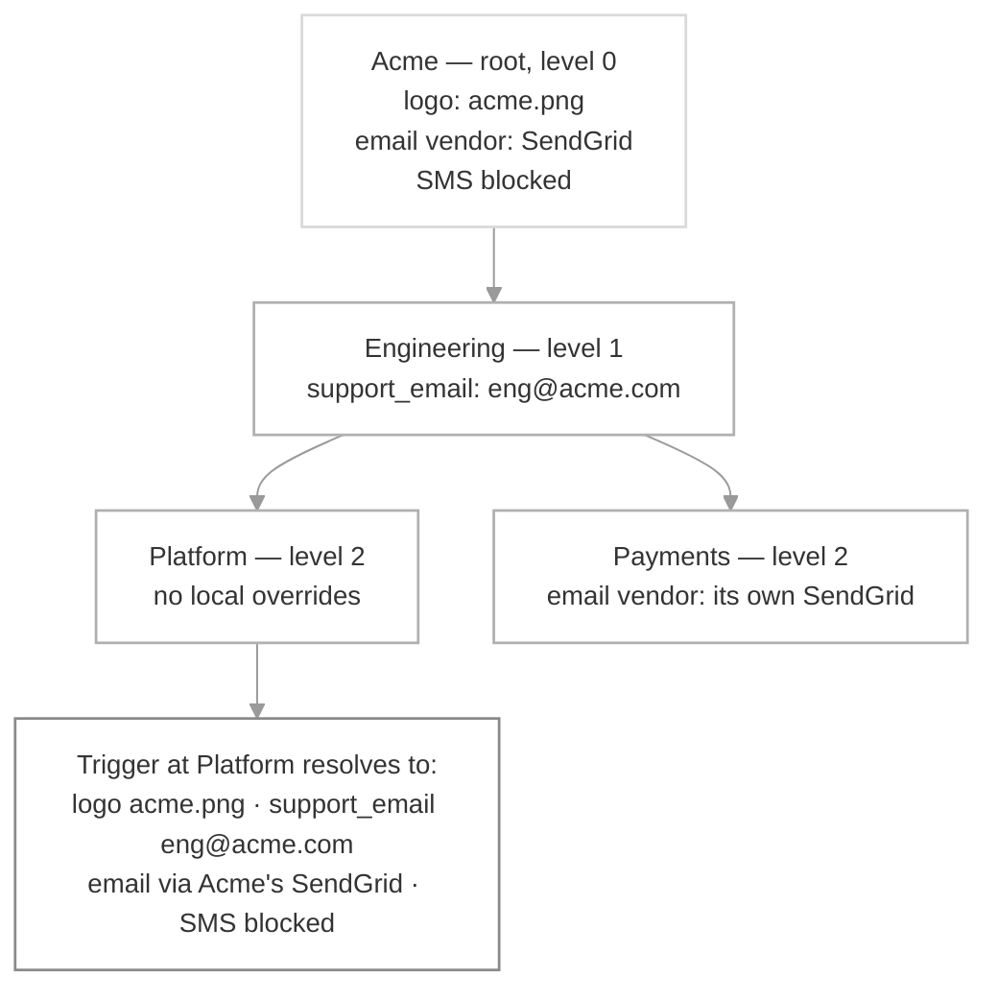

A sub-tenant is a [tenant](/docs/tenants) that has a parent. It inherits the parent's configuration — properties and branding, default preferences, vendors, template variants, and per-tenant user profiles — and sets its own value only where it differs.

Sub-tenants nest. A sub-tenant can be a parent to sub-tenants of its own, up to 5 levels in total.

Without a parent, every tenant is self-contained. A customer with ten projects means configuring the same branding, categories, and vendors ten times, then keeping all ten in sync by hand. With a parent, you configure once at the top and override only where a level is genuinely different.

## How inheritance works

| Term | Meaning |
|---|---|
| **Root** | A tenant with no parent. Level 0. |
| **Parent** | The tenant directly above. Each tenant has at most one. |
| **Ancestors** | The chain from the root down to a tenant, including the tenant itself. |
| **Level** | Depth in the tree. Root is level 0; the deepest allowed is level 4. |
| **Effective value** | The value actually applied after walking the chain. |

Two rules cover every setting:

- **Defaults flow top-down.** Start at the root and walk down to the tenant you triggered at. The **lowest** tenant that has explicitly set a value wins. This is how properties, branding, vendors, user profiles, and a tenant's default preferences — including their digest schedules and condition values — resolve.
- **A user's own settings flow bottom-up.** Start at the tenant you triggered at and walk up. The **first** value found wins. This is how a user's own preferences, digest schedules, and condition values resolve.

The full precedence order stays `user > tenant > category default` — sub-tenants change how the tenant part of that chain is resolved, not the order. See [Preference evaluation](/docs/preference-evaluation).

Two things are true of every inherited setting:

- **Resolution is live.** Nothing is copied when you create a sub-tenant. Editing a parent immediately changes every descendant that hasn't overridden the same value.
- **Merging is shallow.** Values merge one key at a time. Overriding one key never stops other keys from inheriting, and nested structures are not deep-merged.

## What inherits

| Setting | How it resolves | Unit of override |
|---|---|---|
| Properties and [branding](/docs/tenant-templates) | Top-down | One key. Overriding `support_email` still inherits `company_name`. |
| [Default preferences](/docs/tenant-preference) for a category | Top-down | The whole category. A child can't override the opt-in channels and keep the parent's opt-in/opt-out setting. |
| Blocked categories and blocked channels | Top-down, and cannot be reversed | See [Settings that can't be overridden](#settings-that-cant-be-overridden). |
| Default digest schedules and condition values | Top-down | One value. |
| [Per-tenant user profile](/docs/user-tenant-mapping) | Top-down over the user's global profile | One field. |
| A user's own preferences | Bottom-up | One category. |
| A user's own digest schedule and condition values | Bottom-up | One value. |
| [Template variants](/docs/template-variants) | Closest tenant in the chain wins | One variant. |
| [Vendors](/docs/tenant-vendor) | Top-down | One channel. Overriding SMS still inherits the parent's email vendor. |

A tenant's `id` and `name` are never inherited. Every tenant has its own.

**Template variants.** At send time SuprSend walks the chain from the triggered tenant up to the root, then falls back to variants with no tenant filter. At each level it tries the recipient's locale from exact to broader to the template default (`es-MX` → `es` → `en`). The first variant whose channel, tenant, and locale match — and whose hard conditions pass — is used. **Tenant proximity beats locale specificity**: a closer tenant's `en` variant wins over a farther tenant's exact-locale variant. If nothing matches anywhere, the template's default variant is sent.

**Vendors.** A descendant sees only *that* an ancestor covers a channel, never the ancestor's credentials. If no tenant in the chain configures a channel, the workspace vendor applies.

**Digest schedules and condition values.** These resolve as `user value > tenant default > category default`, unchanged from [preference evaluation](/docs/preference-evaluation#resolving-digest-schedule-and-condition-values). Across a hierarchy each half of that resolves in its own direction: the tenant default top-down, the user's own choice bottom-up.

**User profiles.** A user contributes a profile only at the levels they're actually subscribed to. Levels they skip add nothing — they don't reset or blank out anything already resolved.

## Settings that can't be overridden

Most settings can be overridden — by a tenant lower down, or by the user. Three can't be, which is what makes them safe to rely on for compliance.

**Blocked categories** (`blocked_for_tenant`) — when any ancestor blocks a category:

- It is hidden from the preference centre for every descendant.
- No notifications are delivered for it at any descendant, even one that marks the category as `cant_unsubscribe` with mandatory channels.
- A descendant cannot unblock it. The attempt is rejected.
- A descendant **can** block a category an ancestor left unblocked. Blocking only ever moves down.

**Blocked channels** (`blocked_channels`) — a channel blocked by any ancestor is blocked for the whole subtree. A descendant's effective list is the union of its own blocks and every ancestor's. Descendants can add channels; they cannot remove an inherited one.

**Mandatory categories at the triggered tenant** — normally the user's own preference wins. The exception is a category whose resolved setting at the triggered tenant is `cant_unsubscribe`: the notification sends regardless of what the user chose, and the category's mandatory channels are always delivered. Trigger the same category somewhere it isn't `cant_unsubscribe` and the user's opt-out is respected as usual.

<Note>
`cant_unsubscribe` is not a separate cascade. It is one of the values a category's preference can take, and it follows normal override rules — a child can set it even where the parent didn't.
</Note>

## Sharing users across the hierarchy

Whether one user can belong to more than one tenant is controlled by the workspace's [`user_tenancy_mode`](/docs/user-tenant-mapping).

| Mode | Behavior across a hierarchy |
|---|---|
| `exclusive` | A user belongs to exactly one tenant. A second subscription is rejected. SuprSend still resolves that tenant's full ancestor chain, so you don't subscribe the user at each ancestor. |
| `shared` | A user can belong to several tenants. A **sharing boundary level** sets how far across the tree that is allowed: users are shared freely inside any subtree rooted at that level, and never across two different tenants at that level. |

On `shared`, there is no boundary until you set one — a user can belong to any tenant in the workspace.

Set the boundary at level 0 and each root tenant's subtree becomes its own pool: the teams and projects inside one customer share users freely, and no user ever crosses from one customer to another. Subscribing a user to a tenant outside their allowed subtree returns a `400`.

## When to use sub-tenants

Use sub-tenants when a group inside a customer needs most of that customer's setup and differs in a few specific places.

- **Regional structure** — HQ → Regional office → Branch. The branch inherits the HQ's branding and compliance rules and overrides its own contact details.
- **Projects inside an org** — Organization → Team → Project. An org admin sets category defaults once; a project turns one category off for itself.
- **White-label and reseller** — Agency → Client brand → the client's own customers. Each brand connects its own Twilio, SendGrid, or FCM account so messages send from its own provider and reputation, and inherits everything it doesn't set. Because the tree goes 5 levels deep, your customer can hand the same control down another level.
- **Multiple apps under one company** — Company → App A / App B. Each app overrides the vendor (its own FCM or APNs project, its own SMS sender) while inheriting the company's shared templates and branding. The same person's App A notifications go to their App A push token through App A's vendor, and their App B notifications to the App B token.
- **Regulated channels** — a parent blocks SMS for the whole subtree, and no team below can turn it back on.

## Sub-tenants, root tenants, and objects

| | Sub-tenant | Separate root tenant | [Object](/docs/objects) |
|---|---|---|---|
| **What it is** | A tenant with a parent | A tenant with no parent | A non-user entity — a team, a channel, a shared inbox — that users subscribe to |
| **Inherits settings from a parent** | Yes | No | No |
| **Provides tenant branding, template variants, and vendor routing** | Yes | Yes | No |
| **Reaches everyone in a group from one trigger** | No | No | Yes |
| **Use when** | A group inside a customer needs most of the customer's setup and differs in a few places | Two customers share nothing and should never affect each other | You need to notify whoever is currently in a group |

An object has its own channels, properties, and [preferences](/docs/objects#update-object-profile-and-preferences), but they apply when the object itself is the recipient — they are not applied to its subscribers.

Sub-tenants and objects solve different problems and are often used together: the sub-tenant carries the settings, the object carries the membership. For choosing between a tenant and a separate workspace in the first place, see [Modelling your business customers](/docs/guides/modelling-customers-workspace-vs-tenant).

## Limits and behavior

| Topic | Behavior |
|---|---|
| **Maximum depth** | 5 levels (level 0–4). Creating or re-parenting beyond it returns a `400`. |
| **One parent** | Each tenant has at most one parent. |
| **Circular references** | Rejected when you create or re-parent, with a `400`. |
| **Merge depth** | Shallow, per key. Nested structures are not deep-merged. |
| **No snapshot** | Nothing is copied at create time. A parent's edit takes effect on the next read or trigger. |
| **Re-parenting** | The whole subtree moves. User subscriptions move with it, local overrides are kept, and effective values are recomputed from the new chain immediately. |
| **Deleting a parent** | Choose what happens to its children: move them under another tenant, delete the subtree, or leave them as roots (the default). Deletes are soft; users on the deleted tenant are auto-unsubscribed. |
| **Recreating a deleted tenant** | A tenant recreated with a deleted tenant's `id` is a new record with no user associations. The `id` stays reserved. |
| **In-flight notifications** | Always complete with the settings resolved at trigger time, including across deletes and re-parents. |
| **Triggering** | Unchanged. Pass the `tenant_id` of the tenant you're triggering at; the chain resolves automatically. |

## FAQ

<AccordionGroup>
  <Accordion title="Do I need to subscribe a user at every level of the tree?">
    No. Subscribe them where they actually belong. SuprSend resolves the full ancestor chain from the tenant you trigger at, and levels the user isn't subscribed to contribute nothing.
  </Accordion>

  <Accordion title="If I change a parent's branding, do existing sub-tenants update?">
    Yes, immediately, for every key they haven't overridden themselves. Nothing was copied at create time, so there is no re-sync step.
  </Accordion>

  <Accordion title="Can a sub-tenant send through its own delivery vendors?">
    Yes, per channel. A sub-tenant can plug in its own SMS vendor and keep inheriting the parent's email vendor. A descendant never sees an ancestor's credentials — only that the channel is covered.
  </Accordion>

  <Accordion title="Can a sub-tenant unblock a channel or category its parent blocked?">
    No. Blocked channels and blocked categories only move down the tree. A descendant can add blocks of its own, and the attempt to remove an inherited one is rejected.
  </Accordion>

  <Accordion title="A user opted out, but the category is marked cant_unsubscribe. What sends?">
    The notification sends, and the category's mandatory channels are delivered. This applies when the resolved setting at the tenant you triggered at is `cant_unsubscribe`. Trigger the same category at a tenant where it isn't, and the user's opt-out is respected.
  </Accordion>

  <Accordion title="Does a sub-tenant need its own templates?">
    No. It uses the closest matching [template variant](/docs/template-variants) in its chain and falls back to the template's default variant. Add a variant at a sub-tenant only when its content genuinely differs.
  </Accordion>
</AccordionGroup>

## Next steps

<CardGroup cols={2}>
  <Card title="Tenants" icon="layer-group" href="/docs/tenants">
    What tenants are and what you can customize per tenant.
  </Card>

  <Card title="Tenant preferences" icon="sliders" href="/docs/tenant-preference">
    Set admin defaults and block categories or channels for a tenant.
  </Card>

  <Card title="Tenant vendors" icon="envelope" href="/docs/tenant-vendor">
    Route a tenant's notifications through its own providers.
  </Card>

  <Card title="Template variants" icon="paintbrush" href="/docs/template-variants">
    Give a tenant its own content, layout, or channels.
  </Card>
</CardGroup>
