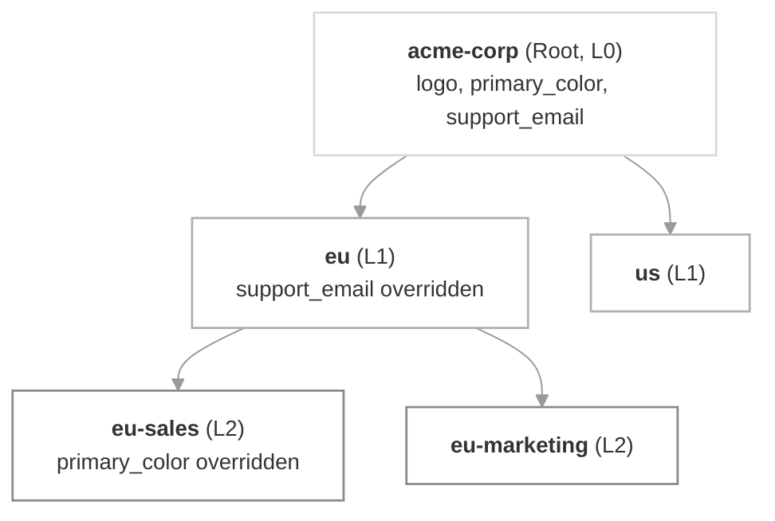

[Tenants](/docs/tenants) in SuprSend used to live in a flat list. **Sub-tenants** let you arrange them into trees (up to **5 levels deep**) where a child tenant inherits its parent's configuration automatically — and each level only overrides the parts that are actually different.

Use it to model organizational hierarchies that map to how your product is sold or how your customers are structured:

| Use case | Example hierarchy |
|---|---|
| Financial services | HQ → Regional Office → Branch |
| Project management SaaS | Organization → Team → Project |
| Enterprise | Company → Division → Department → Team |
| Multi-app workspace | Parent Org → App A / App B / App C |
| Reseller / white-label | Agency → Client Brand → Sub-brand |

## How it works

Every tenant has an optional `parent_id`. Setting it makes the tenant a **child** of that parent; leaving it `null` makes the tenant a **root**. SuprSend tracks the full chain of parents in an `ancestors` array and the tenant's position in the tree in a `level` field (0 = root, 4 = deepest allowed). At trigger time, SuprSend walks that chain and resolves each field to the value from the **lowest tenant that has it set** — the child's own value if it has one, otherwise the closest ancestor's.



Triggering a workflow at `eu-sales` resolves `logo` from the root, `support_email` from `eu`, and `primary_color` from the tenant itself — one merged view of what applies at send time.

## What cascades in phase 1

The property and brand-field cascade is live in this release. The rest of SuprSend's tenant surface continues to work exactly as today — flat, no hierarchy awareness.

| Feature | Cascades? | Notes |
|---|---|---|
| Custom `properties` | Yes | Per-key shallow merge — overriding one key does not block others from inheriting. |
| Brand scalars (`logo`, `primary_color`, `secondary_color`, `tertiary_color`, `preference_page_url`) | Yes | Lowest tenant that sets the field wins. |
| Brand `social_links` (object) | Yes | Per-inner-key shallow merge — override `website` without breaking `twitter` inheritance. |
| `blocked_channels` at the tenant level | Yes, and cannot be undone | A channel blocked anywhere in the chain is blocked for the entire subtree. Descendants can add channels but cannot remove an ancestor's block. |
| Category-level `enabled_for_tenant: false`, `blocked_channels`, `visible_to_subscriber` | Yes, and cannot be undone | Set on a preference category — locked for every descendant. See [tenant preferences](/docs/tenant-preference). |
| [Template variants](/docs/template-variants), [tenant vendors](/docs/tenant-vendor), [user-tenant mapping](/docs/user-tenant-mapping), tenant default preferences (per-category), inbox scoping | No (flat, phase 1) | Continue to resolve against the triggered tenant only. Hierarchy support ships in a later phase. |

## Resolution — a worked example

Say you set the following:

```text
acme-corp (Root, L0):
  logo:          "acme.png"
  primary_color: "#0055ff"
  properties:    { support_email: "help@acme.com", region: "US" }
  social_links:  { website: "acme.com", twitter: "@acme" }

eu (L1, parent = acme-corp):
  properties:    { support_email: "eu@acme.com", division: "EU" }
  social_links:  { website: "acme.eu" }

eu-sales (L2, parent = eu):
  primary_color: "#ff0055"
```

Triggering at `eu-sales` resolves to:

```json
{
  "logo": "acme.png",                          // inherited from acme-corp
  "primary_color": "#ff0055",                  // eu-sales's own override
  "properties": {
    "support_email": "eu@acme.com",            // inherited from eu
    "region": "US",                            // inherited from acme-corp
    "division": "EU"                           // inherited from eu
  },
  "social_links": {
    "website": "acme.eu",                      // inherited from eu (overrode acme-corp's)
    "twitter": "@acme"                         // inherited from acme-corp (eu didn't override)
  }
}
```

The Get / List / Upsert tenant endpoints return this pre-computed under a **`derived`** field on every tenant, so your app never has to walk the tree itself.

## The `derived` field

Every tenant response includes two views of the tenant:

- **The top-level fields (`logo`, `primary_color`, `properties`, `social_links`, ...) — the tenant's own local values only.** These are exactly what you set via create/update; if the field isn't overridden here, it's `null` or absent even when an ancestor has a value.
- **`derived` — the effective merged values after walking the ancestor chain.** This is what actually applies at trigger time.

```json
{
  "id": "eu-sales",
  "name": "EU Sales",
  "parent_id": "eu",
  "ancestors": ["acme-corp", "eu", "eu-sales"],
  "level": 2,

  "logo": null,
  "primary_color": "#ff0055",
  "properties": {},
  "social_links": null,

  "derived": {
    "logo": "acme.png",
    "primary_color": "#ff0055",
    "properties": {
      "support_email": "eu@acme.com",
      "region": "US",
      "division": "EU"
    },
    "social_links": { "website": "acme.eu", "twitter": "@acme" }
  }
}
```

`derived` is read-only and refreshes synchronously on every write that could affect it (an ancestor's edit, a re-parent, a delete). Reads after any mutation are guaranteed consistent.

## When to use sub-tenants

- Your customers have a **hierarchical org structure** that admins need to reflect in notification config (HQ → Branch, Org → Team → Project).
- You run a **white-label or reseller** setup and want each brand's sub-brands to inherit branding by default and only override the differences.
- You need **compliance guarantees** — a channel or category blocked at the root must stay blocked everywhere below, and no team admin below can flip it back on.
- You want admins to **configure once at the top** and let the tree fan out, instead of duplicating the same properties across every tenant.

## When NOT to use sub-tenants

- **Two completely different products or customer bases** that share nothing — use [separate workspaces](/docs/workspaces) instead. Workspaces isolate users, workflows, templates, vendors, and data.
- **A user segment inside one tenant** (e.g. "beta users") — that's a [List](/docs/lists) or an [Object](/docs/objects), not a tenant.
- **Per-tenant content variations** that don't need any parent/child relationship — use flat tenants with [template variants](/docs/template-variants).

## Key behaviors and constraints

- **5 levels max.** Root = level 0, leaf-most allowed = level 4. Every create and re-parent is validated — moves that would exceed the limit are rejected with a 400.
- **Single parent per tenant.** Every non-root tenant has exactly one `parent_id`. There's no multi-parent or DAG model.
- **Globally unique `id` within the workspace.** A tenant can't share its `id` with its parent, sibling, or any other tenant in the workspace. IDs are ≤ 64 chars, and now also accept `.` (dot) alongside the previously allowed set.
- **Live inheritance.** Editing an ancestor's field propagates immediately to descendants that haven't overridden that key. There's no copy-on-create snapshot.
- **Per-key merge, not object replacement.** Setting `social_links: { website: "..." }` on a child overrides only `website`; other inner keys (`twitter`, `linkedin`, ...) continue to inherit from the parent.
- **`blocked_channels` and category-level compliance settings cascade irreversibly downward.** A channel or category blocked at any ancestor cannot be unblocked lower down.
- **Re-parenting is safe.** Local overrides on the moved tenant stay; `derived` recomputes from the new chain. In-flight notifications complete with the settings that were in effect at trigger time.
- **Delete is soft.** A deleted tenant is marked deleted but its data persists; its `id` is not immediately reusable for restore purposes, but creating a new tenant with the same `id` starts a fresh record.
- **`default` tenant is unchanged.** Every workspace still ships with the `default` tenant. It behaves as a root tenant with no children until you give it any.

## Migration from flat tenants

You don't need to do anything. All existing tenants continue to work as roots (`parent_id: null`, `level: 0`), and every existing API keeps working. Two additions worth noting:

- The tenant resource now uses **`id`** and **`name`** at the top level (renamed from `tenant_id` / `tenant_name`). Old keys keep working in both request bodies and responses — every response includes both spellings so no client breaks.
- The `derived` field appears on every tenant response even for roots. On a root, `derived` matches the top-level values (no ancestor to inherit from).

## FAQ

<AccordionGroup>
  <Accordion title="How deep can the tree go?">
    5 levels total. Root is level 0; the deepest allowed level is 4. Creates and re-parents that would exceed this are rejected with a 400 error naming the tenant and level that busted the limit.
  </Accordion>

  <Accordion title="What happens if I edit a parent's `primary_color`?">
    Every descendant that hasn't overridden `primary_color` reflects the new value immediately. Descendants that set their own `primary_color` are unaffected. The `derived` field on every affected tenant's next Get response returns the new merged value.
  </Accordion>

  <Accordion title="Can I mix hierarchical and flat tenants in the same workspace?">
    Yes. A tenant with `parent_id: null` is a root and behaves exactly like flat tenants do today. You can adopt sub-tenants for one part of your customer base and leave the rest flat.
  </Accordion>

  <Accordion title="Do preferences, vendors, template variants, and user-tenant mapping cascade?">
    Not in this phase. Only `properties`, brand fields, tenant-level `blocked_channels`, and the category-level compliance settings (`enabled_for_tenant`, `visible_to_subscriber`, per-category `blocked_channels`) cascade. Everything else resolves against the triggered tenant only. Hierarchy support for the rest ships in a later phase — reach out to [support@suprsend.com](mailto:support@suprsend.com) if you have a use case that needs it sooner.
  </Accordion>

  <Accordion title="Can I re-parent a tenant that has children?">
    Yes. The whole subtree moves with it. SuprSend validates that the moved subtree still fits within the 5-level limit under the new parent, and rejects the move with a 400 if it doesn't. Local overrides on every tenant in the subtree stay intact; `derived` is recomputed from the new ancestor chain.
  </Accordion>

  <Accordion title="What happens to descendants when I delete a parent?">
    You control it with `children_action` on the delete request: `reassign` moves the children to a new parent, `delete` recursively soft-deletes them, and omitting the field (the default) leaves them as root-level tenants. See [Set up sub-tenants → Delete a tenant with children](/docs/sub-tenant-setup#delete-a-tenant-with-children).
  </Accordion>

  <Accordion title="Can I reuse a tenant `id` after deleting it?">
    Yes. Deletes are soft — the old record is marked deleted and no longer reachable by `id`. Creating a new tenant with the same `id` starts a brand-new record; it does **not** restore the deleted tenant's users, subscriptions, or history.
  </Accordion>

  <Accordion title="Is there a performance cost to deep hierarchies?">
    No. SuprSend maintains a per-tenant cache of the merged `derived` profile, refreshed synchronously on every write that could affect it. Trigger-time resolution reads from the cache — it doesn't walk the tree.
  </Accordion>

  <Accordion title="Which plans include sub-tenants?">
    Sub-tenants are available on the Enterprise plan and as an add-on for the Business plan, matching the multi-tenancy availability today.
  </Accordion>
</AccordionGroup>

## Next steps

<CardGroup cols={2}>
  <Card title="Set up sub-tenants" icon="wrench" href="/docs/sub-tenant-setup">
    Create a hierarchy, override at a child, re-parent, and delete safely — dashboard, REST, SDKs, and MCP.
  </Card>
  <Card title="Tenant preferences" icon="sliders" href="/docs/tenant-preference">
    Set admin defaults and lock down channels or categories for an entire subtree.
  </Card>
  <Card title="Tenants overview" icon="layer-group" href="/docs/tenants">
    Refresher on what tenants are and everything you can customize per tenant.
  </Card>
  <Card title="Create / update tenants API" icon="code" href="/reference/create-update-tenants">
    Full request/response reference for the tenant endpoints, including the new hierarchy fields.
  </Card>
</CardGroup>
