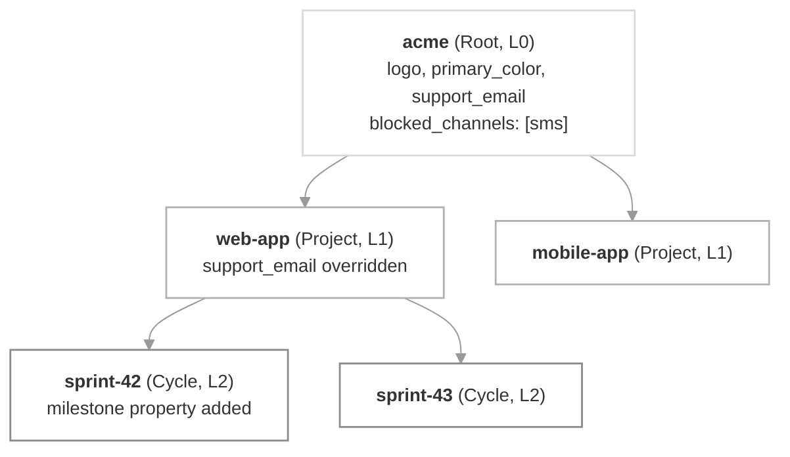

**Sub-tenants** let you nest [tenants](/docs/tenants) in a parent–child tree, up to **5 levels deep**. A child automatically inherits its parent's preferences, templates, vendors, branding, and properties — you only override what should differ at that level. Use it when you'd otherwise be copying the same setup across many tenants.

## Usecases it solves

- **Build hierarchical admin preferences.** Take a project management tool with Company → Project → Cycle. An admin turns email off at the Company and no user gets email in any Project or Cycle; turn it back on for one Cycle and only that Cycle sends email.

- **Users can set different preferences along the tenant tree.** A user picks "don't email me" at the Company and it holds for every Project and Cycle; turn email on for one Project and they get email for that Project and its Cycles, still opted out everywhere else.

- **Globally turn off a channel or category for a tenant.** Turn off email at the company level to keep costs down, block SMS at a customer's tenant when their plan doesn't include it, or turn off a specific notification category at the project level so it stays off for every tenant below.

- **Inherit templates, vendors, and branding — override where you need to.** A white-label agency can let each client brand have its own vendors (Twilio, SendGrid, FCM) and templates. A notification SaaS can give each customer a default template that their sites, projects, or downstream customers tweak.

- **Users can have a different profile per tenant.** The same person can be a team member on one Project and the project manager on another, each with the role, channels, and properties that fit that tenant. If sub-tenants represent different apps of the same customer, each app tenant stores that user's push token and channel identity for that app, while their name, email, and other shared properties come from the tenant above.


## Key concepts

| Concept | Meaning |
|---------|---------|
| **Parent** | Each tenant can have a single parent (`parent_id`). A tenant with no parent is a **root**. |
| **Level** | Depth in the tree. Root = level 0. Maximum level = 4 (5 levels total). |
| **Ancestors** | The chain of parent tenants from the root down to a given tenant's immediate parent. Does not include the tenant itself. |
| **Inheritance** | A child uses its parent's value for a setting until it explicitly sets its own. |
| **Live cascade** | Inheritance is resolved at trigger/read time — editing a parent immediately affects descendants that haven't overridden the same value. There is no copy-on-create snapshot. |
| **Locked cascade** | A setting where an ancestor's value is unioned into every descendant and cannot be removed lower down. A descendant's own value adds to the effective set; sending an empty value is accepted but the ancestor's contribution still applies. Used by tenant-level and category-level `blocked_channels`, and category-level `enabled_for_tenant: false`. |
| **Effective value** | The value actually applied at send time after walking the chain. |
| **Shallow merge** | Merging happens one key at a time. Overriding one key never blocks other keys from inheriting. Nested structures are not deep-merged. |

## How it works

Create a sub-tenant by passing `parent_id` in the [tenant upsert API](/reference/create-update-tenants) — the tenant becomes a child of that parent. Skip `parent_id` (or send `null`) to create a root tenant.

```bash cURL
curl -X POST https://hub.suprsend.com/v1/tenant/eu-sales/ \
  -H "Authorization: Bearer __api_key__" \
  -H "Content-Type: application/json" \
  -d '{
    "name": "EU Sales",
    "parent_id": "eu"
  }'
```

`parent_id` is the only field you send. SuprSend maintains and returns two more fields on every tenant response to describe its place in the tree:

- **`ancestors`** — the chain of parent IDs from the root down to the tenant's immediate parent, root first. Does not include the tenant itself.
- **`level`** — the tenant's position in the tree. `0` = root, `4` = deepest allowed.

### How inheritance resolves

At trigger time, SuprSend walks the ancestor chain to figure out which value applies. Almost everything resolves bottom up — the closest tenant to where the notification fired wins. The one exception is channel and category blocks set at the tenant level, which cascade the other way and can't be undone.

<Frame caption="How inheritance flows across a sub-tenant tree">
  
</Frame>

Here's how each field type resolves:

#### Tenant properties

Tenant's custom and reserved properties (`logo`, colors, `preference_page_url`, `social_links`) are shallow merged from parent to child.

- **Inheritance is per key**. Overriding `support_email` on a child still lets `company_name`, `region`, etc. inherit from above.
- `id` and `name` are never inherited; each tenant has its own.

```text
Company (Level 0):
{
  "company_name":  "Acme",
  "support_email": "help@acme.com"
}

Project (Level 1):
{
  "support_email": "web-support@acme.com",
  "team":          "Web"
}

Effective at Cycle (Level 2):
{
  "company_name":  "Acme",                    // inherited from Company
  "support_email": "web-support@acme.com",    // from Project — overrides one key
  "team":          "Web"                      // from Project — adds a new key
}

// Company later updates company_name → "Acme Corp"
// Cycle effective immediately shows "Acme Corp"
// (live cascade — nothing below overrode it)
```

📘 [Create / Update Tenants →](/reference/create-update-tenants) | [Update Tenant Properties →](/reference/update-tenant-properties)


#### Tenant category-level preferences

For each notification category, a tenant can either set default preferences that descendants override key by key, or hard-block the category — or specific channels within it — so no descendant can re-enable them. Update a category via the [Update Tenant Category Preference](/reference/update-tenant-preference-single-category) endpoint:

```bash cURL
curl -X PATCH https://hub.suprsend.com/v1/tenant/tenant-1/preference/category/promotions/ \
  -H "Authorization: Bearer __api_key__" \
  -H "Content-Type: application/json" \
  -d '{
    "preference": "opt_in",
    "opt_in_channels": ["email", "androidpush", "iospush"],
    "blocked_channels": ["sms"],
    "enabled_for_tenant": true,
    "visible_to_subscriber": true,
    "digest_schedule": {
      "options": [
        { "id": "daily-9am", "time": { "default_value": "09:00" } }
      ]
    },
    "conditions": [
      { "key": "severity_level", "value": "High" }
    ]
  }'
```

Each key inherits independently — send only the ones you want to change:

| Setting | Inheritance behavior |
|---|---|
| **`preference`** (with `mandatory_channels` and `opt_in_channels`) | The category default (`opt_in`, `opt_out`, or `cant_unsubscribe`). Overriding on a child replaces the whole default preference object for that category. Later changes to the parent's `preference` stop propagating to that child. |
| **`blocked_channels`** (per category) | Locked cascade. A child's effective list is the union of every ancestor's blocked channels plus its own. Descendants can *add* more channels but never *remove* an ancestor's. |
| **`enabled_for_tenant`** | Locked cascade. Once a parent disables a category (`enabled_for_tenant: false`), no descendant can re-enable it. |
| **`visible_to_subscriber`** | Inherits until the child sets its own. Once overridden, later parent changes stop propagating to that child. |
| **`digest_schedule`** | Inherits independently — overriding `preference` doesn't detach it. Keeps inheriting from the closest ancestor that set it until the child sets its own. |
| **`conditions`** | Inherits independently, same rule as `digest_schedule`. |

Here's an example flow
```text
Category "Marketing" (workspace default):
  preference: opt_in, blocked_channels: null

Company (Level 0):
  preference:       "opt_out"
  blocked_channels: ["sms"]

Project (Level 1):
  visible_to_subscriber: false
  blocked_channels: ["email"]

Effective at Cycle (Level 2):
{
  "preference":            "opt_out",     // inherited from Company (override of workspace default)
  "blocked_channels":      ["sms","email"],       // union: sms from Company + email from Project (locked cascade)
  "visible_to_subscriber": false          // inherited from Project
}

// Cycle sets blocked_channels = []                    → accepted, but effective stays ["sms"] (sms is locked from Company).
// Cycle sets blocked_channels = ["whatsapp"]          → accepted; effective becomes ["sms", "whatsapp"] (union with Company).
```

📘 [Update Tenant Category Preference →](/reference/update-tenant-preference-single-category) | [Get Tenant Category Preference →](/reference/get-tenant-preference-single-category) | [Tenant Preferences →](/docs/tenant-preference)


#### Tenant blocked channels

Set `blocked_channels` on the tenant itself (not scoped to any category) to globally turn a channel off for every user of that tenant, across every category — including root categories and ones marked `cant_unsubscribe`. Update it via the same [Create / Update Tenants](/reference/create-update-tenants) endpoint:

```bash cURL
curl -X POST https://hub.suprsend.com/v1/tenant/tenant-1/ \
  -H "Authorization: Bearer __api_key__" \
  -H "Content-Type: application/json" \
  -d '{
    "blocked_channels": ["inbox"]
  }'
```

This is a **locked cascade** — a channel blocked at any ancestor stays blocked for every tenant below. Descendants can add more blocks but never remove an ancestor's.

```text
Company (Level 0):
  blocked_channels: ["sms"]

Project (Level 1):
  blocked_channels: ["inbox"]

Effective at Cycle (Level 2):
  blocked_channels: ["sms", "inbox"]     // union of Company + Project

// Cycle sets blocked_channels = []                → accepted, but effective stays ["sms", "inbox"].
// Cycle sets blocked_channels = ["whatsapp"]      → accepted; effective becomes ["sms", "inbox", "whatsapp"].
```

📘 [Create / Update Tenants →](/reference/create-update-tenants)

#### Per-tenant user preference

A user can set their own preferences on any tenant they belong to. At trigger time, walk up from where the notification fired; the *first* value the user has explicitly set wins. Update via the [Update User Category Preference](/reference/update-user-category-preference) or [Update User Channel Preference](/reference/update-user-channel-preference) endpoint — the `tenant_id` query param scopes each write to a specific tenant:

```bash cURL
# Category preference (scoped to tenant-1)
curl -X PATCH "https://hub.suprsend.com/v1/user/user-123/preference/category/promotions/?tenant_id=tenant-1" \
  -H "Authorization: Bearer __api_key__" \
  -H "Content-Type: application/json" \
  -d '{
    "preference": "opt_in",
    "opt_out_channels": ["sms"],
    "digest_schedule": {
      "id": "daily-9am",
      "time": "09:00"
    },
    "properties": [
      { "key": "severity_level", "value": "High" }
    ]
  }'

# Channel preference (scoped to tenant-1)
curl -X PATCH "https://hub.suprsend.com/v1/user/user-123/preference/channel_preference/?tenant_id=tenant-1" \
  -H "Authorization: Bearer __api_key__" \
  -H "Content-Type: application/json" \
  -d '{
    "channel_preferences": [
      { "channel": "email", "is_restricted": true }
    ]
  }'
```

- **User Preference supports 2 granularities** — **category preferences** (opt in/out per notification category, and per channel within a category) and **channel preferences** (restrict or allow a channel across every category the user is subscribed to).
- **Category preferences fall back to the tenant's resolved default** — if the user hasn't set one anywhere in the chain, the tenant's default for that category applies.
- **Channel preferences have no tenant default** — set `is_restricted: true` on a channel to restrict, `false` to allow. If the user has never set it anywhere in the chain, the channel is treated as unrestricted. Mandatory channels on `cant_unsubscribe` categories still fire when restricted.
- **Channel preferences apply as a group** — once a child sets its own `channel_preferences`, it replaces the parent's list entirely; the parent's restrictions on other channels no longer apply at that child.
- **Within a category, each key inherits independently** — changing `preference` doesn't detach `digest_schedule` or condition `properties`; each keeps inheriting from the closest ancestor until the user sets their own.
- **`cant_unsubscribe` at the triggered tenant beats a user's opt-out** — when the tenant's resolved preference for a category is `cant_unsubscribe` at the triggered tenant, the notification still sends on that tenant's effective `mandatory_channels` even if the user opted out anywhere in the ancestor chain. Only the triggered tenant's mandatory channels apply — ancestors' mandatory channel lists don't stack.

Here's an example flow:
```text
Setup — Category "Marketing":
  Tenant defaults:
    Company:  opt_out
    Project:  cant_unsubscribe, mandatory_channels: ["email"]

  Alice's category preferences:
    Company:  opt_out             // "don't send Marketing to me from Company"

  Alice's channel preferences:
    Company:  [{ slack: is_restricted }]
    Project:  [{ email: is_restricted }]

Trigger at Cycle (under Project) for Alice:
  Category resolves to        cant_unsubscribe, mandatory: ["email"]   // Project's default wins at Cycle
  Channel preferences resolve [{ email: is_restricted }]               // Project's list wins; Company's slack is NOT merged in
  → Notification sends on email                                        // mandatory channel at triggered tenant beats
                                                                       // Alice's opt-out AND her email restriction

Trigger at Cycle under a different Project (which inherits Company's opt_out):
  Category resolves to        opt_out                                  // no override in that branch → Company default
  → Notification does NOT send                                          // walk-up finds Alice's opt_out at Company; no mandatory override
```

📘 [Update User Category Preference →](/reference/update-user-category-preference) | [Update User Channel Preference →](/reference/update-user-channel-preference) | [Get User Full Preference →](/reference/get-user-full-preference) | [User Preferences →](/docs/user-preferences)

#### Tenant vendors

For each channel (email, SMS, push, WhatsApp, …), the closest tenant in the chain that configured a vendor wins. Vendors cascade through the full tenant tree today.

- **Per channel, per vendor** — overriding the SMS vendor on a child still lets it inherit the parent's email vendor.
- **Default tenant vendor as final fallback** — if no tenant in the chain configures a vendor for a channel, the default tenant vendor for that channel applies.

<Note>
  The resolved vendor for a tenant + channel is cached for up to **5 minutes**. Adding a new vendor or re-parenting a tenant mid-flight won't interrupt notifications already in progress — the new vendor picks up on the next resolution after the cache expires.
</Note>

📘 [Tenant Vendors →](/docs/tenant-vendor)

#### Tenant templates *(coming soon)*

For a workflow triggered at any tenant, SuprSend will walk the ancestor chain and pick the closest tenant that has a matching template variant — the same rule as vendors.

- **Per channel** — a child that overrides only the email template keeps inheriting the parent's SMS template.
- **Default tenant fallback** — if no tenant in the chain has a variant for a channel, the default tenant's template applies.
- **Locale fallback within each tenant** — at every tenant along the chain, SuprSend will try the recipient's locale from most specific to least specific (e.g. `es-MX` → `es` → template default like `en`) before moving to the next tenant.
- **Tenant proximity beats locale specificity** — a closer tenant's `en` variant wins over a farther tenant's exact-locale variant. The selector picks the closest tenant that has *any* matching variant for the channel, then applies locale fallback within it.

<Tip>
  Today, a workflow triggered at any tenant uses that tenant's template variant if one exists on that exact tenant; otherwise it falls back to the **default tenant's** variant. It does not yet walk the ancestor chain.
</Tip>

📘 [Template Variants →](/docs/template-variants) | [Tenant Templates →](/docs/tenant-templates)

#### Per-tenant user profile *(coming soon)*

A user's effective profile at trigger time will be their global profile merged with each subscribed tenant's per-tenant profile, layered from root down. The lowest tenant in the chain wins on shared fields. Users won't need a subscription at every level — skipped levels contribute nothing.

<Tip>
  Today, a user's effective profile at trigger time is their global profile merged with the per-tenant profile at the **triggered tenant only** — profiles on ancestor tenants do not layer in.
</Tip>

📘 [User-Tenant Mapping →](/docs/user-tenant-mapping) | [Upsert User Tenant Profile →](/reference/upsert-user-tenant-profile)



Trigger a workflow at `sprint-42` and SuprSend takes `logo` and `primary_color` from `acme`, `support_email` from `web-app`, and the `milestone` property from `sprint-42` itself. SMS stays blocked on every send because `acme` locks it at the root — no descendant can turn it back on.

## What cascades in this release

The cascade for properties, brand fields, preferences, and tenant vendors is live today. The rest of SuprSend's tenant surface still works exactly as before — flat, with no hierarchy.

| Feature | Cascades? | Notes |
|---|---|---|
| Custom `properties` | Yes | Merges one key at a time — overriding one key doesn't stop others from being inherited. |
| Brand fields (`logo`, `primary_color`, `secondary_color`, `tertiary_color`, `preference_page_url`) | Yes | The closest tenant that sets the field wins. |
| Brand `social_links` (object) | Yes | Merges one inner key at a time — override `website` without breaking `twitter` inheritance. |
| `blocked_channels` at the tenant level | Yes, and can't be undone | A channel blocked anywhere in the chain is blocked for everything below. Descendants can add more channels but can't remove an ancestor's block. |
| Category-level `enabled_for_tenant: false`, `blocked_channels`, `visible_to_subscriber` | Yes, and can't be undone | Set on a preference category — locked for every tenant below. See [tenant preferences](/docs/tenant-preference). |
| Tenant default preferences (per-category) | Yes | The closest tenant that sets a preference for a category wins. |
| [Tenant vendors](/docs/tenant-vendor) | Yes | The closest tenant that configures a vendor for a channel wins. |
| [Template variants](/docs/template-variants), [user-tenant mapping](/docs/user-tenant-mapping), inbox scoping | No (flat) | Continue to resolve against the triggered tenant only. Template variants fall back one level to the default tenant; full multi-level support ships later. |

## Resolution — a worked example

Say you set the following:

```text
acme (Root, L0):
  logo:             "acme.png"
  primary_color:    "#0055ff"
  properties:       { support_email: "help@acme.com", region: "US" }
  social_links:     { website: "acme.com", twitter: "@acme" }
  blocked_channels: ["sms"]

web-app (L1, parent = acme):
  properties:       { support_email: "web-support@acme.com", team: "Web" }
  social_links:     { website: "acme.com/web" }

sprint-42 (L2, parent = web-app):
  properties:       { milestone: "beta-launch" }
```

Triggering at `sprint-42` gives you:

```json
{
  "logo": "acme.png",                          // from acme
  "primary_color": "#0055ff",                  // from acme
  "properties": {
    "support_email": "web-support@acme.com",   // from web-app
    "region": "US",                            // from acme
    "team": "Web",                             // from web-app
    "milestone": "beta-launch"                 // from sprint-42
  },
  "social_links": {
    "website": "acme.com/web",                 // from web-app (overrode acme's)
    "twitter": "@acme"                         // from acme (web-app didn't override)
  },
  "blocked_channels": ["sms"]                  // locked at acme, can't be undone
}
```

Tenant API responses only show a tenant's **own local values** — the fields it explicitly set. Anything inherited from an ancestor shows as `null` on the tenant. SuprSend resolves the effective values at send time by walking the ancestor chain — your app never has to. Just pass the leaf tenant's `id` at trigger time.

```json
{
  "id": "sprint-42",
  "name": "Sprint 42",
  "parent_id": "web-app",
  "ancestors": ["acme", "web-app"],
  "level": 2,
  "logo": null,
  "primary_color": null,
  "properties": { "milestone": "beta-launch" },
  "social_links": null,
  "blocked_channels": null
}
```

`logo`, `primary_color`, `social_links`, and `blocked_channels` are `null` here because `sprint-42` never set them locally — they still flow down from `acme` and `web-app` at send time.

## When to use sub-tenants

- Your customers have an **org structure** that admins need to reflect in notification settings (HQ → Branch, Org → Team → Project).
- You run a **white-label or reseller** setup and want each brand's sub-brands to inherit branding by default and only change the differences.
- You need to **lock channels or categories org-wide** — a channel or category blocked at the root must stay blocked everywhere below, and no team admin lower down can flip it back on.
- You want admins to **configure once at the top** and let the tree do the rest, instead of copying the same properties into every tenant.

## When NOT to use sub-tenants

- **Two completely different products or customer bases** that share nothing — use [separate workspaces](/docs/workspaces) instead. Workspaces keep users, workflows, templates, vendors, and data isolated.
- **A user segment inside one tenant** (e.g., "beta users") — that's a [List](/docs/lists) or an [Object](/docs/objects), not a tenant.
- **Per-tenant content variations** that don't need any parent/child relationship — use flat tenants with [template variants](/docs/template-variants).

## Create a root tenant

Any existing flat tenant is already a root — `parent_id: null`, `level: 0`. Skip to the next section if you already have the tenant you want as the top of the tree. Otherwise, create one.

<Tabs>
  <Tab title="Dashboard">
    1. Go to **Tenants** in the side nav and click **New Tenant**.
    2. Enter a **Tenant ID** (must be unique across the workspace, ≤ 64 chars, characters `[a-z0-9_.-]`) and a **Name**.
    3. Leave the **Parent Tenant** selector empty — the tenant is created as a root.
    4. Fill in the logo, colors, social links, and any custom properties you want every tenant below to inherit by default.

    <Frame caption="Create root tenant">
      {/* SCREENSHOT: New Tenant modal with Parent Tenant selector left empty, showing branding + properties inputs */}
      
    </Frame>
  </Tab>
  <Tab title="REST API">
    ```bash cURL
    curl -X POST https://hub.suprsend.com/v1/tenant/acme-corp/ \
      -H "Authorization: Bearer __api_key__" \
      -H "Content-Type: application/json" \
      -d '{
        "name": "Acme Corp",
        "logo": "https://acme.com/logo.png",
        "primary_color": "#0055ff",
        "social_links": { "website": "https://acme.com", "twitter": "@acme" },
        "properties": { "support_email": "help@acme.com", "region": "US" }
      }'
    ```

    Skip `parent_id` (or send `null`) to create a root tenant.
  </Tab>
  <Tab title="Node.js">
    ```javascript
    const { Suprsend } = require("@suprsend/node-sdk");
    const supr = new Suprsend("WORKSPACE_KEY", "WORKSPACE_SECRET");

    await supr.tenants.upsert("acme-corp", {
      name: "Acme Corp",
      logo: "https://acme.com/logo.png",
      primary_color: "#0055ff",
      social_links: { website: "https://acme.com", twitter: "@acme" },
      properties: { support_email: "help@acme.com", region: "US" },
    });
    ```
  </Tab>
  <Tab title="Python">
    ```python
    from suprsend import Suprsend

    supr = Suprsend("WORKSPACE_KEY", "WORKSPACE_SECRET")

    supr.tenants.upsert("acme-corp", {
        "name": "Acme Corp",
        "logo": "https://acme.com/logo.png",
        "primary_color": "#0055ff",
        "social_links": {"website": "https://acme.com", "twitter": "@acme"},
        "properties": {"support_email": "help@acme.com", "region": "US"},
    })
    ```
  </Tab>
  <Tab title="AI agent / MCP">
    With the [SuprSend MCP server](/reference/mcp-overview) connected to Claude, Cursor, or another agent, give it a prompt like:

    ```text
    Create a root tenant in my staging workspace with id "acme-corp" and name "Acme Corp".
    Pull the logo, primary color, and social links from https://acme.com and set
    support_email = "help@acme.com" and region = "US" as custom properties.
    ```

    The agent calls the `upsert_suprsend_tenant` tool for you.
  </Tab>
</Tabs>

## Create a child tenant

Add a `parent_id` pointing at the tenant you want as the parent. That's the only difference from creating a root — everything else works the same way.

<Tabs>
  <Tab title="Dashboard">
    1. Open the parent tenant's detail page and click **Add Child Tenant** (or open **New Tenant** and pick the parent from the **Parent Tenant** selector).
    2. Enter the child's **Tenant ID** and **Name**.
    3. The branding and properties tabs show the parent's values as **inherited (read-only)**. Anything you leave alone keeps inheriting live.
    4. Optionally override individual fields — those become the child's own values.

    <Frame caption="Create sub-tenant with Parent Tenant selected">
      {/* SCREENSHOT: New Tenant modal with Parent Tenant = acme-corp; branding preview showing acme-corp's logo/colors as inherited placeholders */}
      
    </Frame>
  </Tab>
  <Tab title="REST API">
    ```bash cURL
    curl -X POST https://hub.suprsend.com/v1/tenant/eu/ \
      -H "Authorization: Bearer __api_key__" \
      -H "Content-Type: application/json" \
      -d '{
        "name": "Acme EU",
        "parent_id": "acme-corp",
        "properties": { "support_email": "eu@acme.com", "division": "EU" },
        "social_links": { "website": "https://acme.eu" }
      }'
    ```

    Fields you don't send stay `null` on the child and are inherited live from the parent chain at send time:

    ```json
    {
      "id": "eu",
      "name": "Acme EU",
      "parent_id": "acme-corp",
      "ancestors": ["acme-corp"],
      "level": 1,
      "logo": null,
      "primary_color": null,
      "social_links": { "website": "https://acme.eu" },
      "properties": { "support_email": "eu@acme.com", "division": "EU" }
    }
    ```

    `logo` and `primary_color` are `null` because `eu` never set them locally — they still resolve to `acme-corp`'s values when a workflow triggers at `eu`.
  </Tab>
  <Tab title="Node.js">
    ```javascript
    await supr.tenants.upsert("eu", {
      name: "Acme EU",
      parent_id: "acme-corp",
      properties: { support_email: "eu@acme.com", division: "EU" },
      social_links: { website: "https://acme.eu" },
    });
    ```
  </Tab>
  <Tab title="Python">
    ```python
    supr.tenants.upsert("eu", {
        "name": "Acme EU",
        "parent_id": "acme-corp",
        "properties": {"support_email": "eu@acme.com", "division": "EU"},
        "social_links": {"website": "https://acme.eu"},
    })
    ```
  </Tab>
</Tabs>

<Check>
  Fetch the child right after creating it and check that `logo` and `primary_color` are `null` on the child while the parent has them set — that's inheritance in place. `social_links.website` should show the child's own value.
</Check>

## Override without breaking inheritance

The merge happens **one key at a time**. Overriding one property or one inner social-link key leaves every other key inheriting from the parent chain.

### Custom properties

Use `PATCH /v1/tenant/{tenant_id}/properties/` with `$set` / `$unset` operations to change one property without touching the rest of the object.

```bash cURL
curl -X PATCH https://hub.suprsend.com/v1/tenant/eu-sales/properties/ \
  -H "Authorization: Bearer __api_key__" \
  -H "Content-Type: application/json" \
  -d '{
    "operations": [
      { "$set": { "team_size": 42 } },
      { "$unset": ["division"] }
    ]
  }'
```

- `$set` — adds or updates the given keys in `properties`. Existing keys not in the payload stay as they are.
- `$unset` — removes the listed keys from the tenant's own `properties`. If an ancestor still has the key set, the tenant falls back to the inherited value at send time; otherwise the key isn't there at all.
- Only custom properties are settable this way. Reserved fields (`id`, `name`) can't be set or unset here.

To **replace the entire properties object** — dropping all local values in one shot — send `properties` at the top level instead:

```bash cURL
curl -X PATCH https://hub.suprsend.com/v1/tenant/eu-sales/properties/ \
  -H "Authorization: Bearer __api_key__" \
  -H "Content-Type: application/json" \
  -d '{ "properties": { "team_size": 42 } }'
```

<Warning>
  The top-level `properties` form **replaces** the tenant's entire local properties object. Anything not in the payload is dropped. Inherited keys still apply at send time, but any local values you'd set are gone. Use the `operations` form when you want to change just one key.
</Warning>

### Brand fields

Send only the fields you want to set. Fields you skip stay unset on the tenant and keep inheriting.

```bash cURL
curl -X POST https://hub.suprsend.com/v1/tenant/eu-sales/ \
  -H "Authorization: Bearer __api_key__" \
  -H "Content-Type: application/json" \
  -d '{ "primary_color": "#ff0055" }'
```

For `social_links`, send only the inner keys you want to override — the ones you skip keep inheriting:

```bash cURL
curl -X POST https://hub.suprsend.com/v1/tenant/eu-sales/ \
  -H "Authorization: Bearer __api_key__" \
  -H "Content-Type: application/json" \
  -d '{
    "social_links": { "website": "https://sales.acme.eu" }
  }'
```

At send time the child resolves `social_links.website` to `"https://sales.acme.eu"` (its own value), while `social_links.twitter` still comes from the root's `"@acme"`.

## Block a channel across a subtree

Set `blocked_channels` on the tenant to make one or more channels unavailable for every user under that tenant — and every tenant below it.

```bash cURL
curl -X POST https://hub.suprsend.com/v1/tenant/acme-corp/ \
  -H "Authorization: Bearer __api_key__" \
  -H "Content-Type: application/json" \
  -d '{ "blocked_channels": ["sms"] }'
```

A descendant's **effective `blocked_channels` is the combined list of its own and every ancestor's**. Descendants can add more channels; they can't remove one an ancestor set.

```text
acme-corp:  blocked_channels = ["sms"]
  eu:       blocked_channels = ["whatsapp"]
    eu-sales effective = ["sms", "whatsapp"]   ← combined across the chain
```

For category-level rules (turn a category off for a whole subtree, force a channel block per category, or hide a category from user preference pages) see [tenant preferences](/docs/tenant-preference).

## Browse the tree

The list tenants endpoint takes a few new query parameters that let you walk the hierarchy without pulling everything back.

| Query param | Returns |
|---|---|
| `parent_id=<id>` | Direct children of the given tenant only. |
| `ancestor[]=<id>` | Every tenant under the given tenant, at any depth. |
| `level[]=<n>` | Tenants at the given level. `level[]=0` returns all root tenants. Repeat the param to combine multiple levels. |

Every tenant in the list response includes `ancestors`, `level`, and `children_count`, so you can build a client-side tree view from a single call.

```bash cURL
# Direct children of acme-corp
curl -H "Authorization: Bearer __api_key__" \
  "https://hub.suprsend.com/v1/tenant/?parent_id=acme-corp"

# Every tenant under acme-corp, any depth
curl -H "Authorization: Bearer __api_key__" \
  "https://hub.suprsend.com/v1/tenant/?ancestor[]=acme-corp"

# All root tenants in the workspace
curl -H "Authorization: Bearer __api_key__" \
  "https://hub.suprsend.com/v1/tenant/?level[]=0"
```

<Tip>
  Use `children_count` on each list item to decide whether a tree node is expandable in your UI, without making an extra call.
</Tip>

## Re-parent a tenant

Change the `parent_id` on an existing tenant to move it (and its entire subtree) somewhere else in the tree. Pass `parent_id: null` (or an empty string) to make it a root again.

<Tabs>
  <Tab title="Dashboard">
    1. Open the tenant's detail page.
    2. Click the **Change Parent** action next to the breadcrumb.
    3. Pick the new parent from the selector. Any parent that would push the moved subtree past level 4 is disabled.
    4. Confirm — the modal shows how many children are moving with it and warns that inherited values will be recomputed.

    <Frame caption="Re-parent confirmation modal">
      {/* SCREENSHOT: Change parent modal showing "Moving eu-sales (and 3 children) from eu to acme-corp. Inherited values will be recomputed." */}
      
    </Frame>
  </Tab>
  <Tab title="REST API">
    ```bash cURL
    curl -X POST https://hub.suprsend.com/v1/tenant/eu-sales/ \
      -H "Authorization: Bearer __api_key__" \
      -H "Content-Type: application/json" \
      -d '{ "parent_id": "acme-corp" }'
    ```

    Local values on the moved tenant (and every tenant below it) stay as they are. Inherited values are resolved from the new chain at the next send — they may have changed.
  </Tab>
</Tabs>

<Warning>
  A re-parent that would push any tenant in the moved subtree past level 4 is rejected with a 400. So is any move that would create a loop (moving a tenant under one of its own descendants).
</Warning>

## Delete a tenant

Deletes are always soft — the tenant and its history are kept in the database with an `is_deleted` flag. Notifications already in flight finish with the settings that were in effect when they were triggered. When the tenant has children, you decide what happens to them with `children_action`.

| `children_action` | What happens to the children |
|---|---|
| `"orphan"` (default, also applied when omitted) | Children become **root tenants**. Their data stays; the deleted parent is dropped from their ancestor chain. |
| `"reassign"` | Children move under the tenant given in `reassign_to`. SuprSend checks the new subtree still fits within 5 levels. `reassign_to` is required — if omitted or `null`, the behavior falls back to `orphan`. |
| `"delete"` | Every child (and their children, all the way down) is soft-deleted too. |

<Tabs>
  <Tab title="Dashboard">
    On the tenant detail page, click **Delete**. If the tenant has children, the confirmation modal gives you three options — reassign to a specific tenant, leave children as roots, or delete them all — with a summary of how many tenants are affected.

    <Frame caption="Delete modal with children handling options">
      {/* SCREENSHOT: Delete confirmation with three radio options: reassign, leave as root, delete all; impact summary "3 child tenants affected" */}
      
    </Frame>
  </Tab>
  <Tab title="REST API">
    ```bash cURL
    # Move children under a new parent
    curl -X DELETE https://hub.suprsend.com/v1/tenant/eu/ \
      -H "Authorization: Bearer __api_key__" \
      -H "Content-Type: application/json" \
      -d '{
        "children_action": "reassign",
        "reassign_to": "acme-corp"
      }'

    # Delete every tenant below too
    curl -X DELETE https://hub.suprsend.com/v1/tenant/eu/ \
      -H "Authorization: Bearer __api_key__" \
      -H "Content-Type: application/json" \
      -d '{ "children_action": "delete" }'

    # Leave children as root tenants (default)
    curl -X DELETE https://hub.suprsend.com/v1/tenant/eu/ \
      -H "Authorization: Bearer __api_key__" \
      -H "Content-Type: application/json" \
      -d '{ "children_action": "orphan" }'
    ```

    All three return `204 No Content` on success.
  </Tab>
</Tabs>

## Key behaviors and constraints

- **5 levels max.** Root = level 0, deepest allowed = level 4. Every create and re-parent is checked — moves that would go past the limit are rejected with a 400.
- **One parent per tenant.** Every non-root tenant has exactly one `parent_id`. There's no multi-parent or DAG model.
- **`id` is unique across the workspace.** A tenant can't share its `id` with its parent, sibling, or any other tenant. IDs are ≤ 64 chars, and now also accept `.` (dot) alongside the previously allowed characters.
- **Live inheritance.** Editing an ancestor's field takes effect right away for every tenant below that hasn't overridden it. There's no snapshot at create time.
- **Merged one key at a time, not replaced whole.** Setting `social_links: { website: "..." }` on a child only overrides `website`; other inner keys (`twitter`, `linkedin`, ...) keep inheriting from the parent.
- **`blocked_channels` and category-level block settings only go one way — down.** A channel or category blocked at any ancestor can't be unblocked lower down.
- **Re-parenting is safe.** Local values on the moved tenant stay put; inherited values resolve from the new chain at the next send. Notifications in flight finish with the settings that were in effect at trigger time.
- **Delete is soft.** A deleted tenant is marked deleted but the data stays. Creating a new tenant with the same `id` starts a fresh record — it does **not** bring back the deleted tenant's users, subscriptions, or history.
- **The `default` tenant is unchanged.** Every workspace still ships with the `default` tenant. It behaves as a root tenant with no children until you give it any.

## Migration from flat tenants

You don't need to do anything. All existing tenants keep working as roots (`parent_id: null`, `level: 0`), and every existing API call keeps working. Two additions worth knowing:

- The tenant resource now uses **`id`** and **`name`** at the top level (renamed from `tenant_id` / `tenant_name`). The old keys still work in both requests and responses — every response includes both spellings so nothing breaks.
- Every tenant response now includes `parent_id`, `ancestors`, `level`, and `children_count`. For an existing flat tenant, `parent_id` is `null`, `ancestors` is `[]`, `level` is `0`.

## Troubleshooting

<AccordionGroup>
  <Accordion title="`Tenant id already in use`">
    Tenant IDs are unique across a workspace — the ID can't match any existing tenant (including its own siblings, ancestors, or descendants). Soft-deleted tenants don't hold the ID; you can create a new tenant with the same ID as a deleted one, and it starts as a fresh record. Pick a different ID or delete the existing tenant first.
  </Accordion>

  <Accordion title="`Circular reference detected`">
    A create or re-parent tried to set a tenant's parent to one of its own descendants. Look at the proposed parent's ancestor chain — it contains the tenant you're moving. Break the loop by moving the descendant somewhere neutral first (or making it a root), then retry the original move.
  </Accordion>

  <Accordion title="`Operation would exceed the maximum of 5 levels`">
    The move (or create) would push some tenant in the affected subtree to level 5 or beyond. The error names the tenant's subtree depth and the target parent's level. Options: pick a shallower parent, or move deeper nodes up first to flatten the subtree.
  </Accordion>

  <Accordion title="My child tenant isn't picking up my parent update at send time.">
    Inheritance is resolved live at send time, so a workflow triggered after the parent update should already reflect the new value. If it doesn't, check that (a) the write on the parent actually returned 200, (b) you're triggering at the right child (`parent_id` and `ancestors` match what you expect), and (c) the field isn't overridden on the child — a local value always wins over an inherited one.
  </Accordion>

  <Accordion title="`reassign_to` is required when `children_action = reassign`">
    You sent `"children_action": "reassign"` in the delete body without `reassign_to`. Add the target parent's `id`, or use one of the other actions (`"delete"` to also delete the children, or `"orphan"` to leave them as roots).
  </Accordion>

  <Accordion title="My `blocked_channels` change didn't take effect for a descendant.">
    A `blocked_channels` block at any level flows down and can't be undone. The descendant's effective list at send time is the **combined list** across the chain — every ancestor's blocks plus its own. If you were trying to *unblock* a channel by removing it from a child's `blocked_channels`, that's not possible — an ancestor's block always wins. Remove it at the level where it was originally set.
  </Accordion>
</AccordionGroup>

## FAQ

<AccordionGroup>
  <Accordion title="How deep can the tree go?">
    5 levels total. Root is level 0; the deepest allowed level is 4. Creates and re-parents that would go past this are rejected with a 400 that names the tenant and level that busted the limit.
  </Accordion>

  <Accordion title="What happens if I edit a parent's `primary_color`?">
    Every tenant below it that hasn't overridden `primary_color` picks up the new value right away — the next workflow triggered at any of those tenants uses the new value. Tenants that set their own `primary_color` aren't affected.
  </Accordion>

  <Accordion title="Can I mix hierarchical and flat tenants in the same workspace?">
    Yes. A tenant with `parent_id: null` is a root and behaves exactly like flat tenants do today. You can use sub-tenants for one part of your customer base and leave the rest flat.
  </Accordion>

  <Accordion title="Do preferences, vendors, template variants, and user-tenant mapping cascade?">
    Not in this phase. Only `properties`, brand fields, tenant-level `blocked_channels`, and the category-level block settings (`enabled_for_tenant`, `visible_to_subscriber`, per-category `blocked_channels`) cascade. Everything else applies to the triggered tenant only. Hierarchy support for the rest ships in a later phase — reach out to [support@suprsend.com](mailto:support@suprsend.com) if you have a use case that needs it sooner.
  </Accordion>

  <Accordion title="Can I re-parent a tenant that has children?">
    Yes. The whole subtree moves with it. SuprSend checks that the moved subtree still fits within the 5-level limit under the new parent, and rejects the move with a 400 if it doesn't. Local values on every tenant in the subtree stay as they are; inherited values resolve from the new chain at the next send.
  </Accordion>

  <Accordion title="Can I reuse a tenant `id` after deleting it?">
    Yes. Deletes are soft — the old record is marked deleted and no longer reachable by `id`. Creating a new tenant with the same `id` starts a brand-new record; it does **not** bring back the deleted tenant's users, subscriptions, or history.
  </Accordion>

  <Accordion title="Is there a performance cost to deep hierarchies?">
    No. Send-time resolution is optimized and doesn't add measurable latency, even at the maximum depth of 5 levels.
  </Accordion>

  <Accordion title="Which plans include sub-tenants?">
    Sub-tenants are available on the Enterprise plan and as an add-on for the Business plan, matching how multi-tenancy is available today.
  </Accordion>
</AccordionGroup>

## Next steps

<CardGroup cols={2}>
  <Card title="Tenant preferences" icon="sliders" href="/docs/tenant-preference">
    Set admin defaults and lock down channels or categories for an entire subtree.
  </Card>
  <Card title="Tenant templates" icon="paintbrush" href="/docs/tenant-templates">
    Use inherited brand values and custom properties in your template content with `$tenant.*` variables.
  </Card>
  <Card title="Trigger a tenant workflow" icon="bolt" href="/docs/tenant-workflows">
    Pass the leaf tenant's `id` at trigger time and let SuprSend resolve the merged profile.
  </Card>
  <Card title="Tenant API reference" icon="code" href="/reference/create-update-tenants">
    Full request/response schemas for every tenant endpoint, including the new hierarchy fields.
  </Card>
</CardGroup>
