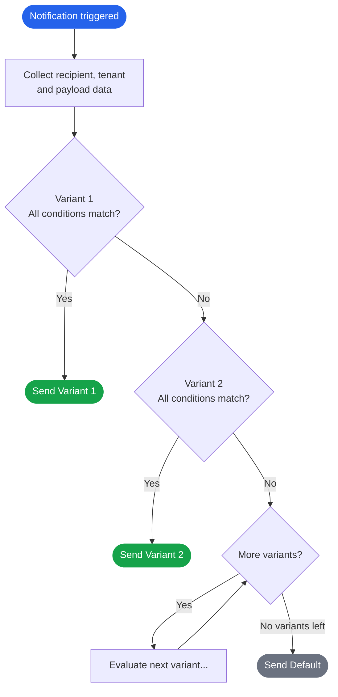

# Template Variants

Imagine you send a "Payment received" notification. Enterprise customers want it formal, with their own logo. Free-tier users get a simpler version with an upgrade nudge. French users get it in French. All from the same event trigger.

That's what variants are for.

A **variant** is an alternate version of a template that gets sent when specific conditions are true. You write the conditions, SuprSend evaluates them at send time and picks the right one. If nothing matches, it falls back to the **default** variant — which every template always has and can never be deleted.

---

## When to use variants

Use variants when the **message** differs — not just filled-in fields. For names and IDs only, use [variables](/docs/templates#variables).

<CardGroup cols={2}>
  <Card title="White-label tenants" icon="buildings" iconType="solid">
    Each [tenant](/docs/tenants) gets its own branding, tone, and links — one template, one variant per customer (`$tenant.id`). Default catches everyone else.
  </Card>
  <Card title="Language & locale" icon="language" iconType="solid">
    One variant per locale when copy or layout differs per market. SuprSend picks by locale with fallback. Text-only differences → [Localisation](/docs/templates#localisation).
  </Card>
  <Card title="Same event, different story" icon="code-branch" iconType="solid">
    Same trigger (e.g. `order.shipped`), different bodies — express vs standard, critical vs info — from payload or profile conditions.
  </Card>
  <Card title="A/B copy" icon="flask" iconType="solid">
    Challenger variant for a cohort tag; everyone else gets the default. Compare in [Analytics](/docs/analytics), then keep the winner or delete the test.
  </Card>
</CardGroup>

---

## How selection works

This is the most important thing to understand before building variants. Everything else — how you write conditions, how you order variants — flows from this.

When a notification is triggered, SuprSend runs through all non-default variants **in order**, top to bottom. It sends the **first one whose conditions all pass**. If nothing matches, it sends the default.



Three rules that govern everything:

**All conditions must pass.** There's no partial matching. If a variant has three conditions and one fails, the whole variant is skipped.

**Order is priority.** If two variants both match, the higher one wins. This is why ordering matters — place specific variants above general ones.

**The default always catches the rest.** It cannot be deleted, disabled, or moved. It is always at the top of the panel and always the last resort.

### Soft vs. hard matching

Not all conditions behave the same when they don't match:

| Condition type | On no match | Called |
|---|---|---|
| **Tenant**, **Locale** | Falls back through a hierarchy: `tenant+locale` → `tenant+default locale` → `default tenant+locale` → `default` | Soft |
| **Everything else** — payload fields, recipient properties, actor properties | Variant is skipped, no fallback | Hard |

A practical consequence: if you build a variant with `$recipient.plan == "pro"` and the recipient's plan is `"free"`, SuprSend skips that variant and keeps evaluating the next one. Make sure every scenario has either a matching variant, or will fall through to a sensible default.

---

## Creating a variant

Open any template, then click the **+** icon next to "All Variants" in the left panel. You'll see two options.

### Adding a channel

Choose **New Channel** to add a channel the template doesn't have yet — for example, adding SMS to an Email-only template. This adds the channel with its own default variant. No conditional logic is created here.

### Adding a variant

Choose **New Variant** to create a conditional version of an existing channel. A modal opens with the following fields:

**Channels** *(required)*
Which channels this variant applies to. A single variant can span multiple channels at once.

**Variant ID** *(required)*
A unique identifier that appears in Logs. Make it descriptive — you'll thank yourself when debugging:

```
# Good — tells you tenant, language, or purpose at a glance
acme-en
acme-fr
pro-users
express-shipping

# Bad — useless in logs
variant1
test
copy-of-default
```

**Locale** *(required)*
The language for this variant. Used in the soft fallback hierarchy — if an exact `tenant + locale` combination isn't found, SuprSend walks up automatically.

**Tenant** *(optional)*
Scope this variant to one tenant. Leave blank for variants that aren't tenant-specific.

**Conditions** *(optional)*
The rules that must all be true for this variant to be selected. You can add multiple conditions (all must pass) and group them with **+ OR** for OR-logic between groups.

---

## Writing conditions

Each condition follows this pattern:

```
[Data Type]  [Property]  [Operator]  [Value]

Recipient    plan         ==          "pro"
Tenant       id           ==          "acme"
Payload      order_type   ==          "express"
```

### Data types

| Data type | What it looks at | Example |
|---|---|---|
| **Recipient** | The recipient's stored profile properties | `$recipient.plan == "pro"` |
| **Actor** | Properties of the user who triggered the event | `$actor.role == "admin"` |
| **Tenant** | Properties on the tenant | `$tenant.id == "acme"` |
| **Input Payload** | Data passed in the trigger API call | `order_type == "express"` |

### Operators

| Category | Operators |
|---|---|
| Equality | `==` &nbsp;&nbsp; `!=` |
| Numeric | `>` &nbsp;&nbsp; `>=` &nbsp;&nbsp; `<` &nbsp;&nbsp; `<=` |
| String | `contains` &nbsp;&nbsp; `not contains` &nbsp;&nbsp; `is empty` &nbsp;&nbsp; `is not empty` |
| Date | `datetime is` &nbsp;&nbsp; `datetime is before` &nbsp;&nbsp; `datetime is after` |
| Array | `intersects` &nbsp;&nbsp; `not intersects` |

### Examples

```
# Show premium content to pro plan users
$recipient.plan  ==  "pro"

# Acme Corp, French language variant
$tenant.id          ==  "acme"
$recipient.language ==  "fr"

# Express shipping message based on trigger payload
order_type  ==  "express"

# Target users in any of these cohorts (array overlap)
$recipient.cohort  intersects  ["beta", "early_access"]
```

<Tip>
  **Design conditions with AI:** *"Design SuprSend template variants for [your scenario]. Available data: [list your payload keys, tenant props, recipient props]. For each variant, suggest an ID, conditions, correct ordering, and which should be the default fallback."*
</Tip>

---

## Ordering variants

Drag and drop variants in the left panel to set their priority. The rules:

- **The default is always first** and cannot be moved or placed below any other variant.
- **More specific variants go higher.** A variant for `acme + french` should sit above one for `french only` — otherwise the general one matches Acme users first and the specific one never fires.
- **Variants are independent per channel.** Email can have 4 variants, SMS can have 1. Each channel evaluates its own list at send time.

**If a variant isn't being picked when you expect it to,** the problem is almost always ordering. A broader variant above it is matching first. Either move the specific variant higher, or tighten the conditions on the broader one.

---

## Editing a variant

Click any variant in the left panel to open it. You're always editing the **draft** — the live version is unchanged until you commit.

**Edit content**
Write directly in the channel editor. Content auto-saves.

**Edit conditions, ID, locale, or tenant**
Click the **⚙ settings icon** on the variant. All fields from creation are editable here.

**Import content from another variant or template**
Use the **Import** button to copy content from any variant in any template. Useful when a new variant is structurally similar to an existing one.

---

## Managing variants

**Duplicate** — Click **···** on a variant → **Duplicate**. Content is copied into a new variant. Update the ID and conditions before committing.

**Delete** — Click **···** → **Delete**. Permanently removes the variant and its content. The default cannot be deleted.

**Disable a channel** — Click **···** on the **channel name** (not a specific variant) → **Disable**. Stops notifications on that channel immediately, but preserves all content. Re-enable anytime. Use this during vendor migrations when you need to pause a channel without losing your content.

---

## Testing variants

<Warning>
  Don't test individual variants to check whether conditions are working. Testing a single variant sends that variant directly, **bypassing all selection logic**. You'll get a send, but you won't know if conditions are correct.
</Warning>

To test the full selection logic — the only way to verify ordering and conditions work end-to-end:

1. Click **Test** in the editor toolbar.
2. Select the **Template Group** tab.
3. Enter a **Recipient** whose profile matches the condition you want to verify.
4. Select a **Tenant** if your variant has a tenant condition.
5. Click **Send Test**.
6. Open [Logs](/docs/logging) — the send record shows which variant was selected and which conditions matched.

Run this for each variant you care about. Test edge cases too — make sure the default fires when you expect it to.

---

## Publishing changes

Click **Commit** when you're ready to go live. A modal lists all pending changes across all variants — you can deselect any variant you're not ready to publish yet and commit the rest independently.

### Approval-gated channels

For **WhatsApp** and **SMS in India**, committing doesn't immediately publish the variant. It enters **Approval Pending** and goes live only after carrier or vendor approval.

- Multi-language templates: each language variant is approved separately.
- Fallback vendors: approval is required from each vendor independently.
- All other channels (Email, Push) are unaffected — they go live on commit as normal.

---

## Common patterns

### One template, many tenants

```
Variant: acme-default         →  $tenant.id == "acme"
Variant: globex-default       →  $tenant.id == "globex"
Default                       →  (fallback for all other tenants)
```

Onboarding a new tenant with custom branding → add one variant. No deployment.

### Tenant + language (combined)

Place tenant-specific variants above language-only ones so the specific match wins first:

```
Variant: acme-fr    →  $tenant.id == "acme"  +  $recipient.language == "fr"
Variant: acme-en    →  $tenant.id == "acme"  +  $recipient.language == "en"
Variant: default-fr →  $recipient.language == "fr"
Default             →  (English, all other tenants)
```

An Acme user who speaks French hits `acme-fr`. An Acme user who speaks English hits `acme-en`. A non-Acme French user hits `default-fr`. Everyone else gets the default.

### Plan-based messaging

```
Variant: pro-users   →  $recipient.plan == "pro"
Variant: free-users  →  $recipient.plan == "free"
Default              →  (no plan set, or unrecognized value)
```

### A/B test, then promote

```
Variant: subject-line-b   →  $recipient.cohort == "beta"   (challenger)
Default                   →  (control — everyone else)
```

To promote: update the default with the winner's content, or widen the challenger's conditions to all users. To kill: delete the challenger variant.

---

## FAQ

<AccordionGroup>

  <Accordion title="What happens if no variant matches?">
    The **default** is always sent. It cannot be deleted, disabled, or moved. It's the guaranteed fallback for every template.
  </Accordion>

  <Accordion title="Can different channels have different variants?">
    Yes. Variants are per-channel. A template can have 4 Email variants, 2 SMS variants, and just the default for Push. Each channel evaluates its own list independently at send time.
  </Accordion>

  <Accordion title="Can one variant cover multiple channels?">
    Yes. When creating a variant, you select which channels it applies to. You can pick one or many — the same conditions apply across all selected channels.
  </Accordion>

  <Accordion title="What's the difference between soft and hard conditions?">
    **Tenant** and **locale** are soft — SuprSend falls back through a hierarchy if no exact match is found. **Everything else** (payload fields, recipient properties, actor properties) is hard — if the condition doesn't match, the variant is skipped with no fallback.
  </Accordion>

  <Accordion title="I'm combining a locale condition with a payload condition on one variant. Which type is it?">
    Locale is soft (has fallback). Payload is hard (no fallback). When combined on one variant, both must pass. The soft/hard distinction only matters for what happens when each individual condition fails on its own.
  </Accordion>

  <Accordion title="Why isn't my variant being picked even though conditions look correct?">
    Almost always an ordering issue. A broader variant higher in the list is matching first. Open the panel, find what's sitting above your variant, and check if it matches your test recipient. Either drag your variant higher or tighten the conditions on the one above it.
  </Accordion>

  <Accordion title="Can I edit conditions after creating a variant?">
    Yes. Click the **⚙ settings icon** on the variant in the left panel. All creation fields — ID, locale, tenant, and conditions — are fully editable. Commit when ready to publish.
  </Accordion>

  <Accordion title="What happens to WhatsApp variants after I commit?">
    They enter **Approval Pending** and only go live after vendor approval. Multi-language templates require per-language approval. If you have a fallback vendor, each vendor needs to approve separately.
  </Accordion>

  <Accordion title="Can I pause a channel without losing content?">
    Yes. Click **···** on the channel name → **Disable**. The channel stops sending immediately, but all variant content is preserved. Re-enable anytime.
  </Accordion>

  <Accordion title="Can I start a new variant from an existing one?">
    Yes — use **Duplicate** from the **···** menu to copy a variant within the same template, or use **Import** inside the variant editor to pull content from any variant in any template.
  </Accordion>

</AccordionGroup>