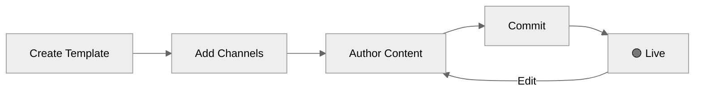

Without templates, every content change is a deployment. A **template** decouples _what you send_ from _how you send it_ — it holds notification content for every channel in one versioned container, referenced in [workflows](/docs/workflows) by a **slug**, and editable from the dashboard, [CLI](/reference/cli-intro), or [API](/reference/get-template-list) without touching your codebase.

## Core Concepts

<CardGroup cols={2}>
  <Card title="Slug" icon="tag" iconType="solid">
    Immutable identifier set at creation (e.g. `order-shipped`).
  </Card>
  <Card title="Channel" icon="tower-broadcast" iconType="solid">
    Email, SMS, WhatsApp, Push, Inbox, Slack, or MS Teams — one template holds all.
  </Card>
  <Card title="Variant" icon="bullseye" iconType="solid">
    Alternate content per tenant, language, or condition. See [Template Variants](/docs/template-variants).
  </Card>
  <Card title="Version" icon="code-branch" iconType="solid">
    Published snapshot (V1, V2, …). Rollback moves the live pointer without deleting history.
  </Card>
</CardGroup>

<Info>
  **Draft vs. Live** — Editing always happens on the draft. Live traffic is never affected until you publish. A template with no published version is never sent.
</Info>

---

## How a Template Gets Delivered

<Steps>
  <Step title="Lookup">
    When a workflow runs, SuprSend looks up the template by its slug and identifies which channels are enabled.
  </Step>
  <Step title="Select content">
    For each channel, SuprSend picks which content to send. If you've added [variants](/docs/template-variants) with conditions, the first matching variant is used. If there are no variants — or no conditions match — the `default` content is sent. Most templates work fine with just the default, no variants needed.
  </Step>
  <Step title="Render">
    Variables (`{{order_id}}`, `{{$recipient.name}}`, etc.) are replaced with actual values from the trigger payload and recipient profile.
  </Step>
  <Step title="Dispatch">
    The rendered message is sent via the configured [vendor](/docs/vendors) for that channel.
  </Step>
</Steps>

---

## Template Lifecycle

First publish makes a template **Live**. Every subsequent edit opens an isolated draft — live traffic is unaffected until you publish again.

---

## Guides

<CardGroup cols={2}>
  <Card title="Creating & Managing Templates" icon="pen-to-square" iconType="solid" href="/docs/templates">
    Create, author, publish, version, and manage templates end-to-end.
  </Card>
  <Card title="Template Variants" icon="copy" iconType="solid" href="/docs/template-variants">
    Target different content by tenant, locale, or any runtime condition.
  </Card>
  <Card title="Multi-lingual Templates" icon="language" iconType="solid" href="/docs/multi-lingual-template">
    Deliver notifications in each recipient's preferred language.
  </Card>
  <Card title="Testing Templates" icon="flask" iconType="solid" href="/docs/testing-the-template">
    Send a real notification to a real device before publishing.
  </Card>
  <Card title="Handlebars Helpers" icon="code" iconType="solid" href="/docs/handlebars-helpers">
    Conditionals, loops, date formatting, and helper functions for dynamic content.
  </Card>
  <Card title="Template Management API" icon="gear" iconType="solid" href="/reference/get-template-list">
    Manage templates programmatically via the REST API.
  </Card>
</CardGroup>

---

## AI Tools for Template Authoring

SuprSend integrates with AI tools at multiple levels to help you author, validate, and debug templates faster.

<CardGroup cols={2}>
  <Card title="AI Copilot" icon="sparkles" iconType="solid" href="https://app.suprsend.com">
    Press `Cmd + /` in the dashboard to ask questions or debug templates.
  </Card>
  <Card title="MCP Server" icon="plug" iconType="solid" href="/reference/cli-intro">
    Connect your IDE's AI assistant to your workspace via `suprsend start-mcp-server`.
  </Card>
  <Card title="LLM-Friendly Docs" icon="robot" iconType="solid" href="https://docs.suprsend.com/llms.txt">
    Feed docs to any LLM — `docs.suprsend.com/llms.txt` or `/llms-full.txt`.
  </Card>
  <Card title="Ready-to-Use Prompts" icon="message-bot" iconType="solid" href="/docs/email-template#validate-with-ai">
    Copy-paste prompts in every channel editor doc for validation, optimization, and debugging.
  </Card>
</CardGroup>

---

## Channel Editors

Each channel has a dedicated editor with channel-specific fields and a live device preview.

<CardGroup cols="3">
  <Card title="Email" icon="envelope-dot" iconType="solid" href="/docs/email-template">
    HTML designer, code editor, or plain text.
  </Card>
  <Card title="SMS" icon="comment-sms" iconType="solid" href="/docs/sms-template">
    DLT and non-DLT flows with vendor approval.
  </Card>
  <Card title="WhatsApp" icon="whatsapp" iconType="solid" href="/docs/whatsapp-template">
    Pre-approved message templates.
  </Card>
  <Card title="Android Push" icon="android" iconType="solid" href="/docs/android-push-template">
    Title, body, image, action URL, buttons, and sound.
  </Card>
  <Card title="iOS Push" icon="apple" iconType="solid" href="/docs/ios-push-template">
    Title, body, image, and action URL.
  </Card>
  <Card title="Web Push" icon="mobile-screen" iconType="solid" href="/docs/web-push-template">
    Title, body, image, action URL, and buttons.
  </Card>
  <Card title="In-App Inbox" icon="inbox-full" iconType="solid" href="/docs/in-app-inbox-template">
    Rich cards with avatar, buttons, tags, and expiry.
  </Card>
  <Card title="Slack" icon="slack" iconType="solid" href="/docs/slack-template">
    Text or Block Kit via Handlebars or JSONNET.
  </Card>
  <Card title="MS Teams" icon="windows" iconType="solid" href="/docs/ms-teams-template">
    Text or Adaptive Card via Handlebars or JSONNET.
  </Card>
</CardGroup>
