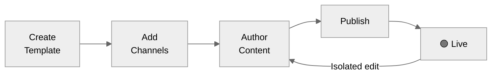

Without templates, every content change is a deployment. A **template** decouples _what you send_ from _how you send it_ — it holds notification content for every channel in one versioned container, referenced in [workflows](/docs/workflows) by a **slug**, and editable from the dashboard, [CLI](/reference/cli-template-overview), or [API](/reference/list-templates-v2) without touching your codebase.

## Core Concepts

<CardGroup cols={2}>
  <Card title="Slug" icon="tag" iconType="solid">
    The stable identifier your workflow uses to reference a template (e.g. `order-shipped`). Set at creation. Cannot be changed.
  </Card>
  <Card title="Channel" icon="tower-broadcast" iconType="solid">
    A delivery surface — Email, SMS, WhatsApp, Push, Inbox, Slack, or MS Teams. One template can hold content for all of them.
  </Card>
  <Card title="Variant" icon="bullseye" iconType="solid">
    An alternative version of a channel's content, selected at send time by conditions (tenant, language, or payload). Most specific match wins. See [Template Variants](/docs/template-variants).
  </Card>
  <Card title="Version" icon="code-branch" iconType="solid">
    A published snapshot (V1, V2, …). The live version is a pointer — rolling back moves it without deleting newer versions.
  </Card>
</CardGroup>

<Info>
  **Draft vs. Live** — Editing always happens on the draft. Live traffic is never affected until you publish. A template with no published version is never sent.
</Info>

---

## How a Template Gets Delivered

<Steps>
  <Step title="Lookup">
    When a workflow runs, SuprSend looks up the template by its slug.
  </Step>
  <Step title="Variant selection">
    For each enabled channel, variant conditions are evaluated against the trigger payload and recipient profile. The most specific match wins; if nothing matches, `default` is used.
  </Step>
  <Step title="Render">
    Variables in the content (`{{order_id}}`, `{{$recipient.name}}`, etc.) are rendered against the payload and recipient properties.
  </Step>
  <Step title="Dispatch">
    The rendered message is dispatched via the configured [vendor](/docs/vendors) for that channel.
  </Step>
</Steps>

---

## Template Lifecycle

First publish makes a template **Live**. Every subsequent edit opens an isolated draft — live traffic is unaffected until you publish again.

---

## Guides

<CardGroup cols={2}>
  <Card title="Creating & Managing Templates" icon="pen-to-square" iconType="solid" href="/docs/templates">
    Create, author, publish, version, and manage templates end-to-end.
  </Card>
  <Card title="Template Variants" icon="copy" iconType="solid" href="/docs/template-variants">
    Target different content by tenant, locale, or any runtime condition.
  </Card>
  <Card title="Multi-lingual Templates" icon="language" iconType="solid" href="/docs/multi-lingual-template">
    Deliver notifications in each recipient's preferred language.
  </Card>
  <Card title="Testing Templates" icon="flask" iconType="solid" href="/docs/testing-the-template">
    Send a real notification to a real device before publishing.
  </Card>
  <Card title="Handlebars Helpers" icon="code" iconType="solid" href="/docs/handlebars-helpers">
    Conditionals, loops, date formatting, and helper functions for dynamic content.
  </Card>
  <Card title="Template Management API" icon="gear" iconType="solid" href="/reference/list-templates-v2">
    Manage templates programmatically via the REST API.
  </Card>
</CardGroup>

---

## Channel Editors

Each channel has a dedicated editor with channel-specific fields and a live device preview.

<CardGroup cols="3">
  <Card title="Email" icon="envelope-dot" iconType="solid" href="/docs/email-template">
    HTML designer, code editor, or plain text.
  </Card>
  <Card title="SMS" icon="comment-sms" iconType="solid" href="/docs/sms-template">
    DLT and non-DLT flows with vendor approval.
  </Card>
  <Card title="WhatsApp" icon="whatsapp" iconType="solid" href="/docs/whatsapp-template">
    Pre-approved message templates.
  </Card>
  <Card title="Android Push" icon="android" iconType="solid" href="/docs/android-push-template">
    Title, body, image, action URL, buttons, and sound.
  </Card>
  <Card title="iOS Push" icon="apple" iconType="solid" href="/docs/ios-push-template">
    Title, body, image, and action URL.
  </Card>
  <Card title="Web Push" icon="mobile-screen" iconType="solid" href="/docs/web-push-template">
    Title, body, image, action URL, and buttons.
  </Card>
  <Card title="In-App Inbox" icon="inbox-full" iconType="solid" href="/docs/in-app-inbox-template">
    Rich cards with avatar, buttons, tags, and expiry.
  </Card>
  <Card title="Slack" icon="slack" iconType="solid" href="/docs/slack-template">
    Text or Block Kit via Handlebars or JSONNET.
  </Card>
  <Card title="MS Teams" icon="windows" iconType="solid" href="/docs/ms-teams-template">
    Text or Adaptive Card via Handlebars or JSONNET.
  </Card>
</CardGroup>
