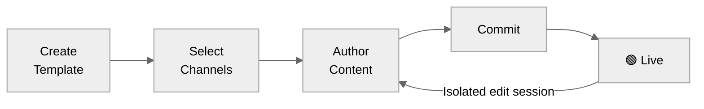

A **template** is a versioned container that holds notification content for every channel — Email, SMS, WhatsApp, Push, Inbox, Slack, MS Teams — in one place. Templates are referenced in [workflows](/docs/workflows) by a **slug**, fully decoupled from code, and managed entirely from the dashboard, CLI, or MCP.

## Key Concepts

<CardGroup cols={2}>
  <Card title="Multi-channel" icon="layer-group" iconType="solid">
    One template holds content for all channels. An _Order Shipped_ notification covering Email, SMS, and Push is authored in a single template — not three.
  </Card>
  <Card title="Versioned" icon="code-branch" iconType="solid">
    Every commit creates an immutable snapshot (V1, V2, V3…). Edits happen in isolation — live traffic is unaffected until you commit.
  </Card>
  <Card title="Variant targeting" icon="bullseye" iconType="solid">
    Serve different content by locale, tenant, or runtime condition. First matching variant wins; `default` is the fallback.
  </Card>
  <Card title="Code-free" icon="rocket" iconType="solid">
    Engineers integrate once. Product and content teams ship changes without deployments.
  </Card>
</CardGroup>

## Template Lifecycle

**Draft** (no commits yet) → first commit makes it **Live** → every subsequent edit works on an isolated copy → changes go live only on the next commit.

---

## Get Started

<CardGroup cols={2}>
  <Card title="Creating & Managing Templates" icon="pen-to-square" iconType="solid" href="/docs/templates">
    Create, author, commit, version, and manage templates end-to-end.
  </Card>
  <Card title="Template Variants" icon="copy" iconType="solid" href="/docs/template-variants">
    Target different audiences with locale, tenant, or condition-based variants.
  </Card>
  <Card title="Handlebars Helpers" icon="code" iconType="solid" href="/docs/handlebars-helpers">
    Conditionals, loops, date formatting, and helper functions for dynamic content.
  </Card>
  <Card title="Testing Templates" icon="flask" iconType="solid" href="/docs/testing-the-template">
    Send test notifications to real devices before committing.
  </Card>
  <Card title="Multi-lingual Templates" icon="language" iconType="solid" href="/docs/multi-lingual-template">
    Deliver notifications in each recipient's preferred language.
  </Card>
</CardGroup>

## Channel Editors

Each channel has a dedicated editor with a form and live device preview.

<CardGroup cols="3">
  <Card title="Email" icon="envelope-dot" iconType="solid" href="/docs/email-template" />
  <Card title="SMS" icon="comment-sms" iconType="solid" href="/docs/sms-template" />
  <Card title="In-App Inbox" icon="inbox-full" iconType="solid" href="/docs/in-app-inbox-template" />
  <Card title="Android Push" icon="android" iconType="solid" href="/docs/android-push-template" />
  <Card title="iOS Push" icon="apple" iconType="solid" href="/docs/ios-push-template" />
  <Card title="Web Push" icon="mobile-screen" iconType="solid" href="/docs/web-push-template" />
  <Card title="Slack" icon="slack" iconType="solid" href="/docs/slack-template" />
  <Card title="WhatsApp" icon="whatsapp" iconType="solid" href="/docs/whatsapp-template" />
  <Card title="MS Teams" icon="windows" iconType="solid" href="/docs/ms-teams-template" />
</CardGroup>
