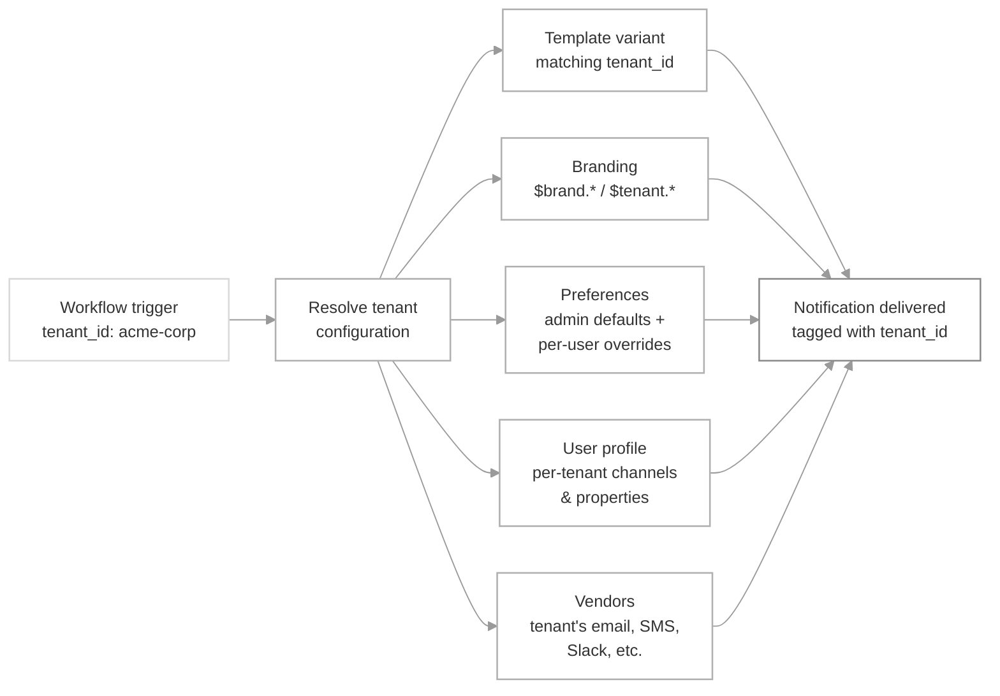

## Understanding tenants

Tenants (previously named as brands) represents a segment that a user belongs to. It can be **organizations**, **teams within an organization**, **projects**, **workspaces**, subsidiary companies or different product lines in the same business, and so on. **Tenants** in SuprSend are used to design custom notification experience based on these segments.

## Possible customizations and usage
Each tenant can have its own properties, preferences, vendors, and custom template design or content. You can use tenants to:

- **[White-label notifications](/docs/tenant-templates)** - Send notifications to your customers' end users with their branding, colors, logos, and social links. One shared template; `$brand.*` variables are replaced with tenant-specific values at runtime.
- **[Set admin-level preference defaults](/docs/tenant-preference)** - Define default notification preferences at the account or project level that apply to all users within it.
- **[Per-tenant user preferences](/reference/update-user-category-preference)** - Let users have different notification preferences for each tenant they belong to. For example, a user might mute Slack notifications for one project but keep them on for another. Just pass `tenant_id` while saving per-tenant preferences for a user.
- **[Route via tenant vendors](/docs/tenant-vendor)** - Send notifications through your customers' own email domain, SMS sender ID, or WhatsApp provider instead of yours. If no tenant vendor is set, the default vendor is used.
- **[Scope in-app feeds](/docs/react-customising-feed)** - Show a separate notification inbox per tenant so users only see what's relevant to their current context. Messages are tagged with `tenant_id`; badge counts are scoped automatically.
- **[Block preference categories](/docs/tenant-preference#platform-admin-controlling-tenant-access)** - Block certain paid features / modules or channels for a tenant as they have not subscribed to them.
- **[Custom template content per tenant](/docs/template-variants)** - Go beyond variable substitution and give a tenant its own template content, layout, or channels. Create a [template variant](/docs/template-variants) with a `tenant_id` condition — SuprSend picks the matching variant at send time and falls back to the default template for tenants without one.
- **[Per-tenant user properties or channel identities](/docs/user-tenant-mapping)** - Users can have different roles per project or different push tokens, Slack tokens, or emails per app. Set per-tenant overrides on top of the user's global profile; SuprSend merges them at send time.

A single user can belong to multiple tenants and have different notification preferences for each.

<Info>
Every workspace includes a `default` tenant that represents your own organization. If no `tenant_id` is passed in a workflow or event trigger, the default tenant's properties are applied.
</Info>

## How tenants work

By default, tenancy is a trigger-time concept. You pass `tenant_id` at trigger time and SuprSend applies that tenant's configuration at runtime to your notifications.

When a workflow is triggered with a `tenant_id`, SuprSend layers the tenant's configuration onto the send:

1. Select the [template variant](/docs/template-variants) whose condition matches the `tenant_id`, falling back to the default template if no variant matches — this is how a tenant gets its own content, layout, or channels rather than only variable substitution.
2. Resolve the tenant's branding properties and replace `$tenant.*` variables in workflows or `$brand.*` variables in your templates with tenant properties.
3. Evaluate tenant-level admin preferences and default preference settings.
4. Apply per-user, per-tenant preferences if the user has them set for that tenant.
5. Shallow-merge the recipient's **[per-tenant user profile](/docs/user-tenant-mapping)** on top of their global profile — per-tenant channel identities (push tokens, Slack tokens, email) and properties (`role`, `plan`) win for this send.
6. Route the notification through the tenant's configured vendor, falling back to the default vendor if none is set. If no tenant vendor is set, the default vendor is used.
7. Tag the message with the `tenant_id` so in-app inbox feeds can be scoped per tenant.

## Real-world examples
<CardGroup cols="1">
  <Card title="Multi-tenant B2B2X applications" icon="palette" iconType="solid">
    You send notifications to your customers' end users - each customer wants their own branding and vendors(email domain, SMS sender ID, etc.).

    **In SuprSend:** Each customer is a tenant. Store their logo, colors, and social links as tenant properties. Override [tenant vendors](/docs/tenant-vendor) to send from their email domain, SMS sender ID, or WhatsApp number.
  </Card>
  <Card title="Admin preferences in SaaS Applications" icon="shield-halved" iconType="solid">
    You are a SAAS product and your customers' admins want to control which notifications reach their internal team, on which channels and which categories are relevant to which roles in their organization.

    **In SuprSend:** Each customer org is a tenant. Admins set [tenant default preferences](/docs/tenant-preference) to control categories and channels. Use [tags](/docs/managing-notification-categories#adding-tags-optional) on categories to map to roles, then filter what each user sees based on their role.
  </Card>
  <Card title="Project Management App with per-project preference settings" icon="sitemap" iconType="solid">
    Your app has multi-level preference settings: global preferences, project-level defaults, and per-user overrides. Preferences cascade: global → project → user.

    **In SuprSend:** Each customer will be mapped to workspaces. Global Preferences are set as [category level defaults](/docs/tenant-preference#platform-admin-controlling-tenant-access). Each project is a tenant. Set category-level defaults as [tenant preferences](/docs/tenant-preference) - they cascade down to users within that project. Users can then override with their own per-tenant preferences.
  </Card>
  <Card title="Multiple apps with per-app user identities" icon="mobile-screen" iconType="solid">
  Your company has multiple product lines and the same user has different push tokens, Slack tokens, or email addresses across each app. Notifications need to route to the right identity for the right app.
  
  **In SuprSend:** Each app or product line is a tenant. Use [user-tenant mapping](/docs/user-tenant-mapping) to store tenant-specific channel identities (push tokens, Slack tokens, email) and properties per user, so notifications always deliver to the correct app.
</Card>
</CardGroup>

## FAQ

<AccordionGroup>
  <Accordion title="Do I need to assign users to tenants?">
    Not necessarily. You can simply pass `tenant_id` at trigger time and SuprSend will apply that tenant's configuration.
  </Accordion>

  <Accordion title="Can a user belong to multiple tenants?">
    Yes. With [user-tenant mapping](/docs/user-tenant-mapping), you can associate a single `distinct_id` with any number of tenants and store a different set of properties and channel identities per tenant. At send time, SuprSend shallow-merges the user's global profile with the per-tenant override for the triggering `tenant_id`. Workspaces can also be set to `exclusive` mode to restrict a user to at most one tenant.
  </Accordion>

  <Accordion title="What happens if I don't pass a tenant_id?">
    The `default` tenant is used. Every workspace has one, representing your organization's own branding and settings.
  </Accordion>

  <Accordion title="Is there a limit on the number of tenants?">
    No. You can create as many tenants as your application requires.
  </Accordion>

  <Accordion title="Can I use different workflows per tenant?">
    You can, but it's usually not needed. Use `$tenant.*` variables, per-tenant preferences, and step conditions to customize behavior within a single shared workflow. This keeps your notification logic manageable as you scale.
  </Accordion>

  <Accordion title="What if two business lines have completely different users and notifications?">
    Use separate workspaces instead of tenants. Workspaces provide full isolation of users, workflows, templates, vendors and other data points. 
  </Accordion>

  <Accordion title="Will all users in a tenant receive a notification when I trigger with that tenant_id?">
  No. Passing `tenant_id` in a workflow trigger does not send the notification to all users in that tenant. It only applies that tenant's configuration (branding, preferences, vendors) to the notification. You still need to specify the recipients explicitly in your trigger call.
</Accordion>

<Accordion title="Can I update a tenant's branding and use custom properties in templates?">
  Yes. You can update tenant properties (logo, colors, social links, and any custom properties) at any time via the dashboard, SDKs, or API. Use `$brand.<property>` variables in your templates to render them dynamically. See [Tenant Templates](/docs/tenant-templates) for details.
</Accordion>

<Accordion title="Can I create completely different template content per tenant?">
  Yes. Use [template variants](/docs/template-variants) with a `tenant_id` condition to give a tenant its own subject line, body, layout, or even a different set of channels enabled — anything variable substitution alone can't cover. At send time, SuprSend picks the variant whose condition matches the trigger's `tenant_id`; tenants without a matching variant fall through to the default template.
</Accordion>

<Accordion title="When should I use `$brand.*` variables versus a template variant?">
  Reach for `$brand.*` variables when the *content is the same* and only tenant-specific values change (logo, primary color, product name, support email) — one shared template stays maintainable and every new tenant just needs its properties populated. Reach for a [template variant](/docs/template-variants) when the *content itself differs* — a different CTA, an extra section, a tenant-specific layout, or a legal footer only one tenant needs. Most workspaces use variables broadly and reserve variants for the handful of tenants that need genuinely different content.
</Accordion>

<Accordion title="What happens if a tenant doesn't have a matching template variant?">
  SuprSend evaluates variants top-to-bottom and picks the first one whose condition matches. If no variant matches, the default template is used — so you can add a variant for one specific tenant without affecting anyone else.
</Accordion>

<Accordion title="Can template variants combine tenant conditions with other conditions like language or plan?">
  Yes. A variant's condition can reference `tenant_id`, the user's `$preferred_language`, trigger data properties, or any combination. Common pattern: one variant per tenant for content differences, plus multi-lingual [translations](/docs/multi-lingual-template) inside each variant for language differences.
</Accordion>

<Accordion title="Is multi-tenancy available on all plans?">
  Multi-tenancy is available on enterprise plan and as add-on for business plan.
</Accordion>

<Accordion title="Can I filter the in-app inbox by tenant and additional criteria like project or tags?">
  The inbox can be scoped to a [single tenant](/docs/react-customising-feed#customising-tenant) using `tenantId`. For further filtering within a tenant (for example, by project or asset type), you can pass tags in your Inbox template and filter the feed on your frontend using [store filters](/docs/react-customising-feed#adding-tabs).
</Accordion>
</AccordionGroup>

## Next steps

<CardGroup cols="2">
  <Card title="Tenant Quick Start" icon="rocket" iconType="solid" href="/docs/tenant-quick-start">
    Create a tenant and send your first tenant-scoped notification.
  </Card>
  <Card title="Tenant Templates" icon="paintbrush" iconType="solid" href="/docs/tenant-templates">
    Use tenant variables and pre-built components in your templates to customize the look and feel of your notifications per-tenant.
  </Card>
  <Card title="Tenant Workflows" icon="sitemap" iconType="solid" href="/docs/tenant-workflows">
    Trigger workflows for a tenant to apply tenant level customization in notifications.
  </Card>
  <Card title="Tenant Preferences" icon="sliders" iconType="solid" href="/docs/tenant-preference">
    Set admin controls and default opt-in/opt-out per tenant.
  </Card>
  <Card title="Tenant Vendors" icon="envelope" iconType="solid" href="/docs/tenant-vendor">
    Route notifications through each tenant's own email/SMS providers.
  </Card>
  <Card title="User-Tenant Mapping" icon="users" iconType="solid" href="/docs/user-tenant-mapping">
    Give a user different properties and channel identities per tenant.
  </Card>
</CardGroup>