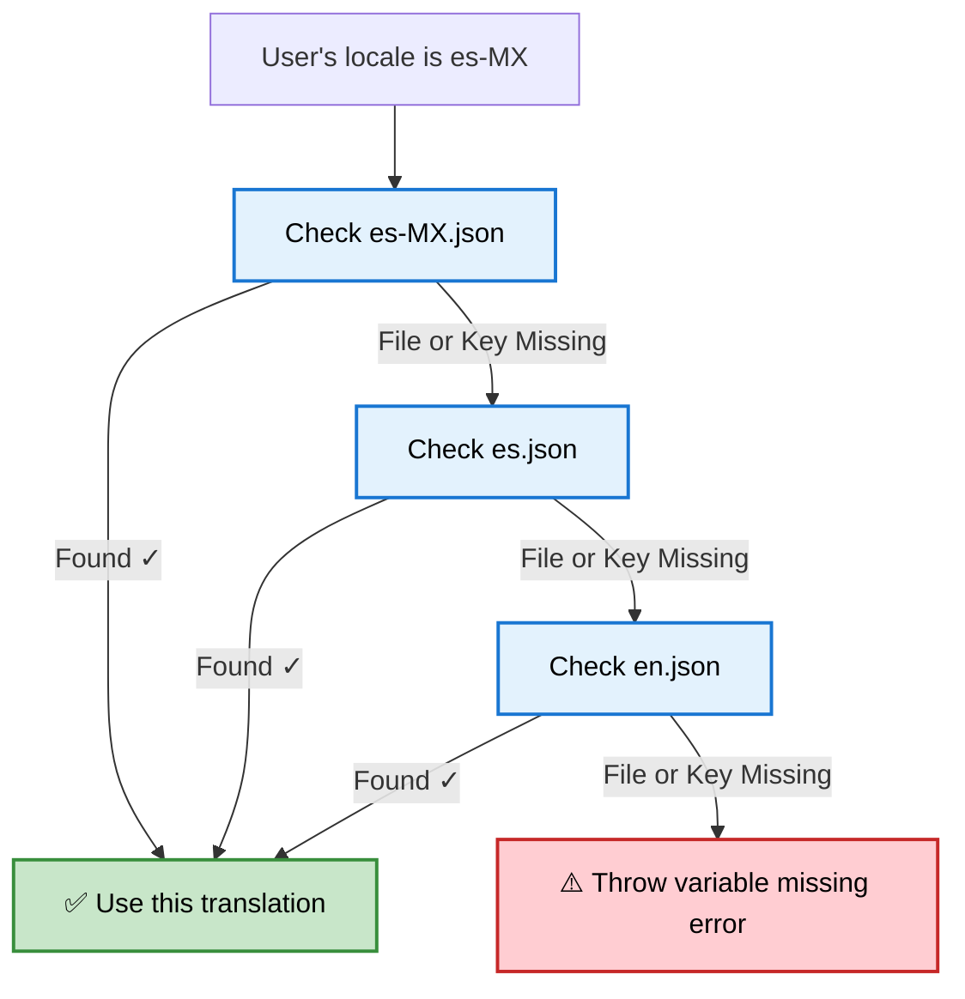

Translations help you **localize notifications dynamically** based on your user's locale.  
Instead of maintaining multiple templates per language, you can manage a single template and multiple translation files.

<Note>
**One template + multiple translation files = localized notifications for all your users.**
</Note>

---

## How translations work
SuprSend automatically handles localization while sending notifications - no extra code required.

### Steps to Enable Translations

1. **Upload translation files** from the [dashboard](https://app.suprsend.com/en/staging/developers/translations), via [CLI](https://docs.suprsend.com/reference/cli-translation-overview), or [API](/reference/add-translation).  
   Each file is a JSON containing key-value pairs consistent across locales.
2. **Set user locale** in SDK using `set_locale()` or via the `$locale` property in [create/update user API](/reference/create-update-users).
3. **Use translation keys** inside templates:
   - Handlebars: `{{t "key_name"}}`
   - JSONNET: `t("key_name")`
4. At the time of workflow execution, SuprSend looks for key_name in the user's locale file and if not found, applies below fallback logic.

### Fallback Logic

If either the locale file or key inside the locale file is missing, SuprSend searches in this order:

1. Exact locale match — for example, `es-MX.json`
2. General language file — for example, `es.json`
3. Default language fallback — for example, `en.json`



<Note>
**Best practice:** Always maintain an `en.json` file as the base language. It ensures your system always has a fallback even if locale-specific keys are missing.
</Note>

## Basic usage
Translations are JSON objects that define the localized text for your app messages in different locales.
Let’s say you have a task management app and you want to notify users when a new task is created or completed - localized for English and French users.

```json {en.json}
{
"TaskCreated": "A new task has been created: {{task_name}}",
"TaskCompleted": "Task {{task_name}} has been completed successfully!"
}
```

```json {fr.json}

{
"task_created": "Une nouvelle tâche a été créée : {{task_name}}",
"task_completed": "La tâche {{task_name}} a été complétée avec succès !"
}
```
Once you have the files uploaded for `en` and `fr` locales, you can reference it in your templates using the `t` tag:


<CodeGroup> 
```handlebars handlebars 
{{t "task_created" task_name=task.name}} 
{{t "task_completed" task_name=task.name}} 
``` 
```jsonnet jsonnet 
{ 
  task_created: t("task_created", {task_name: task.name}), 
  task_completed: t("task_completed", {task_name: task.name}) 
} 
``` 
</CodeGroup> 

## Managing translation files

You can manage translation files from [developers -> translations](https://app.suprsend.com/en/staging/developers/translations) on the SuprSend dashboard, via [API](/reference/add-translation) and [CLI](/reference/cli-translation-overview).

### Flow

All translation changes, including delete, is version controlled and needs to be committed to make them live.

    ```mermaid
    flowchart TD
    A["📝 Make Changes<br/><small>Add, edit, or delete translation files in the dashboard</small>"] --> B["👀 Review Drafts<br/><small>All changes are saved in draft version until committed</small>"]
    B --> C["✅ Commit Changes<br/><small>Commit translations to make them live</small>"]
    C --> D["🕓 Version History / Rollback<br/><small>Each commit creates a new version; you can review or rollback anytime</small>"]

    style A fill:#e3f2fd,stroke:#1976d2,stroke-width:2px,color:#000
    style B fill:#e3f2fd,stroke:#1976d2,stroke-width:2px,color:#000
    style C fill:#c8e6c9,stroke:#388e3c,stroke-width:2px,color:#000
    style D fill:#fff3cd,stroke:#f9a825,stroke-width:2px,color:#000
    ```

### Directory structure
There are two ways to organize translation files:
1. **By locale code** — one file per language, for example en.json, fr.json
2. **By namespace + locale code** — group translations by feature or module within the same language, for example `auth.en.json`, `tasks.fr.json`. This comes in handy when you have different teams managing their translations or can have same key across different features or modules.

All files for a locale goes into a single directory.

```json
translations/
├── en/                  # English (base language)
│   ├── en.json         # General translations
│   └── auth.en.json    # namespaced translations
└── en-GB/              
    ├── en-GB.json      
    └── orders.en-GB.json 
```

### Add locale files

<Steps>
  <Step title="Upload file">
    Go to **Developers** → **Translations** section. Click on `+New File` button and upload locale files. 
    Locale file naming convention:
      - `{locale_code}.json`: example: `en.json`, `es-MX.json`
      - `{namespace}.{locale_code}.json`: example: `auth.en.json`, `orders.es-MX.json`

      <Frame>
        
      </Frame>

<Warning>
    File uploads with wrong name would throw error on upload. Make sure to edit the name before upload.
</Warning>
  </Step>
  
  <Step title="Save Changes">
    Click **Next** to save. Files are saved as a draft version until committed.
    
    <Frame>
      
    </Frame>
  </Step>
  
  <Step title="Commit changes">
    Click **Commit Changes** to make translations live. Add a short description of your update for later reference. You can also skip this step and commit later.
    
    <Frame>
      
    </Frame>
  </Step>
</Steps>

### Update existing files
Download, edit locally, and re-upload updated translation files.

<Steps>
  
  <Step title="Download file">
    Click **Download** to save the translation file locally for editing.
    
    <Frame>
      
    </Frame>
  </Step>
  
  <Step title="Edit, upload and commit">
    Make your edits to the downloaded JSON file, then click `+ New File` and upload the edited file to replace the existing file. Finally, click **Commit** to make your translation changes live.
  </Step>
</Steps>

### Delete files

Remove locale files that are no longer needed.

<Steps>
  <Step title="Delete file">
    Find the translation file you want to remove, and click **Delete**. This will mark the file for deletion in the draft version.
    
    <Frame>
      
    </Frame>
  </Step>
  <Step title="Commit deletion">
    Click **Commit** to make deletion live. The deletion will only take place after you commit.
    
    <Frame>
      
    </Frame>
  </Step>
</Steps>

### Version history and rollback

SuprSend uses git-like versioning for locale file changes. Every commit creates a new version that you can view, download, or roll back to.

  - **View version history**<br/>
  Click **Version History** to see all previous versions. You can download and view older files, and check the status column to see what changed compared to the previous version.
  - **Rollback to an older version**<br/>
  Inside version history tab, select the version you want to restore and click **Rollback version**.
    
    <Frame>
      
    </Frame>


## Using translations in templates
You can use translations in your templates using the `t` tag. Anything inside the `t` tag will be replaced with the translation for the key.

#### Simple, Nested and Namespaced keys
<CodeGroup>
```handlebars handlebars (sms, email, push, inbox)
{{t "key_name"}}
{{t "feature:key_name"}} // for namespaced locale files
{{t "nested_key.sub_key"}} // for nested keys
```
```jsonnet jsonnet (slack, ms_teams)
{
  simple_key: t("key_name"),
  namespaced_key: t("feature:key_name"),
  batched_key: t(data["$batched_events"][0].name)
  nested_key: t("nested_key.sub_key")
}
```
</CodeGroup>

#### Pluralization
Translations support plural forms using the keys `zero`, `one`, and `other`.
When you pass a count variable, SuprSend automatically picks the correct form.
If count is missing or null, the zero form is used by default.

**translation file:**
```json en.json
{
  "tasks": {
    "zero": "You have no tasks",
    "one": "You have 1 task",
    "other": "You have {{count}} tasks"
  }
}
```
      **Rules:** 
      - `count = 0` → uses `zero` form → `"No items"`
      - `count = 1` → uses `one` form → `"1 item"`
      - `count ≥ 2` → uses `other` form → `"5 items"`

**template:**
<CodeGroup>
```handlebars handlebars (sms, email, push, inbox)
{{t "tasks" count=$batched_events_count}}
```
```jsonnet jsonnet (slack, ms_teams)
{
  tasks: t('tasks', {count: data["$batched_events_count"]})
}
```
</CodeGroup>

#### Interpolation
If your translation includes variables, you can dynamically replace them with values from your template or workflow data like this:

**translation file:**
```json en.json
{
  "greeting": "Hello, {{name}}!"
}
```

**template:**
<CodeGroup>
```handlebars handlebars (sms, email, push, inbox)
{{t "greeting" name=$recipient.name}}
```
```jsonnet jsonnet (slack, ms_teams)
{
  greeting: t('greeting', {name: data["$recipient"].name})
}
```
</CodeGroup>

**Rendered content:**
- "Hello, John!" when $recipient.name is "John"

#### Combining with Handlebars helpers
Here, are some examples of how you can combine translations with other Handlebars helpers.

1. **Default value**
```handlebars
{{default (t "name") "Guest"}} 
```
2. **Conditional rendering**
```handlebars
{{#if user.is_premium}}
{{t "premium_plan.details"}}
{{else}}
{{t "standard_plan.detail"}}
{{/if}}
```
3. **Looping**
```handlebars
{{#each $batched_events}}
{{t "item_name"}}
{{/each}}
```

## Automate translation with CLI and APIs
You can manage your translations files programmatically using:
- [CLI](/reference/cli-translation-overview)
- [Management API](/reference/add-translation)

## Supported locales

SuprSend supports ISO 639-1 language codes, ISO 3166-1 alpha-2 country codes, and full BCP 47 locale identifiers. Here's the complete list of supported locales:
<Accordion title="Supported locale codes">

| Locale Code | Name |
|-------------|------|
| `en` | English |
| `en-001` | English (world) |
| `en-150` | English (Europe) |
| `en-AE` | English (united arab emirates) |
| `en-AG` | English (antigua & barbuda) |
| `en-AI` | English (anguilla) |
| `en-AS` | English (american samoa) |
| `en-AT` | English (austria) |
| `en-AU` | English (australia) |
| `en-BB` | English (barbados) |
| `en-BE` | English (belgium) |
| `en-BI` | English (burundi) |
| `en-BM` | English (bermuda) |
| `en-BS` | English (bahamas) |
| `en-BW` | English (botswana) |
| `en-BZ` | English (belize) |
| `en-CA` | English (canada) |
| `en-CC` | English (cocos (keeling) islands) |
| `en-CH` | English (switzerland) |
| `en-CK` | English (cook islands) |
| `en-CM` | English (cameroon) |
| `en-CX` | English (christmas island) |
| `en-CY` | English (cyprus) |
| `en-DE` | English (germany) |
| `en-DG` | English (diego garcia) |
| `en-DK` | English (denmark) |
| `en-DM` | English (dominica) |
| `en-ER` | English (eritrea) |
| `en-FI` | English (finland) |
| `en-FJ` | English (fiji) |
| `en-FK` | English (falkland islands) |
| `en-FM` | English (micronesia) |
| `en-GB` | English (united kingdom) |
| `en-GD` | English (grenada) |
| `en-GG` | English (guernsey) |
| `en-GH` | English (ghana) |
| `en-GI` | English (gibraltar) |
| `en-GM` | English (gambia) |
| `en-GU` | English (guam) |
| `en-GY` | English (guyana) |
| `en-HK` | English (hong kong sar china) |
| `en-ID` | English (indonesia) |
| `en-IE` | English (ireland) |
| `en-IL` | English (israel) |
| `en-IM` | English (isle of man) |
| `en-IN` | English (india) |
| `en-IO` | English (british indian ocean territory) |
| `en-JE` | English (jersey) |
| `en-JM` | English (jamaica) |
| `en-KE` | English (kenya) |
| `en-KI` | English (kiribati) |
| `en-KN` | English (st. kitts & nevis) |
| `en-KY` | English (cayman islands) |
| `en-LC` | English (st. lucia) |
| `en-LR` | English (liberia) |
| `en-LS` | English (lesotho) |
| `en-MG` | English (madagascar) |
| `en-MH` | English (marshall islands) |
| `en-MO` | English (macao sar china) |
| `en-MP` | English (northern mariana islands) |
| `en-MS` | English (montserrat) |
| `en-MT` | English (malta) |
| `en-MU` | English (mauritius) |
| `en-MV` | English (maldives) |
| `en-MW` | English (malawi) |
| `en-MY` | English (malaysia) |
| `en-NA` | English (namibia) |
| `en-NF` | English (norfolk island) |
| `en-NG` | English (nigeria) |
| `en-NL` | English (netherlands) |
| `en-NR` | English (nauru) |
| `en-NU` | English (niue) |
| `en-NZ` | English (new zealand) |
| `en-PG` | English (papua new guinea) |
| `en-PH` | English (philippines) |
| `en-PK` | English (pakistan) |
| `en-PN` | English (pitcairn islands) |
| `en-PR` | English (puerto rico) |
| `en-PW` | English (palau) |
| `en-RW` | English (rwanda) |
| `en-SB` | English (solomon islands) |
| `en-SC` | English (seychelles) |
| `en-SD` | English (sudan) |
| `en-SE` | English (sweden) |
| `en-SG` | English (singapore) |
| `en-SH` | English (st. helena) |
| `en-SI` | English (slovenia) |
| `en-SL` | English (sierra leone) |
| `en-SS` | English (south sudan) |
| `en-SX` | English (sint maarten) |
| `en-SZ` | English (eswatini) |
| `en-TC` | English (turks & caicos islands) |
| `en-TK` | English (tokelau) |
| `en-TO` | English (tonga) |
| `en-TT` | English (trinidad & tobago) |
| `en-TV` | English (tuvalu) |
| `en-TZ` | English (tanzania) |
| `en-UG` | English (uganda) |
| `en-UM` | English (u.s. outlying islands) |
| `en-US` | English (united states) |
| `en-VC` | English (st. vincent & grenadines) |
| `en-VG` | English (british virgin islands) |
| `en-VI` | English (u.s. virgin islands) |
| `en-VU` | English (vanuatu) |
| `en-WS` | English (samoa) |
| `en-ZA` | English (south africa) |
| `en-ZM` | English (zambia) |
| `en-ZW` | English (zimbabwe) |
| `es` | Spanish |
| `es-419` | Spanish (Latin America) |
| `es-AR` | Spanish (argentina) |
| `es-BO` | Spanish (bolivia) |
| `es-BR` | Spanish (brazil) |
| `es-BZ` | Spanish (belize) |
| `es-CL` | Spanish (chile) |
| `es-CO` | Spanish (colombia) |
| `es-CR` | Spanish (costa rica) |
| `es-CU` | Spanish (cuba) |
| `es-DO` | Spanish (dominican republic) |
| `es-EA` | Spanish (ceuta & melilla) |
| `es-EC` | Spanish (ecuador) |
| `es-ES` | Spanish (spain) |
| `es-GQ` | Spanish (equatorial guinea) |
| `es-GT` | Spanish (guatemala) |
| `es-HN` | Spanish (honduras) |
| `es-IC` | Spanish (canary islands) |
| `es-MX` | Spanish (mexico) |
| `es-NI` | Spanish (nicaragua) |
| `es-PA` | Spanish (panama) |
| `es-PE` | Spanish (peru) |
| `es-PH` | Spanish (philippines) |
| `es-PR` | Spanish (puerto rico) |
| `es-PY` | Spanish (paraguay) |
| `es-SV` | Spanish (el salvador) |
| `es-US` | Spanish (united states) |
| `es-UY` | Spanish (uruguay) |
| `es-VE` | Spanish (venezuela) |
| `fr` | French |
| `fr-BE` | French (belgium) |
| `fr-BF` | French (burkina faso) |
| `fr-BI` | French (burundi) |
| `fr-BJ` | French (benin) |
| `fr-BL` | French (st. barthélemy) |
| `fr-CA` | French (canada) |
| `fr-CD` | French (congo - kinshasa) |
| `fr-CF` | French (central african republic) |
| `fr-CG` | French (congo - brazzaville) |
| `fr-CH` | French (switzerland) |
| `fr-CI` | French (côte d’ivoire) |
| `fr-CM` | French (cameroon) |
| `fr-DJ` | French (djibouti) |
| `fr-DZ` | French (algeria) |
| `fr-FR` | French (france) |
| `fr-GA` | French (gabon) |
| `fr-GF` | French (french guiana) |
| `fr-GN` | French (guinea) |
| `fr-GP` | French (guadeloupe) |
| `fr-GQ` | French (equatorial guinea) |
| `fr-HT` | French (haiti) |
| `fr-KM` | French (comoros) |
| `fr-LU` | French (luxembourg) |
| `fr-MA` | French (morocco) |
| `fr-MC` | French (monaco) |
| `fr-MF` | French (st. martin) |
| `fr-MG` | French (madagascar) |
| `fr-ML` | French (mali) |
| `fr-MQ` | French (martinique) |
| `fr-MR` | French (mauritania) |
| `fr-MU` | French (mauritius) |
| `fr-NC` | French (new caledonia) |
| `fr-NE` | French (niger) |
| `fr-PF` | French (french polynesia) |
| `fr-PM` | French (st. pierre & miquelon) |
| `fr-RE` | French (réunion) |
| `fr-RW` | French (rwanda) |
| `fr-SC` | French (seychelles) |
| `fr-SN` | French (senegal) |
| `fr-SY` | French (syria) |
| `fr-TD` | French (chad) |
| `fr-TG` | French (togo) |
| `fr-TN` | French (tunisia) |
| `fr-VU` | French (vanuatu) |
| `fr-WF` | French (wallis & futuna) |
| `fr-YT` | French (mayotte) |
| `it` | Italian |
| `it-CH` | Italian (switzerland) |
| `it-IT` | Italian (italy) |
| `it-SM` | Italian (san marino) |
| `it-VA` | Italian (vatican city) |
| `de` | German |
| `de-AT` | German (austria) |
| `de-BE` | German (belgium) |
| `de-CH` | German (switzerland) |
| `de-DE` | German (germany) |
| `de-IT` | German (italy) |
| `de-LI` | German (liechtenstein) |
| `de-LU` | German (luxembourg) |
| `ru` | Russian |
| `ru-BY` | Russian (belarus) |
| `ru-KG` | Russian (kyrgyzstan) |
| `ru-KZ` | Russian (kazakhstan) |
| `ru-MD` | Russian (moldova) |
| `ru-RU` | Russian (russia) |
| `ru-UA` | Russian (ukraine) |
| `ja` | Japanese |
| `ja-JP` | Japanese (japan) |
| `zh` | Chinese |
| `zh-CN` | Chinese (china) |
| `zh-HK` | Chinese (hong kong sar china) |
| `zh-MO` | Chinese (macao sar china) |
| `zh-MY` | Chinese (malaysia) |
| `zh-SG` | Chinese (singapore) |
| `zh-TW` | Chinese (taiwan) |
| `ar` | Arabic |
| `ar-001` | Arabic (world) |
| `ar-AE` | Arabic (united arab emirates) |
| `ar-BH` | Arabic (bahrain) |
| `ar-DJ` | Arabic (djibouti) |
| `ar-DZ` | Arabic (algeria) |
| `ar-EG` | Arabic (egypt) |
| `ar-EH` | Arabic (western sahara) |
| `ar-ER` | Arabic (eritrea) |
| `ar-IL` | Arabic (israel) |
| `ar-IQ` | Arabic (iraq) |
| `ar-JO` | Arabic (jordan) |
| `ar-KM` | Arabic (comoros) |
| `ar-KW` | Arabic (kuwait) |
| `ar-LB` | Arabic (lebanon) |
| `ar-LY` | Arabic (libya) |
| `ar-MA` | Arabic (morocco) |
| `ar-MR` | Arabic (mauritania) |
| `ar-OM` | Arabic (oman) |
| `ar-PS` | Arabic (palestinian territories) |
| `ar-QA` | Arabic (qatar) |
| `ar-SA` | Arabic (saudi arabia) |
| `ar-SD` | Arabic (sudan) |
| `ar-SO` | Arabic (somalia) |
| `ar-SS` | Arabic (south sudan) |
| `ar-SY` | Arabic (syria) |
| `ar-TD` | Arabic (chad) |
| `ar-TN` | Arabic (tunisia) |
| `ar-YE` | Arabic (yemen) |
| `ms` | Malay |
| `ms-BN` | Malay (brunei) |
| `ms-ID` | Malay (indonesia) |
| `ms-MY` | Malay (malaysia) |
| `ms-SG` | Malay (singapore) |
| `pt` | Portuguese |
| `pt-AO` | Portuguese (angola) |
| `pt-BR` | Portuguese (brazil) |
| `pt-CH` | Portuguese (switzerland) |
| `pt-CV` | Portuguese (cape verde) |
| `pt-GQ` | Portuguese (equatorial guinea) |
| `pt-GW` | Portuguese (guinea-bissau) |
| `pt-LU` | Portuguese (luxembourg) |
| `pt-MO` | Portuguese (macao sar china) |
| `pt-MZ` | Portuguese (mozambique) |
| `pt-PT` | Portuguese (portugal) |
| `pt-ST` | Portuguese (são tomé & príncipe) |
| `pt-TL` | Portuguese (timor-leste) |
| `vi` | Vietnamese |
| `vi-VN` | Vietnamese (vietnam) |
| `hi` | Hindi |
| `hi-IN` | Hindi (india) |
| `mr` | Marathi |
| `mr-IN` | Marathi (india) |
| `ml` | Malayalam |
| `ml-IN` | Malayalam (india) |
| `kn` | Kannada |
| `kn-IN` | Kannada (india) |
| `ta` | Tamil |
| `ta-IN` | Tamil (india) |
| `ta-LK` | Tamil (sri lanka) |
| `ta-MY` | Tamil (malaysia) |
| `ta-SG` | Tamil (singapore) |
| `te` | Telugu |
| `te-IN` | Telugu (india) |
| `as` | Assamese |
| `as-IN` | Assamese (india) |
| `pa` | Panjabi; Punjabi |
| `pa-IN` | Panjabi; Punjabi (india) |
| `pa-PK` | Panjabi; Punjabi (pakistan) |
| `gu` | Gujarati |
| `gu-IN` | Gujarati (india) |
| `ks` | Kashmiri |
| `ks-IN` | Kashmiri (devanagari, india) |
| `bn` | Bengali |
| `bn-BD` | Bangla (bangladesh) |
| `bn-IN` | Bangla (india) |
| `or` | Oriya |
| `or-IN` | Odia (india) |
| `ur` | Urdu |
| `ur-IN` | Urdu (india) |
| `ur-PK` | Urdu (pakistan) |
| `sd` | Sindhi |
| `sd-IN` | Sindhi (india) |
| `sd-PK` | Sindhi (pakistan) |
| `ne` | Nepali |
| `ne-IN` | Nepali (india) |
| `ne-NP` | Nepali (nepal) |
| `aa` | Afar |
| `aa-DJ` | Afar (djibouti) |
| `aa-ER` | Afar (eritrea) |
| `aa-ET` | Afar (ethiopia) |
| `ab` | Abkhazian |
| `ab-GE` | Abkhazian (georgia) |
| `ae` | Avestan |
| `af` | Afrikaans |
| `af-NA` | Afrikaans (namibia) |
| `af-ZA` | Afrikaans (south africa) |
| `ak` | Akan |
| `ak-GH` | Akan (ghana) |
| `am` | Amharic |
| `am-ET` | Amharic (ethiopia) |
| `an` | Aragonese |
| `an-ES` | Aragonese (spain) |
| `av` | Avaric |
| `ay` | Aymara |
| `az` | Azerbaijani |
| `az-AZ` | Azerbaijani (azerbaijan) |
| `az-IQ` | Azerbaijani (iraq) |
| `az-IR` | Azerbaijani (iran) |
| `az-TR` | Azerbaijani (türkiye) |
| `ba` | Bashkir |
| `ba-RU` | Bashkir (russia) |
| `be` | Belarusian |
| `be-BY` | Belarusian (belarus) |
| `bg` | Bulgarian |
| `bg-BG` | Bulgarian (bulgaria) |
| `bi` | Bislama |
| `bm` | Bambara |
| `bm-ML` | Bambara (mali) |
| `bo` | Tibetan |
| `bo-CN` | Tibetan (china) |
| `bo-IN` | Tibetan (india) |
| `br` | Breton |
| `br-FR` | Breton (france) |
| `bs` | Bosnian |
| `bs-BA` | Bosnian (cyrillic, bosnia & herzegovina) |
| `ca` | Catalan; Valencian |
| `ca-AD` | Catalan (andorra) |
| `ca-ES` | Catalan (spain, valencian) |
| `ca-FR` | Catalan (france) |
| `ca-IT` | Catalan (italy) |
| `ce` | Chechen |
| `ce-RU` | Chechen (russia) |
| `ch` | Chamorro |
| `co` | Corsican |
| `co-FR` | Corsican (france) |
| `cr` | Cree |
| `cs` | Czech |
| `cs-CZ` | Czech (czechia) |
| `cu` | Church Slavic; Old Slavonic; Church Slavonic; Old Bulgarian; Old Church Slavonic |
| `cu-RU` | Church slavic (russia) |
| `cv` | Chuvash |
| `cv-RU` | Chuvash (russia) |
| `cy` | Welsh |
| `cy-GB` | Welsh (united kingdom) |
| `da` | Danish |
| `da-DK` | Danish (denmark) |
| `da-GL` | Danish (greenland) |
| `dv` | Divehi; Dhivehi; Maldivian |
| `dv-MV` | Divehi (maldives) |
| `dz` | Dzongkha |
| `dz-BT` | Dzongkha (bhutan) |
| `ee` | Ewe |
| `ee-GH` | Ewe (ghana) |
| `ee-TG` | Ewe (togo) |
| `el` | Greek, Modern (1453-) |
| `el-CY` | Greek (cyprus) |
| `el-GR` | Greek (greece) |
| `eo` | Esperanto |
| `eo-001` | Esperanto (world) |
| `et` | Estonian |
| `et-EE` | Estonian (estonia) |
| `eu` | Basque |
| `eu-ES` | Basque (spain) |
| `fa` | Persian |
| `fa-AF` | Persian (afghanistan) |
| `fa-IR` | Persian (iran) |
| `ff` | Fulah |
| `ff-BF` | Fulah (burkina faso) |
| `ff-CM` | Fulah (cameroon) |
| `ff-GH` | Fulah (ghana) |
| `ff-GM` | Fulah (gambia) |
| `ff-GN` | Fulah (guinea) |
| `ff-GW` | Fulah (guinea-bissau) |
| `ff-LR` | Fulah (liberia) |
| `ff-MR` | Fulah (mauritania) |
| `ff-NE` | Fulah (niger) |
| `ff-NG` | Fulah (nigeria) |
| `ff-SL` | Fulah (sierra leone) |
| `ff-SN` | Fulah (senegal) |
| `fi` | Finnish |
| `fi-FI` | Finnish (finland) |
| `fj` | Fijian |
| `fo` | Faroese |
| `fo-DK` | Faroese (denmark) |
| `fo-FO` | Faroese (faroe islands) |
| `fy` | Western Frisian |
| `fy-NL` | Western frisian (netherlands) |
| `ga` | Irish |
| `ga-GB` | Irish (united kingdom) |
| `ga-IE` | Irish (ireland) |
| `gd` | Gaelic; Scottish Gaelic |
| `gd-GB` | Scottish gaelic (united kingdom) |
| `gl` | Galician |
| `gl-ES` | Galician (spain) |
| `gn` | Guarani |
| `gn-PY` | Guarani (paraguay) |
| `gv` | Manx |
| `gv-IM` | Manx (isle of man) |
| `ha` | Hausa |
| `ha-GH` | Hausa (ghana) |
| `ha-NE` | Hausa (niger) |
| `ha-NG` | Hausa (nigeria) |
| `ha-SD` | Hausa (sudan) |
| `he` | Hebrew |
| `he-IL` | Hebrew (israel) |
| `ho` | Hiri Motu |
| `hr` | Croatian |
| `hr-BA` | Croatian (bosnia & herzegovina) |
| `hr-HR` | Croatian (croatia) |
| `ht` | Haitian; Haitian Creole |
| `hu` | Hungarian |
| `hu-HU` | Hungarian (hungary) |
| `hy` | Armenian |
| `hy-AM` | Armenian (armenia) |
| `hz` | Herero |
| `ia` | Interlingua (International Auxiliary Language Association) |
| `ia-001` | Interlingua (world) |
| `id` | Indonesian |
| `id-ID` | Indonesian (indonesia) |
| `ie` | Interlingue; Occidental |
| `ie-EE` | Interlingue (estonia) |
| `ig` | Igbo |
| `ig-NG` | Igbo (nigeria) |
| `ii` | Sichuan Yi; Nuosu |
| `ii-CN` | Sichuan yi (china) |
| `ik` | Inupiaq |
| `io` | Ido |
| `io-001` | Ido (world) |
| `is` | Icelandic |
| `is-IS` | Icelandic (iceland) |
| `iu` | Inuktitut |
| `iu-CA` | Inuktitut (canada) |
| `jv` | Javanese |
| `jv-ID` | Javanese (indonesia) |
| `ka` | Georgian |
| `ka-GE` | Georgian (georgia) |
| `kg` | Kongo |
| `ki` | Kikuyu; Gikuyu |
| `ki-KE` | Kikuyu (kenya) |
| `kj` | Kuanyama; Kwanyama |
| `kk` | Kazakh |
| `kk-CN` | Kazakh (china) |
| `kk-KZ` | Kazakh (kazakhstan) |
| `kl` | Kalaallisut; Greenlandic |
| `kl-GL` | Kalaallisut (greenland) |
| `km` | Central Khmer |
| `km-KH` | Khmer (cambodia) |
| `ko` | Korean |
| `ko-CN` | Korean (china) |
| `ko-KP` | Korean (north korea) |
| `ko-KR` | Korean (south korea) |
| `kr` | Kanuri |
| `ku` | Kurdish |
| `ku-TR` | Kurdish (türkiye) |
| `kv` | Komi |
| `kw` | Cornish |
| `kw-GB` | Cornish (united kingdom) |
| `ky` | Kirghiz; Kyrgyz |
| `ky-KG` | Kyrgyz (kyrgyzstan) |
| `la` | Latin |
| `la-VA` | Latin (vatican city) |
| `lb` | Luxembourgish; Letzeburgesch |
| `lb-LU` | Luxembourgish (luxembourg) |
| `lg` | Ganda |
| `lg-UG` | Ganda (uganda) |
| `li` | Limburgan; Limburger; Limburgish |
| `ln` | Lingala |
| `ln-AO` | Lingala (angola) |
| `ln-CD` | Lingala (congo - kinshasa) |
| `ln-CF` | Lingala (central african republic) |
| `ln-CG` | Lingala (congo - brazzaville) |
| `lo` | Lao |
| `lo-LA` | Lao (laos) |
| `lt` | Lithuanian |
| `lt-LT` | Lithuanian (lithuania) |
| `lu` | Luba-Katanga |
| `lu-CD` | Luba-katanga (congo - kinshasa) |
| `lv` | Latvian |
| `lv-LV` | Latvian (latvia) |
| `mg` | Malagasy |
| `mg-MG` | Malagasy (madagascar) |
| `mh` | Marshallese |
| `mi` | Maori |
| `mi-NZ` | Māori (new zealand) |
| `mk` | Macedonian |
| `mk-MK` | Macedonian (north macedonia) |
| `mn` | Mongolian |
| `mn-CN` | Mongolian (china) |
| `mn-MN` | Mongolian (mongolia) |
| `mt` | Maltese |
| `mt-MT` | Maltese (malta) |
| `my` | Burmese |
| `my-MM` | Burmese (myanmar (burma)) |
| `na` | Nauru |
| `nb` | Bokmål, Norwegian; Norwegian Bokmål |
| `nb-NO` | Norwegian bokmål (norway) |
| `nb-SJ` | Norwegian bokmål (svalbard & jan mayen) |
| `nd` | Ndebele, North; North Ndebele |
| `nd-ZW` | North ndebele (zimbabwe) |
| `ng` | Ndonga |
| `nl` | Dutch; Flemish |
| `nl-AW` | Dutch (aruba) |
| `nl-BE` | Dutch (belgium) |
| `nl-BQ` | Dutch (caribbean netherlands) |
| `nl-CW` | Dutch (curaçao) |
| `nl-NL` | Dutch (netherlands) |
| `nl-SR` | Dutch (suriname) |
| `nl-SX` | Dutch (sint maarten) |
| `nn` | Norwegian Nynorsk; Nynorsk, Norwegian |
| `nn-NO` | Norwegian nynorsk (norway) |
| `no` | Norwegian |
| `nr` | Ndebele, South; South Ndebele |
| `nr-ZA` | South ndebele (south africa) |
| `nv` | Navajo; Navaho |
| `nv-US` | Navajo (united states) |
| `ny` | Chichewa; Chewa; Nyanja |
| `ny-MW` | Nyanja (malawi) |
| `oc` | Occitan (post 1500) |
| `oc-ES` | Occitan (spain) |
| `oc-FR` | Occitan (france) |
| `oj` | Ojibwa |
| `om` | Oromo |
| `om-ET` | Oromo (ethiopia) |
| `om-KE` | Oromo (kenya) |
| `os` | Ossetian; Ossetic |
| `os-GE` | Ossetic (georgia) |
| `os-RU` | Ossetic (russia) |
| `pi` | Pali |
| `pl` | Polish |
| `pl-PL` | Polish (poland) |
| `ps` | Pushto; Pashto |
| `ps-AF` | Pashto (afghanistan) |
| `ps-PK` | Pashto (pakistan) |
| `qu` | Quechua |
| `qu-BO` | Quechua (bolivia) |
| `qu-EC` | Quechua (ecuador) |
| `qu-PE` | Quechua (peru) |
| `rm` | Romansh |
| `rm-CH` | Romansh (switzerland) |
| `rn` | Rundi |
| `rn-BI` | Rundi (burundi) |
| `ro` | Romanian; Moldavian; Moldovan |
| `ro-MD` | Romanian (moldova) |
| `ro-RO` | Romanian (romania) |
| `rw` | Kinyarwanda |
| `rw-RW` | Kinyarwanda (rwanda) |
| `sa` | Sanskrit |
| `sa-IN` | Sanskrit (india) |
| `sc` | Sardinian |
| `sc-IT` | Sardinian (italy) |
| `se` | Northern Sami |
| `se-FI` | Northern sami (finland) |
| `se-NO` | Northern sami (norway) |
| `se-SE` | Northern sami (sweden) |
| `sg` | Sango |
| `sg-CF` | Sango (central african republic) |
| `si` | Sinhala; Sinhalese |
| `si-LK` | Sinhala (sri lanka) |
| `sk` | Slovak |
| `sk-SK` | Slovak (slovakia) |
| `sl` | Slovenian |
| `sl-SI` | Slovenian (slovenia) |
| `sm` | Samoan |
| `sn` | Shona |
| `sn-ZW` | Shona (zimbabwe) |
| `so` | Somali |
| `so-DJ` | Somali (djibouti) |
| `so-ET` | Somali (ethiopia) |
| `so-KE` | Somali (kenya) |
| `so-SO` | Somali (somalia) |
| `sq` | Albanian |
| `sq-AL` | Albanian (albania) |
| `sq-MK` | Albanian (north macedonia) |
| `sq-XK` | Albanian (kosovo) |
| `sr` | Serbian |
| `sr-BA` | Serbian (bosnia & herzegovina) |
| `sr-ME` | Serbian (montenegro) |
| `sr-RS` | Serbian (serbia) |
| `sr-XK` | Serbian (kosovo) |
| `ss` | Swati |
| `ss-SZ` | Swati (eswatini) |
| `ss-ZA` | Swati (south africa) |
| `st` | Sotho, Southern |
| `st-LS` | Southern sotho (lesotho) |
| `st-ZA` | Southern sotho (south africa) |
| `su` | Sundanese |
| `su-ID` | Sundanese (indonesia) |
| `sv` | Swedish |
| `sv-AX` | Swedish (åland islands) |
| `sv-FI` | Swedish (finland) |
| `sv-SE` | Swedish (sweden) |
| `sw` | Swahili |
| `sw-CD` | Swahili (congo - kinshasa) |
| `sw-KE` | Swahili (kenya) |
| `sw-TZ` | Swahili (tanzania) |
| `sw-UG` | Swahili (uganda) |
| `tg` | Tajik |
| `tg-TJ` | Tajik (tajikistan) |
| `th` | Thai |
| `th-TH` | Thai (thailand) |
| `ti` | Tigrinya |
| `ti-ER` | Tigrinya (eritrea) |
| `ti-ET` | Tigrinya (ethiopia) |
| `tk` | Turkmen |
| `tk-TM` | Turkmen (turkmenistan) |
| `tl` | Tagalog |
| `tn` | Tswana |
| `tn-BW` | Tswana (botswana) |
| `tn-ZA` | Tswana (south africa) |
| `to` | Tonga (Tonga Islands) |
| `to-TO` | Tongan (tonga) |
| `tr` | Turkish |
| `tr-CY` | Turkish (cyprus) |
| `tr-TR` | Turkish (türkiye) |
| `ts` | Tsonga |
| `ts-ZA` | Tsonga (south africa) |
| `tt` | Tatar |
| `tt-RU` | Tatar (russia) |
| `tw` | Twi |
| `ty` | Tahitian |
| `ug` | Uighur; Uyghur |
| `ug-CN` | Uyghur (china) |
| `uk` | Ukrainian |
| `uk-UA` | Ukrainian (ukraine) |
| `uz` | Uzbek |
| `uz-AF` | Uzbek (afghanistan) |
| `uz-UZ` | Uzbek (uzbekistan) |
| `ve` | Venda |
| `ve-ZA` | Venda (south africa) |
| `vo` | Volapük |
| `vo-001` | Volapük (world) |
| `wa` | Walloon |
| `wa-BE` | Walloon (belgium) |
| `wo` | Wolof |
| `wo-SN` | Wolof (senegal) |
| `xh` | Xhosa |
| `xh-ZA` | Xhosa (south africa) |
| `yi` | Yiddish |
| `yi-UA` | Yiddish (ukraine) |
| `yo` | Yoruba |
| `yo-BJ` | Yoruba (benin) |
| `yo-NG` | Yoruba (nigeria) |
| `za` | Zhuang; Chuang |
| `za-CN` | Zhuang (china) |
| `zu` | Zulu |
| `zu-ZA` | Zulu (south africa) |

<Note>
Don't see your locale? SuprSend supports all standard ISO 639-1 language codes, ISO 3166-1 alpha-2 country codes, and BCP 47 locale identifiers. Contact support if you need help with a specific locale.
</Note>
</Accordion>

## Best practices

- Keep keys short: `auth:login` > `authentication_login_button_text`
- Always define plural forms wherever needed: `zero`, `one`, `other` for consistent behavior
- Maintain `en.json` as the base language
- Use translation keys everywhere - avoid raw text in templates
- Whenever you're adding new variables and updating translation files, make sure you update it across locales.

## Troubleshooting

Even with proper setup, issues may be encountered. Here are common problems and their solutions:

<Accordion title="Translation not showing up">
**Possible causes:**
- Latest translation files are not committed
- User locale not set
- Key missing in translation files
</Accordion>

<Accordion title="Template preview is not showing correct translation">
Refresh the page and load preview again. If you were already on the template page and translation files got updated, you may need to reload the page to see the latest changes.
</Accordion>

<Accordion title="Interpolation is not working">
Check if the format of variable name is correct in the locale file. It should be added as `{{variable_name}}` in the translation file.
</Accordion>
