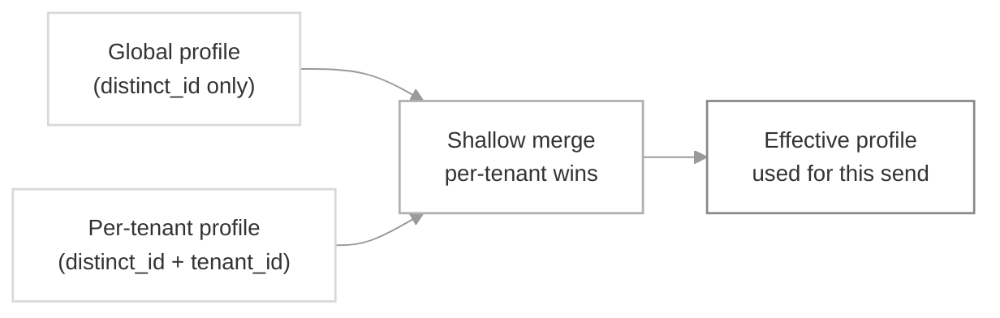

User-tenant mapping lets a single user carry different properties and channel identities in different tenants. A user might be *"project manager"* in one tenant and *"member"* in another, or hold a separate `$androidpush` / `$iospush` token per mobile app under the same workspace. When you trigger with `tenant_id`, SuprSend resolves the user against that tenant's overrides layered on top of their global profile.

## How it works

Every user still has a **global profile** — the one you create today by calling the user API without a `tenant_id`. On top of that, you can now create a **per-tenant profile** for any tenant the user is associated with. At send time, SuprSend produces the effective profile by shallow-merging the two: per-tenant values win, and any key not set at the tenant level is picked from global.



The merge is **shallow** — one level deep, per key. If a key exists in the per-tenant profile it replaces the global value entirely; if it doesn't, the global value is used. This applies to both **properties** (custom keys like `role`, `plan`) and **channel identities** (`$email`, `$slack`, `$androidpush`, etc.).

<Note>
A trigger without `tenant_id` continues to resolve to the global profile exactly as before — no behavior change for existing customers who don't adopt this feature.
</Note>

## When to use it

Reach for user-tenant mapping when a single `distinct_id` legitimately represents the same person across multiple tenants, but their notification setup differs per tenant. Common scenarios:

- **Same user, different push tokens per app.** A workspace runs multiple mobile apps (each a tenant); the user has separate `$androidpush` / `$iospush` tokens per app install, and a push for one app should never be routed to another app's token.
- **Tenant-scoped role or plan properties.** The user is *"admin"* on `projectA` and *"viewer"* on `projectB` — template branches on `role`.
- **Different work email per business line.** `$email` on the global profile is the personal address; per-tenant `$email` is the tenant-specific work address.

## When NOT to use it — user-tenant mapping vs neighboring approaches

| Approach | User-tenant mapping | Separate users per tenant | Tenant properties only |
|---|---|---|---|
| **Best for** | Same person, tenant-specific overrides to channels/properties | Truly different people who happen to share an identifier upstream | Tenant-wide branding, admin defaults, vendor routing |
| **User identity** | One `distinct_id`, many per-tenant profiles | One `distinct_id` per tenant (`user_tenantA`, `user_tenantB`) | One `distinct_id`, one profile |
| **Use when** | *"Same user installs two of our mobile apps, needs a separate push token per app"* | *"Two unrelated end-users your upstream system happens to number identically"* | *"All users in a tenant should see that tenant's logo and colors"* |

If you only need per-tenant *branding* (logo, colors, template variables), you don't need user-tenant mapping — see [Tenants](/docs/tenants) and [Tenant Templates](/docs/tenant-templates).

## User tenancy mode — shared vs exclusive

A workspace-level setting, `user_tenancy_mode`, controls whether a user can belong to more than one tenant. Configure it under **Settings → General → Multi-Tenant User Mapping** in the dashboard, or via the [workspace config API](/reference/update-workspace-config) (`PATCH /v1/{workspace}/config/`).

| Value | Meaning | When to use |
|---|---|---|
| `shared` | One user can be associated with any number of tenants. | *"The same person is a member of multiple customer orgs and should keep one identity across them."* |
| `exclusive` | One user can be associated with at most one tenant (plus a global-only profile). Second-tenant association throws an error. | *"Each user physically belongs to exactly one customer org; associations to another org indicate a bug in our data."* |

Defaults: `shared` for workspaces created before this feature shipped, `exclusive` for new workspaces.

<Frame>
  
</Frame>

<Warning>
Switching a workspace from `shared` → `exclusive` requires a data migration to pick the surviving tenant per user. This flip is not self-serve — contact support@suprsend.com to make the change.
</Warning>

## Channel fallback — controlling what leaks from global

The shallow merge is convenient but leaky. If a user has `$androidpush` on their global profile and only overrides `$email` on the `suprstack` tenant, a push send under `suprstack` still uses the *global* Android token — which is exactly what you don't want when the two tenants are separate mobile apps installed on the same device.

Channel fallback is the workspace-level control that decides which channels are allowed to fall back to the global profile when the tenant profile has no override. Configure it under **Settings → General → Multi-Tenant User Mapping** or via [PATCH /v1/{workspace}/config/](/reference/update-workspace-config).

| Field | Values | What it does |
|---|---|---|
| `user_tenancy_channel_fallback_mode` | `all` \| `allowlist` | `all` (default) — every channel falls back. `allowlist` — only channels named in `user_tenancy_channel_fallback` fall back; everything else is dropped from the send when the tenant profile has no override for it. |
| `user_tenancy_channel_fallback` | `string[]` of channel keys, e.g. `["$email", "$sms", "$whatsapp"]` | The allowlist. Only meaningful when mode is `allowlist`. |
| `user_tenancy_channel_fallback_applies_to_default_tenant` | `bool`, default `false` | Whether the rule above also governs sends with no `tenant_id`. `false` keeps the default-tenant path permissive (all channels fall back); `true` applies the same allowlist. |

Typical setup for isolated mobile apps: `allowlist` mode with `["$email", "$sms", "$whatsapp"]` — safe channels fall back, while `$androidpush`, `$iospush`, `$webpush`, `$inbox`, and `$slack` are dropped unless the tenant profile carries its own value.

### Default-tenant exemption

A trigger with `tenant_id = null` (or no `tenant_id` at all) uses the default-tenant path. By default, this path is exempt from the fallback rule — every channel falls back, since the default tenant represents "no scoping." Set `user_tenancy_channel_fallback_applies_to_default_tenant: true` if you want the same allowlist to govern default-tenant sends too (useful when the default tenant is treated as a real customer environment rather than a catch-all).

## Associating a user to a tenant

Every route below writes to the same per-tenant profile store — pick whichever fits your flow. The body accepts the same fields as [Edit User Profile](/reference/edit-user-profile) (channels, properties, `$timezone`, `$locale`, `$preferred_language`).

<Tabs>
  <Tab title="Dashboard">
    <Steps>
      <Step title="Open the tenant's Associated Users tab">
        Go to **Tenants → *tenant_id* → Associated Users**. The tab lists every user already mapped to this tenant, with **Channels Overridden** and **Properties Overridden** columns so you can see at a glance which fields diverge from the user's global profile.
        <Frame>
          
        </Frame>
      </Step>
      <Step title="Add the user">
        Click **+ Add Users**. In the side sheet, pick the user from the **User** dropdown, then add per-tenant channels and properties. Every field you enter here writes to the per-tenant profile, not the global one.
        <Frame>
          
        </Frame>
      </Step>
      <Step title="Save">
        Click **Add User**. The user now appears on the Associated Users tab with the channels and properties you overrode.
      </Step>
    </Steps>

    **Alternative — edit tenant overrides from the User detail page.** Open **Users → *distinct_id*** and switch the **View for tenant** dropdown (top-right) to the tenant you want to scope changes to. A banner confirms the tenant context and any values overridden for this tenant render highlighted in blue. Use the per-field editor to override a channel or property, or click **Reset all** to clear every override at once.

    <Frame>
      
    </Frame>

    You can also list users through the tenant's lens from **Users → View for tenant → *tenant_id***. The listing then reflects each user's effective profile for that tenant.

    <Frame>
      
    </Frame>
  </Tab>
  <Tab title="REST API">
    ```bash
    curl -X POST "https://hub.suprsend.com/v1/user/joe@example.com/tenant/suprstack/" \
      --header 'Authorization: Bearer __YOUR_API_KEY__' \
      --header 'Content-Type: application/json' \
      --data '{
        "$email": ["joe@suprstack.com"],
        "$androidpush": ["fcm_token_suprstack_abc123"],
        "$timezone": "America/New_York",
        "$preferred_language": "en",
        "role": "admin"
      }'
    ```
    See [Upsert user-tenant profile](/reference/upsert-user-tenant-profile) for the full request and response schema.
  </Tab>
</Tabs>

<Note>
Under `exclusive` mode, calling this on a user already mapped to a different tenant returns `400` with a message like `user is already associated with a different tenant`. Delete the first mapping before creating the new one.
</Note>

To **fetch** a merged tenant-scoped profile or **list** every tenant a user is mapped to, see [Fetch user-tenant profile](/reference/fetch-user-tenant-profile) and [List user tenant profiles](/reference/list-user-tenant-profiles). To **list every user mapped to a given tenant**, call [List Users](/reference/list-users) with `?tenant_id=<tenant_id>` — the response includes each user's tenant-scoped `properties` and channel overrides alongside their global profile.

## Triggering a workflow with tenant context

Any trigger — workflow API, event, broadcast, or object fan-out — accepts tenant context and produces the effective profile before evaluating the workflow.

Set `tenant_id` at the top level of the trigger. It applies to every recipient and the actor:

```json
{
  "workflow": "invoice-reminder",
  "tenant_id": "suprstack",
  "recipients": [{ "distinct_id": "joe@example.com" }],
  "data": { "invoice_no": "INV-2287", "amount": "$1,240" }
}
```

If you're defining a recipient inline and want the profile fields you pass (`$email`, `$sms`, properties) to be written against a specific tenant rather than the user's global profile, add `$context.tenant_id` on that recipient. The same `$context.tenant_id` is accepted on the `actor` object.

```json
{
  "workflow": "invoice-reminder",
  "tenant_id": "suprstack",
  "recipients": [
    {
      "distinct_id": "joe@example.com",
      "$email": ["joe@suprstack.com"],
      "$context": { "tenant_id": "suprstack" }
    }
  ],
  "data": { "invoice_no": "INV-2287" }
}
```

<Warning>
When both are present, `$context.tenant_id` **must equal** the trigger-level `tenant_id`. A mismatch rejects the request and the workflow does not trigger. Use `$context.tenant_id` to scope the *inline profile write* to the same tenant the trigger is sending under — not to switch tenants per recipient.
</Warning>

`tenant_id` at the trigger level is the send-time tenant context. It does **not** need to match a tenant the user is already associated with — under `shared`, an unrelated `tenant_id` simply resolves to the global profile since there's nothing to merge. Under `exclusive`, an unrelated `tenant_id` returns `400`.

## Deleting a user-tenant mapping

Removes the per-tenant profile fragment for that user-tenant pair. The global profile is untouched, and the user remains in the workspace. Delete it either from the dashboard or via API.

<Tabs>
  <Tab title="Dashboard">
    Go to **Tenants → *tenant_id* → Associated Users**, click the row menu on the user you want to unmap, and choose **Remove from tenant**. A confirmation modal appears before the mapping is deleted.
  </Tab>
  <Tab title="REST API">
    ```bash
    curl -X DELETE "https://hub.suprsend.com/v1/user/joe@example.com/tenant/suprstack/" \
      --header 'Authorization: Bearer __YOUR_API_KEY__'
    ```
  </Tab>
</Tabs>

## Key behaviors and constraints

- **Global profile is untouched** — creating per-tenant profiles never modifies the global one. A user with no per-tenant profile behaves identically to today.
- **Shallow merge, per-tenant wins** — object-typed values are replaced, not deep-merged. If `properties.address` exists on both profiles, the per-tenant object replaces the global one entirely.
- **Isolation is per-workspace** — `user_tenancy_mode` applies to every tenant in the workspace; it can't be set per tenant.
- **Fallback is per-channel** — governed by the workspace-level `user_tenancy_channel_fallback_mode` + `user_tenancy_channel_fallback` list; not settable per tenant or per user.
- **The default tenant behaves like global on the trigger path** — unless `user_tenancy_channel_fallback_applies_to_default_tenant` is enabled.
- **Preferences are separate** — per-tenant user preferences already exist and are governed by the [preference APIs](/reference/update-user-category-preference). User-tenant mapping stores properties and channel identities, not preferences.

## Troubleshooting

<AccordionGroup>
  <Accordion title="400 — 'user is already associated with a different tenant'">
    Your workspace is in `exclusive` mode and this user already has a per-tenant profile on another tenant. Either delete the existing mapping first, switch the workspace to `shared` (contact support@suprsend.com), or use a different `distinct_id` for the new tenant.
  </Accordion>

  <Accordion title="404 — 'tenant not found' on the upsert call">
    The `tenant_id` in the URL doesn't exist in the workspace. Create the tenant first via [Managing Tenants](/docs/tenant-management), then retry.
  </Accordion>

  <Accordion title="Notification went to the wrong push device or channel identity">
    The per-tenant profile doesn't have that channel set, so the shallow merge fell back to the global identity. Add the correct tenant-scoped identity (for example, the tenant's `$androidpush` token or `$email`) to the per-tenant profile so it wins during the merge.
  </Accordion>

  <Accordion title="Trigger with tenant_id silently used the global profile">
    Under `shared` mode, an unrelated `tenant_id` (one the user isn't mapped to) simply falls through to the global profile — there's nothing to merge. Double-check the `tenant_id` spelling and confirm the user is actually associated with that tenant on the **Associated Users** tab. If you want the API to reject unrelated tenants outright, use `exclusive` mode.
  </Accordion>

  <Accordion title="Merged profile in the dashboard doesn't match what got sent">
    Confirm the User detail page's **View for tenant** dropdown is set to the same `tenant_id` you passed in the trigger — a mismatched tenant filter shows a different merged profile than the send actually used.
  </Accordion>
</AccordionGroup>

## FAQ

<AccordionGroup>
  <Accordion title="Do I have to map every user to a tenant?">
    No. Users without any per-tenant profile continue to resolve to the global profile for every send. Mapping is opt-in per user.
  </Accordion>

  <Accordion title="What happens if I trigger with a tenant_id the user isn't associated with?">
    Under `shared`, the send resolves against the user's global profile (nothing to merge). Under `exclusive`, the API throws an error because the user-tenant combination is invalid.
  </Accordion>

  <Accordion title="How does this interact with tenant properties like logo and colors?">
    Tenant branding (`$brand.logo`, `$brand.primary_color`, etc.) is unchanged — it comes from the tenant object itself, not from the user's per-tenant profile. See [Tenants](/docs/tenants).
  </Accordion>

  <Accordion title="Does deleting a user's tenant mapping delete the user?">
    No. Deleting the mapping removes the per-tenant profile for that user-tenant pair. The global profile stays intact.
  </Accordion>

  <Accordion title="Does deleting a tenant remove all its user mappings?">
    Yes. When a tenant is deleted, every per-tenant profile scoped to that tenant is removed. Global profiles remain intact.
  </Accordion>

  <Accordion title="What if I use Segment group calls?">
    Group / identify calls that carry a tenant identifier update the user's per-tenant profile for that tenant, following the same merge rules.
  </Accordion>

  <Accordion title="Can I auto-detect the tenant for a user with only one association?">
    Not today. Every trigger, get, and update call that needs tenant context must pass `tenant_id` (or omit it to use the global profile).
  </Accordion>
</AccordionGroup>

## Next steps

<CardGroup cols={2}>
  <Card title="Upsert user-tenant profile" icon="code" href="/reference/upsert-user-tenant-profile">
    POST endpoint to create or update the per-tenant profile for a user.
  </Card>
  <Card title="List user tenant profiles" icon="list-check" href="/reference/list-user-tenant-profiles">
    List every tenant the user is associated with, with the merged and override profiles.
  </Card>
  <Card title="Multi-tenant modelling guide" icon="sitemap" href="/docs/multi-tenant-modelling">
    End-to-end architecture example for a B2B2X notification service.
  </Card>
  <Card title="Tenants overview" icon="book" href="/docs/tenants">
    Learn what tenants are and the other customizations they enable.
  </Card>
</CardGroup>
