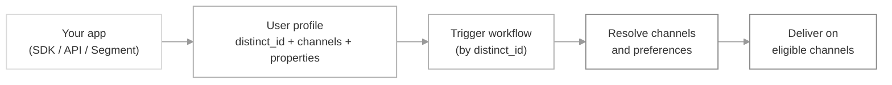

A **user** in SuprSend is a person who receives (or triggers) a notification. Each user is identified by a unique `distinct_id`, and their profile stores everything SuprSend needs to reach them — channel identities (`$email`, `$sms`, push tokens, Slack access token, etc.), custom properties (`plan`, `role`, `timezone`), and preferences.

Without a stored profile, you would have to pass every channel identity and property on every trigger. Storing them once against a `distinct_id` lets you reference the user by ID from then on — SuprSend fills in the channels, applies preferences, and routes on the properties automatically.

## How it works



You identify a user once — either from your backend SDK, a client-side SDK, or a third-party connector like Segment. From then on, every workflow trigger that names their `distinct_id` picks up their channels, properties, and preferences automatically.

<Note>
Users are workspace-scoped — a `distinct_id` in your staging workspace is a different user from the same `distinct_id` in production.
</Note>

## Types of users

SuprSend distinguishes users along two axes: whether they're **stored** (identified vs anonymous), and what **role** they play in a trigger (recipient vs actor).

### Identified vs anonymous

- **Identified user** — the default. You create a persistent profile with a `distinct_id`; channels, properties, and preferences are saved and reused across triggers. Use this for anyone you'll notify more than once.
- **Anonymous (transient) user** — set `is_transient: true` on the `recipients` or `actor` payload of a single trigger. Channels and properties are used for that send only; nothing is saved. Use this for unregistered users, one-off system emails, or notifications to raw email/phone addresses you don't want polluting your user list.

<CodeGroup>
```json Recipient
{
  "recipients": [
    {
      "is_transient": true,
      "$email": ["guest@example.com"],
      "name": "Guest"
    }
  ]
}
```

```json Actor
{
  "actor": {
    "is_transient": true,
    "name": "Billing System"
  }
}
```
</CodeGroup>

<Tip>
Prefer identified users whenever you'll message the same person again — preferences, digest schedules, and per-tenant overrides all require a stored profile.
</Tip>

### Recipient vs actor

Every workflow trigger references users in two possible roles:

- **Recipient** — the user (or [object](/docs/objects)) receiving the notification. Passed in the `recipients` array. Their channels, properties, and preferences drive delivery.
- **Actor** — the user who initiated the action being announced (e.g. the person who commented, invited, or approved). Passed as `actor` in the trigger. Their properties are available in the template as `$actor.name`, `$actor.avatar`, etc. — an actor is never notified themselves.

A single `distinct_id` can appear as a recipient in one trigger and as an actor in another; there is no separate "actor user" record.

## Creating users

You can create or update a user from any of the routes below. All of them upsert against `distinct_id` — creating the profile the first time, patching it on subsequent calls. Keys you send are updated; keys you omit stay as they were.

A typical payload sets one or more channel identities (each is a list) plus any custom properties you want to reference in templates or workflow conditions.

### Backend SDK / HTTP API

Call the [Create / Update Users API](/reference/create-update-users) or a backend SDK from your application server. *Best for server-of-record patterns — sync on signup, subscription change, or profile edit.*

<CodeGroup>
```bash cURL
curl --request POST \
  --url https://hub.suprsend.com/v1/user/user_1a2b3c/ \
  --header 'Authorization: Bearer __YOUR_API_KEY__' \
  --header 'Content-Type: application/json' \
  --data '{
    "$email": ["user@example.com"],
    "$sms": ["+15555555555"],
    "$androidpush": ["fcm_token_abc123"],
    "$timezone": "America/Los_Angeles",
    "$preferred_language": "en",
    "name": "Alex Rivera",
    "plan": "growth",
    "role": "admin"
  }'
```

```javascript Node.js
const { Suprsend } = require("@suprsend/node-sdk");

const supr_client = new Suprsend("__workspace_key__", "__workspace_secret__");

const user = supr_client.user.get_instance("user_1a2b3c");

user.add_email("user@example.com");
user.add_sms("+15555555555");
user.add_androidpush("fcm_token_abc123");

user.set_timezone("America/Los_Angeles");
user.set_preferred_language("en");
user.set({
  name: "Alex Rivera",
  plan: "growth",
  role: "admin",
});

const res = await user.save();
console.log(res);
```

```python Python
from suprsend import Suprsend

supr_client = Suprsend("__workspace_key__", "__workspace_secret__")

user = supr_client.user.get_instance("user_1a2b3c")

user.add_email("user@example.com")
user.add_sms("+15555555555")
user.add_androidpush("fcm_token_abc123")

user.set_timezone("America/Los_Angeles")
user.set_preferred_language("en")
user.set({
    "name": "Alex Rivera",
    "plan": "growth",
    "role": "admin",
})

res = user.save()
print(res)
```

```java Java
import suprsend.Suprsend;
import suprsend.Subscriber;

Suprsend suprsendClient = new Suprsend("__workspace_key__", "__workspace_secret__");

Subscriber user = suprsendClient.user.getInstance("user_1a2b3c");

user.addEmail("user@example.com");
user.addSms("+15555555555");
user.addAndroidpush("fcm_token_abc123", "fcm");

user.setTimezone("America/Los_Angeles");
user.setPreferredLanguage("en");
user.set("name", "Alex Rivera");
user.set("plan", "growth");
user.set("role", "admin");

JSONObject response = user.save();
System.out.println(response);
```

```go Go
import "github.com/suprsend/suprsend-go"

suprClient, _ := suprsend.NewSuprsendClient("__workspace_key__", "__workspace_secret__")

user := suprClient.Users.GetInstance("user_1a2b3c")

user.AddEmail("user@example.com")
user.AddSms("+15555555555")
user.AddAndroidpush("fcm_token_abc123", "fcm")

user.SetTimezone("America/Los_Angeles")
user.SetPreferredLanguage("en")
user.Set("name", "Alex Rivera")
user.Set("plan", "growth")
user.Set("role", "admin")

res, err := user.Save()
if err != nil {
    log.Fatalln(err)
}
fmt.Println(res)
```
</CodeGroup>

See the language-specific guides for full method reference and installation: [Node](/docs/node-create-user-profile), [Python](/docs/python-create-user-profile), [Java](/docs/java-create-user-profile), [Go](/docs/go-create-user-profile). For precise mutations use [edit operations](/reference/edit-user-profile) (`$set`, `$unset`, `$append`, `$remove`).

### Client-side SDK

Identify the user from the browser or mobile app after they've authenticated. *Best when you also need to capture in-app events or register device push tokens.* Client-side identification uses a public API key plus a short-lived user token minted by your backend — see [client authentication](/docs/client-authentication).

<CodeGroup>
```javascript JavaScript
import { SuprSendClient } from "@suprsend/web-sdk";

const suprSendClient = new SuprSendClient(
  "__public_api_key__",
  "your-tenant"
);

// Authenticate the current user (userToken is minted by your backend)
await suprSendClient.identify("user_1a2b3c", userToken);

// Sync channels and properties
await suprSendClient.user.addEmail("user@example.com");
await suprSendClient.user.addSms("+15555555555");
await suprSendClient.user.setPreferredLanguage("en");
await suprSendClient.user.set({
  name: "Alex Rivera",
  plan: "growth",
});
```

```javascript React Native
import Suprsend from "@suprsend/react-native-sdk";

const suprsend = new Suprsend("__public_api_key__");

// Authenticate the current user — push token is registered automatically
suprsend.identify("user_1a2b3c");

// Sync channels and properties
suprsend.user.setEmail("user@example.com");
suprsend.user.setSms("+15555555555");
suprsend.user.setPreferredLanguage("en");
suprsend.user.set({
  name: "Alex Rivera",
  plan: "growth",
});
```

```kotlin Android (Kotlin)
// Authenticate the current user — androidpush token is registered automatically
ssApi.identify("user_1a2b3c")

// Sync channels and properties
ssApi.getUser().setEmail("user@example.com")
ssApi.getUser().setSms("+15555555555")
ssApi.getUser().setPreferredLanguage("en")
ssApi.getUser().set("name", "Alex Rivera")
ssApi.getUser().set("plan", "growth")
```

```swift iOS (Swift)
// Authenticate the current user — iospush token is registered automatically
await SuprSend.shared.identify(
    distinctID: "user_1a2b3c",
    userToken: userToken
)

// Sync channels and properties
await SuprSend.shared.user.addEmail("user@example.com")
await SuprSend.shared.user.addSms("+15555555555")
await SuprSend.shared.user.setPreferredLanguage("en")
await SuprSend.shared.user.set("name", "Alex Rivera")
await SuprSend.shared.user.set("plan", "growth")
```

```dart Flutter (Dart)
// Authenticate the current user — push token is registered automatically
suprsend.identify("user_1a2b3c");

// Sync channels and properties
suprsend.user.setEmail("user@example.com");
suprsend.user.setSms("+15555555555");
suprsend.user.setPreferredLanguage("en");
suprsend.user.set({
  "name": "Alex Rivera",
  "plan": "growth",
});
```
</CodeGroup>

See the platform-specific guides for installation, push-token setup, and full method reference: [JavaScript](/docs/js-events-and-user-methods), [React Native](/docs/react-native-create-user), [Android](/docs/android-create-user), [iOS](/docs/swift-events-and-user-methods), [Flutter](/docs/flutter-create-user).

<Tip>
For most B2B products, sync from the backend on write (signup, plan change) and use the client SDK only for push-token registration and events. That keeps the user profile authoritative in one place.
</Tip>

### Inline in a trigger

Pass channel identities and properties directly on the `recipients` object of a [workflow trigger](/docs/trigger-workflow) — SuprSend upserts the user before sending. *Best for lightweight onboarding flows where the trigger itself carries the freshest data*, or for [anonymous sends](#identified-vs-anonymous) via `is_transient: true`.

<CodeGroup>
```bash cURL
curl --request POST \
  --url https://hub.suprsend.com/trigger/ \
  --header 'Authorization: Bearer __YOUR_API_KEY__' \
  --header 'Content-Type: application/json' \
  --data '{
    "workflow": "welcome-series",
    "recipients": [
      {
        "distinct_id": "user_1a2b3c",
        "$email": ["user@example.com"],
        "$sms": ["+15555555555"],
        "name": "Alex Rivera",
        "plan": "growth"
      }
    ],
    "data": {
      "signup_source": "landing_page"
    }
  }'
```
</CodeGroup>

To skip user creation when the recipient shouldn't be persisted, add `"$skip_create": true`. To send without any stored profile, use `"is_transient": true` and omit `distinct_id`.

### Third-party connector

Sync users automatically from [Segment](/docs/segment). Every `identify` call from Segment maps to a SuprSend user upsert — `userId` becomes the `distinct_id`, and everything under `traits` syncs as properties or channel identities (with a per-key mapping you configure once). *Best if user identity already flows through Segment in your stack — you get user sync without any additional integration code.*

## Mapping users to other entities

A user can be associated with three other primitives in SuprSend — a **tenant**, an **object**, or a **list**. Each mapping serves a different purpose, and a single user can participate in all three simultaneously.

| Mapping | What it does | Reach for it when |
|---|---|---|
| **[User ↔ Tenant](/docs/user-tenant-mapping)** | Isolate users to a single tenant, or share users across tenants with per-tenant overrides for channels and properties | *"Users in our B2B app should never leak across customer orgs"*, or *"Same person exists in two of our customer orgs and needs a different Slack token in each"* |
| **[User ↔ Object](/docs/object-subscriptions)** | Subscribe a user to a group entity (team, project, department) with optional subscription properties | *"Notify everyone watching this project when a comment is posted"* |
| **[User ↔ List](/docs/lists)** | Add the user to an audience for **campaigns** (broadcasts) or **re-engagement workflows** on list entry / exit | *"Send the Q1 product newsletter to Growth-plan users"* or *"Trigger a win-back flow when a user drops out of the 'active in last 30 days' list"* |

### User ↔ Tenant

How users relate to tenants depends on a workspace-level setting, `user_tenancy_mode`:

- **`shared`** (default for existing workspaces) — one `distinct_id` can be associated with any number of tenants. On top of a shared **global profile**, you can store a per-tenant profile per tenant the user belongs to. At send time, SuprSend shallow-merges the global profile with the per-tenant override for the trigger's `tenant_id` — per-tenant values win. Use this when the same person legitimately exists across multiple tenants and needs different channel identities or properties in each (e.g. per-tenant Slack tokens, a `role` that differs per customer org).
- **`exclusive`** (default for new workspaces) — one `distinct_id` can be associated with at most one tenant. The first tenant a user is mapped to is final; associating them to a second tenant throws an error. Use this when tenants represent isolated customer orgs and users must never leak across them — the standard B2B SaaS multi-tenancy model.

See [User-Tenant Mapping](/docs/user-tenant-mapping) for the user tenancy mode, merge semantics, and end-to-end setup.

### User ↔ Object

Users subscribe to [objects](/docs/objects) — non-user entities like teams, projects, or departments. A subscription can carry its own properties (e.g. `role: "owner"`) that templates read as `$recipient.subscription.role`. Triggering a workflow on the object then fans out to every subscribed user (and any nested object subscribers), without listing them explicitly in the trigger.

Use object subscriptions for reusable "who's watching this?" relationships — the membership lives on the object, not on the user, so adding or removing subscribers doesn't require re-triggering anything. See [Object subscriptions](/docs/object-subscriptions).

### User ↔ List

Mapping users to a list is how you build the audience for two of the highest-volume notification patterns: **campaigns** and **re-engagement flows**.

- **Campaigns / broadcasts** — send a one-shot message to everyone on the list at once (product updates, newsletters, launch announcements, promotional offers). [Broadcasts](/docs/broadcast) are a single high-throughput send to every member, tuned for this pattern.
- **Re-engagement workflows** — trigger a workflow the moment a user enters or exits the list. Ship a welcome series to users joining the "signed up in the last 7 days" list; fire a win-back flow when a user drops out of "active in last 30 days." The list itself becomes the signal — you don't have to write the event.

Users are added to a list either explicitly (SDK, CSV upload, database sync) or automatically via a **[Segment List](/docs/segment-lists)** whose rule matches user properties and events. Segment Lists keep membership fresh on their own — a user joins the moment they meet the criteria and drops off when they stop.

See [Lists](/docs/lists) for creation options and [Add user to list](/docs/add-user-to-list) for programmatic membership.

## Key behaviors and constraints

- **`distinct_id` is immutable** — once created, it cannot be renamed. To merge two profiles created for the same person, use the [user merge API](/reference/merge-users).
- **Upserts, not overwrites** — the user API patches by default; keys you don't send are left untouched. Use [edit operations](/reference/edit-user-profile) (`$set`, `$unset`, `$append`, `$remove`) for precise mutations.
- **Channel identities are lists** — `$email`, `$sms`, `$whatsapp`, `$androidpush`, `$iospush`, `$webpush`, `$slack` are all arrays. A user can have multiple addresses per channel; SuprSend attempts each until one succeeds unless you narrow it with [Smart Delivery](/docs/smart-delivery).
- **Reserved property prefix** — keys starting with `$` are reserved for SuprSend-managed fields (`$email`, `$timezone`, `$preferred_language`, `$skip_create`, `is_transient`). Use plain keys for custom properties.
- **Anonymous users leave no trace** — a `is_transient: true` recipient is not searchable, has no preferences, and cannot be targeted in future triggers. Use it only for genuinely one-shot sends.
- **Workspace-scoped** — the same `distinct_id` in two workspaces (staging vs production, or two separate environments) refers to two independent profiles.

## FAQ

<AccordionGroup>
  <Accordion title="What should I use as the distinct_id?">
    Use a stable, unique identifier from your own system — typically your database's user primary key. Avoid email addresses or usernames, because those can change and the `distinct_id` cannot.
  </Accordion>

  <Accordion title="Can one user have different channel identities per tenant?">
    Yes. Set them up as per-tenant overrides via [user-tenant mapping](/docs/user-tenant-mapping). The global profile remains untouched; the per-tenant values apply only when a trigger carries the matching `tenant_id`.
  </Accordion>

  <Accordion title="How do I send to someone who isn't a registered user?">
    Pass `is_transient: true` on the `recipients` payload along with the channel identities you want to reach them on. No profile is created, and nothing is stored. See [anonymous user triggers](/docs/node-trigger-workflow-from-api#sending-notification-to-anonymous-user).
  </Accordion>

  <Accordion title="What happens if I trigger with a distinct_id that doesn't exist?">
    If you pass channel identities inline on the recipient, SuprSend creates the user on the fly (unless you set `$skip_create: true`). If you pass only a `distinct_id` and no channels, the trigger fails because there's no way to reach the recipient.
  </Accordion>

  <Accordion title="Can a user appear as both actor and recipient in the same trigger?">
    Yes — for example, an "I approved my own request" notification. The same `distinct_id` can be listed as `actor` and as a member of `recipients`. Their properties resolve into `$actor.*` and `$recipient.*` independently.
  </Accordion>

  <Accordion title="How do I delete a user?">
    Use [delete user API](/reference/delete-user). This removes the profile, channel identities, preferences, and per-tenant overrides for that `distinct_id` in the workspace.
  </Accordion>
</AccordionGroup>

## Next steps

<CardGroup cols={2}>
  <Card title="Update user profile" icon="user-pen" href="/docs/update-user-profile">
    Add channels, set custom properties, and edit profiles via SDK or API.
  </Card>
  <Card title="User-tenant mapping" icon="users" href="/docs/user-tenant-mapping">
    Give a user different properties and channel identities per tenant.
  </Card>
  <Card title="Object subscriptions" icon="sitemap" href="/docs/object-subscriptions">
    Subscribe users to teams, projects, or other group entities.
  </Card>
  <Card title="Lists" icon="list" href="/docs/lists">
    Group users into audiences for broadcasts and list-entry workflows.
  </Card>
  <Card title="User preferences" icon="sliders" href="/docs/user-preferences">
    Let users control which categories and channels they receive.
  </Card>
  <Card title="Trigger a workflow" icon="bolt" href="/docs/trigger-workflow">
    Send a notification to a user by `distinct_id`.
  </Card>
</CardGroup>
