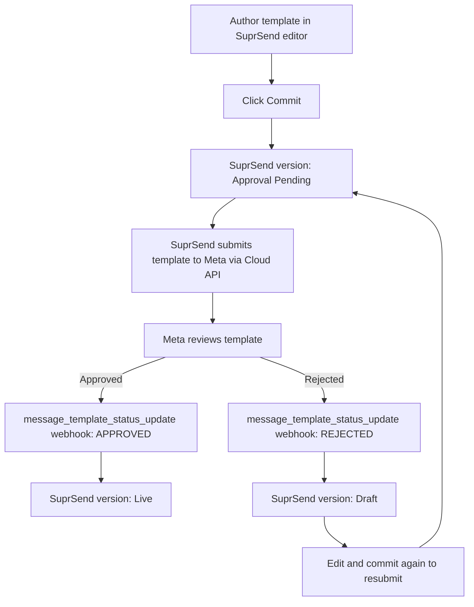

This page covers the template approval flow for the **WhatsApp Cloud API** (Meta direct) vendor. With this vendor, SuprSend submits your committed template to Meta automatically and tracks the approval status via webhook — you don't need to upload templates anywhere else.

For the same flow on other WhatsApp vendors, see their integration pages: [Karix](/docs/karix-whatsapp), [Gupshup](/docs/gupshup-whatsapp), and [Netcore](/docs/netcore-whatsapp). Note that [Netcore does not support template auto-approval](/docs/netcore-whatsapp#must-know) — templates must be created on the Netcore platform separately.

<Note>
  This page is about the **approval workflow only**. For the editor (header, body, footer, buttons), see [WhatsApp Template](/docs/whatsapp-template). For Meta's content rules, see [WhatsApp Template Guidelines](/docs/whatsapp-template-guidelines).
</Note>

---

## Prerequisites

Auto-approval requires the WhatsApp Cloud API vendor to be fully configured on SuprSend. Complete the [WhatsApp Cloud API integration guide](/docs/whatsapp-cloud-api) first, then verify the items below.

| Requirement | Where to set | Why it's needed for approval |
|---|---|---|
| **WhatsApp Business Account ID (WABA ID)** | SuprSend vendor form (mandatory) | Identifies the WABA that templates are submitted under |
| **App ID** | SuprSend vendor form (mandatory) | Required to auto-approve templates on your account |
| **Access token** | SuprSend vendor form (mandatory) | Must be a system user token with `whatsapp_business_management` and `whatsapp_business_messaging` permissions (set during [token generation](/docs/whatsapp-cloud-api#step-5-generate-access-token)) |
| **Meta webhook subscription** | Meta App dashboard → WhatsApp → Configuration | Sends template status updates back to SuprSend so the version flips to Live (or back to Draft) automatically. See [Configure webhook in Meta](/docs/whatsapp-cloud-api#configure-webhook-in-meta-account-for-automated-template-approval-and-dlr-tracking). |

<Warning>
  Without the Meta webhook configured, SuprSend cannot receive automated approval status updates from Meta. The template will still be submitted, but its status on SuprSend will not update automatically.
</Warning>

---

## How approval works end-to-end

<Steps>
  <Step title="Author and commit">
    Create or edit your template in the [WhatsApp editor](/docs/whatsapp-template) and click **Commit**. The version enters **Approval Pending** state.
  </Step>
  <Step title="SuprSend submits to Meta">
    Using the WABA ID, App ID, and access token from your vendor configuration, SuprSend submits the template to Meta's Cloud API on your behalf. Named Handlebars variables like `{{order_id}}` are automatically converted to Meta's required positional format `{{1}}`, `{{2}}` at submission time. You always author with named variables — see [Adding dynamic content](/docs/whatsapp-template#adding-dynamic-content).
  </Step>
  <Step title="Meta reviews">
    Meta reviews the template through a combination of automated and manual review. A decision is typically returned within minutes, and [can take up to 24 hours](https://developers.facebook.com/documentation/business-messaging/whatsapp/templates/template-review).
  </Step>
  <Step title="Status delivered via webhook">
    Meta sends the result via the [`message_template_status_update`](https://developers.facebook.com/documentation/business-messaging/whatsapp/webhooks/reference/message_template_status_update/) webhook to the URL you configured in Meta App dashboard → WhatsApp → Configuration.
  </Step>
  <Step title="SuprSend updates the version">
    On approval, the SuprSend version moves to **Live** and is used for all subsequent workflow triggers. On rejection, it returns to **Draft** for revision. Pending and approved versions are visible in the **Approvals** tab on the [template listing page](/docs/templates#managing-templates).
  </Step>
</Steps>

---

## Template categories

Every WhatsApp template must declare a category. Choosing the wrong category is the most common reason for rejection or reclassification by Meta. The categories below are defined by Meta's [Template fundamentals](https://developers.facebook.com/docs/whatsapp/business-management-api/message-templates).

| Category | Use when | Examples |
|---|---|---|
| **Utility** | Responding to a user action — transactional or service updates | Order confirmation, shipping update, payment receipt, appointment reminder |
| **Marketing** | Proactively reaching out with promotions or re-engagement (requires opt-in) | Flash sale, product recommendation, abandoned cart nudge |
| **Authentication** | Sending OTPs or verification codes — uses a specialised template structure | Login OTP, two-factor auth, phone verification |

<Warning>
  Meta may **reclassify** your template if the content does not match the selected category. A "Utility" template with promotional language may be reclassified as "Marketing" — with different pricing and opt-in requirements. See the [reclassification note](/docs/whatsapp-template#choosing-the-right-category) for details.
</Warning>

---

## Status values

Meta returns one of the following statuses through the webhook and the [Template API](https://developers.facebook.com/docs/whatsapp/business-management-api/message-templates#template-status). The table maps each API status to the label shown in the [WhatsApp Manager](https://business.facebook.com/latest/whatsapp_manager/message_templates) and what it means for sending.

| Meta API status | WhatsApp Manager label | Can send? | Meaning |
|---|---|---|---|
| `PENDING` | In-Review | No | Template is still under review (up to 24 hours). |
| `APPROVED` | Active – Quality pending | Yes | Approved but no quality feedback yet from recipients. |
| `APPROVED` | Active – High Quality | Yes | Little to no negative customer feedback. |
| `APPROVED` | Active – Medium Quality | Yes | Some negative feedback or low read-rates — at risk. |
| `APPROVED` | Active – Low Quality | Yes | Significant negative feedback — close to being paused. |
| `REJECTED` | Rejected | No | Failed review or violates a policy. Edit and resubmit, or appeal. |
| `PAUSED` | Paused | No | Paused due to recurring negative feedback or low read-rates. See [Template Pausing](https://developers.facebook.com/documentation/business-messaging/whatsapp/templates/template-pausing/). |
| `DISABLED` | Disabled | No | Disabled due to repeated negative feedback. |

<Info>
  Source: Meta's [Template fundamentals → Template status](https://developers.facebook.com/docs/whatsapp/business-management-api/message-templates).
</Info>

---

## Where to monitor approval status

- **SuprSend** — the **Approvals** tab on the [Templates listing page](/docs/templates#managing-templates) shows pending WhatsApp/DLT approvals.
- **WhatsApp Manager** — log in to [business.facebook.com/latest/whatsapp_manager/message_templates](https://business.facebook.com/latest/whatsapp_manager/message_templates) for the full list of templates on your WABA, their current status, and quality ratings.
- **Email** — Meta also notifies your Business Manager admins by email on each approval decision.

---

## If your template is rejected

<Steps>
  <Step title="Identify the reason">
    Open the template on SuprSend — the rejection reason returned by Meta is shown next to the status. You can also view rejections in **WhatsApp Manager → Rejected message templates** under your WABA, which includes the rejection reason.
  </Step>
  <Step title="Edit the draft on SuprSend">
    The version automatically returns to **Draft** state on rejection. Edit the content to address the issue (see common reasons below) and click **Commit** to resubmit. The new commit goes through approval as a fresh submission.
  </Step>
  <Step title="Or, appeal in WhatsApp Manager">
    If you disagree with the rejection, you can [appeal in WhatsApp Manager](https://developers.facebook.com/documentation/business-messaging/whatsapp/templates/template-review). Appeals must include a sample. Meta reviews appeals within 24 hours.
  </Step>
</Steps>

For content fixes, see the full list of dos and don'ts in [WhatsApp Template Guidelines](/docs/whatsapp-template-guidelines).

### Common rejection reasons (from Meta)

The list below comes from Meta's [Template review → Common rejection reasons](https://developers.facebook.com/documentation/business-messaging/whatsapp/templates/template-review).

- **Parameter formatting** — mismatched curly braces, special characters (`#`, `$`, `%`) inside variables, non-sequential variables (e.g. `{{1}}, {{2}}, {{5}}, {{4}}`), too many variables relative to the message length, or templates that start/end with a dangling variable.
- **Content and policy violations** — content that violates Meta's Commerce or Business policies, requests for sensitive identifiers (full payment card numbers, financial account numbers, national IDs), or abusive/threatening content.
- **Character limits and text format** — body component limits depend on the template format and tag.
- **Duplication** — same body and footer wording as an already-existing template on your WABA.

---

## Common pitfalls specific to Cloud API

<AccordionGroup>
  <Accordion title="Vendor form missing WABA ID or App ID">
    Both fields are mandatory on the SuprSend vendor form for auto-approval to work. Without them SuprSend cannot submit templates to Meta on your behalf. See [Add vendor configuration on SuprSend](/docs/whatsapp-cloud-api#add-vendor-configuration-on-suprsend).
  </Accordion>
  <Accordion title="Webhook not configured in Meta">
    If the Meta webhook is not configured (or the verify token doesn't match), SuprSend will not receive `message_template_status_update` events. Templates will remain in **Approval Pending** on SuprSend even after Meta's review completes. Configure it via [WhatsApp → Configuration](/docs/whatsapp-cloud-api#configure-webhook-in-meta-account-for-automated-template-approval-and-dlr-tracking) and subscribe to all events listed in that section.
  </Accordion>
  <Accordion title="Access token missing required permissions">
    The system user token must include both `whatsapp_business_management` and `whatsapp_business_messaging` permissions. A token without `whatsapp_business_management` cannot submit or read templates. See [Generate access token](/docs/whatsapp-cloud-api#step-5-generate-access-token).
  </Accordion>
  <Accordion title="Category mismatch leads to reclassification">
    Meta may reclassify a template (e.g. Utility → Marketing) if the content doesn't match the selected category. Pricing and opt-in requirements differ by category. Pick the category that matches your message intent before committing.
  </Accordion>
</AccordionGroup>

---

## Frequently asked questions

<AccordionGroup>
  <Accordion title="How long does approval take?">
    Most templates are approved within minutes. Meta states the review can take [up to 24 hours](https://developers.facebook.com/documentation/business-messaging/whatsapp/templates/template-review).
  </Accordion>
  <Accordion title="Can I test a template before approval?">
    No. WhatsApp templates must be committed and approved before testing. The Test button uses the live (approved) version. See [Preview and test](/docs/whatsapp-template#preview-and-test).
  </Accordion>
  <Accordion title="Can I edit a template after it's approved?">
    Editing on SuprSend always works on a draft. To change an approved template, edit and **Commit** again — the new version goes through approval separately, while the previous live version continues to be used until the new one is approved.
  </Accordion>
  <Accordion title="How do dynamic variables get submitted to Meta?">
    SuprSend converts named Handlebars variables (e.g. `{{order_id}}`) into Meta's required positional format (`{{1}}`, `{{2}}`) when submitting. You always author with named variables. See [Adding dynamic content](/docs/whatsapp-template#adding-dynamic-content).
  </Accordion>
  <Accordion title="Do language variants need separate approval?">
    Yes. Each [template variant](/docs/template-variants) is submitted to Meta independently and approved separately. The default variant acts as the fallback.
  </Accordion>
  <Accordion title="What if a template is paused or disabled by Meta?">
    `PAUSED` and `DISABLED` templates cannot be sent to customers. Address the quality issues reported in WhatsApp Manager. For pausing rules, see Meta's [Template Pausing](https://developers.facebook.com/documentation/business-messaging/whatsapp/templates/template-pausing/) doc.
  </Accordion>
</AccordionGroup>
