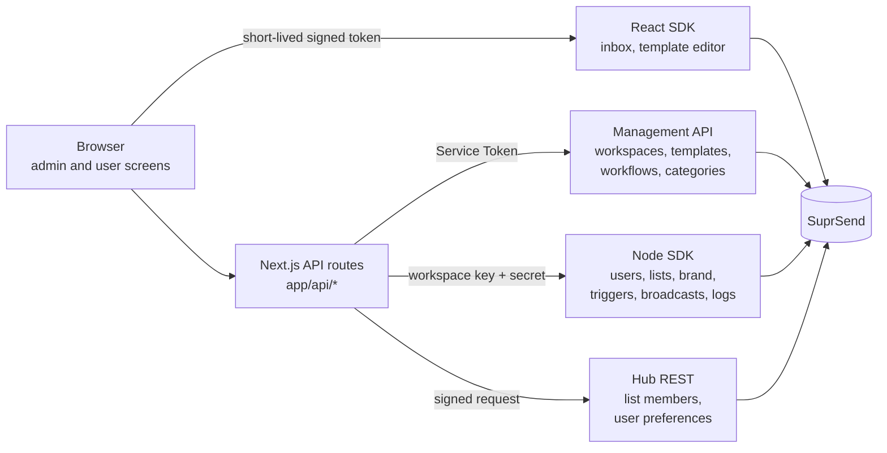
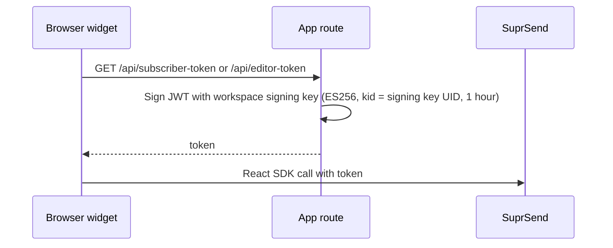

WorkVibe is a demo restaurant platform. Its customers are restaurant chains, and its notifications reach their diners. This page shows you how to run it, what each screen does, and how you can build it using SuprSend.

<Card title="WorkVibe">
  A B2B2C admin console and diner view, built on Next.js with the **Node SDK**, **drop-in Inbox**, and **embedded template editor**.<br/>
  [GitHub code repository](https://github.com/yashika248/workvibe-reference)
</Card>

**Stack:** Next.js 16 (App Router) · React 19 · TypeScript · Tailwind v4 · shadcn/Radix UI.
**SuprSend SDKs:** `@suprsend/node-sdk`, `@suprsend/react`, `@suprsend/react-editor`.

## What the app does

WorkVibe sells to restaurant chains. Two people use it, so the app has two views:

- **Admin** — the chain's own team. They write the messages, decide which notifications exist and who they reach, and check what went out.
- **User** — a diner. They read their notifications in an in-app inbox and choose what they want to hear about.

Each view is a set of screens, listed in [App navigation](#app-navigation). The app ships with two chains, **Ember & Oak** and **Nolan's Pizza**. A switcher in the top bar changes which one you are working in.

## How WorkVibe maps to SuprSend

One SuprSend account holds the whole product. Each restaurant chain is a **workspace** of its own, with its own keys, diners, templates, workflows and delivery logs. Nothing is shared between them. When you switch chain in the app, everything you see — diners, templates, workflows, logs — comes from that chain's workspace alone.

<Frame>
  
</Frame>

Both chains start from the same set of notifications, then add their own. To go deeper on modelling your customers in SuprSend, and on the concepts this app uses, read [Designing notifications for B2B2C applications](/docs/guides/modelling-customers-b2b2c).

## App structure

The [repository](https://github.com/yashika248/workvibe-reference) is organised like this:

| Folder | What it holds |
|---|---|
| `app/admin/` | Admin screens: templates, workflows, lists, broadcast, executions, analytics, users, preference defaults, brand |
| `app/user/` | User screens: inbox, preferences |
| `app/api/` | API routes. **The only code that talks to SuprSend** |
| `components/` | One `*-client.tsx` per screen, plus shared UI |
| `lib/server/` | Server-only SuprSend access (Node SDK, Management API, Hub REST) |
| `lib/wf/` | Turns a workflow definition into the flow diagram |
| `scripts/` | Workspace creation, asset push, test trigger |
| `suprsend/<workspace>/` | Categories, templates and workflows as SuprSend CLI files |
| `proxy.ts` | Optional password gate for a hosted demo |

## Run it locally

**Prerequisites:** Node.js 20+ and a SuprSend account. Sign up free at [app.suprsend.com](https://app.suprsend.com).

<Steps>
  <Step title="Install">
    ```bash
    git clone https://github.com/yashika248/workvibe-reference.git
    cd workvibe-reference
    npm install
    ```
  </Step>
  <Step title="Create the workspaces">
    Get an account Service Token: **Account Settings → Service Tokens**. Copy the env template and paste the token into `SUPRSEND_SERVICE_TOKEN`.

    ```bash
    cp .env.example .env.local
    npm run create:workspaces
    ```

    This creates two workspaces in your account, `workvibe-emberoak` and `workvibe-nolans`, and fills each Workspace Key in `.env.local`.
  </Step>
  <Step title="Paste the remaining keys">
    In the dashboard, switch to each workspace and open **Developers → API Keys**.

    | Variable | Where to find it |
    |---|---|
    | `SUPRSEND_<WS>_WORKSPACE_SECRET` | **Workspace Key and Secret** |
    | `NEXT_PUBLIC_SUPRSEND_<WS>_PUBLIC_KEY` | **Public Keys** — starts with `SS.PUBK` |
    | `SUPRSEND_<WS>_SIGNING_KEY_UID` | **Signing Keys** — the `signing_key_…` UID, not the `ws_signk_…` ID |
    | `SUPRSEND_<WS>_SIGNING_KEY_B64` | **Signing Keys** — the private key PEM, base64-encoded |

    `<WS>` is `WORKVIBE_EMBEROAK` or `WORKVIBE_NOLANS`.

    The signing key downloads as a file with line breaks, and an env file holds one line per value. Encode it before you paste it:

    ```bash
    base64 -i signing-key.pem | tr -d '\n'
    ```
  </Step>
  <Step title="Use the ready-made notifications">
    The repo ships a working set of notification categories, email and inbox templates, and workflows, in `suprsend/`. Push them and both workspaces have something to send from the first minute. Preview first, then push:

    ```bash
    npm run push:assets -- --dry-run
    npm run push:assets
    ```

    | | Ember & Oak | Nolan's Pizza |
    |---|---|---|
    | Shared workflows | `welcome-diner`, `order-confirmed`, `order-ready`, `order-receipt`, `sign-in-alert` | Same five |
    | Added | `order-feedback` + `feedback` category | `arriving-soon`, `weekend-deal` broadcast template, `offers` category |

    Building your own instead? Create them in the SuprSend dashboard and the app picks them up — it reads whatever is live in the workspace. The rest of this page uses the ready-made set.
  </Step>
  <Step title="Run">
    ```bash
    npm run dev
    ```

    Open [http://localhost:3000](http://localhost:3000).
  </Step>
</Steps>

## Add your starting data

The repo ships the notifications, not the data. Each workspace starts empty: no branding, no diners. You add both from the app, and both are stored in SuprSend.

<Steps>
  <Step title="Set each workspace's brand">
    Open **Brand Settings**. Set name, colours, logo and website. Templates read these through `{{$brand.*}}`, so emails carry the chain's own name and colours instead of your SuprSend account name.
  </Step>
  <Step title="Add subscribers">
    Open **Users** and use **Add subscriber**. Each person becomes a user in SuprSend and joins the `all-subscribers` list, which the app creates for you the first time you open this screen.

    A real diner would sign up in the chain's own product. **Add subscriber** stands in for that signup.
  </Step>
  <Step title="Check it works">
    1. In **Admin → Workflows**, click **Send test** on `order-ready` and pick a subscriber.
    2. Switch to **User** in the top bar, pick that person in **Viewing as**, and open **Inbox**. The message is there.
    3. **Executions** shows the same send from the admin side.

    Email needs an email vendor in the dashboard (**Vendors**). The inbox works without one.
  </Step>
</Steps>

### Optional: welcome people when they sign up

One workflow, `welcome-diner`, runs on its own when someone joins the `all-subscribers` list. It stays quiet until you switch on the event that starts it, and that switch lives on the list itself.

In the SuprSend dashboard, open **Lists**, open `all-subscribers`, and turn on **Track user entry**.

Lists and Users are separate sections of the dashboard. **Users** is every person in the workspace; **Lists** is the groups they belong to. This setting lives on the list, not on the person.

<Tabs>
  <Tab title="Lists">
    <Frame caption="Lists — open all-subscribers here to turn on Track user entry">
      
    </Frame>
  </Tab>
  <Tab title="Users">
    <Frame caption="Users — every person in the workspace, with their channels">
      
    </Frame>
  </Tab>
</Tabs>

<Warning>
  Turn it on **before** you add anyone. Joining the list is the moment that triggers the welcome, so people added while it is off are never welcomed. The API can't set this — only the dashboard can.
</Warning>

## App navigation

### Top bar

| Control | What it does |
|---|---|
| **Workspace switcher** | Picks the customer. Lists every workspace whose key and secret are in `.env.local`. Shows the brand name and colour |
| **Admin / User** | Admin = the restaurant chain's settings. User = what one diner sees |
| **Viewing as** | User view only. Picks which subscriber you are seeing the app as |

### Admin view

| Screen | What you do there |
|---|---|
| **Templates** | See every template and its channels. Open one to edit it |
| **Template editor** | Edit email and inbox content in SuprSend's embedded editor. Preview as a real subscriber |
| **Workflows** | See every workflow. Open its flow diagram. **Send test** to a subscriber |
| **Lists** | See every subscriber list and its members. Shows whether joining triggers an event |
| **Broadcast** | Send one template to everyone on `all-subscribers`, under a promotional category |
| **Executions** | See every send, as workflow runs or a filterable message log. Resend a message |
| **Analytics** | Delivery and engagement by channel, template and workflow. Opt-outs by category and channel |
| **Users** | Add or remove subscribers. See and change one person's preferences and recent activity |
| **Preference defaults** | Set each category's default: on, off or required, and its default channels |
| **Brand Settings** | Set name, logo, colours, links and custom properties used by templates |

<Tabs>
  <Tab title="Templates">
    <Frame></Frame>
  </Tab>
  <Tab title="Template editor">
    <Frame></Frame>
  </Tab>
  <Tab title="Workflows">
    <Frame></Frame>
    <Frame></Frame>
  </Tab>
  <Tab title="Lists">
    <Frame></Frame>
  </Tab>
  <Tab title="Broadcast">
    <Frame caption="Shown on Nolan's Pizza, the workspace with a promotional category">
      
    </Frame>
  </Tab>
  <Tab title="Executions">
    <Frame></Frame>
    <Frame></Frame>
  </Tab>
  <Tab title="Analytics">
    <Frame></Frame>
  </Tab>
  <Tab title="Users">
    <Frame></Frame>
  </Tab>
  <Tab title="Preference defaults">
    <Frame></Frame>
  </Tab>
  <Tab title="Brand Settings">
    <Frame></Frame>
  </Tab>
</Tabs>

### User view

| Screen | What you do there |
|---|---|
| **Inbox** | The diner's in-app notifications. Mark as read |
| **Preferences** | The diner turns categories and channels on or off. Required ones can't be turned off |

<Tabs>
  <Tab title="Inbox">
    <Frame></Frame>
  </Tab>
  <Tab title="Preferences">
    <Frame></Frame>
  </Tab>
</Tabs>

## How each screen talks to SuprSend

### The path every screen takes

SuprSend's backend APIs authenticate with the workspace key and secret, and those can't sit in browser code where anyone can read them. So every call runs on the server: open **Users**, the browser asks the WorkVibe server for `/api/users`, and that route calls SuprSend and returns the result.

For you that means all SuprSend code lives in `app/api` and `lib/server`, and the screens only ever call the app's own routes. The exception is SuprSend's browser components — the diner's inbox and the template editor — which call SuprSend themselves using a short-lived token the server signs for them.



### Which API each screen uses

Every route resolves the active workspace first, from the `wv_workspace` cookie. With no cookie, the first connected workspace is used.

| Screen | App route | SuprSend call | Auth |
|---|---|---|---|
| Workspace switcher | server layout (`lib/server/workspace.ts`) | Management API `GET /v1/workspace/`, then Node SDK `tenants.get("default")` for brand name and colour | Service Token; key + secret |
| Templates | `GET` / `DELETE /api/templates` | Management API templates (v2): list, get, delete | Service Token |
| Template editor | `GET /api/editor-token` | `@suprsend/react-editor` `TemplateEditor` | ES256 token, `entity_type: "template"` |
| Workflows | `GET /api/workflows` | Management API workflows (v1): list, get | Service Token |
| Send test, Resend | `POST /api/trigger` | Node SDK `track_event` for event-triggered workflows; `workflows.trigger` for API-triggered ones | Key + secret |
| Lists | `GET /api/lists` | Node SDK `subscriber_lists`; Hub REST `GET /v1/subscriber_list/{id}/subscriber/` for members | Key + secret; HMAC signature |
| Broadcast | `GET` / `POST /api/broadcast` | Management API templates and categories; Node SDK `subscriber_lists.broadcast` | Service Token; key + secret |
| Executions | `GET /api/executions` | Node SDK `messages.list` | Key + secret |
| Analytics | `/api/executions`, `/api/opt-outs`, `/api/workflows` | `messages.list`; each user's preferences via Hub REST | Key + secret; ES256 signature |
| Users | `GET` / `POST` / `DELETE /api/users`, `/api/admin/user-preferences` | Node SDK `users` (list, get, edit, delete), `subscriber_lists` (create, add); Hub REST preferences | Key + secret; ES256 signature |
| Preference defaults | `/api/admin/preference-config` | Management API `GET` / `POST /v1/{ws}/preference_category/` | Service Token |
| Brand Settings | `/api/brand` | Node SDK `tenants.get` / `tenants.upsert("default")` | Key + secret |
| Inbox | `GET /api/subscriber-token` | `@suprsend/react` `SuprSendProvider` + `NotificationFeed` | ES256 token, `entity_type: "subscriber"`, scoped to tenant `default` |
| Preferences | `/api/user-preferences` | Hub REST `GET` / `PATCH /v2/subscriber/{id}/category/` | Public key + ES256 `x-ss-signature` |

Full API lists and credential types: [B2B2C guide → Reference: credentials and APIs](/docs/guides/modelling-customers-b2b2c#reference-credentials-and-apis).

### Two calls that use the REST API

- **List members and user preferences:** both come from the REST API, called directly from `lib/server/`. Use the same approach when you need them.
- **Preference categories:** there is no call that updates one category. The save takes the whole category structure, so the app reads what is live, applies your one change to it, and sends all of it back. Changing a single toggle this way leaves every other category as it was.

### How the inbox and editor get their token



### Send test and Broadcast

These are the two screens that deliver a real message. Both prepare the request before it reaches SuprSend.

- **Send test** fills every template variable from the template's own sample data before sending, so the message renders fully even when you pass nothing. The recipient needs an email on their profile.
- **Broadcast** sends on a **promotional** category, which is where a message to everyone belongs. That keeps transactional and system categories free for the messages people are waiting on.

### Publishing from your own code

`POST /api/templates` and `POST /api/workflows` (`mode: "publish"`) publish a template or a workflow. The workflow route publishes that workflow's templates first and stops if one fails, so a half-published journey never goes live. The screens read from SuprSend rather than publish to it, so these two are yours to call from a script or your own backend.

## Change or extend it

### Add a customer workspace

No code change.

1. Create the workspace in the dashboard.
2. Add its keys to `.env.local`. The prefix comes from the slug: `workvibe-foo` → `SUPRSEND_WORKVIBE_FOO_…`.
3. Restart the dev server. The app reads the workspace list once per process.
4. To give it notifications, add `suprsend/workvibe-foo/` and run `npm run push:assets -- workvibe-foo`.

### Edit templates, workflows or categories

Edit the files in `suprsend/<workspace>/`, then push. Push one workspace by naming it:

```bash
npm run push:assets -- workvibe-emberoak
```

<Warning>
  Pushing overwrites the live copy. If someone edited a template in the dashboard, pull it first.
</Warning>

```bash
npx suprsend template pull -w workvibe-emberoak -d suprsend/workvibe-emberoak/templates
```

Use `workflow` or `category` instead of `template` to pull those.

### Fire a workflow from the terminal

```bash
node --env-file=.env.local scripts/fire-test.mjs workvibe-emberoak order-ready u_30214
```

Copy the `distinct_id` from **Users**.

### Check your changes

```bash
npm run lint && npm run typecheck && npm test && npm run build
```

CI runs the same four on every pull request.

## Deploy

The app runs anywhere Next.js runs, for example Vercel. Add the same variables from `.env.local` to the deployment, and set `NEXT_PUBLIC_APP_URL` to the deployed URL.

**Put a password on it.** WorkVibe has no login. Set `DEMO_PASSWORD` and every page and API route asks for it (`proxy.ts`). A deployed demo reads and writes your real SuprSend account.

### Reusing this pattern in your own product

Two routes sign the tokens that SuprSend's browser components need. WorkVibe has no login, so both hand a token to whoever asks. Your product knows who is signed in, so tie both to that session before you ship them.

| Route | What it's for | In WorkVibe | In your product |
|---|---|---|---|
| `/api/subscriber-token` | Signs the token the diner's inbox uses, which tells SuprSend whose notifications to show | Takes `distinct_id` from the query string, so a caller can ask for a token for anyone | Take `distinct_id` from the signed-in session |
| `/api/editor-token` | Signs the token the template editor uses, which tells SuprSend which templates may be edited | Open to any caller. The token it signs unlocks every template in the workspace, because `entity_id` is set to `"*"` | Limit it to admins, and set `entity_id` to the template they are editing |

## Troubleshooting

<AccordionGroup>
  <Accordion title="&quot;No workspace connected&quot;">
    Full message: "No workspace is connected. Run npm run create:workspaces, paste the keys into .env.local, then restart the dev server."

    A workspace shows only when `SUPRSEND_<WS>_WORKSPACE_KEY` matches its UID **and** `_WORKSPACE_SECRET` is set. Fix the keys, then restart the dev server.
  </Accordion>
  <Accordion title="&quot;Couldn't read your workspaces&quot;">
    Usually "Listing workspaces failed (HTTP 401)". `SUPRSEND_SERVICE_TOKEN` is wrong or expired. Create a new one in **Account Settings → Service Tokens**.
  </Accordion>
  <Accordion title="&quot;The welcome is off.&quot; on the Users screen">
    `all-subscribers` has Track user entry off. Turn it on in the dashboard. People added while it was off are not welcomed.
  </Accordion>
  <Accordion title="Inbox or template editor doesn't load">
    Error: "Missing signing-key env for …". A signing key variable is empty. Check you used the `signing_key_…` UID, not the `ws_signk_…` ID, and base64-encoded the PEM on one line.

    Error: "public key not configured". `NEXT_PUBLIC_SUPRSEND_<WS>_PUBLIC_KEY` is empty for this workspace.
  </Accordion>
  <Accordion title="Send test or editor preview fails">
    "… has no email — add one in the Users tab." — test sends need a subscriber with an email.

    "This workspace has no subscribers to preview as." — the editor previews as a real subscriber. Add one in **Users** first.
  </Accordion>
  <Accordion title="Broadcast: &quot;isn't a promotional category&quot;">
    Pick a category under the promotional root. Nolan's Pizza ships with `offers`. Ember & Oak ships with none, so add one in **Preference defaults** or the dashboard first.
  </Accordion>
  <Accordion title="Sent, but no email arrives">
    Add an email vendor in the dashboard (**Vendors**). Open **Executions → Message log** for the failure reason.
  </Accordion>
  <Accordion title="Preferences show email only, no inbox">
    The workspace flag `user_inbox_preference_enabled` is off. `npm run push:assets` turns it on. If you pushed categories another way, set it with the Management API workspace config.
  </Accordion>
  <Accordion title="My dashboard template edits disappeared">
    `npm run push:assets` overwrote them. Pull before you push — see [Edit templates, workflows or categories](#edit-templates-workflows-or-categories).
  </Accordion>
  <Accordion title="Hosted demo returns &quot;Locked. Enter the demo password first.&quot;">
    `DEMO_PASSWORD` is set. Enter it on the gate page.
  </Accordion>
</AccordionGroup>

## Reference

### Environment variables

| Variable | Scope | Used for |
|---|---|---|
| `SUPRSEND_SERVICE_TOKEN` | Account | Management API for every workspace |
| `SUPRSEND_<WS>_WORKSPACE_KEY` / `_SECRET` | Workspace | Node SDK and signed Hub REST. A matching key also makes the workspace appear |
| `SUPRSEND_<WS>_SIGNING_KEY_UID` / `_B64` | Workspace | Signs inbox, editor and preference tokens |
| `NEXT_PUBLIC_SUPRSEND_<WS>_PUBLIC_KEY` | Workspace | Inbox and user preferences |
| `NEXT_PUBLIC_APP_URL` | App | The app's base URL |
| `DEMO_PASSWORD` | Deployment | Shared password for a hosted demo. Leave empty locally |
| `SUPRSEND_MGMNT_URL`, `SUPRSEND_HOST` | Optional | API hosts, for a private or regional cluster |

### Scripts

| Command | Does |
|---|---|
| `npm run dev` | Start the dev server |
| `npm run build` / `npm start` | Production build / run |
| `npm run lint` / `typecheck` / `test` | ESLint / TypeScript / Vitest |
| `npm run create:workspaces` | Create both workspaces and fill their Workspace Keys |
| `npm run push:assets` | Push `suprsend/` to every workspace. Add `-- --dry-run` to preview, or `-- <workspace>` for one |
| `node --env-file=.env.local scripts/fire-test.mjs <workspace> <workflow> <distinct_id>` | Fire one workflow at a subscriber |

## Next steps

<CardGroup cols={2}>
  <Card title="B2B2C modelling guide" icon="building" href="/docs/guides/modelling-customers-b2b2c">
    Why each customer is its own workspace.
  </Card>
  <Card title="Workspaces vs tenants" icon="scale-balanced" href="/docs/guides/modelling-customers-workspace-vs-tenant">
    When to use the other model.
  </Card>
  <Card title="React inbox" icon="inbox" href="/docs/react-inbox-integration">
    The inbox used in the User view.
  </Card>
  <Card title="Embedded template editor" icon="pen-to-square" href="/docs/embeddable-template-react-sdk">
    The editor used in Templates.
  </Card>
</CardGroup>
