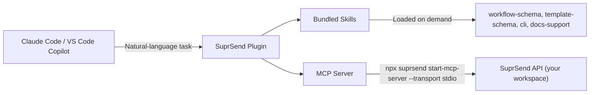

The SuprSend Agent Plugin is a single installable artifact that bundles four [Agent Skills](/reference/agent-skills) and the [SuprSend MCP server](/reference/mcp-overview). One install gives your agent the schema knowledge to generate correct code *and* the live tools to act on your workspace — without any boilerplate.

The plugin format is shared across **Claude Code**, **VS Code Copilot**, and **GitHub Copilot CLI** — the same [`suprsend/claude-code-plugin`](https://github.com/suprsend/claude-code-plugin) repo serves all three hosts.

<Note>
  The plugin runs the SuprSend CLI through [`npx`](https://docs.npmjs.com/cli/v10/commands/npx), so [Node.js](https://nodejs.org/) v20+ is the only hard prerequisite. Nothing else to install.
</Note>

---

## What you get

| Layer | What it does | Source |
|---|---|---|
| **Skills** | Workflow schema, template (variant) schema, CLI docs, and support resources — loaded automatically by your agent through [progressive disclosure](/reference/agent-skills#how-skills-work) | [suprsend/skills](https://github.com/suprsend/skills) |
| **MCP Server** | Live tools to query and manage your SuprSend workspace — workflows, templates, schemas, events, categories, translations | [suprsend/cli](https://github.com/suprsend/cli) (`start-mcp-server`) |

The plugin is the recommended path on Claude Code and VS Code Copilot. If you're on Cursor, Windsurf, or another MCP-only host, use the [MCP quickstarts](/reference/mcp-overview) and [Agent Skills quickstart](/reference/agent-skill-quickstart) instead.

---

## Install

<Steps>
  <Step title="Generate a service token">
    Go to [Dashboard → Account Settings → Service Tokens](https://app.suprsend.com/en/account-settings/service-tokens) and create a workspace-scoped [service token](/docs/developer/service-tokens).
  </Step>

  <Step title="Authenticate">
    Save the token as the default profile:

    ```bash
    npx suprsend profile add --name default --service-token <YOUR_SERVICE_TOKEN>
    ```

    Or export it for the current shell:

    ```bash
    export SUPRSEND_SERVICE_TOKEN="your_service_token_here"
    ```

    <Tip>
      The CLI reads `SUPRSEND_SERVICE_TOKEN` from the environment first, then falls back to the active profile. Either works.
    </Tip>
  </Step>

  <Step title="Install the plugin">
    <Tabs>
      <Tab title="Claude Code">
        Inside Claude Code, register the marketplace and install:

        ```text
        /plugin marketplace add suprsend/claude-code-plugin
        /plugin install suprsend@suprsend-marketplace
        ```

        Skills and MCP tools are available immediately. The host fetches the `suprsend` npm package on first MCP startup and caches it; subsequent launches are instant.
      </Tab>
      <Tab title="VS Code Copilot">
        <Warning>
          **Preview feature.** VS Code Agent Plugins are currently in preview. The host requires `chat.plugins.enabled` to be on (managed at the organization level — if disabled, contact your admin).
        </Warning>

        1. Open the command palette (`Cmd + Shift + P` on macOS, `Ctrl + Shift + P` on Windows/Linux)
        2. Run **`Chat: Install Plugin From Source`**
        3. Enter `suprsend/claude-code-plugin` when prompted (or the full URL `https://github.com/suprsend/claude-code-plugin.git`)

        For a whole team, commit `.github/copilot/settings.json` to your project repo:

        ```json
        {
          "extraKnownMarketplaces": {
            "suprsend-marketplace": {
              "source": { "source": "github", "repo": "suprsend/claude-code-plugin" }
            }
          },
          "enabledPlugins": {
            "suprsend@suprsend-marketplace": true
          }
        }
        ```

        When teammates open the repo, the marketplace is auto-registered and the plugin is enabled — no per-developer setup.
      </Tab>
    </Tabs>
  </Step>

  <Step title="Verify">
    <Tabs>
      <Tab title="Claude Code">
        In a Claude Code session, run:

        ```text
        /plugin
        ```

        The `suprsend` plugin should appear under **Installed**. Then check the MCP connection:

        ```text
        /mcp
        ```

        You should see `suprsend: connected`. Try a prompt:

        ```text
        List all workflows in my SuprSend workspace.
        ```
      </Tab>
      <Tab title="VS Code Copilot">
        Search `@agentPlugins` in the Extensions sidebar — `suprsend` should appear under **Agent Plugins → Installed**. MCP startup logs are in the **Output** panel — pick **MCP — suprsend** from the dropdown.

        In a new chat, try:

        ```text
        List all workflows in my SuprSend workspace.
        ```
      </Tab>
    </Tabs>
  </Step>
</Steps>

---

## Architecture



Skills give the agent **knowledge** — accurate schemas, CLI flags, and doc endpoints — so the code and JSON it produces are correct on the first try. The MCP server gives the agent **capabilities** — live tools to read and write your workspace. Together they remove the two failure modes of LLM-driven notification work: hallucinated schemas and missing API access.

---

## What's bundled

**Skills**

<CardGroup cols={2}>
  <Card title="suprsend-workflow-schema" icon="diagram-project" href="/reference/agent-skill-workflow-schema">
    Complete workflow node reference — JSON schema, documentation, and usage examples for every node type.
  </Card>
  <Card title="suprsend-template-schema" icon="palette" href="https://github.com/suprsend/skills/tree/main/skills/suprsend-template-schema">
    Template (variant) schema reference — variant envelope, multi-tenant and multi-lingual variants, Handlebars and JSONnet syntax, and per-channel content schemas for all 9 channels.
  </Card>
  <Card title="suprsend-cli" icon="terminal" href="/reference/agent-skill-cli">
    Full CLI command reference with agent-targeted per-command tips — managing workspaces, templates, workflows, schemas, and more.
  </Card>
  <Card title="suprsend-docs-support" icon="book" href="/reference/agent-skill-docs-support">
    How to access SuprSend documentation — LLM-friendly endpoints, in-app chat, AI Copilot, Slack community, and email support.
  </Card>
</CardGroup>

**MCP tools**

The bundled MCP server is the same one the CLI ships (`suprsend start-mcp-server`). It exposes tools for the resources you manage from the dashboard — see the [Tool List](/reference/mcp-tool-list) for current identifiers and scoping patterns.

<CardGroup cols={3}>
  <Card title="Users" icon="user" href="/reference/mcp-tool-list#users">
    `users.get`, `users.upsert`, preferences, list and object subscriptions.
  </Card>
  <Card title="Tenants" icon="building" href="/reference/mcp-tool-list#tenants">
    `tenants.get`, `tenants.get_all`, `tenants.upsert`, preference overrides.
  </Card>
  <Card title="Objects" icon="cube" href="/reference/mcp-tool-list#objects">
    `objects.get`, `objects.upsert`, per-object preferences and channel restrictions.
  </Card>
  <Card title="Workflows" icon="diagram-project" href="/reference/mcp-tool-list#workflows">
    `workflows.list` — inspect configured workflows. Manage workflow files locally with the bundled CLI skill.
  </Card>
  <Card title="Documentation" icon="book" href="/reference/mcp-tool-list#documentation">
    `documentation.search` and `documentation.fetch` — the agent can look up SuprSend docs at runtime.
  </Card>
  <Card title="CLI passthrough" icon="terminal" href="/reference/cli-intro">
    The `suprsend-cli` skill lets the agent shell out for templates, schemas, events, categories, and translations — push and commit changes through the same `suprsend` binary.
  </Card>
</CardGroup>

---

## Usage

Once loaded, talk to your agent in natural language. The right skill and MCP tools activate automatically.

```text
> List all my workflows

> Create a new workflow called "welcome-email" that sends an email
  when a user signs up

> Show me the schema for workflow nodes

> Pull the "order-confirmed" workflow and explain what it does

> What CLI commands can I use to manage templates?

> Push my local workflow changes to staging

> Show me how to configure a fallback from email to SMS
```

See the [Prompt Cheatsheet](/reference/mcp-prompts) for more copy-paste prompts.

---

## Configuration

### MCP server config

The plugin ships an `.mcp.json` that auto-registers the MCP server on load:

```json
{
  "mcpServers": {
    "suprsend": {
      "command": "npx",
      "args": ["-y", "suprsend", "start-mcp-server", "--transport", "stdio"]
    }
  }
}
```

`npx -y` fetches the `suprsend` npm package on first launch and caches it for subsequent runs. No manual install required.

### Transport flags

The MCP server runs `stdio` by default. Override only if you need remote or multi-client access:

```bash
npx suprsend start-mcp-server                       # default (stdio)
npx suprsend start-mcp-server --transport stdio     # explicit
npx suprsend start-mcp-server --transport sse       # remote / multi-client
```

### Scoping tool access

Restrict which tools the host can call using `--tools`. Useful in production or shared environments:

```bash
npx suprsend start-mcp-server --tools "users.*,workflows.list"
npx suprsend start-mcp-server --tools "users.get"
```

See the [Tool List](/reference/mcp-tool-list) for all available identifiers and wildcard patterns.

### Global install (optional)

If you'd rather not rely on the npx fallback, install the CLI globally. A `suprsend` binary on `PATH` takes precedence over `npx suprsend`:

```bash
brew tap suprsend/tap
brew install --cask suprsend
```

See [CLI Installation](/reference/cli-installation) for all install methods — Homebrew, prebuilt binary releases, or source build.

---

## FAQ

<AccordionGroup>
  <Accordion title="Why do I see `suprsend: command not found`?">
    **Answer:** The host cannot find Node.js, `npx`, or a global `suprsend` binary. The plugin expects [Node.js v20+](https://nodejs.org/) so `npx` can fetch the CLI on first run.

    Run `node --version` and `npx --version`. After Node v20+ is installed, the plugin pulls the `suprsend` package automatically on first MCP startup.
  </Accordion>

  <Accordion title="Why won't the MCP server connect?">
    **Answer:** The server usually fails when the service token is missing, invalid, or the active profile points at the wrong workspace.

    Re-run `npx suprsend profile add --name default --service-token <YOUR_SERVICE_TOKEN>` or set `SUPRSEND_SERVICE_TOKEN` in your environment. Test manually:

    ```bash
    npx suprsend start-mcp-server --transport stdio
    ```

    In **VS Code**, open **Output** and choose **MCP — suprsend** from the dropdown to read startup errors.
  </Accordion>

  <Accordion title="Why don't SuprSend skills activate when I describe a task?">
    **Answer:** The plugin may be installed but skills did not register cleanly with the host.

    **Claude Code:** Run `/plugin marketplace remove suprsend-marketplace`, then `/plugin marketplace add suprsend/claude-code-plugin` and `/plugin install suprsend@suprsend-marketplace` again.

    **VS Code:** Under **Agent Plugins → Installed**, toggle the SuprSend plugin off and on, or uninstall it and run **Chat: Install Plugin From Source** again.
  </Accordion>

  <Accordion title="Why doesn't the SuprSend plugin show up in my editor?">
    **Answer:** The marketplace was not added, or Agent Plugins are turned off for your organization.

    **Claude Code:** Run `/plugin` and check **Installed**. If the plugin is missing, run `/plugin marketplace add suprsend/claude-code-plugin` again.

    **VS Code:** Search `@agentPlugins` in the Extensions sidebar. Confirm `chat.plugins.enabled` is on (often an org policy — ask your admin if it is disabled).
  </Accordion>

  <Accordion title="Why do MCP tools return empty or unexpected data?">
    **Answer:** The CLI is often using a different workspace profile than the one you expect.

    Run `npx suprsend profile list` and switch with `npx suprsend profile use --name <profile>`.
  </Accordion>
</AccordionGroup>
