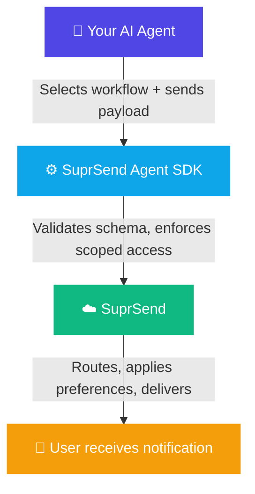

The Agent SDK is for AI agents running in production that need to notify humans as part of their own decisions. It turns your SuprSend workflows into callable, schema-enforced tools any agent framework can invoke.

<Note>
  This is distinct from the [MCP server](/reference/mcp-overview), which is for development-time use. The Agent SDK is for agents making decisions at runtime.
</Note>

---

## How it works

You define the notification system in SuprSend - workflows, templates, channels, preferences. The Agent SDK exposes those workflows as tools the agent can call. The agent selects the right workflow, sends a validated payload, and SuprSend handles routing, delivery, and preferences.

---

## When to use Agent SDK vs MCP

| | Agent SDK | MCP Server |
|---|---|---|
| **Use case** | Agents triggering notifications in production | Developers building and managing in their IDE |
| **Environment** | Your agent's runtime (server, cloud function) | Local development |
| **Tools exposed** | Only the workflows you allow | Full tool set, scoped with `--tools` |
| **Auth** | Service token, scoped per agent | Service token for your workspace |

---

## Guardrails

<CardGroup cols={2}>
  <Card title="Schema enforcement" icon="shield-check">
    Agents can only send payloads that match the schema defined for each workflow. Hallucinated or missing fields are rejected before anything fires.
  </Card>
  <Card title="Scoped access" icon="lock">
    You control which workflows each agent can invoke. A document processing agent can't accidentally trigger a security alert workflow.
  </Card>
  <Card title="Full observability" icon="chart-line">
    Every agent-triggered notification appears in your SuprSend logs with full execution trace - workflow, payload, routing, and delivery outcome.
  </Card>
  <Card title="Template governance" icon="palette">
    Notifications use your existing templates, maintaining design and messaging standards regardless of which agent triggered them.
  </Card>
</CardGroup>

---

## Example use cases

- **Document processing** - Agent completes extraction and notifies the user with results via email.
- **Security monitoring** - Agent detects anomalous login and triggers push and email alerts simultaneously.
- **Sales automation** - Agent identifies buyer intent and routes a follow-up to the right channel.
- **Customer support** - Agent resolves a ticket and sends the customer a summary via in-app and email.
- **Ops and incident response** - Agent detects a delivery failure and escalates to on-call via Slack.

---

## Get started

The Agent SDK is currently in early access.

<CardGroup cols={2}>
  <Card title="Join the waitlist" icon="rocket" href="https://www.suprsend.com/agent-sdk">
    Sign up for early access.
  </Card>
  <Card title="Book a demo" icon="calendar" href="https://calendly.com/suprsend">
    Talk to the team about your use case.
  </Card>
  <Card title="MCP Server" icon="server" href="/reference/mcp-overview">
    For development-time agent tooling.
  </Card>
  <Card title="Management API" icon="code" href="https://docs.suprsend.com/docs/developer/management-api.md">
    Trigger and manage via REST API.
  </Card>
</CardGroup>
