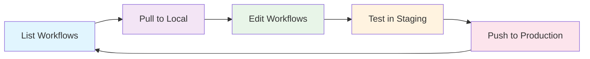

## Overview

Get the SuprSend CLI up and running in ~5 minutes.

**What you'll learn:**
- Install the CLI on your system
- Set up authentication 
- List, pull, and push workflows

**Prerequisites**: A [SuprSend account](https://app.suprsend.com).

---

## Step 1: Install the CLI

Install the SuprSend CLI using your preferred method:

<Steps>
<CodeGroup>

```bash Homebrew (Recommended)
# Best for developers on macOS or Linux
brew tap suprsend/tap
brew install --cask suprsend
```

```bash Binary Releases
# Best for Windows users, servers or CI/CD environments
# Download from: https://github.com/suprsend/cli/releases

# Linux/macOS
chmod +x suprsend
sudo mv suprsend /usr/local/bin/

# Windows: Extract suprsend.exe to your PATH
```

```bash Source Build
# Best for contributors or advanced users
# Requires Go 1.20 or later
git clone https://github.com/suprsend/cli.git
cd cli/cmd/suprsend
go build -o suprsend
sudo mv suprsend /usr/local/bin/
```

</CodeGroup>

</Steps>

---

## Step 2: Authentication

Get your service token from [SuprSend Dashboard](https://app.suprsend.com) → **Account Settings** → **Service Tokens**.

Then pick ONE method:

```bash
# Environment Variable (Easiest) - Best for CI/CD pipelines, Docker containers and servers
export SUPRSEND_SERVICE_TOKEN="your_service_token_here"

# Profiles - Best for local development, multiple sessions, or self-hosted setups with multiple servers
suprsend profile add --name "my-workspace" --service-token "your_service_token_here"
suprsend profile use --name "my-workspace"

# After setting up a profile, you can use commands without flags:
suprsend workflow list  # Uses active profile automatically

# Command Flag - Best for one-off commands, local testing, debugging
suprsend workflow list --service-token "your_service_token_here"
```

---

## Step 3: Enable Autocompletion (Optional)

Get smart command completion with <kbd>tab</kbd> - saves time and prevents typos:

```bash
# Quick setup for current session
source <(suprsend completion bash)
source <(suprsend completion zsh)

# Make it permanent
suprsend completion bash >> ~/.bashrc
suprsend completion zsh >> ~/.zshrc
```

**Try it out:** Press <kbd>TAB</kbd> to see autocompletion in action:

```bash
suprsend <TAB>          # See all available commands
suprsend workflow <TAB> # See workflow operations
suprsend --<TAB>        # See all available flags
```

---

## ✅ Setup Complete!

Your CLI is ready to use. Let's try some commands:

---

## Common Operations

Here's the typical workflow cycle:



### List your workflows

Check what's available in staging:

```bash
# List all workflows in staging workspace
suprsend --workspace staging workflow list
```

**No workflows?** No problem! Create your first one: 

<Steps>
  <Step title="Open the Dashboard">
    Click here to open the [SuprSend Dashboard](https://app.suprsend.com/en/staging/workflows)
  </Step>
  <Step title="Create New Workflow">
    Click the **"+"** button to create a new workflow
  </Step>
  <Step title="Follow the Guide">
    Use our [workflow design guide](/docs/design-workflow) to build your workflow
  </Step>
  <Step title="Return Here">
    Come back and run `suprsend --workspace staging workflow list` to see your new workflow!
  </Step>
</Steps>

### Pull workflows for local editing

Download workflows as editable YAML files for:
- ✏️ Edit in your favorite editor
- 🔄 Version control with Git
- 🧪 Test locally before deploying

```bash
# Download workflow files to local directory
suprsend --workspace staging workflow pull
```

Files land in `suprsend/workflow/` directory. Edit them, then push back to deploy.

---

### Manage and deploy workflows

Enable/disable workflows and push to production:

```bash
# Enable/disable workflows
suprsend --workspace staging workflow disable <workflow-slug>
suprsend --workspace staging workflow enable <workflow-slug>

# Push changes to production
suprsend --workspace production workflow push --commit=true --commit-message "Update workflows"
suprsend --workspace production workflow push --slug <workflow-slug> --commit=true --commit-message "Update workflow"
```

<Warning>
**Note**: Replace `<workflow-slug>` with an actual workflow slug from your list. Always use `--commit=true` when pushing workflows to make them live.
</Warning>

<Tip>
**Pro Tip**: Use `suprsend sync` to clone and validate assets between workspaces. Perfect for promoting tested workflows from staging to production!
</Tip>

---

## 🎉 You're all set!

You've successfully set up the SuprSend CLI and learned the basics. You're ready to manage your notification infrastructure!

---

## What's next?

Ready to go deeper? Check out these advanced topics:

<CardGroup cols={2}>
      <Card title="CLI Overview" icon="terminal" href="/reference/cli-intro">
        Learn more about the SuprSend CLI and its capabilities.
      </Card>
      <Card title="Workflow Management" icon="code" href="/reference/cli-workflow-overview">
        Master advanced workflow operations, state management, and cross-environment synchronization.
      </Card>
      <Card title="Schema Management" icon="database" href="/reference/cli-schema-overview">
        Learn schema operations for payload validation, type safety, and data consistency.
      </Card>
      <Card title="Profile Management" icon="user" href="/reference/cli-profile-overview">
        Configure multiple profiles for different workspaces and development environments.
      </Card>
    </CardGroup>