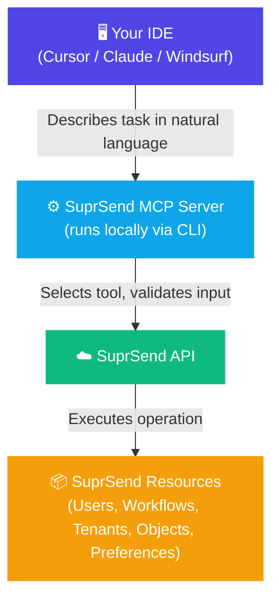

The SuprSend MCP server exposes your notification infrastructure — workflows, users, tenants, objects, and preferences — as callable tools through the [Model Context Protocol](https://modelcontextprotocol.io). Connect any MCP-compatible client and operate on SuprSend resources directly, without writing API wrappers or navigating the dashboard.

<CardGroup cols={3}>
  <Card title="Cursor" icon="arrow-pointer" href="/reference/mcp-quickstart-cursor">
    Set up in Cursor
  </Card>
  <Card title="Claude" icon="comments" href="/reference/mcp-quickstart-claude">
    Set up in Claude Desktop
  </Card>
  <Card title="Windsurf" icon="wind" href="/reference/mcp-quickstart-windsurf">
    Set up in Windsurf
  </Card>
</CardGroup>

---

## What you can do

<AccordionGroup>
  <Accordion title="Query and debug" icon="magnifying-glass">
    - Get a user's profile, channel addresses, and delivery preferences
    - Inspect category and channel-level preferences to debug why a notification didn't arrive
    - List all workflows in your workspace and check their enabled/disabled state
    - Fetch SuprSend documentation contextually, right inside your editor
  </Accordion>

  <Accordion title="Bootstrap and test" icon="flask">
    - Create users, tenants, and objects with a single prompt
    - Trigger workflows to test notification flows interactively
    - Set up channel addresses and preference states for test scenarios
    - Get an entire test workspace ready from one conversation
  </Accordion>

  <Accordion title="Build integrations" icon="code">
    - Generate SDK integration code with correct parameters
    - Add the in-app inbox or preference center to your app
    - Set up React SDK, Node.js backend triggers, and webhook handlers
    - Migrate templates from external tools or codebases
  </Accordion>

  <Accordion title="Manage resources" icon="sliders">
    - Update tenant branding (logo, colors) and preference defaults
    - Opt users in or out of notification categories and channels
    - Manage list memberships and object subscriptions
    - Configure object-level preferences that subscribers inherit
  </Accordion>
</AccordionGroup>

---

## How it works

The MCP server runs locally via the SuprSend CLI. When you start it, your AI client connects and gains access to a set of typed tools. When you describe a task, the AI selects the right tool, calls it with validated inputs, and acts on the result.

All requests are authenticated using a workspace-scoped service token. You control which tools are exposed using the `--tools` flag, so production environments can be restricted to read-only if needed.

---

## Learn more

<CardGroup cols={2}>
  <Card title="Tool List" icon="wrench" href="/reference/mcp-tool-list">
    All available MCP tools, organized by category. Includes scoping with `--tools`.
  </Card>
  <Card title="Prompt Cheatsheet" icon="clipboard-list" href="/reference/mcp-prompts">
    Copy-paste prompts for workflows, users, tenants, debugging, and integration.
  </Card>
  <Card title="Task Management App" icon="rocket" href="/docs/task-management-app-guide">
    Build a complete notification system from scratch using AI prompts.
  </Card>
  <Card title="Agent Skills" icon="graduation-cap" href="/reference/agent-skills">
    Install SuprSend knowledge into your agent for better code generation.
  </Card>
</CardGroup>
