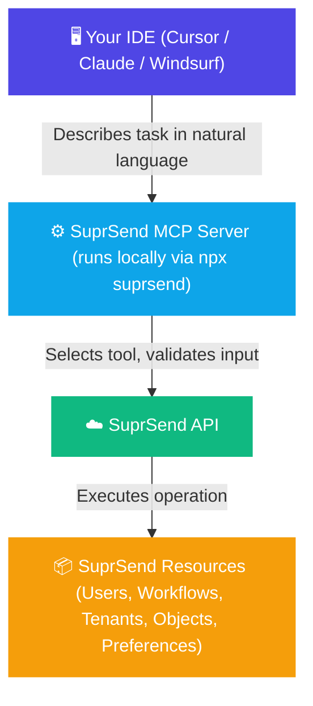

The SuprSend MCP server exposes your notification infrastructure - workflows, users, tenants, objects, and preferences - as callable tools through the [Model Context Protocol](https://modelcontextprotocol.io). Connect any MCP-compatible client and operate on SuprSend resources directly, without writing API wrappers or navigating the dashboard.

<CardGroup cols={3}>
  <Card title="Cursor" icon="arrow-pointer" href="/reference/mcp-quickstart-cursor">
    Set up in Cursor
  </Card>
  <Card title="Claude" icon="comments" href="/reference/mcp-quickstart-claude">
    Set up in Claude Desktop
  </Card>
  <Card title="Windsurf" icon="wind" href="/reference/mcp-quickstart-windsurf">
    Set up in Windsurf
  </Card>
</CardGroup>

---

## What you can do

<AccordionGroup>
  <Accordion title="Vibe-code with SuprSend in your product" icon="wand-magic-sparkles">
    - Integrate SuprSend SDK Integration with just a simple prompt in your codebase
    - Add the in-app inbox or preference center to your app
    - Setup up workflow or event triggers on product actions where you want to send notifications
    - Add user identification call when user logs in or signs up to your product
    - Migrate templates from external tools or codebases
  </Accordion>
    <Accordion title="Setup your account and create test data" icon="wand-magic-sparkles">
    - "Create a tenant called Acme Corp and set their marketing category to opt-out by default"
    - Seed test users with channel addresses, then subscribe them to objects so they inherit the right preferences
    - Configure a preference hierarchy: set category defaults, apply tenant-level overrides, then layer in user choices
    - Add users to lists and objects to model your real subscription topology before writing any code
  </Accordion>
  <Accordion title="Query and debug" icon="bug">
    - "User 583 says they never got the invite - show me their profile, channel addresses, and preferences"
    - Check what does an error mean and how to fix it
    - Check if a notification category is enabled at the user, tenant, or object level to find where it's being suppressed
    - Pull up a workflow to verify if it's active and inspect its configuration
  </Accordion>

</AccordionGroup>

---

## How it works

The MCP server runs locally via the SuprSend CLI - your AI client launches it on demand with `npx suprsend start-mcp-server` (no install step, always the latest version; requires [Node.js](https://nodejs.org/) 18+). When it starts, your AI client connects and gains access to a set of typed tools. When you describe a task, the AI selects the right tool, calls it with validated inputs, and acts on the result.

All requests are authenticated using a workspace-scoped service token. You control which tools are exposed using the `--tools` flag, so production workspaces can be restricted to read-only if needed.

---

## Learn more

<CardGroup cols={2}>
  <Card title="Tool List" icon="wrench" href="/reference/mcp-tool-list">
    All available MCP tools, organized by category. Includes scoping with `--tools`.
  </Card>
  <Card title="Prompt Cheatsheet" icon="clipboard-list" href="/reference/mcp-prompts">
    Copy-paste prompts for workflows, users, tenants, debugging, and integration.
  </Card>
  <Card title="Task Management App" icon="rocket" href="/docs/task-management-app-guide">
    Build a complete notification system from scratch using AI prompts.
  </Card>
  <Card title="Agent Skills" icon="graduation-cap" href="/reference/agent-skills">
    Install SuprSend knowledge into your agent for better code generation.
  </Card>
</CardGroup>
